# Page Scan Report

> **URL:** https://localhost:7046/Account/Manage/PersonalData  
> **Status:** ✅ 200  

---

## Summary

| Field | Value |
|-------|-------|
| URL | https://localhost:7046/Account/Manage/PersonalData |
| Title | Personal Data |
| Status | ✅ 200 |
| HTML Size | 7.0 KB |
| Screenshots | 17 (1.0 MB) |
| Images | 0 |
| Images Missing Alt | 0 |
| A11y Violations | Warning 5 |
| Critical | 0 |
| Serious | 2 |
| Moderate | 3 |
| Minor | 0 |
| Tools Run | axe, htmlcheck, htmlcs, ibm |

## Screenshots

<table>
<tr>
<td align="center" width="50%">
<a href="01-page-load-00000ms.png">
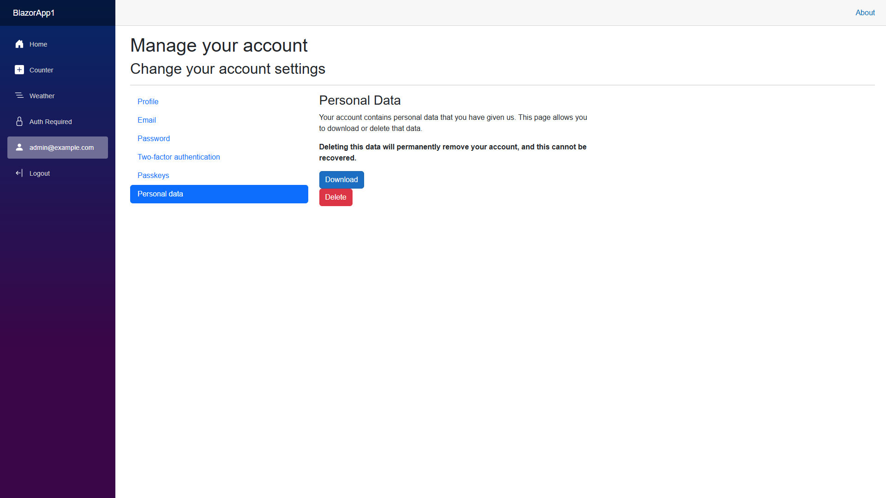
</a>
 <strong>1. Page Load +0ms</strong>
 59.1 KB
</td>
<td align="center" width="50%">

 <strong>2. axe-overlay</strong>
 57.8 KB
</td>
</tr>
<tr>
<td align="center" width="50%">
<a href="04-quickpeek-overlay.png">
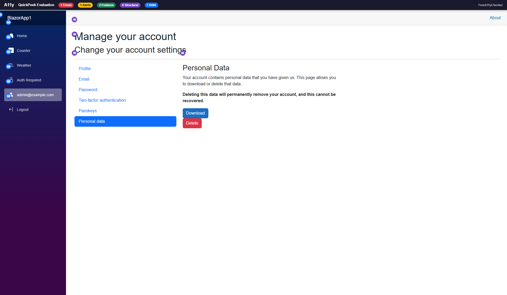
</a>
 <strong>3. quickpeek-overlay</strong>
 74.4 KB
</td>
<td align="center" width="50%">
<a href="05-htmlcs-overlay.png">
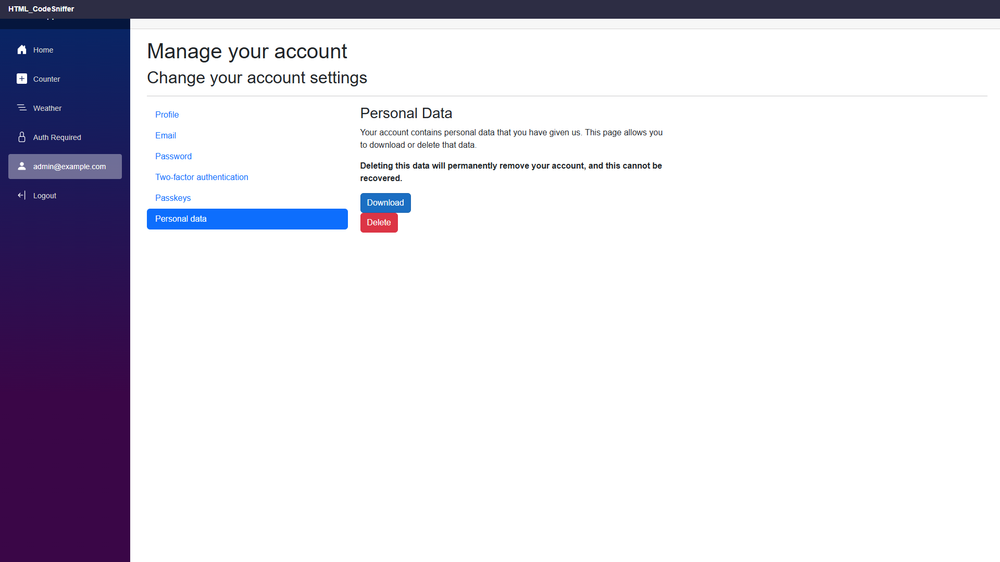
</a>
 <strong>4. htmlcs-overlay</strong>
 57.5 KB
</td>
</tr>
<tr>
<td align="center" width="50%">
<a href="06-ibm-overlay.png">
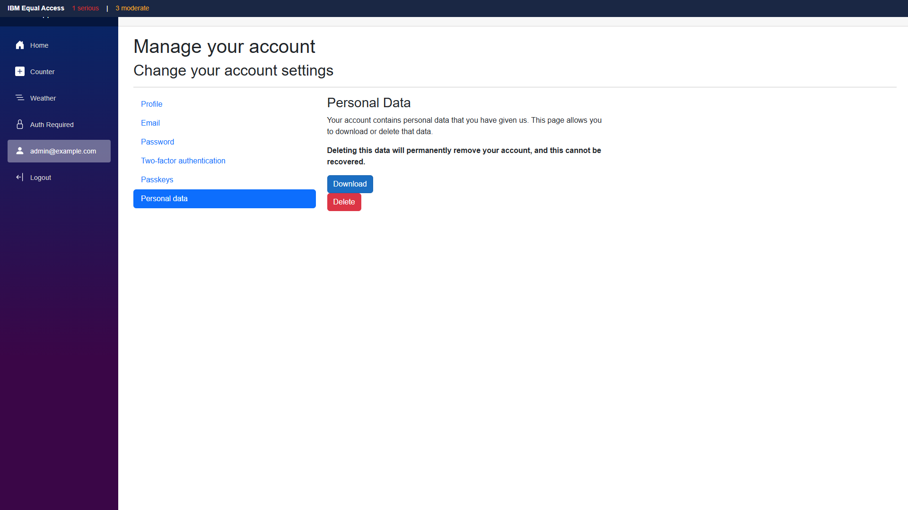
</a>
 <strong>5. ibm-overlay</strong>
 58.9 KB
</td>
<td align="center" width="50%">
<a href="07-structure-overlay.png">
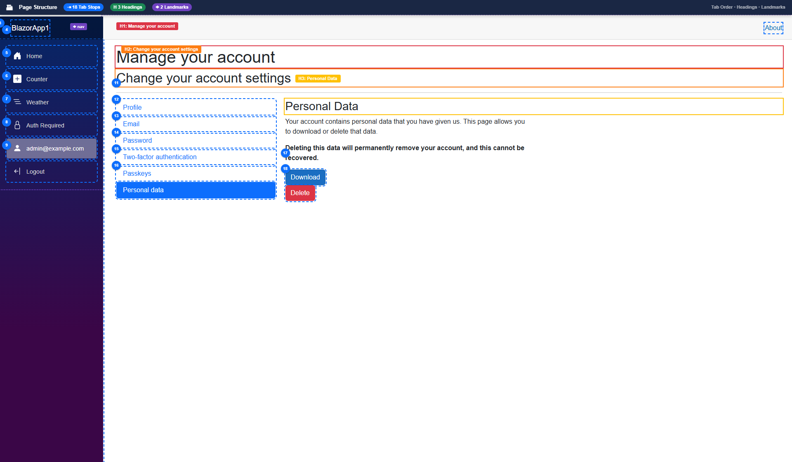
</a>
 <strong>6. structure-overlay</strong>
 97.1 KB
</td>
</tr>
<tr>
<td align="center" width="50%">
<a href="07b-wireframe-blueprint.png">
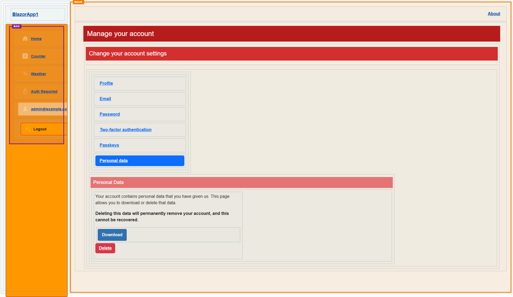
</a>
 <strong>7. wireframe-blueprint</strong>
 52.7 KB
</td>
<td align="center" width="50%">

 <strong>8. cvd-protanopia</strong>
 64.2 KB
</td>
</tr>
<tr>
<td align="center" width="50%">
<a href="09-cvd-deuteranopia.png">
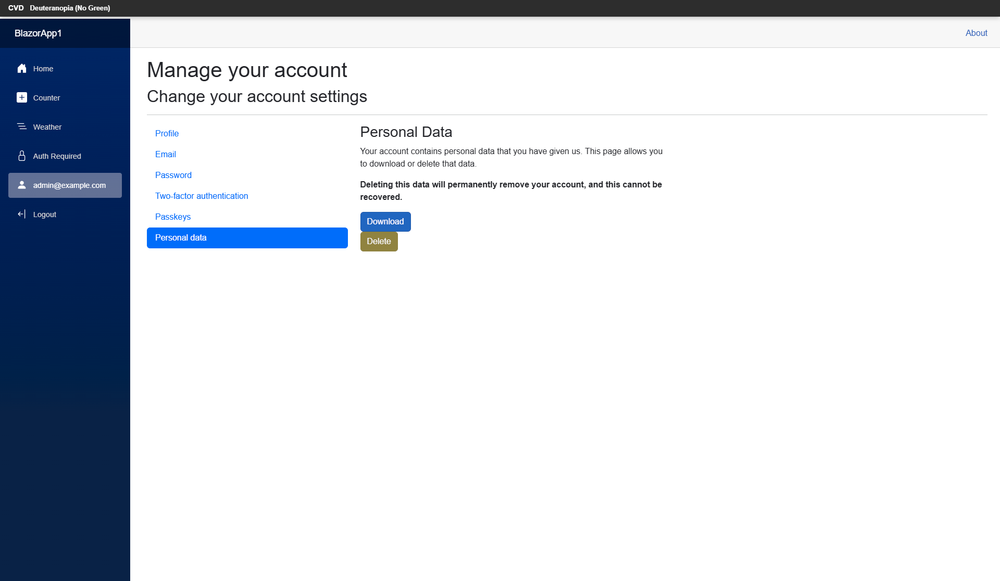
</a>
 <strong>9. cvd-deuteranopia</strong>
 64.8 KB
</td>
<td align="center" width="50%">
<a href="10-cvd-tritanopia.png">
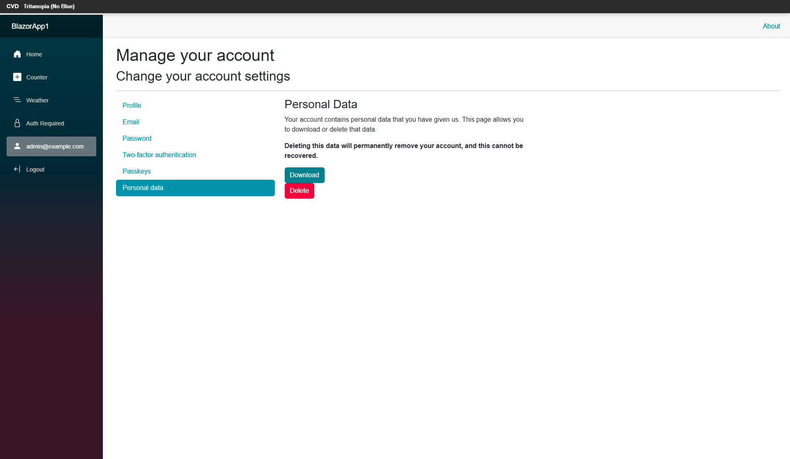
</a>
 <strong>10. cvd-tritanopia</strong>
 65.2 KB
</td>
</tr>
<tr>
<td align="center" width="50%">
<a href="11-cvd-achromatopsia.png">
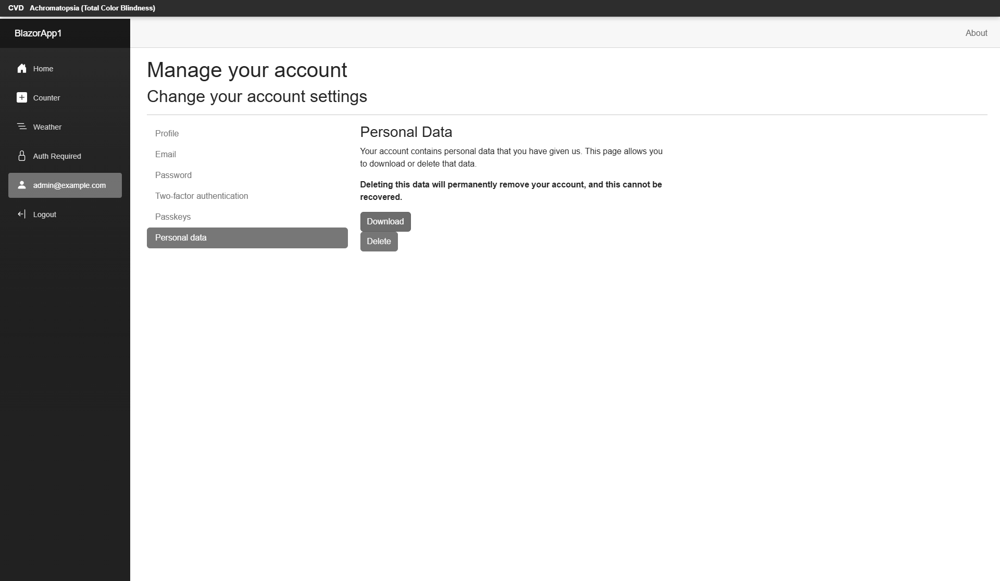
</a>
 <strong>11. cvd-achromatopsia</strong>
 58.5 KB
</td>
<td align="center" width="50%">
<a href="12-cvd-protanomaly.png">
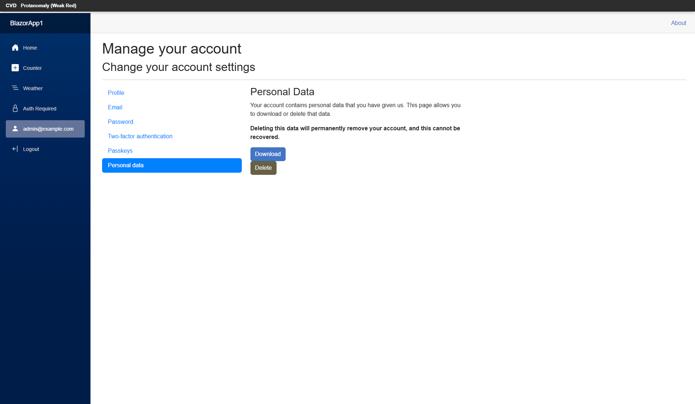
</a>
 <strong>12. cvd-protanomaly</strong>
 63.8 KB
</td>
</tr>
<tr>
<td align="center" width="50%">

 <strong>13. cvd-deuteranomaly</strong>
 65.1 KB
</td>
<td align="center" width="50%">
<a href="14-cvd-tritanomaly.png">
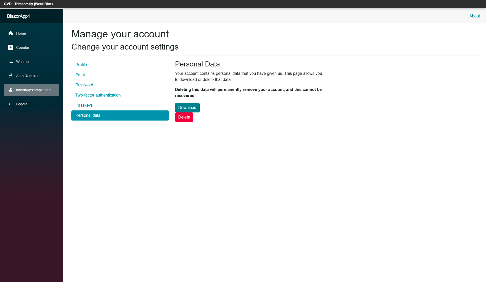
</a>
 <strong>14. cvd-tritanomaly</strong>
 65.5 KB
</td>
</tr>
<tr>
<td align="center" width="50%">
<a href="15-screenreader-view.png">
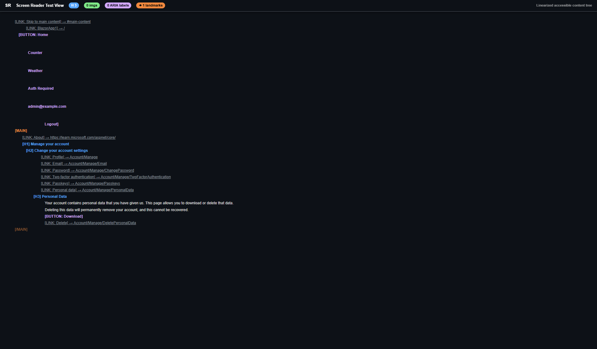
</a>
 <strong>15. screenreader-view</strong>
 55.3 KB
</td>
<td align="center" width="50%">
<a href="16-reduced-motion.png">
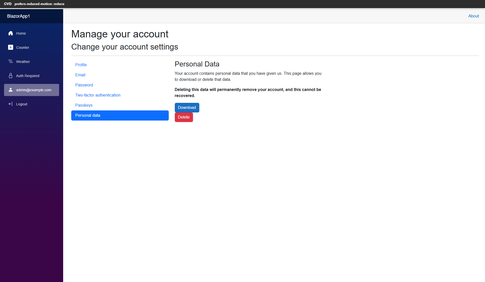
</a>
 <strong>16. reduced-motion</strong>
 61.5 KB
</td>
</tr>
<tr>
<td align="center" width="50%">
<a href="17-forced-colors.png">
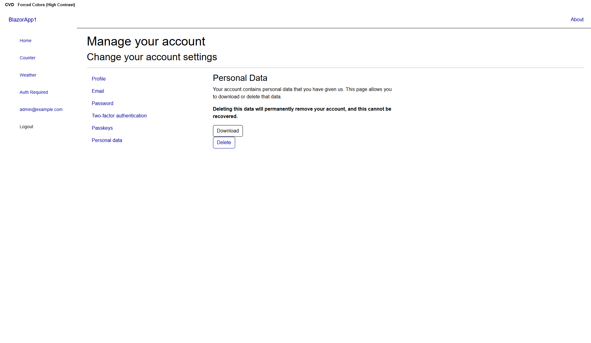
</a>
 <strong>17. forced-colors</strong>
 48.4 KB
</td>
<td></td>
</tr>
</table>

## Page Images (0)

*No images found on page.*

## Accessibility

### Cross-Tool Comparison

| Severity | axe | htmlcheck | htmlcs | ibm |
|----------|:---:|:---:|:---:|:---:|
| critical | 0 | 0 | 0 | 0 |
| serious | 1 | 0 | 0 | 1 |
| moderate | 0 | 0 | 0 | 3 |
| minor | 0 | 0 | 0 | 0 |
| **Total** | **1** | **0** | **0** | **4** |

### Violations by Confidence

<strong>3 rule(s) violated</strong>

| # | Rule | Severity | Consensus | axe | htmlcheck | htmlcs | ibm | Example |
|--:|------|:--------:|:---------:|:---:|:---:|:---:|:---:|---------|
| 1 | nested-interactive | serious | medium 1/4 | found | --- | --- | --- | `

> **Note:** Automated scanning catches ~30-60% of WCAG issues. Manual keyboard and screen reader testing is still required for full compliance.

## Files

| File | Description |
|------|-------------|
| `01-page-load-00000ms.png` | Page Load +0ms (59.1 KB) |
| `03-axe-overlay.png` | axe-overlay (57.8 KB) |
| `04-quickpeek-overlay.png` | quickpeek-overlay (74.4 KB) |
| `05-htmlcs-overlay.png` | htmlcs-overlay (57.5 KB) |
| `06-ibm-overlay.png` | ibm-overlay (58.9 KB) |
| `07-structure-overlay.png` | structure-overlay (97.1 KB) |
| `07b-wireframe-blueprint.png` | wireframe-blueprint (52.7 KB) |
| `08-cvd-protanopia.png` | cvd-protanopia (64.2 KB) |
| `09-cvd-deuteranopia.png` | cvd-deuteranopia (64.8 KB) |
| `10-cvd-tritanopia.png` | cvd-tritanopia (65.2 KB) |
| `11-cvd-achromatopsia.png` | cvd-achromatopsia (58.5 KB) |
| `12-cvd-protanomaly.png` | cvd-protanomaly (63.8 KB) |
| `13-cvd-deuteranomaly.png` | cvd-deuteranomaly (65.1 KB) |
| `14-cvd-tritanomaly.png` | cvd-tritanomaly (65.5 KB) |
| `15-screenreader-view.png` | screenreader-view (55.3 KB) |
| `16-reduced-motion.png` | reduced-motion (61.5 KB) |
| `17-forced-colors.png` | forced-colors (48.4 KB) |
| `metadata.json` | Machine-readable scan data |
| `a11y-summary.json` | Merged cross-tool accessibility summary |

---

*Generated by FreeA11yChecker Scanner v1.0*
