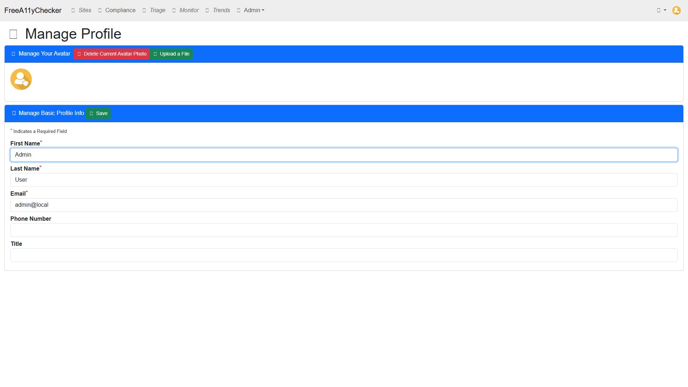
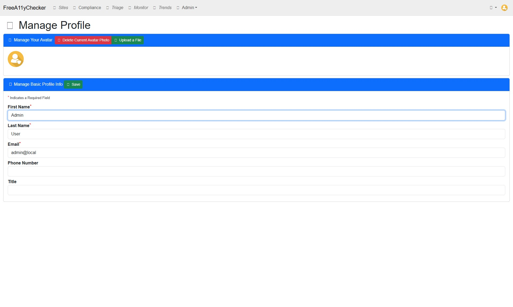
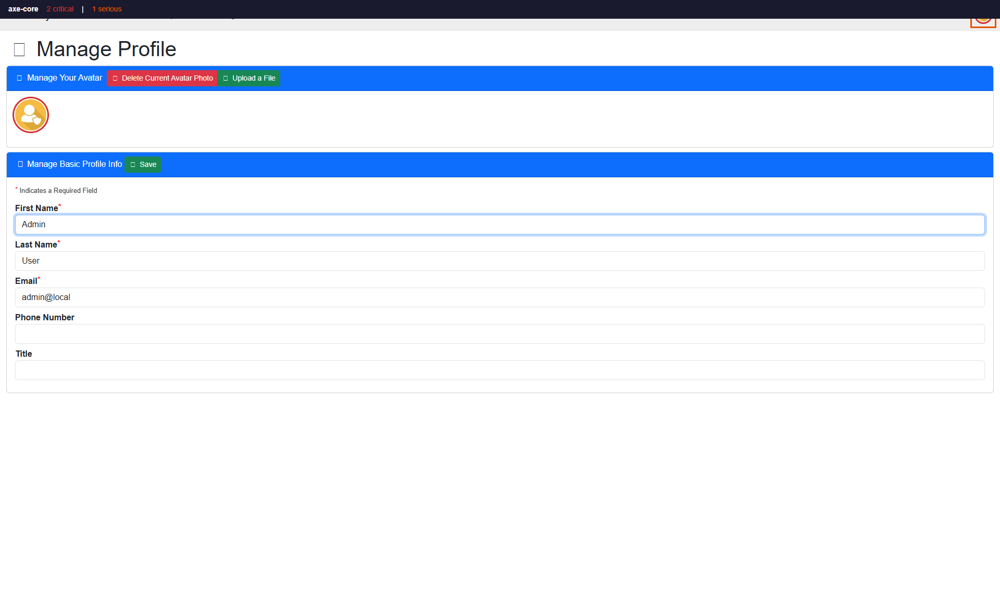
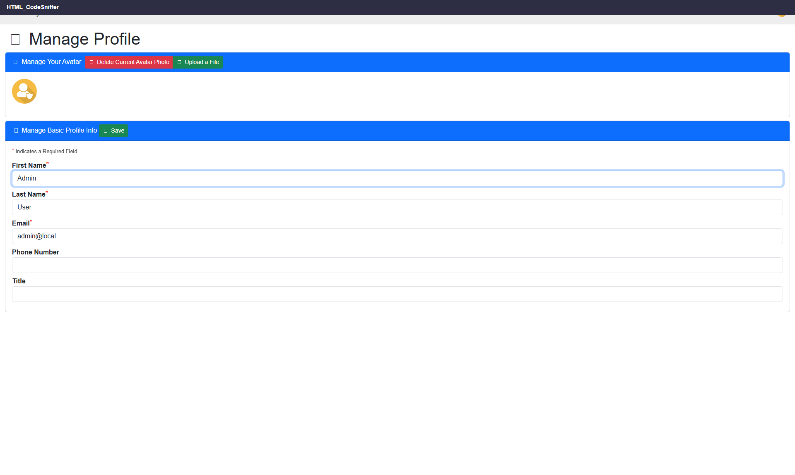
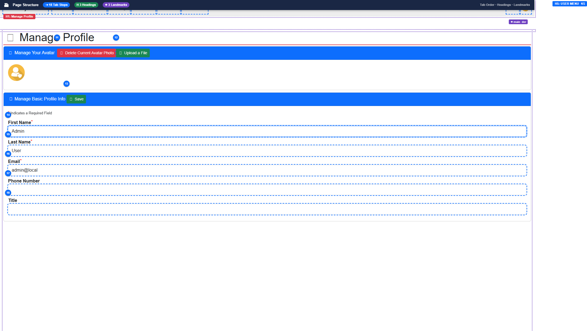
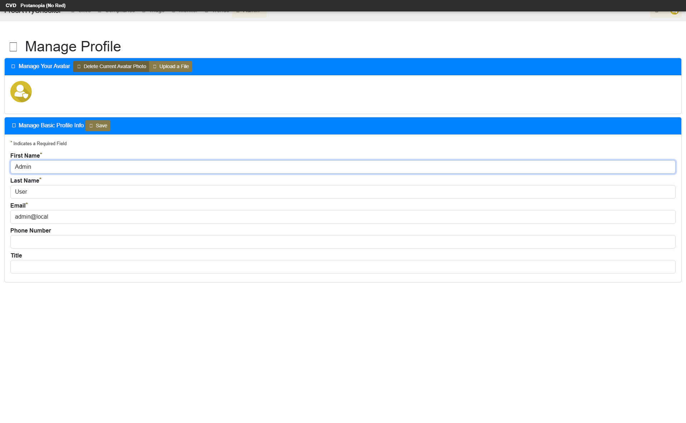
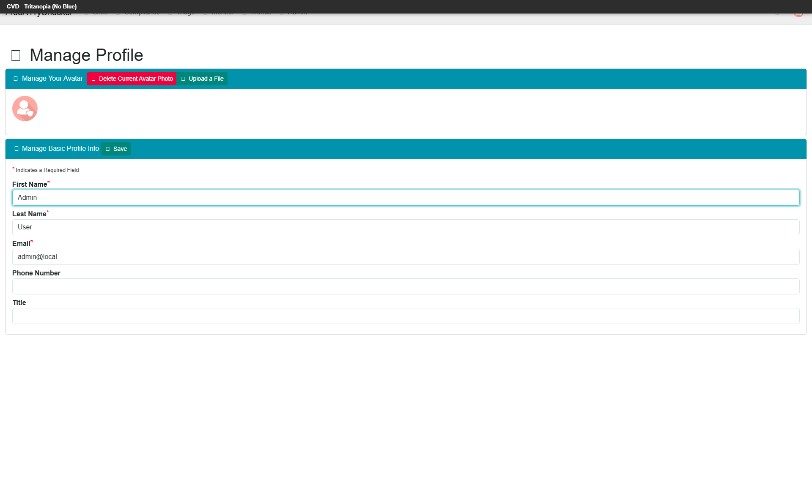
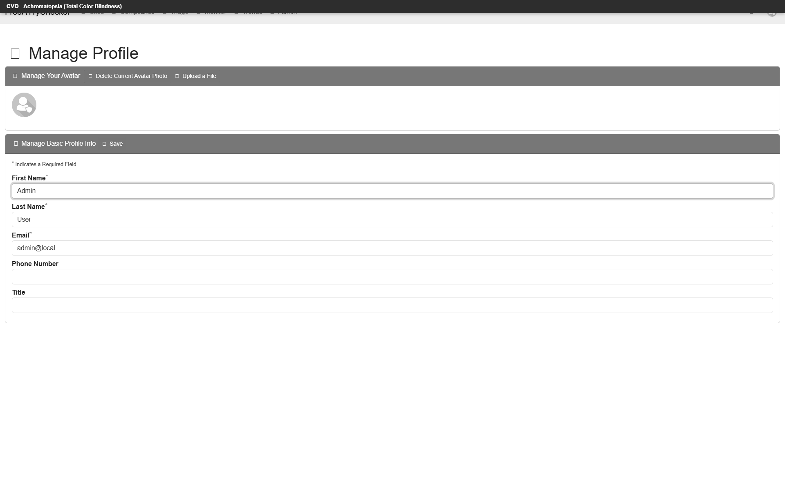
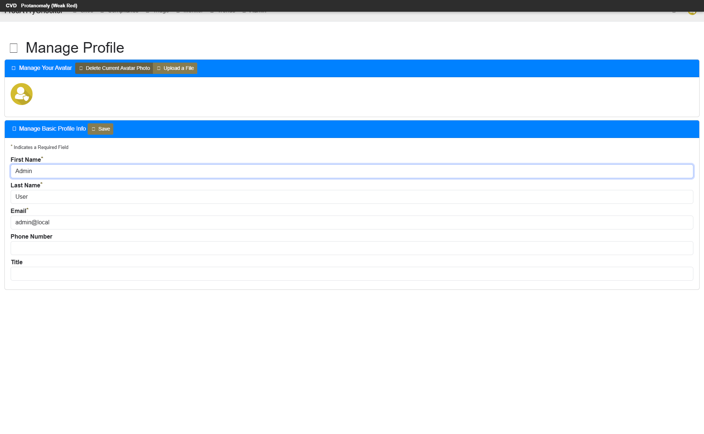

# Page Scan Report

> **URL:** http://localhost:5111/Profile  
> **Status:** ✅ 200  

---

## Summary

| Field | Value |
|-------|-------|
| URL | http://localhost:5111/Profile |
| Title | FreeA11yChecker |
| Status | ✅ 200 |
| HTML Size | 77.4 KB |
| Screenshots | 18 (851.1 KB) |
| Images | 2 |
| Images Missing Alt | Warning 2 |
| A11y Violations | Warning 10 |
| Critical | 2 |
| Serious | 7 |
| Moderate | 1 |
| Minor | 0 |
| Tools Run | axe, htmlcheck, htmlcs, ibm |

## Screenshots

<table>
<tr>
<td align="center" width="50%">

 <strong>1. Page Load +0ms</strong>
 41.2 KB
</td>
<td align="center" width="50%">

 <strong>2. page-expanded</strong>
 104.1 KB
</td>
</tr>
<tr>
<td align="center" width="50%">

 <strong>3. axe-overlay</strong>
 38.6 KB
</td>
<td align="center" width="50%">

 <strong>4. quickpeek-overlay</strong>
 53.0 KB
</td>
</tr>
<tr>
<td align="center" width="50%">

 <strong>5. htmlcs-overlay</strong>
 35.5 KB
</td>
<td align="center" width="50%">

 <strong>6. ibm-overlay</strong>
 36.9 KB
</td>
</tr>
<tr>
<td align="center" width="50%">

 <strong>7. structure-overlay</strong>
 67.7 KB
</td>
<td align="center" width="50%">

 <strong>8. wireframe-blueprint</strong>
 53.2 KB
</td>
</tr>
<tr>
<td align="center" width="50%">

 <strong>9. cvd-protanopia</strong>
 41.3 KB
</td>
<td align="center" width="50%">

 <strong>10. cvd-deuteranopia</strong>
 41.2 KB
</td>
</tr>
<tr>
<td align="center" width="50%">

 <strong>11. cvd-tritanopia</strong>
 40.7 KB
</td>
<td align="center" width="50%">

 <strong>12. cvd-achromatopsia</strong>
 39.4 KB
</td>
</tr>
<tr>
<td align="center" width="50%">

 <strong>13. cvd-protanomaly</strong>
 41.0 KB
</td>
<td align="center" width="50%">

 <strong>14. cvd-deuteranomaly</strong>
 41.4 KB
</td>
</tr>
<tr>
<td align="center" width="50%">

 <strong>15. cvd-tritanomaly</strong>
 41.0 KB
</td>
<td align="center" width="50%">

 <strong>16. screenreader-view</strong>
 64.0 KB
</td>
</tr>
<tr>
<td align="center" width="50%">

 <strong>17. reduced-motion</strong>
 36.7 KB
</td>
<td align="center" width="50%">

 <strong>18. forced-colors</strong>
 34.1 KB
</td>
</tr>
</table>

## Page Images (2)

| # | Source URL | Alt Text |
|--:|-----------|----------|
| 1 | http://localhost:5111/File/View/c77bf246-5a9c-4a06-a538-632eae2be15a | *(missing)* |
| 2 | http://localhost:5111/File/View/c77bf246-5a9c-4a06-a538-632eae2be15a | *(missing)* |

## Accessibility

### Cross-Tool Comparison

| Severity | axe | htmlcheck | htmlcs | ibm |
|----------|:---:|:---:|:---:|:---:|
| critical | 2 | 0 | 0 | 0 |
| serious | 1 | 2 | 0 | 4 |
| moderate | 0 | 0 | 0 | 1 |
| minor | 0 | 0 | 0 | 0 |
| **Total** | **3** | **2** | **0** | **5** |

### Violations by Confidence

<strong>6 rule(s) violated</strong>

| # | Rule | Severity | Consensus | axe | htmlcheck | htmlcs | ibm | Example |
|--:|------|:--------:|:---------:|:---:|:---:|:---:|:---:|---------|
| 1 | image-alt | critical | medium 2/4 | found | found | --- | --- | `` |
| 6 | aria_content_in_landmark | moderate | low 1/4 | --- | --- | --- | found | `<a href="#main-content" class="visually-hidden-focusable">` |

> **Note:** Automated scanning catches ~30-60% of WCAG issues. Manual keyboard and screen reader testing is still required for full compliance.

## Files

| File | Description |
|------|-------------|
| `01-page-load-00000ms.png` | Page Load +0ms (41.2 KB) |
| `02-page-expanded.jpeg` | page-expanded (104.1 KB) |
| `03-axe-overlay.png` | axe-overlay (38.6 KB) |
| `04-quickpeek-overlay.png` | quickpeek-overlay (53.0 KB) |
| `05-htmlcs-overlay.png` | htmlcs-overlay (35.5 KB) |
| `06-ibm-overlay.png` | ibm-overlay (36.9 KB) |
| `07-structure-overlay.png` | structure-overlay (67.7 KB) |
| `07b-wireframe-blueprint.png` | wireframe-blueprint (53.2 KB) |
| `08-cvd-protanopia.png` | cvd-protanopia (41.3 KB) |
| `09-cvd-deuteranopia.png` | cvd-deuteranopia (41.2 KB) |
| `10-cvd-tritanopia.png` | cvd-tritanopia (40.7 KB) |
| `11-cvd-achromatopsia.png` | cvd-achromatopsia (39.4 KB) |
| `12-cvd-protanomaly.png` | cvd-protanomaly (41.0 KB) |
| `13-cvd-deuteranomaly.png` | cvd-deuteranomaly (41.4 KB) |
| `14-cvd-tritanomaly.png` | cvd-tritanomaly (41.0 KB) |
| `15-screenreader-view.png` | screenreader-view (64.0 KB) |
| `16-reduced-motion.png` | reduced-motion (36.7 KB) |
| `17-forced-colors.png` | forced-colors (34.1 KB) |
| `metadata.json` | Machine-readable scan data |
| `a11y-summary.json` | Merged cross-tool accessibility summary |

---

*Generated by FreeA11yChecker Scanner v1.0*
