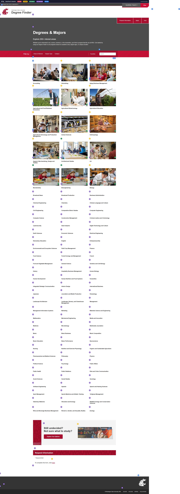
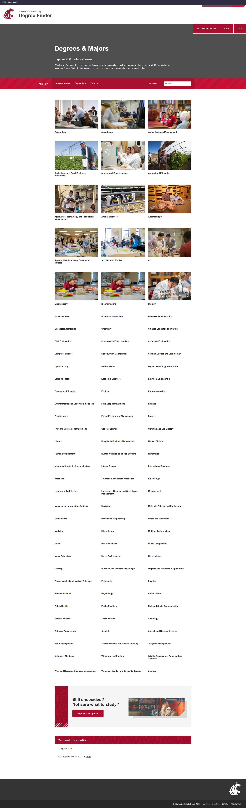
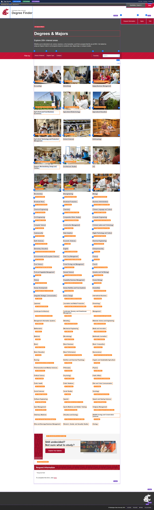
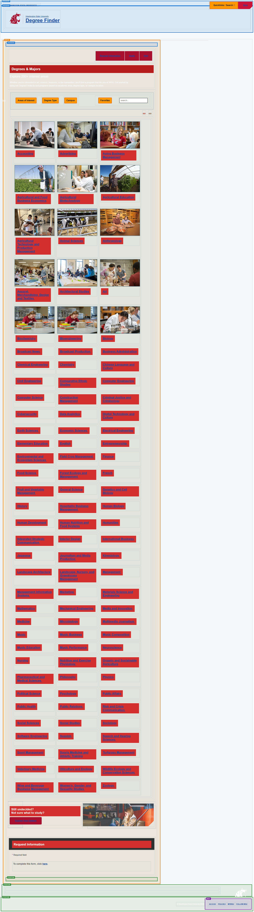
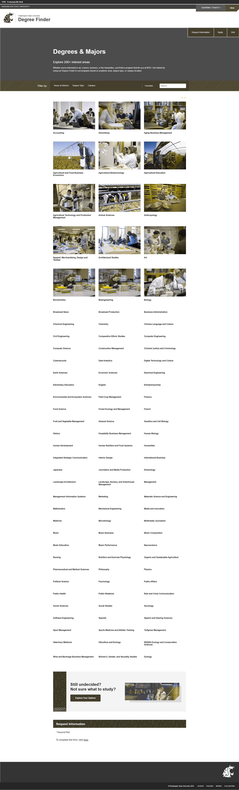
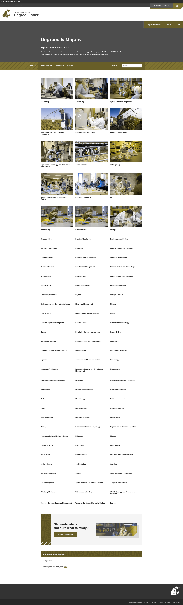
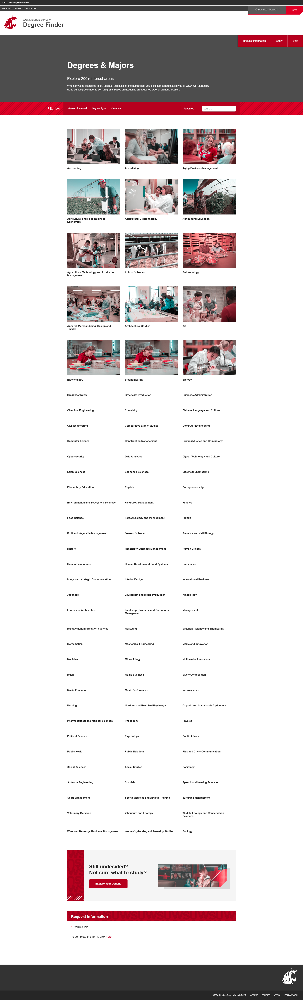
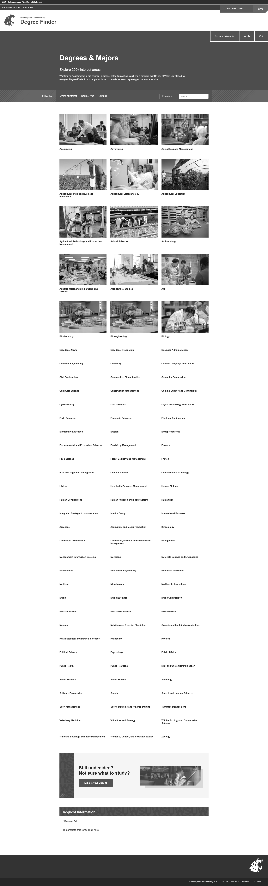
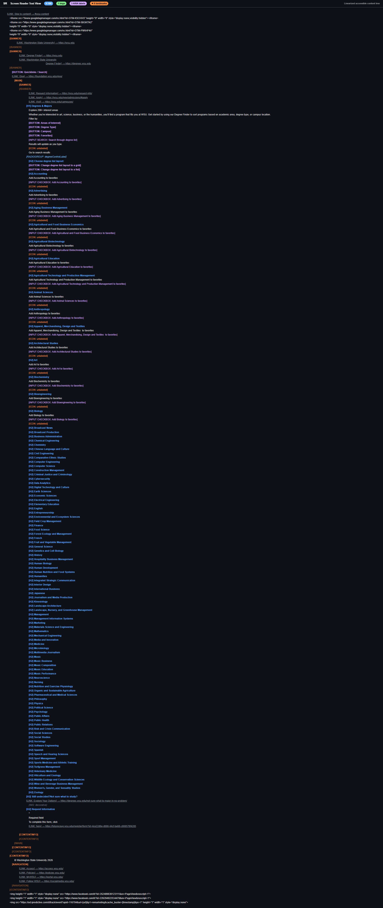
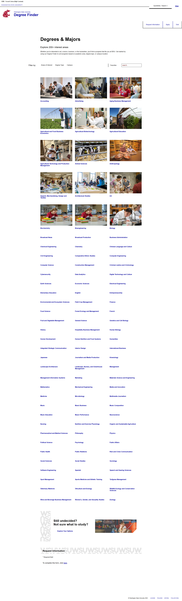

# Page Scan Report

> **URL:** https://admission.wsu.edu/academics/  
> **Status:** ✅ 200  

---

## Summary

| Field | Value |
|-------|-------|
| URL | https://admission.wsu.edu/academics/ |
| Title | Degree Finder | Washington State University |
| Status | ✅ 200 |
| HTML Size | 96.9 KB |
| Screenshots | 17 (33.4 MB) |
| Images | 16 |
| Images Missing Alt | 0 |
| A11y Violations | Warning 13 |
| Critical | 0 |
| Serious | 6 |
| Moderate | 7 |
| Minor | 0 |
| Tools Run | axe, htmlcheck, htmlcs, ibm |

## Screenshots

<table>
<tr>
<td align="center" width="50%">

 <strong>1. Page Load +0ms</strong>
 420.8 KB
</td>
<td align="center" width="50%">

 <strong>2. axe-overlay</strong>
 2.3 MB
</td>
</tr>
<tr>
<td align="center" width="50%">

 <strong>3. quickpeek-overlay</strong>
 2.3 MB
</td>
<td align="center" width="50%">

 <strong>4. htmlcs-overlay</strong>
 2.3 MB
</td>
</tr>
<tr>
<td align="center" width="50%">

 <strong>5. ibm-overlay</strong>
 2.3 MB
</td>
<td align="center" width="50%">

 <strong>6. structure-overlay</strong>
 2.4 MB
</td>
</tr>
<tr>
<td align="center" width="50%">

 <strong>7. wireframe-blueprint</strong>
 2.0 MB
</td>
<td align="center" width="50%">

 <strong>8. cvd-protanopia</strong>
 2.2 MB
</td>
</tr>
<tr>
<td align="center" width="50%">

 <strong>9. cvd-deuteranopia</strong>
 2.2 MB
</td>
<td align="center" width="50%">

 <strong>10. cvd-tritanopia</strong>
 2.2 MB
</td>
</tr>
<tr>
<td align="center" width="50%">

 <strong>11. cvd-achromatopsia</strong>
 1.4 MB
</td>
<td align="center" width="50%">

 <strong>12. cvd-protanomaly</strong>
 2.2 MB
</td>
</tr>
<tr>
<td align="center" width="50%">

 <strong>13. cvd-deuteranomaly</strong>
 2.2 MB
</td>
<td align="center" width="50%">

 <strong>14. cvd-tritanomaly</strong>
 2.2 MB
</td>
</tr>
<tr>
<td align="center" width="50%">

 <strong>15. screenreader-view</strong>
 357.9 KB
</td>
<td align="center" width="50%">

 <strong>16. reduced-motion</strong>
 2.3 MB
</td>
</tr>
<tr>
<td align="center" width="50%">

 <strong>17. forced-colors</strong>
 2.3 MB
</td>
<td></td>
</tr>
</table>

## Page Images (16)

| # | Source URL | Alt Text |
|--:|-----------|----------|
| 1 | https://wpcdn.web.wsu.edu/wp-ucomm/uploads/sites/3025/Accounting_CCOB-Class-R... |  |
| 2 | https://wpcdn.web.wsu.edu/wp-ucomm/uploads/sites/3025/Murrow_6615-768x512.jpg |  |
| 3 | https://wpcdn.web.wsu.edu/wp-ucomm/uploads/sites/3025/CCOB-at-Senior-Center_7... |  |
| 4 | https://wpcdn.web.wsu.edu/wp-ucomm/uploads/sites/3025/CAHNRS_PotatoFieldDay-7... |  |
| 5 | https://wpcdn.web.wsu.edu/wp-ucomm/uploads/sites/3025/CAHNRS_Tri-Cities-Biofu... |  |
| 6 | https://wpcdn.web.wsu.edu/wp-ucomm/uploads/sites/3025/Agricultural-Education-... |  |
| 7 | https://wpcdn.web.wsu.edu/wp-ucomm/uploads/sites/3025/CAHNRS_-Karkee-Biologic... |  |
| 8 | https://wpcdn.web.wsu.edu/wp-ucomm/uploads/sites/3025/Animal-Sciences-Knott-D... |  |
| 9 | https://wpcdn.web.wsu.edu/wp-ucomm/uploads/sites/3025/CAS-anthro-pottery_2975... |  |
| 10 | https://wpcdn.web.wsu.edu/wp-ucomm/uploads/sites/3025/Apparel-Merchandise_AMD... |  |
| 11 | https://wpcdn.web.wsu.edu/wp-ucomm/uploads/sites/3025/Architectural-Studies_A... | Students work and collaborate on a pr... |
| 12 | https://wpcdn.web.wsu.edu/wp-ucomm/uploads/sites/3025/CAS_FineArts-Clay-Palme... |  |
| 13 | https://wpcdn.web.wsu.edu/wp-ucomm/uploads/sites/3025/bioengineering-biochemi... | A student in a lab examines "bee hote... |
| 14 | https://wpcdn.web.wsu.edu/wp-ucomm/uploads/sites/3025/bioengineering-biochemi... | A student in a lab examines "bee hote... |
| 15 | https://wpcdn.web.wsu.edu/wp-ucomm/uploads/sites/3025/CAS-X_General-Science_M... |  |
| 16 | https://wpcdn.web.wsu.edu/wp-ucomm/uploads/sites/3025/2023-11-06-10_06_49-Unt... |  |

## Accessibility

### Cross-Tool Comparison

| Severity | axe | htmlcheck | htmlcs | ibm |
|----------|:---:|:---:|:---:|:---:|
| critical | 0 | 0 | 0 | 0 |
| serious | 2 | 3 | 0 | 1 |
| moderate | 0 | 1 | 0 | 6 |
| minor | 0 | 0 | 0 | 0 |
| **Total** | **2** | **4** | **0** | **7** |

### Violations by Confidence

<strong>8 rule(s) violated</strong>

| # | Rule | Severity | Consensus | axe | htmlcheck | htmlcs | ibm | Example |
|--:|------|:--------:|:---------:|:---:|:---:|:---:|:---:|---------|
| 1 | target-size | serious | high 1/4 | found | --- | --- | --- | `<button class="wsu-degree-finder__degrees-grid-control-gr...` |
| 2 | image-alt | serious | low 1/4 | --- | found | --- | --- | `` |
| 5 | aria_child_valid | moderate | low 1/4 | --- | --- | --- | found | `

> **Note:** Automated scanning catches ~30-60% of WCAG issues. Manual keyboard and screen reader testing is still required for full compliance.

## Files

| File | Description |
|------|-------------|
| `01-page-load-00000ms.png` | Page Load +0ms (420.8 KB) |
| `03-axe-overlay.png` | axe-overlay (2.3 MB) |
| `04-quickpeek-overlay.png` | quickpeek-overlay (2.3 MB) |
| `05-htmlcs-overlay.png` | htmlcs-overlay (2.3 MB) |
| `06-ibm-overlay.png` | ibm-overlay (2.3 MB) |
| `07-structure-overlay.png` | structure-overlay (2.4 MB) |
| `07b-wireframe-blueprint.png` | wireframe-blueprint (2.0 MB) |
| `08-cvd-protanopia.png` | cvd-protanopia (2.2 MB) |
| `09-cvd-deuteranopia.png` | cvd-deuteranopia (2.2 MB) |
| `10-cvd-tritanopia.png` | cvd-tritanopia (2.2 MB) |
| `11-cvd-achromatopsia.png` | cvd-achromatopsia (1.4 MB) |
| `12-cvd-protanomaly.png` | cvd-protanomaly (2.2 MB) |
| `13-cvd-deuteranomaly.png` | cvd-deuteranomaly (2.2 MB) |
| `14-cvd-tritanomaly.png` | cvd-tritanomaly (2.2 MB) |
| `15-screenreader-view.png` | screenreader-view (357.9 KB) |
| `16-reduced-motion.png` | reduced-motion (2.3 MB) |
| `17-forced-colors.png` | forced-colors (2.3 MB) |
| `metadata.json` | Machine-readable scan data |
| `a11y-summary.json` | Merged cross-tool accessibility summary |

---

*Generated by FreeA11yChecker Scanner v1.0*
