# Page Scan Report

> **URL:** https://admission.wsu.edu/visits/  
> **Status:** ✅ 200  

---

## Summary

| Field | Value |
|-------|-------|
| URL | https://admission.wsu.edu/visits/ |
| Title | Visit & Explore | Admissions | Washington State University |
| Status | ✅ 200 |
| HTML Size | 128.0 KB |
| Screenshots | 18 (42.5 MB) |
| Images | 12 |
| Images Missing Alt | 0 |
| A11y Violations | Warning 49 |
| Critical | 1 |
| Serious | 26 |
| Moderate | 22 |
| Minor | 0 |
| Tools Run | axe, htmlcheck, htmlcs, ibm |

## Screenshots

<table>
<tr>
<td align="center" width="50%">
<a href="01-page-load-00000ms.png">
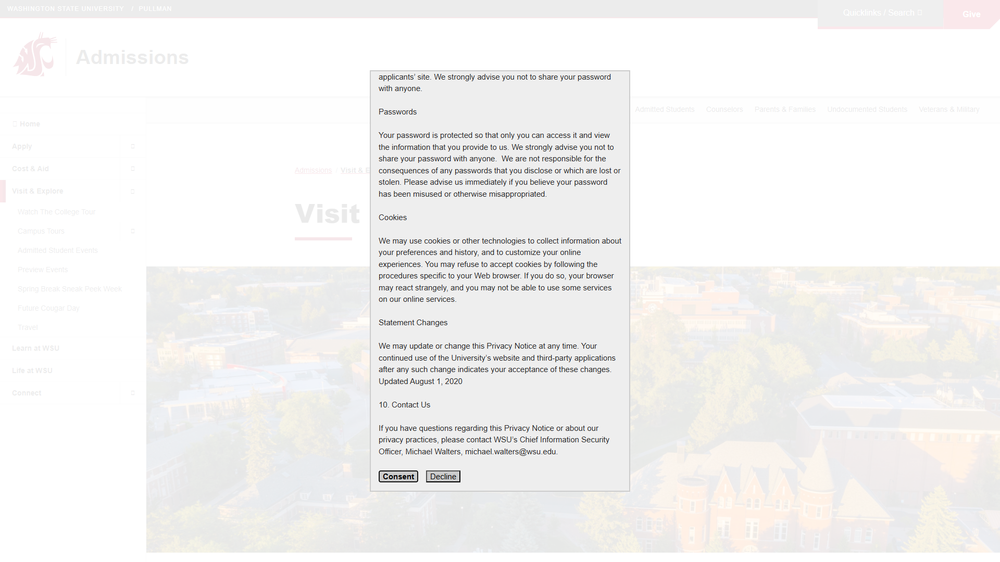
</a>
 <strong>1. Page Load +0ms</strong>
 682.5 KB
</td>
<td align="center" width="50%">
<a href="02-page-expanded.jpeg">
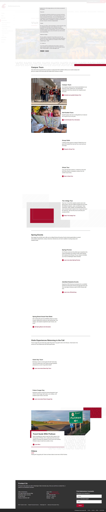
</a>
 <strong>2. page-expanded</strong>
 1.2 MB
</td>
</tr>
<tr>
<td align="center" width="50%">

 <strong>3. axe-overlay</strong>
 2.5 MB
</td>
<td align="center" width="50%">
<a href="04-quickpeek-overlay.png">
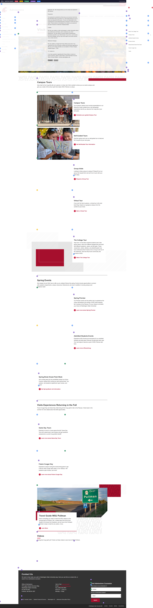
</a>
 <strong>4. quickpeek-overlay</strong>
 2.7 MB
</td>
</tr>
<tr>
<td align="center" width="50%">

 <strong>5. htmlcs-overlay</strong>
 2.5 MB
</td>
<td align="center" width="50%">

 <strong>6. ibm-overlay</strong>
 2.5 MB
</td>
</tr>
<tr>
<td align="center" width="50%">
<a href="07-structure-overlay.png">
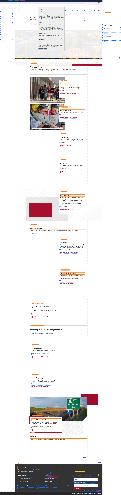
</a>
 <strong>7. structure-overlay</strong>
 2.7 MB
</td>
<td align="center" width="50%">
<a href="07b-wireframe-blueprint.png">
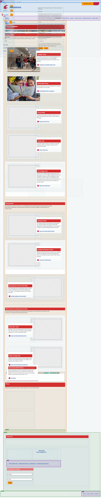
</a>
 <strong>8. wireframe-blueprint</strong>
 1.6 MB
</td>
</tr>
<tr>
<td align="center" width="50%">
<a href="08-cvd-protanopia.png">
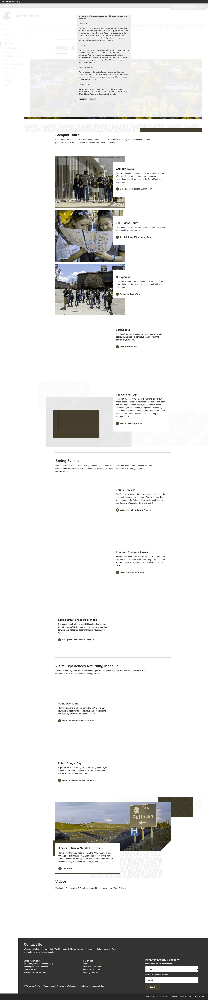
</a>
 <strong>9. cvd-protanopia</strong>
 2.9 MB
</td>
<td align="center" width="50%">
<a href="09-cvd-deuteranopia.png">
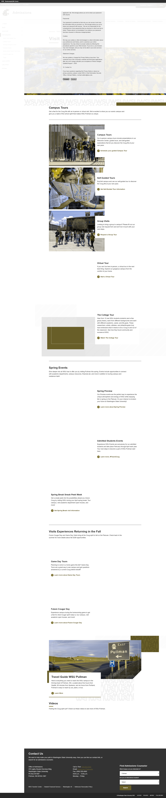
</a>
 <strong>10. cvd-deuteranopia</strong>
 2.9 MB
</td>
</tr>
<tr>
<td align="center" width="50%">
<a href="10-cvd-tritanopia.png">
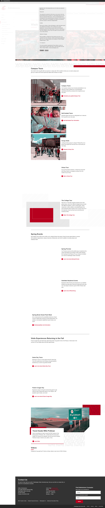
</a>
 <strong>11. cvd-tritanopia</strong>
 2.9 MB
</td>
<td align="center" width="50%">
<a href="11-cvd-achromatopsia.png">
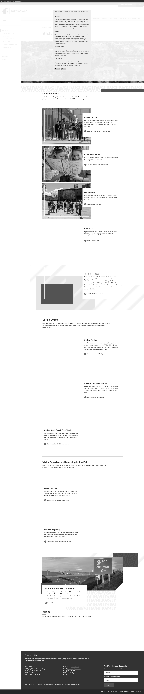
</a>
 <strong>12. cvd-achromatopsia</strong>
 1.9 MB
</td>
</tr>
<tr>
<td align="center" width="50%">
<a href="12-cvd-protanomaly.png">
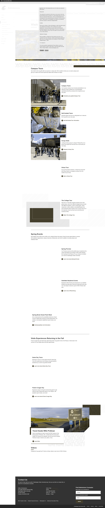
</a>
 <strong>13. cvd-protanomaly</strong>
 2.9 MB
</td>
<td align="center" width="50%">

 <strong>14. cvd-deuteranomaly</strong>
 2.9 MB
</td>
</tr>
<tr>
<td align="center" width="50%">

 <strong>15. cvd-tritanomaly</strong>
 2.9 MB
</td>
<td align="center" width="50%">
<a href="15-screenreader-view.png">
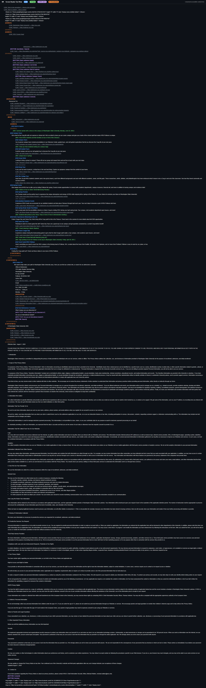
</a>
 <strong>16. screenreader-view</strong>
 788.0 KB
</td>
</tr>
<tr>
<td align="center" width="50%">

 <strong>17. reduced-motion</strong>
 3.0 MB
</td>
<td align="center" width="50%">
<a href="17-forced-colors.png">
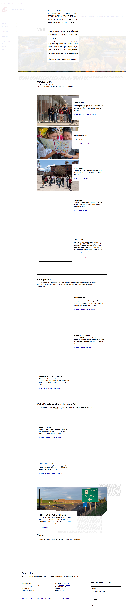
</a>
 <strong>18. forced-colors</strong>
 3.0 MB
</td>
</tr>
</table>

## Page Images (12)

| # | Source URL | Alt Text |
|--:|-----------|----------|
| 1 | https://wpcdn.web.wsu.edu/wp-admission/uploads/sites/3144/2022/11/Summer2020D... | Summer aerials with a drone on the ca... |
| 2 | https://wpcdn.web.wsu.edu/wp-admission/uploads/sites/3144/2024/08/Group-tour-... | Future WSU students and their familie... |
| 3 | https://wpcdn.web.wsu.edu/wp-admission/uploads/sites/3144/2024/08/Map-edited-... | Close up of two students looking at a... |
| 4 | https://wpcdn.web.wsu.edu/wp-admission/uploads/sites/3144/2023/11/tour-for-we... | campus tour in spring |
| 5 | https://wpcdn.web.wsu.edu/wp-admission/uploads/sites/3144/2024/08/computer-ed... |  |
| 6 | https://wpcdn.web.wsu.edu/wp-admission/uploads/sites/3144/2024/08/vlcsnap-202... |  |
| 7 | https://wpcdn.web.wsu.edu/wp-admission/uploads/sites/3144/2025/07/Spring-Prev... | Visitors on tour on Glenn Terrell Mal... |
| 8 | https://wpcdn.web.wsu.edu/wp-admission/uploads/sites/3144/2024/08/FutureCoug-... |  |
| 9 | https://wpcdn.web.wsu.edu/wp-admission/uploads/sites/3144/2024/09/Spring_2059... | Students take photos by the Cherry Tr... |
| 10 | https://wpcdn.web.wsu.edu/wp-admission/uploads/sites/3144/2025/07/FootballCro... | Crowd cheering in Martin Stadium |
| 11 | https://wpcdn.web.wsu.edu/wp-admission/uploads/sites/3144/2025/07/Cougs-Run-O... | Aerial view of Gesa field with firewo... |
| 12 | https://wpcdn.web.wsu.edu/wp-admission/uploads/sites/3144/2024/10/Pullman-Roa... | Sign pointing to turn for Pullman on ... |

## Accessibility

### Cross-Tool Comparison

| Severity | axe | htmlcheck | htmlcs | ibm |
|----------|:---:|:---:|:---:|:---:|
| critical | 1 | 0 | 0 | 0 |
| serious | 4 | 5 | 0 | 17 |
| moderate | 0 | 1 | 0 | 21 |
| minor | 0 | 0 | 0 | 0 |
| **Total** | **5** | **6** | **0** | **38** |

### Violations by Confidence

<strong>19 rule(s) violated</strong>

| # | Rule | Severity | Consensus | axe | htmlcheck | htmlcs | ibm | Example |
|--:|------|:--------:|:---------:|:---:|:---:|:---:|:---:|---------|
| 1 | aria-allowed-attr | critical | medium 1/4 | found | --- | --- | --- | `
509-553-5450</a>` |
| 3 | label_name_visible | serious | low 1/4 | --- | --- | --- | found | `<a class="wsu-button wsu-button--style-action" href="http...` |
| 4 | image-alt | serious | low 1/4 | --- | found | --- | --- | `` |
| 6 | frame-title | serious | low 1/4 | found | --- | --- | --- | `<iframe class="youtube-player" type="text/html" width="64...` |
| 7 | aria_banner_single | serious | low 1/4 | --- | --- | --- | found | `<header class="wsu-header-global  wsu-header-global--styl...` |
| 8 | aria_banner_label_unique | serious | low 1/4 | --- | --- | --- | found | `<header class="wsu-header-global  wsu-header-global--styl...` |
| 9 | frame_title_exists | serious | low 1/4 | --- | --- | --- | found | `<iframe allowfullscreen="true" frameborder="0" src="https...` |
| 10 | aria_contentinfo_label_unique | serious | low 1/4 | --- | --- | --- | found | `<footer class="wsu-footer-site wsu-footer-site--dark">` |
| 11 | text_contrast_sufficient | serious | low 1/4 | --- | --- | --- | found | `<a href="tel:5095535450">` |
| 12 | link-name | serious | low 1/4 | --- | found | --- | --- | `<a href="https://admission.wsu.edu?s=" class="wsu-button-...` |
| 13 | button-name | serious | low 1/4 | --- | found | --- | --- | `<button class="wsu-search__submit" aria-lable="Submit Sea...` |
| 14 | figure_label_exists | moderate | low 1/4 | --- | --- | --- | found | `<figure class="wp-block-image size-large wsu-position--re...` |
| 15 | aria_landmark_name_unique | moderate | low 1/4 | --- | --- | --- | found | `<header class="wsu-header-global  wsu-header-global--styl...` |
| 16 | aria_content_in_landmark | moderate | low 1/4 | --- | --- | --- | found | `<a href="#menu-site-navigation" class="wsu-skip-to-main">` |
| 17 | label | moderate | low 1/4 | --- | found | --- | --- | `<input class="wsu-search__input" type="text" aria-lable="...` |
| 18 | aria_attribute_redundant | moderate | low 1/4 | --- | --- | --- | found | `<select aria-required="true" required="required" name="fo...` |
| 19 | aria_child_valid | moderate | low 1/4 | --- | --- | --- | found | `<ul class="wsu-social-icons">` |

> **Note:** Automated scanning catches ~30-60% of WCAG issues. Manual keyboard and screen reader testing is still required for full compliance.

## Files

| File | Description |
|------|-------------|
| `01-page-load-00000ms.png` | Page Load +0ms (682.5 KB) |
| `02-page-expanded.jpeg` | page-expanded (1.2 MB) |
| `03-axe-overlay.png` | axe-overlay (2.5 MB) |
| `04-quickpeek-overlay.png` | quickpeek-overlay (2.7 MB) |
| `05-htmlcs-overlay.png` | htmlcs-overlay (2.5 MB) |
| `06-ibm-overlay.png` | ibm-overlay (2.5 MB) |
| `07-structure-overlay.png` | structure-overlay (2.7 MB) |
| `07b-wireframe-blueprint.png` | wireframe-blueprint (1.6 MB) |
| `08-cvd-protanopia.png` | cvd-protanopia (2.9 MB) |
| `09-cvd-deuteranopia.png` | cvd-deuteranopia (2.9 MB) |
| `10-cvd-tritanopia.png` | cvd-tritanopia (2.9 MB) |
| `11-cvd-achromatopsia.png` | cvd-achromatopsia (1.9 MB) |
| `12-cvd-protanomaly.png` | cvd-protanomaly (2.9 MB) |
| `13-cvd-deuteranomaly.png` | cvd-deuteranomaly (2.9 MB) |
| `14-cvd-tritanomaly.png` | cvd-tritanomaly (2.9 MB) |
| `15-screenreader-view.png` | screenreader-view (788.0 KB) |
| `16-reduced-motion.png` | reduced-motion (3.0 MB) |
| `17-forced-colors.png` | forced-colors (3.0 MB) |
| `metadata.json` | Machine-readable scan data |
| `a11y-summary.json` | Merged cross-tool accessibility summary |

---

*Generated by FreeA11yChecker Scanner v1.0*
