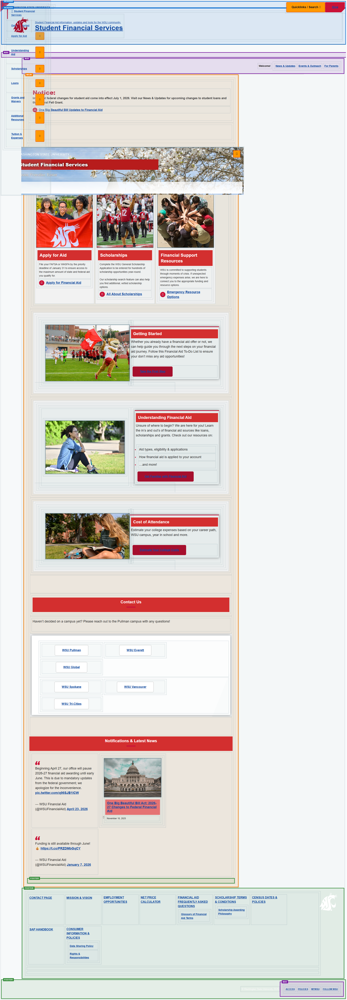
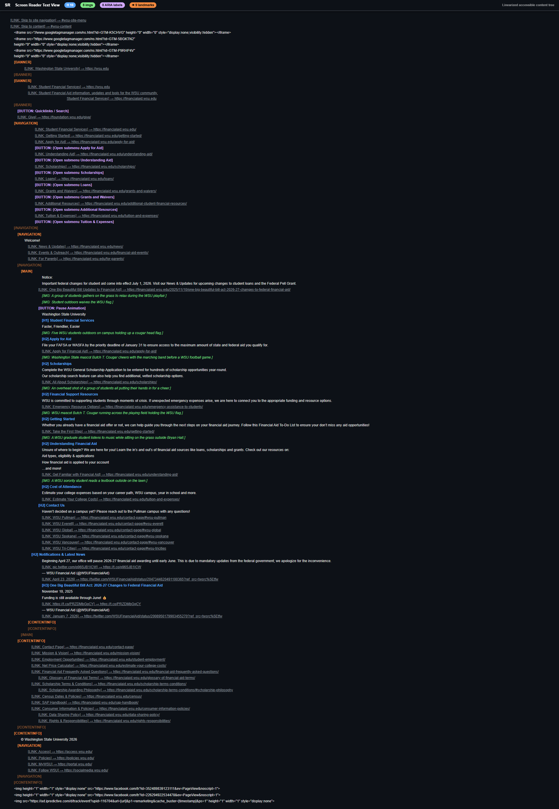

# Page Scan Report

> **URL:** https://financialaid.wsu.edu/  
> **Status:** ✅ 200  

---

## Summary

| Field | Value |
|-------|-------|
| URL | https://financialaid.wsu.edu/ |
| Title | Student Financial Services | Washington State University |
| Status | ✅ 200 |
| HTML Size | 109.3 KB |
| Screenshots | 24 (55.2 MB) |
| Images | 16 |
| Images Missing Alt | 0 |
| A11y Violations | Warning 8 |
| Critical | 0 |
| Serious | 4 |
| Moderate | 4 |
| Minor | 0 |
| Tools Run | axe, htmlcheck, htmlcs, ibm |

## Screenshots

<table>
<tr>
<td align="center" width="50%">

 <strong>1. Page Load +0ms</strong>
 1.1 MB
</td>
<td align="center" width="50%">

 <strong>2. Page Load +1641ms</strong>
 1.3 MB
</td>
</tr>
<tr>
<td align="center" width="50%">

 <strong>3. Page Load +2430ms</strong>
 1.4 MB
</td>
<td align="center" width="50%">

 <strong>4. Page Load +4777ms</strong>
 1.3 MB
</td>
</tr>
<tr>
<td align="center" width="50%">

 <strong>5. Page Load +5562ms</strong>
 1.0 MB
</td>
<td align="center" width="50%">

 <strong>6. Page Load +6346ms</strong>
 1.1 MB
</td>
</tr>
<tr>
<td align="center" width="50%">

 <strong>7. Page Load +8725ms</strong>
 1.1 MB
</td>
<td align="center" width="50%">

 <strong>8. Page Load +9523ms</strong>
 1.1 MB
</td>
</tr>
<tr>
<td align="center" width="50%">

 <strong>9. axe-overlay</strong>
 3.2 MB
</td>
<td align="center" width="50%">

 <strong>10. quickpeek-overlay</strong>
 3.3 MB
</td>
</tr>
<tr>
<td align="center" width="50%">

 <strong>11. htmlcs-overlay</strong>
 3.4 MB
</td>
<td align="center" width="50%">

 <strong>12. ibm-overlay</strong>
 3.4 MB
</td>
</tr>
<tr>
<td align="center" width="50%">

 <strong>13. structure-overlay</strong>
 3.5 MB
</td>
<td align="center" width="50%">

 <strong>14. wireframe-blueprint</strong>
 2.2 MB
</td>
</tr>
<tr>
<td align="center" width="50%">

 <strong>15. cvd-protanopia</strong>
 3.1 MB
</td>
<td align="center" width="50%">

 <strong>16. cvd-deuteranopia</strong>
 3.0 MB
</td>
</tr>
<tr>
<td align="center" width="50%">

 <strong>17. cvd-tritanopia</strong>
 3.0 MB
</td>
<td align="center" width="50%">

 <strong>18. cvd-achromatopsia</strong>
 1.8 MB
</td>
</tr>
<tr>
<td align="center" width="50%">

 <strong>19. cvd-protanomaly</strong>
 3.0 MB
</td>
<td align="center" width="50%">

 <strong>20. cvd-deuteranomaly</strong>
 3.0 MB
</td>
</tr>
<tr>
<td align="center" width="50%">

 <strong>21. cvd-tritanomaly</strong>
 3.0 MB
</td>
<td align="center" width="50%">

 <strong>22. screenreader-view</strong>
 352.2 KB
</td>
</tr>
<tr>
<td align="center" width="50%">

 <strong>23. reduced-motion</strong>
 3.2 MB
</td>
<td align="center" width="50%">

 <strong>24. forced-colors</strong>
 3.2 MB
</td>
</tr>
</table>

## Page Images (16)

| # | Source URL | Alt Text |
|--:|-----------|----------|
| 1 | https://wpcdn.web.wsu.edu/wp-financialaid/uploads/sites/2322/2024/12/Thompson... | A full view of WSU Pullman's Thompson... |
| 2 | https://wpcdn.web.wsu.edu/wp-financialaid/uploads/sites/2322/2024/08/CougsatP... | A group of students gathers on the gr... |
| 3 | https://wpcdn.web.wsu.edu/wp-financialaid/uploads/sites/2322/2024/08/Studentw... | Student outdoors waives the WSU flag. |
| 4 | https://wpcdn.web.wsu.edu/wp-financialaid/uploads/sites/2322/2024/03/DRAFT-SI... | Five WSU students outdoors on campus ... |
| 5 | https://wpcdn.web.wsu.edu/wp-financialaid/uploads/sites/2322/2024/08/ButchonF... | Washington State mascot Butch T. Coug... |
| 6 | https://wpcdn.web.wsu.edu/wp-financialaid/uploads/sites/2322/2024/08/StudentG... | An overhead shot of a group of studen... |
| 7 | https://wpcdn.web.wsu.edu/wp-financialaid/uploads/sites/2322/2024/03/DRAFT-SI... | Five WSU students outdoors on campus ... |
| 8 | https://wpcdn.web.wsu.edu/wp-financialaid/uploads/sites/2322/2024/08/ButchonF... | Washington State mascot Butch T. Coug... |
| 9 | https://wpcdn.web.wsu.edu/wp-financialaid/uploads/sites/2322/2024/08/StudentG... | An overhead shot of a group of studen... |
| 10 | https://wpcdn.web.wsu.edu/wp-financialaid/uploads/sites/2322/2024/08/Butchwit... | WSU mascot Butch T. Cougar running ac... |
| 11 | https://wpcdn.web.wsu.edu/wp-financialaid/uploads/sites/2322/2024/08/Butchwit... | WSU mascot Butch T. Cougar running ac... |
| 12 | https://wpcdn.web.wsu.edu/wp-financialaid/uploads/sites/2322/2024/08/SmilingG... | A WSU graduate student listens to mus... |
| 13 | https://wpcdn.web.wsu.edu/wp-financialaid/uploads/sites/2322/2024/08/SmilingG... | A WSU graduate student listens to mus... |
| 14 | https://wpcdn.web.wsu.edu/wp-financialaid/uploads/sites/2322/2024/08/Sorority... | A WSU sorority student reads a textbo... |
| 15 | https://wpcdn.web.wsu.edu/wp-financialaid/uploads/sites/2322/2024/08/Sorority... | A WSU sorority student reads a textbo... |
| 16 | https://wpcdn.web.wsu.edu/wp-financialaid/uploads/sites/2322/2025/11/US-capit... | An exterior shot of the US Capitol bu... |

## Accessibility

### Cross-Tool Comparison

| Severity | axe | htmlcheck | htmlcs | ibm |
|----------|:---:|:---:|:---:|:---:|
| critical | 0 | 0 | 0 | 0 |
| serious | 0 | 3 | 0 | 1 |
| moderate | 0 | 1 | 0 | 3 |
| minor | 0 | 0 | 0 | 0 |
| **Total** | **0** | **4** | **0** | **4** |

### Violations by Confidence

<strong>5 rule(s) violated</strong>

| # | Rule | Severity | Consensus | axe | htmlcheck | htmlcs | ibm | Example |
|--:|------|:--------:|:---------:|:---:|:---:|:---:|:---:|---------|
| 1 | image-alt | serious | medium 1/4 | --- | found | --- | --- | `` |

> **Note:** Automated scanning catches ~30-60% of WCAG issues. Manual keyboard and screen reader testing is still required for full compliance.

## Files

| File | Description |
|------|-------------|
| `01-page-load-00000ms.png` | Page Load +0ms (1.1 MB) |
| `01-page-load-01641ms.png` | Page Load +1641ms (1.3 MB) |
| `01-page-load-02430ms.png` | Page Load +2430ms (1.4 MB) |
| `01-page-load-04777ms.png` | Page Load +4777ms (1.3 MB) |
| `01-page-load-05562ms.png` | Page Load +5562ms (1.0 MB) |
| `01-page-load-06346ms.png` | Page Load +6346ms (1.1 MB) |
| `01-page-load-08725ms.png` | Page Load +8725ms (1.1 MB) |
| `01-page-load-09523ms.png` | Page Load +9523ms (1.1 MB) |
| `03-axe-overlay.png` | axe-overlay (3.2 MB) |
| `04-quickpeek-overlay.png` | quickpeek-overlay (3.3 MB) |
| `05-htmlcs-overlay.png` | htmlcs-overlay (3.4 MB) |
| `06-ibm-overlay.png` | ibm-overlay (3.4 MB) |
| `07-structure-overlay.png` | structure-overlay (3.5 MB) |
| `07b-wireframe-blueprint.png` | wireframe-blueprint (2.2 MB) |
| `08-cvd-protanopia.png` | cvd-protanopia (3.1 MB) |
| `09-cvd-deuteranopia.png` | cvd-deuteranopia (3.0 MB) |
| `10-cvd-tritanopia.png` | cvd-tritanopia (3.0 MB) |
| `11-cvd-achromatopsia.png` | cvd-achromatopsia (1.8 MB) |
| `12-cvd-protanomaly.png` | cvd-protanomaly (3.0 MB) |
| `13-cvd-deuteranomaly.png` | cvd-deuteranomaly (3.0 MB) |
| `14-cvd-tritanomaly.png` | cvd-tritanomaly (3.0 MB) |
| `15-screenreader-view.png` | screenreader-view (352.2 KB) |
| `16-reduced-motion.png` | reduced-motion (3.2 MB) |
| `17-forced-colors.png` | forced-colors (3.2 MB) |
| `metadata.json` | Machine-readable scan data |
| `a11y-summary.json` | Merged cross-tool accessibility summary |

---

*Generated by FreeA11yChecker Scanner v1.0*
