# Page Scan Report

> **URL:** https://financialaid.wsu.edu/forms/  
> **Status:** ✅ 200  

---

## Summary

| Field | Value |
|-------|-------|
| URL | https://financialaid.wsu.edu/forms/ |
| Title | Financial Aid Forms | Student Financial Services | Washington State University |
| Status | ✅ 200 |
| HTML Size | 84.4 KB |
| Screenshots | 17 (6.2 MB) |
| Images | 0 |
| Images Missing Alt | 0 |
| A11y Violations | Warning 14 |
| Critical | 0 |
| Serious | 5 |
| Moderate | 9 |
| Minor | 0 |
| Tools Run | axe, htmlcheck, htmlcs, ibm |

## Screenshots

<table>
<tr>
<td align="center" width="50%">
<a href="01-page-load-00000ms.png">
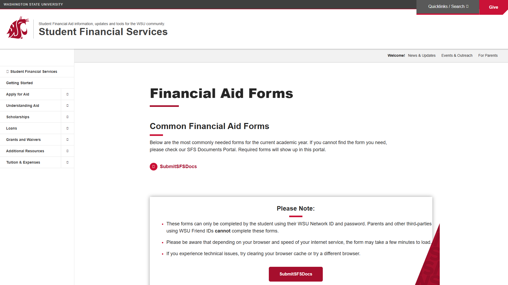
</a>
 <strong>1. Page Load +0ms</strong>
 104.6 KB
</td>
<td align="center" width="50%">
<a href="03-axe-overlay.png">
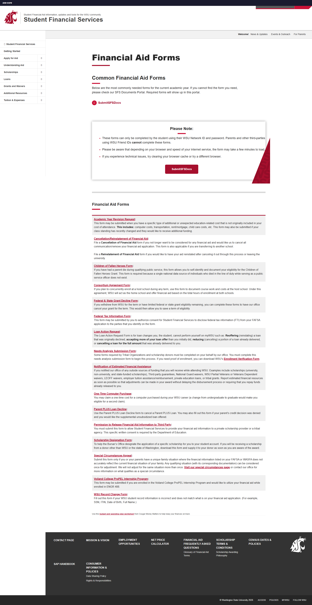
</a>
 <strong>2. axe-overlay</strong>
 368.4 KB
</td>
</tr>
<tr>
<td align="center" width="50%">
<a href="04-quickpeek-overlay.png">
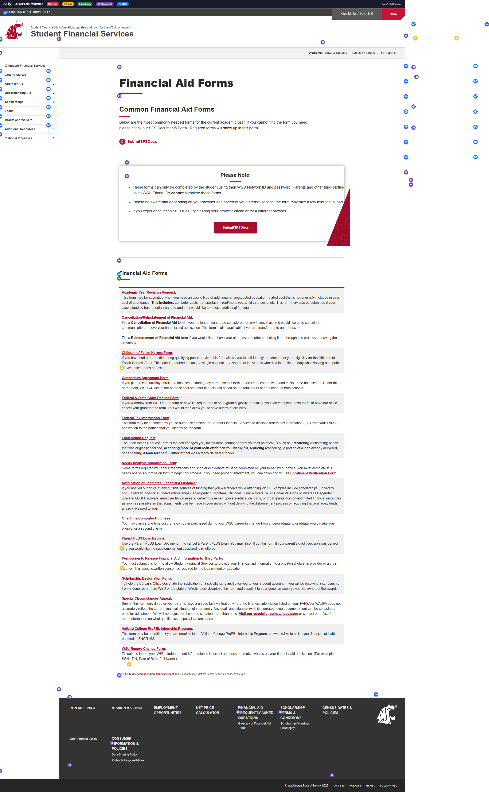
</a>
 <strong>3. quickpeek-overlay</strong>
 437.9 KB
</td>
<td align="center" width="50%">

 <strong>4. htmlcs-overlay</strong>
 368.8 KB
</td>
</tr>
<tr>
<td align="center" width="50%">

 <strong>5. ibm-overlay</strong>
 370.3 KB
</td>
<td align="center" width="50%">
<a href="07-structure-overlay.png">
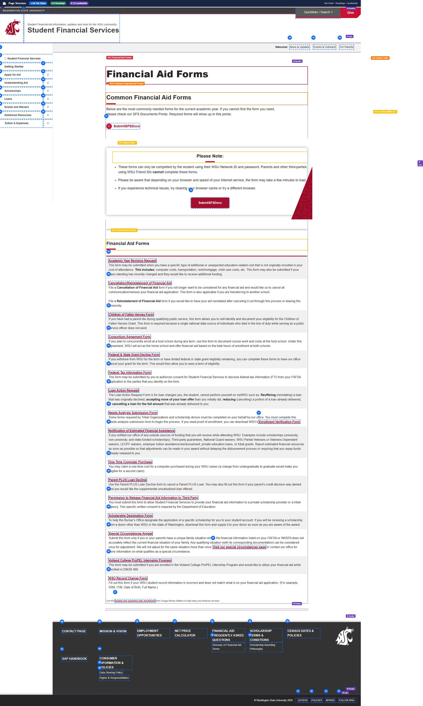
</a>
 <strong>6. structure-overlay</strong>
 475.3 KB
</td>
</tr>
<tr>
<td align="center" width="50%">
<a href="07b-wireframe-blueprint.png">
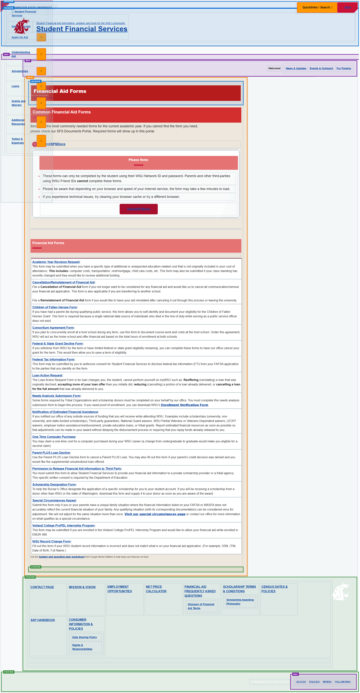
</a>
 <strong>7. wireframe-blueprint</strong>
 388.7 KB
</td>
<td align="center" width="50%">
<a href="08-cvd-protanopia.png">
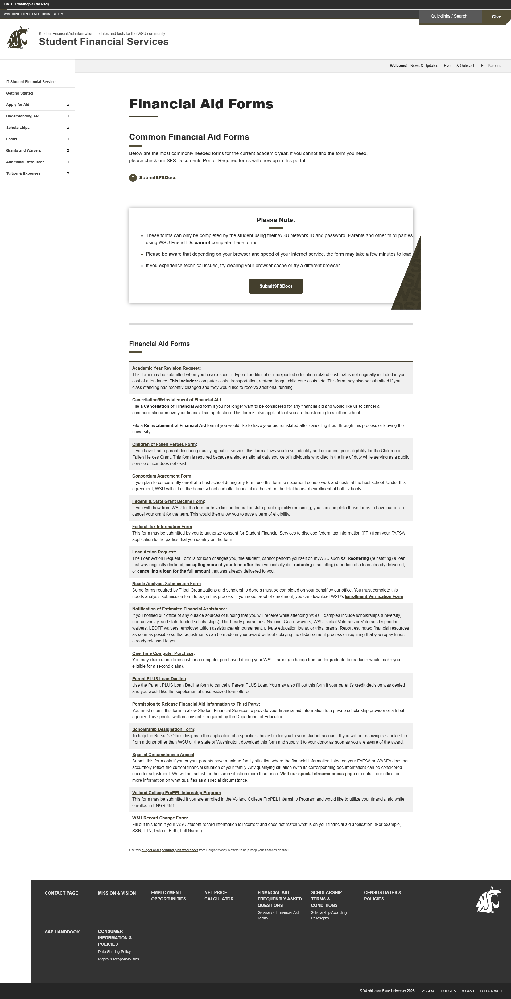
</a>
 <strong>8. cvd-protanopia</strong>
 384.3 KB
</td>
</tr>
<tr>
<td align="center" width="50%">

 <strong>9. cvd-deuteranopia</strong>
 388.3 KB
</td>
<td align="center" width="50%">
<a href="10-cvd-tritanopia.png">
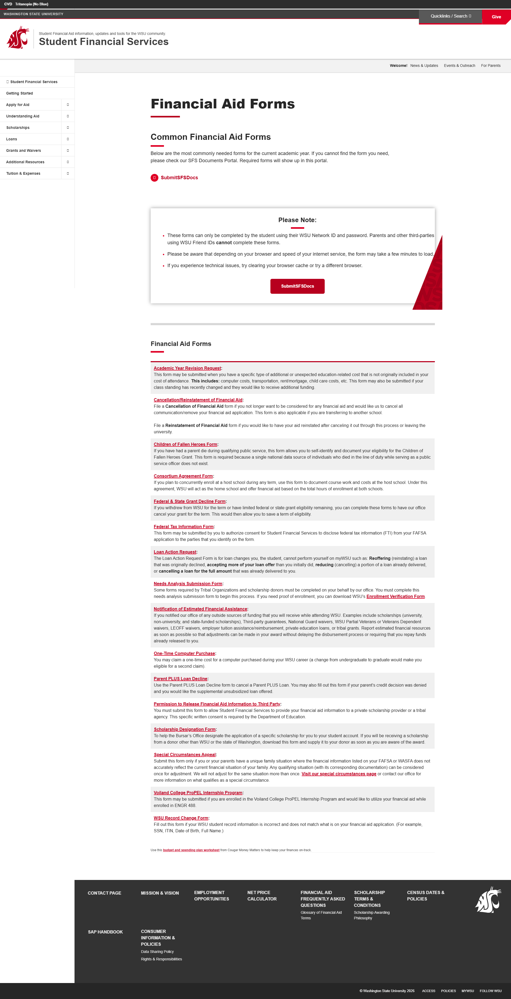
</a>
 <strong>10. cvd-tritanopia</strong>
 385.9 KB
</td>
</tr>
<tr>
<td align="center" width="50%">
<a href="11-cvd-achromatopsia.png">
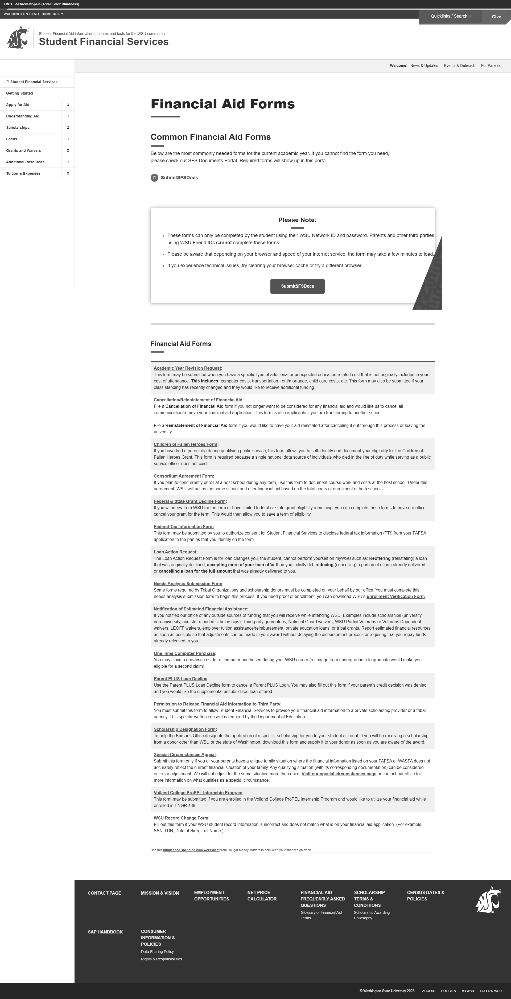
</a>
 <strong>11. cvd-achromatopsia</strong>
 382.3 KB
</td>
<td align="center" width="50%">
<a href="12-cvd-protanomaly.png">
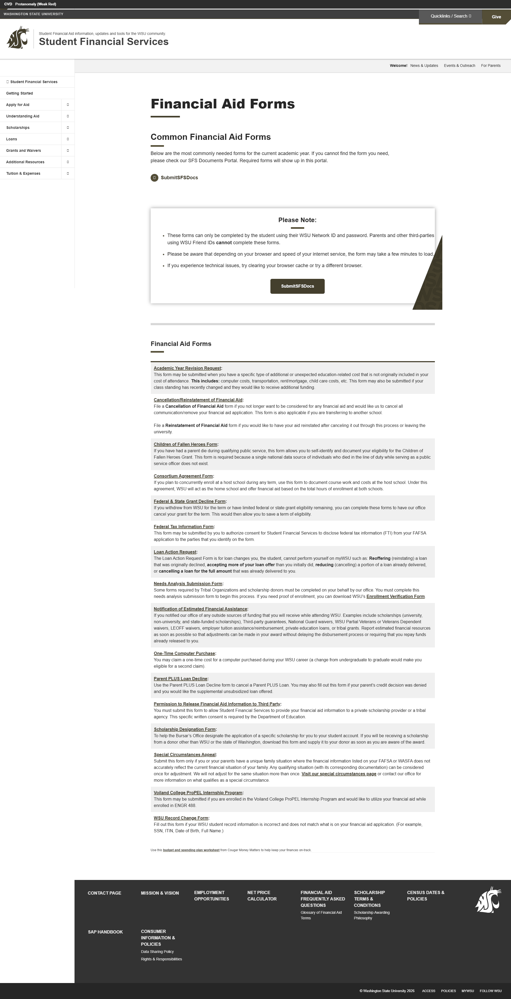
</a>
 <strong>12. cvd-protanomaly</strong>
 386.8 KB
</td>
</tr>
<tr>
<td align="center" width="50%">
<a href="13-cvd-deuteranomaly.png">
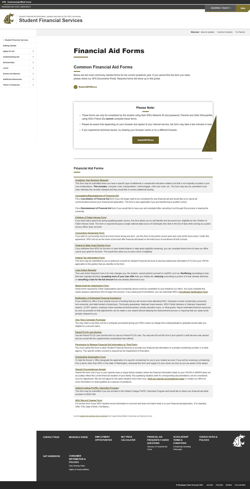
</a>
 <strong>13. cvd-deuteranomaly</strong>
 388.6 KB
</td>
<td align="center" width="50%">

 <strong>14. cvd-tritanomaly</strong>
 386.2 KB
</td>
</tr>
<tr>
<td align="center" width="50%">
<a href="15-screenreader-view.png">
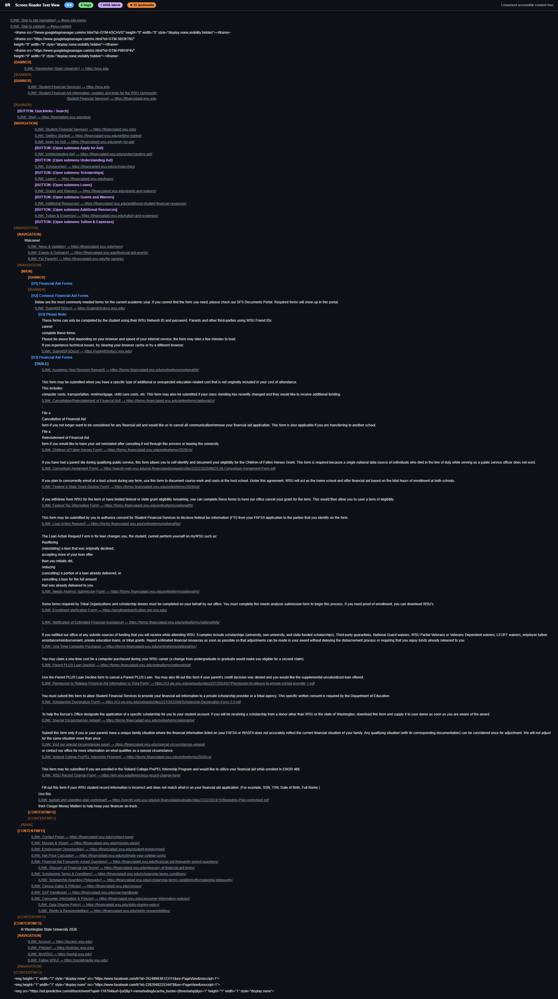
</a>
 <strong>15. screenreader-view</strong>
 422.3 KB
</td>
<td align="center" width="50%">

 <strong>16. reduced-motion</strong>
 373.8 KB
</td>
</tr>
<tr>
<td align="center" width="50%">
<a href="17-forced-colors.png">
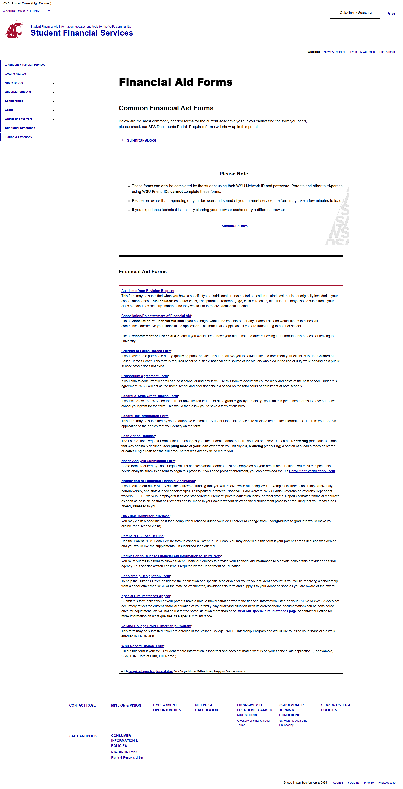
</a>
 <strong>17. forced-colors</strong>
 350.0 KB
</td>
<td></td>
</tr>
</table>

## Page Images (0)

*No images found on page.*

## Accessibility

### Cross-Tool Comparison

| Severity | axe | htmlcheck | htmlcs | ibm |
|----------|:---:|:---:|:---:|:---:|
| critical | 0 | 0 | 0 | 0 |
| serious | 0 | 3 | 0 | 2 |
| moderate | 0 | 6 | 0 | 3 |
| minor | 0 | 0 | 0 | 0 |
| **Total** | **0** | **9** | **0** | **5** |

### Violations by Confidence

<strong>8 rule(s) violated</strong>

| # | Rule | Severity | Consensus | axe | htmlcheck | htmlcs | ibm | Example |
|--:|------|:--------:|:---------:|:---:|:---:|:---:|:---:|---------|
| 1 | image-alt | serious | medium 1/4 | --- | found | --- | --- | `` |
| 4 | link-pdf | moderate | medium 1/4 | --- | found | --- | --- | `<a href="https://wpcdn.web.wsu.edu/wp-financialaid/upload...` |
| 5 | aria_content_in_landmark | moderate | medium 1/4 | --- | --- | --- | found | `<a href="#wsu-site-menu" class="wsu-skip-to-main skip-to-...` |
| 6 | table-header | moderate | medium 1/4 | --- | found | --- | --- | `<table><tbody><tr><td><strong><a href="https://forms.fina...` |
| 7 | fieldset-missing | moderate | medium 1/4 | --- | found | --- | --- | `<input class="wsu-search-options__option-input" type="rad...` |
| 8 | aria_child_valid | moderate | medium 1/4 | --- | --- | --- | found | `<ul class="wsu-social-icons">` |

> **Note:** Automated scanning catches ~30-60% of WCAG issues. Manual keyboard and screen reader testing is still required for full compliance.

## Files

| File | Description |
|------|-------------|
| `01-page-load-00000ms.png` | Page Load +0ms (104.6 KB) |
| `03-axe-overlay.png` | axe-overlay (368.4 KB) |
| `04-quickpeek-overlay.png` | quickpeek-overlay (437.9 KB) |
| `05-htmlcs-overlay.png` | htmlcs-overlay (368.8 KB) |
| `06-ibm-overlay.png` | ibm-overlay (370.3 KB) |
| `07-structure-overlay.png` | structure-overlay (475.3 KB) |
| `07b-wireframe-blueprint.png` | wireframe-blueprint (388.7 KB) |
| `08-cvd-protanopia.png` | cvd-protanopia (384.3 KB) |
| `09-cvd-deuteranopia.png` | cvd-deuteranopia (388.3 KB) |
| `10-cvd-tritanopia.png` | cvd-tritanopia (385.9 KB) |
| `11-cvd-achromatopsia.png` | cvd-achromatopsia (382.3 KB) |
| `12-cvd-protanomaly.png` | cvd-protanomaly (386.8 KB) |
| `13-cvd-deuteranomaly.png` | cvd-deuteranomaly (388.6 KB) |
| `14-cvd-tritanomaly.png` | cvd-tritanomaly (386.2 KB) |
| `15-screenreader-view.png` | screenreader-view (422.3 KB) |
| `16-reduced-motion.png` | reduced-motion (373.8 KB) |
| `17-forced-colors.png` | forced-colors (350.0 KB) |
| `metadata.json` | Machine-readable scan data |
| `a11y-summary.json` | Merged cross-tool accessibility summary |

---

*Generated by FreeA11yChecker Scanner v1.0*
