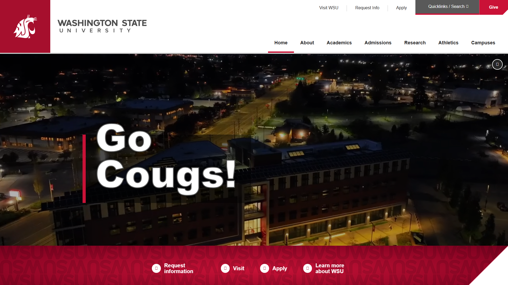
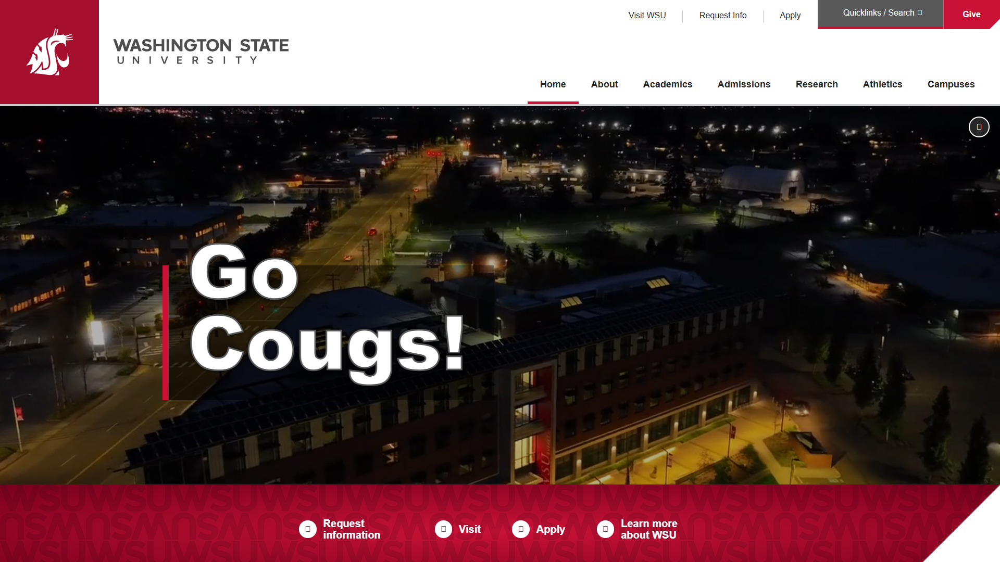
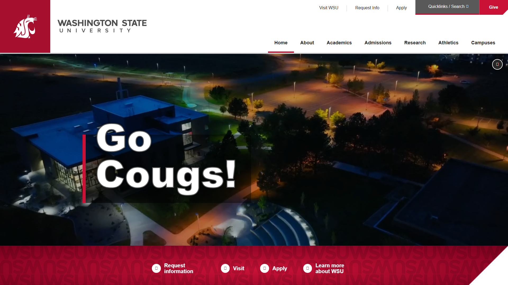
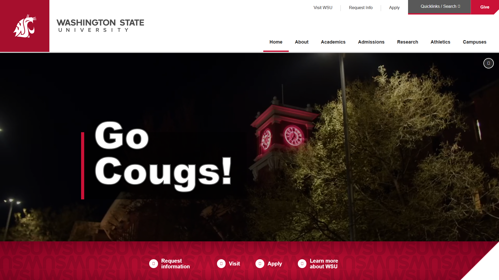
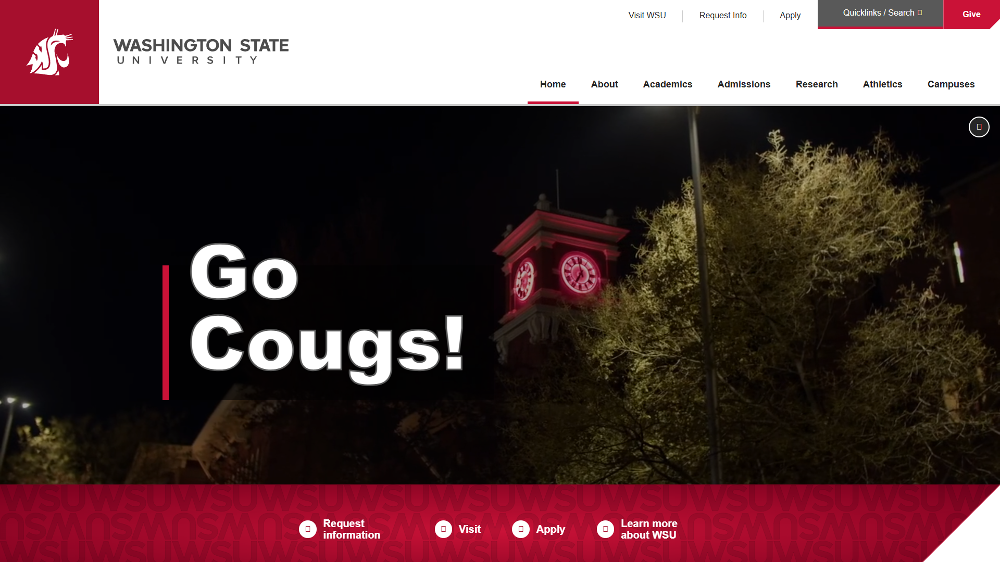
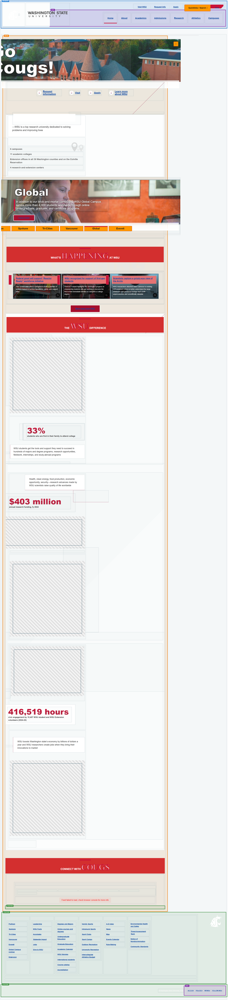
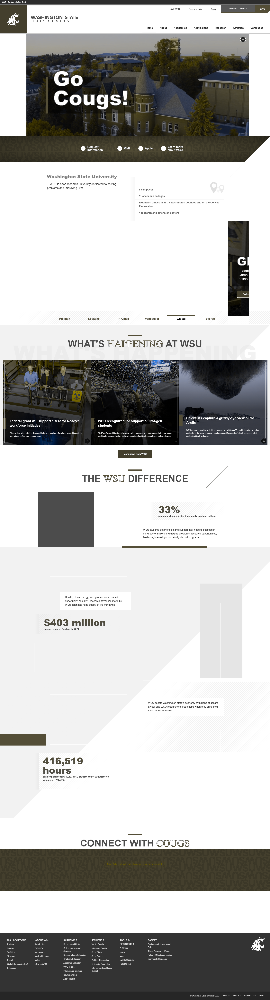
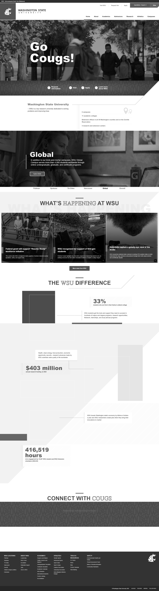
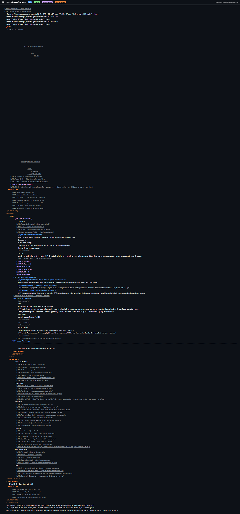

# Page Scan Report

> **URL:** https://wsu.edu/  
> **Status:** ✅ 200  

---

## Summary

| Field | Value |
|-------|-------|
| URL | https://wsu.edu/ |
| Title | Washington State University | Washington State University |
| Status | ✅ 200 |
| HTML Size | 129.8 KB |
| Screenshots | 29 (78.4 MB) |
| Images | 14 |
| Images Missing Alt | 0 |
| A11y Violations | Warning 28 |
| Critical | 0 |
| Serious | 18 |
| Moderate | 10 |
| Minor | 0 |
| Tools Run | axe, htmlcheck, htmlcs, ibm |

## Screenshots

<table>
<tr>
<td align="center" width="50%">

 <strong>1. Page Load +0ms</strong>
 841.6 KB
</td>
<td align="center" width="50%">

 <strong>2. Page Load +777ms</strong>
 847.8 KB
</td>
</tr>
<tr>
<td align="center" width="50%">

 <strong>3. Page Load +1528ms</strong>
 799.9 KB
</td>
<td align="center" width="50%">

 <strong>4. Page Load +2261ms</strong>
 1.6 MB
</td>
</tr>
<tr>
<td align="center" width="50%">

 <strong>5. Page Load +3166ms</strong>
 1.6 MB
</td>
<td align="center" width="50%">

 <strong>6. Page Load +4075ms</strong>
 1.3 MB
</td>
</tr>
<tr>
<td align="center" width="50%">

 <strong>7. Page Load +4915ms</strong>
 1.4 MB
</td>
<td align="center" width="50%">

 <strong>8. Page Load +5773ms</strong>
 1.2 MB
</td>
</tr>
<tr>
<td align="center" width="50%">

 <strong>9. Page Load +6589ms</strong>
 1.3 MB
</td>
<td align="center" width="50%">

 <strong>10. Page Load +7417ms</strong>
 1.3 MB
</td>
</tr>
<tr>
<td align="center" width="50%">

 <strong>11. Page Load +8258ms</strong>
 1.3 MB
</td>
<td align="center" width="50%">

 <strong>12. Page Load +9092ms</strong>
 1.1 MB
</td>
</tr>
<tr>
<td align="center" width="50%">

 <strong>13. Page Load +9850ms</strong>
 1.2 MB
</td>
<td align="center" width="50%">

 <strong>14. axe-overlay</strong>
 4.8 MB
</td>
</tr>
<tr>
<td align="center" width="50%">

 <strong>15. quickpeek-overlay</strong>
 4.5 MB
</td>
<td align="center" width="50%">

 <strong>16. htmlcs-overlay</strong>
 4.6 MB
</td>
</tr>
<tr>
<td align="center" width="50%">

 <strong>17. ibm-overlay</strong>
 4.6 MB
</td>
<td align="center" width="50%">

 <strong>18. structure-overlay</strong>
 4.7 MB
</td>
</tr>
<tr>
<td align="center" width="50%">

 <strong>19. wireframe-blueprint</strong>
 1.9 MB
</td>
<td align="center" width="50%">

 <strong>20. cvd-protanopia</strong>
 3.1 MB
</td>
</tr>
<tr>
<td align="center" width="50%">

 <strong>21. cvd-deuteranopia</strong>
 4.5 MB
</td>
<td align="center" width="50%">

 <strong>22. cvd-tritanopia</strong>
 4.6 MB
</td>
</tr>
<tr>
<td align="center" width="50%">

 <strong>23. cvd-achromatopsia</strong>
 2.6 MB
</td>
<td align="center" width="50%">

 <strong>24. cvd-protanomaly</strong>
 4.2 MB
</td>
</tr>
<tr>
<td align="center" width="50%">

 <strong>25. cvd-deuteranomaly</strong>
 4.3 MB
</td>
<td align="center" width="50%">

 <strong>26. cvd-tritanomaly</strong>
 4.3 MB
</td>
</tr>
<tr>
<td align="center" width="50%">

 <strong>27. screenreader-view</strong>
 326.2 KB
</td>
<td align="center" width="50%">

 <strong>28. reduced-motion</strong>
 4.8 MB
</td>
</tr>
<tr>
<td align="center" width="50%">

 <strong>29. forced-colors</strong>
 4.7 MB
</td>
<td></td>
</tr>
</table>

## Page Images (14)

| # | Source URL | Alt Text |
|--:|-----------|----------|
| 1 | https://s3.wp.wsu.edu/uploads/sites/625/2022/07/Campus-photo-12.jpg |  |
| 2 | https://s3.wp.wsu.edu/uploads/sites/625/2022/07/Campus-photo-13.jpg |  |
| 3 | https://s3.wp.wsu.edu/uploads/sites/625/2022/07/Campus-photo-14.jpg |  |
| 4 | https://s3.wp.wsu.edu/uploads/sites/625/2022/07/Campus-photo-16.jpg |  |
| 5 | https://s3.wp.wsu.edu/uploads/sites/625/2022/08/Campus-photo-17-scaled-e16614... |  |
| 6 | https://s3.wp.wsu.edu/uploads/sites/625/2022/07/Campus-photo-15.jpg |  |
| 7 | https://s3.wp.wsu.edu/uploads/sites/625/2026/05/Noel-Schulz-John-McCloy-and-C... |  |
| 8 | https://s3.wp.wsu.edu/uploads/sites/625/2024/04/wsu-fall-commencement-2022.jpg |  |
| 9 | https://s3.wp.wsu.edu/uploads/sites/625/2026/03/Arctic-grizzly-bear-research-... |  |
| 10 | https://s3.wp.wsu.edu/uploads/sites/625/2022/07/Mask-group-2.jpg |  |
| 11 | https://s3.wp.wsu.edu/uploads/sites/625/2022/07/Grizzly_Bears_7-17-2015___020... |  |
| 12 | https://s3.wp.wsu.edu/uploads/sites/625/2022/07/FluShotFriday_4888-1.jpg |  |
| 13 | https://s3.wp.wsu.edu/uploads/sites/625/2022/07/Mask-group-5-792x535.jpg |  |
| 14 | https://s3.wp.wsu.edu/uploads/sites/625/2022/07/Mask-group-6.jpg |  |

## Accessibility

### Cross-Tool Comparison

| Severity | axe | htmlcheck | htmlcs | ibm |
|----------|:---:|:---:|:---:|:---:|
| critical | 0 | 0 | 0 | 0 |
| serious | 0 | 7 | 0 | 11 |
| moderate | 0 | 1 | 0 | 9 |
| minor | 0 | 0 | 0 | 0 |
| **Total** | **0** | **8** | **0** | **20** |

### Violations by Confidence

<strong>11 rule(s) violated</strong>

| # | Rule | Severity | Consensus | axe | htmlcheck | htmlcs | ibm | Example |
|--:|------|:--------:|:---------:|:---:|:---:|:---:|:---:|---------|
| 1 | text_contrast_sufficient | serious | medium 1/4 | --- | --- | --- | found | `<a href="https://news.wsu.edu/news/2026/05/11/wsu-lands-1...` |
| 2 | image-alt | serious | medium 1/4 | --- | found | --- | --- | `` |
| 5 | aria_contentinfo_label_unique | serious | medium 1/4 | --- | --- | --- | found | `<footer class="wsu-footer-site">` |
| 6 | button-name | serious | medium 1/4 | --- | found | --- | --- | `<button class="wsu-search__submit" aria-lable="Submit Sea...` |
| 7 | figure_label_exists | moderate | medium 1/4 | --- | --- | --- | found | `<figure class="wp-block-image size-large wsu-image--style...` |
| 8 | aria_landmark_name_unique | moderate | medium 1/4 | --- | --- | --- | found | `<footer class="wsu-footer-site">` |
| 9 | label | moderate | medium 1/4 | --- | found | --- | --- | `<input class="wsu-search__input" type="text" aria-lable="...` |
| 10 | aria_content_in_landmark | moderate | medium 1/4 | --- | --- | --- | found | `<a href="#wsu-site-menu" class="wsu-skip-to-main">` |
| 11 | aria_child_valid | moderate | medium 1/4 | --- | --- | --- | found | `<ul class="wsu-social-icons">` |

> **Note:** Automated scanning catches ~30-60% of WCAG issues. Manual keyboard and screen reader testing is still required for full compliance.

## Files

| File | Description |
|------|-------------|
| `01-page-load-00000ms.png` | Page Load +0ms (841.6 KB) |
| `01-page-load-00777ms.png` | Page Load +777ms (847.8 KB) |
| `01-page-load-01528ms.png` | Page Load +1528ms (799.9 KB) |
| `01-page-load-02261ms.png` | Page Load +2261ms (1.6 MB) |
| `01-page-load-03166ms.png` | Page Load +3166ms (1.6 MB) |
| `01-page-load-04075ms.png` | Page Load +4075ms (1.3 MB) |
| `01-page-load-04915ms.png` | Page Load +4915ms (1.4 MB) |
| `01-page-load-05773ms.png` | Page Load +5773ms (1.2 MB) |
| `01-page-load-06589ms.png` | Page Load +6589ms (1.3 MB) |
| `01-page-load-07417ms.png` | Page Load +7417ms (1.3 MB) |
| `01-page-load-08258ms.png` | Page Load +8258ms (1.3 MB) |
| `01-page-load-09092ms.png` | Page Load +9092ms (1.1 MB) |
| `01-page-load-09850ms.png` | Page Load +9850ms (1.2 MB) |
| `03-axe-overlay.png` | axe-overlay (4.8 MB) |
| `04-quickpeek-overlay.png` | quickpeek-overlay (4.5 MB) |
| `05-htmlcs-overlay.png` | htmlcs-overlay (4.6 MB) |
| `06-ibm-overlay.png` | ibm-overlay (4.6 MB) |
| `07-structure-overlay.png` | structure-overlay (4.7 MB) |
| `07b-wireframe-blueprint.png` | wireframe-blueprint (1.9 MB) |
| `08-cvd-protanopia.png` | cvd-protanopia (3.1 MB) |
| `09-cvd-deuteranopia.png` | cvd-deuteranopia (4.5 MB) |
| `10-cvd-tritanopia.png` | cvd-tritanopia (4.6 MB) |
| `11-cvd-achromatopsia.png` | cvd-achromatopsia (2.6 MB) |
| `12-cvd-protanomaly.png` | cvd-protanomaly (4.2 MB) |
| `13-cvd-deuteranomaly.png` | cvd-deuteranomaly (4.3 MB) |
| `14-cvd-tritanomaly.png` | cvd-tritanomaly (4.3 MB) |
| `15-screenreader-view.png` | screenreader-view (326.2 KB) |
| `16-reduced-motion.png` | reduced-motion (4.8 MB) |
| `17-forced-colors.png` | forced-colors (4.7 MB) |
| `metadata.json` | Machine-readable scan data |
| `a11y-summary.json` | Merged cross-tool accessibility summary |

---

*Generated by FreeA11yChecker Scanner v1.0*
