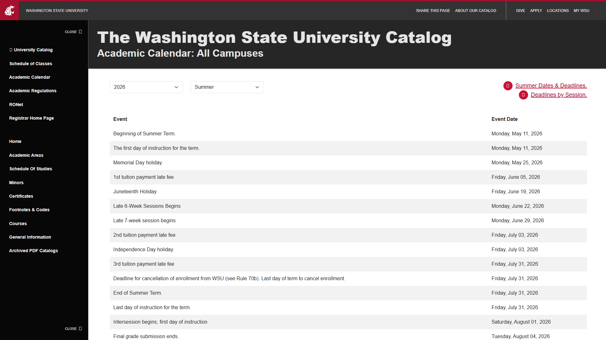
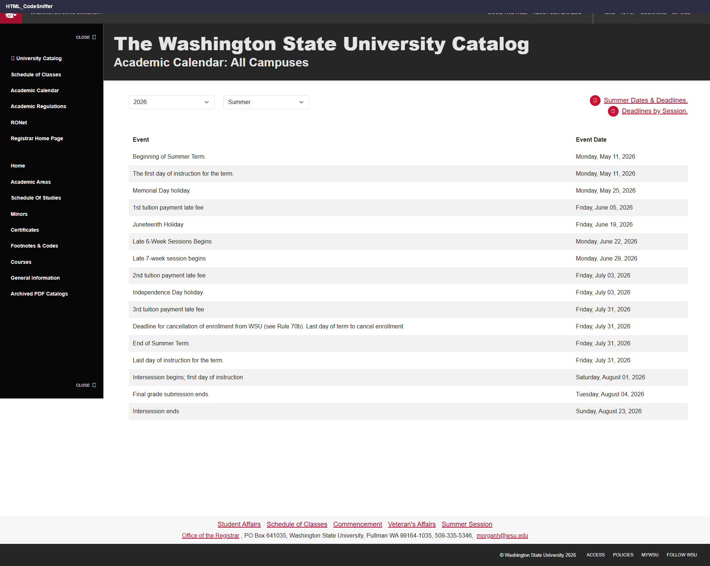
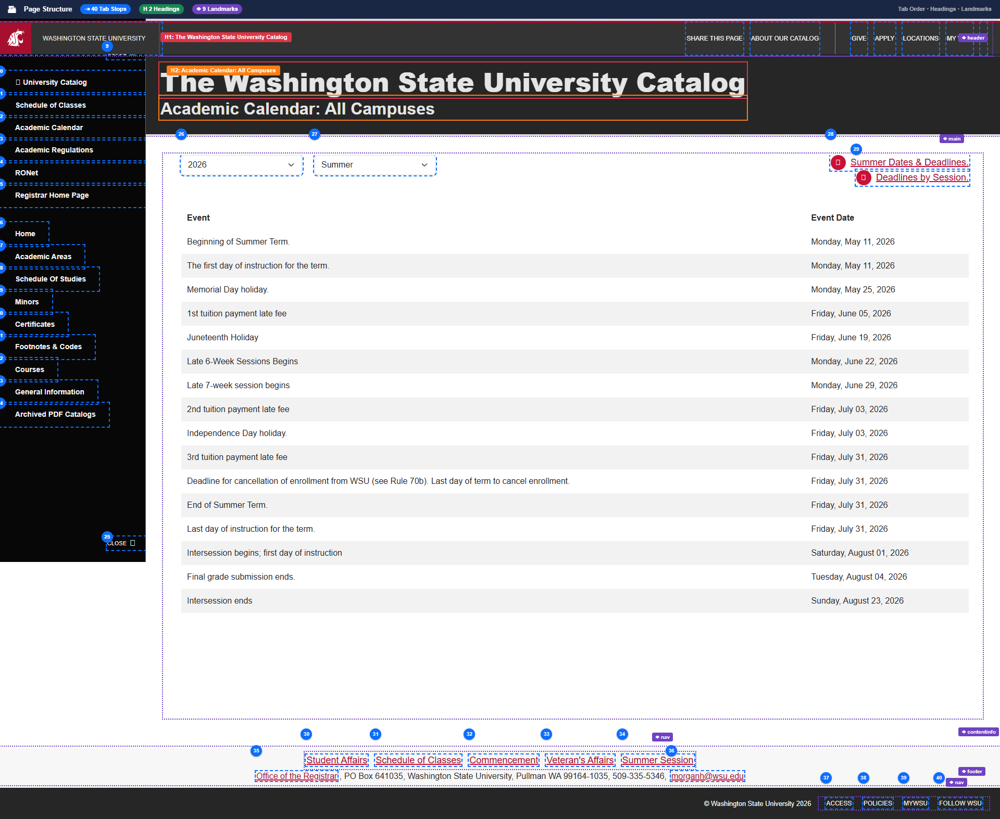
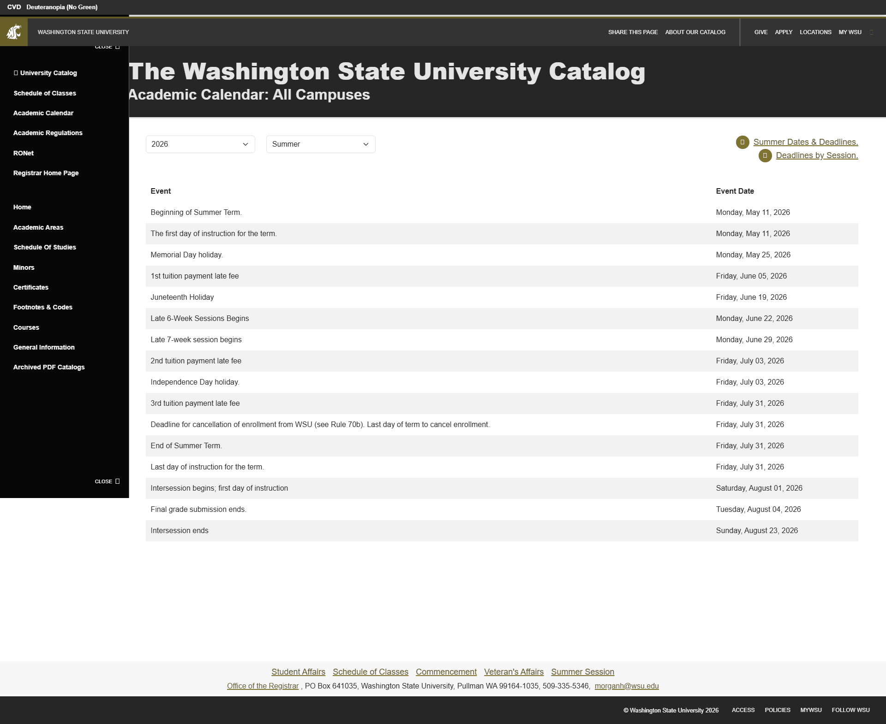
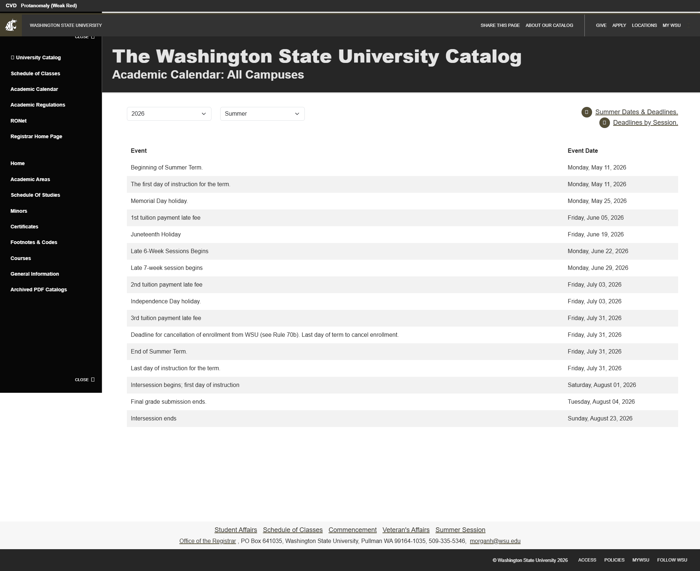
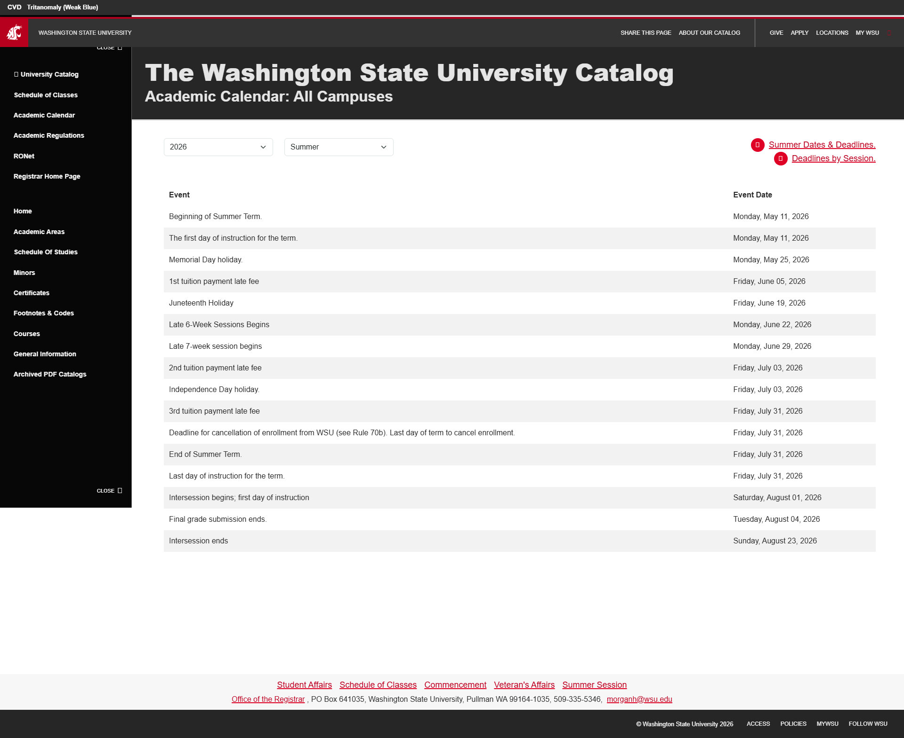
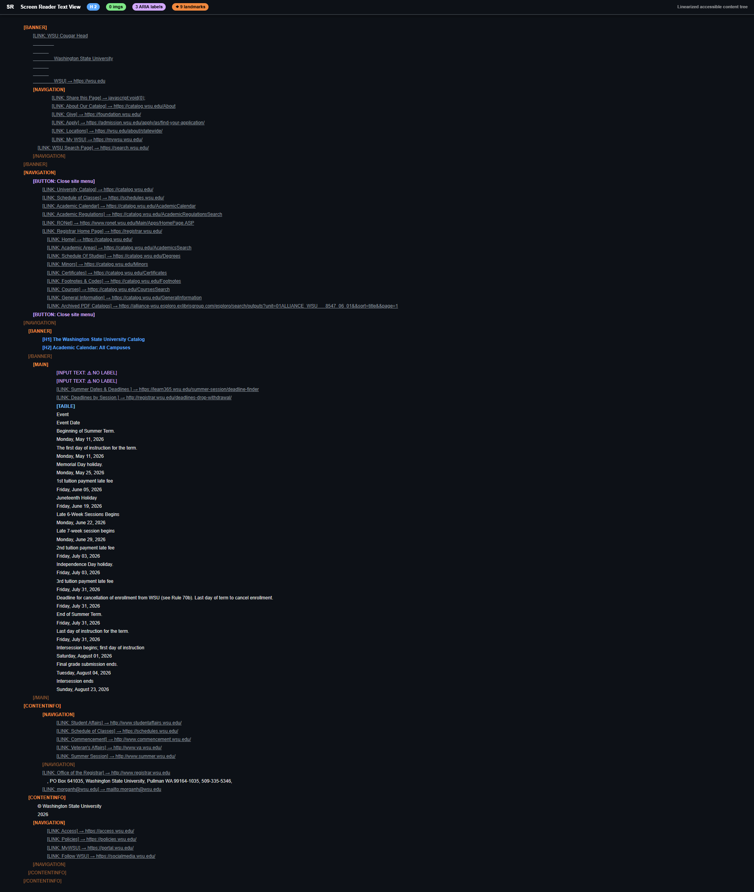
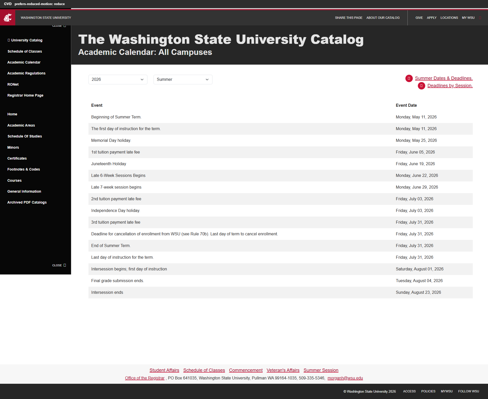
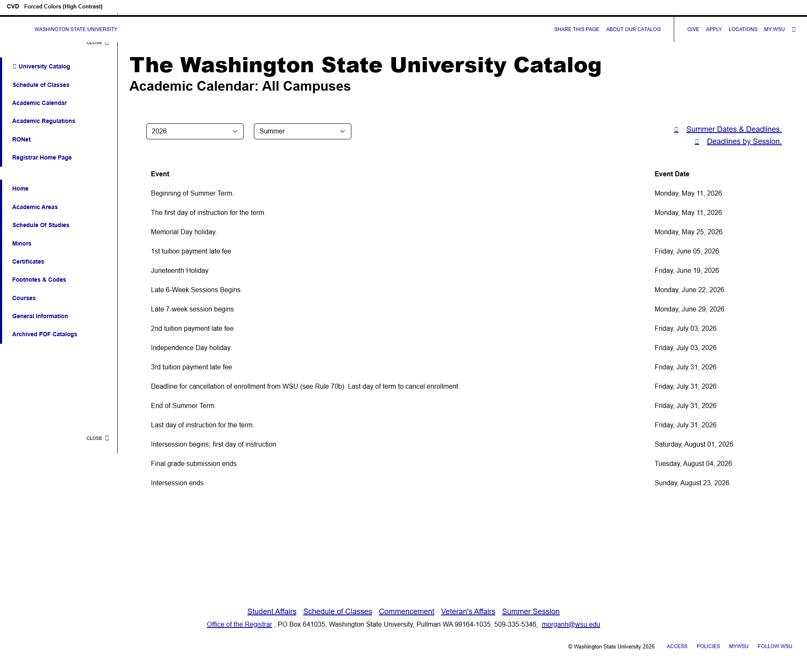

# Page Scan Report

> **URL:** https://registrar.wsu.edu/academic-calendar/  
> **Status:** ✅ 200  

---

## Summary

| Field | Value |
|-------|-------|
| URL | https://registrar.wsu.edu/academic-calendar/ |
| Title | *(none)* |
| Status | ✅ 200 |
| HTML Size | 175.1 KB |
| Screenshots | 17 (2.3 MB) |
| Images | 0 |
| Images Missing Alt | 0 |
| A11y Violations | Warning 15 |
| Critical | 2 |
| Serious | 10 |
| Moderate | 3 |
| Minor | 0 |
| Tools Run | axe, htmlcheck, htmlcs, ibm |

## Screenshots

<table>
<tr>
<td align="center" width="50%">

 <strong>1. Page Load +0ms</strong>
 105.6 KB
</td>
<td align="center" width="50%">

 <strong>2. axe-overlay</strong>
 128.7 KB
</td>
</tr>
<tr>
<td align="center" width="50%">

 <strong>3. quickpeek-overlay</strong>
 146.6 KB
</td>
<td align="center" width="50%">

 <strong>4. htmlcs-overlay</strong>
 127.2 KB
</td>
</tr>
<tr>
<td align="center" width="50%">

 <strong>5. ibm-overlay</strong>
 128.9 KB
</td>
<td align="center" width="50%">

 <strong>6. structure-overlay</strong>
 177.2 KB
</td>
</tr>
<tr>
<td align="center" width="50%">

 <strong>7. wireframe-blueprint</strong>
 133.8 KB
</td>
<td align="center" width="50%">

 <strong>8. cvd-protanopia</strong>
 133.4 KB
</td>
</tr>
<tr>
<td align="center" width="50%">

 <strong>9. cvd-deuteranopia</strong>
 139.6 KB
</td>
<td align="center" width="50%">

 <strong>10. cvd-tritanopia</strong>
 139.0 KB
</td>
</tr>
<tr>
<td align="center" width="50%">

 <strong>11. cvd-achromatopsia</strong>
 136.9 KB
</td>
<td align="center" width="50%">

 <strong>12. cvd-protanomaly</strong>
 139.0 KB
</td>
</tr>
<tr>
<td align="center" width="50%">

 <strong>13. cvd-deuteranomaly</strong>
 140.9 KB
</td>
<td align="center" width="50%">

 <strong>14. cvd-tritanomaly</strong>
 139.0 KB
</td>
</tr>
<tr>
<td align="center" width="50%">

 <strong>15. screenreader-view</strong>
 193.7 KB
</td>
<td align="center" width="50%">

 <strong>16. reduced-motion</strong>
 132.6 KB
</td>
</tr>
<tr>
<td align="center" width="50%">

 <strong>17. forced-colors</strong>
 124.7 KB
</td>
<td></td>
</tr>
</table>

## Page Images (0)

*No images found on page.*

## Accessibility

### Cross-Tool Comparison

| Severity | axe | htmlcheck | htmlcs | ibm |
|----------|:---:|:---:|:---:|:---:|
| critical | 2 | 0 | 0 | 0 |
| serious | 1 | 1 | 0 | 8 |
| moderate | 0 | 1 | 0 | 2 |
| minor | 0 | 0 | 0 | 0 |
| **Total** | **3** | **2** | **0** | **10** |

### Violations by Confidence

<strong>10 rule(s) violated</strong>

| # | Rule | Severity | Consensus | axe | htmlcheck | htmlcs | ibm | Example |
|--:|------|:--------:|:---------:|:---:|:---:|:---:|:---:|---------|
| 1 | skip-link | moderate | medium 1/4 | --- | found | --- | --- |  |
| 2 | select-name | critical | low 1/4 | found | --- | --- | --- | `<select class="form-select" id="year">` |
| 3 | aria_banner_label_unique | serious | low 1/4 | --- | --- | --- | found | `<header class="wsu-header-global wsu-header-global--dark">` |
| 4 | input_label_exists | serious | low 1/4 | --- | --- | --- | found | `<select id="year" class="form-select">` |
| 5 | aria_contentinfo_label_unique | serious | low 1/4 | --- | --- | --- | found | `
` |
| 6 | document-title | serious | low 1/4 | found | --- | --- | --- | `<html lang="en" class="wsu-has-js wsu-reduce-motion" styl...` |
| 7 | link-name | serious | low 1/4 | --- | found | --- | --- | `<a class="wsu-button-ui-search" href="https://search.wsu....` |
| 8 | page_title_exists | serious | low 1/4 | --- | --- | --- | found | `<html style="--blazor-load-percentage: 100%; --blazor-loa...` |
| 9 | label_name_visible | serious | low 1/4 | --- | --- | --- | found | `<a aria-label="Go to Washington State University Homepage...` |
| 10 | aria_landmark_name_unique | moderate | low 1/4 | --- | --- | --- | found | `<header class="wsu-header-global wsu-header-global--dark">` |

> **Note:** Automated scanning catches ~30-60% of WCAG issues. Manual keyboard and screen reader testing is still required for full compliance.

## Files

| File | Description |
|------|-------------|
| `01-page-load-00000ms.png` | Page Load +0ms (105.6 KB) |
| `03-axe-overlay.png` | axe-overlay (128.7 KB) |
| `04-quickpeek-overlay.png` | quickpeek-overlay (146.6 KB) |
| `05-htmlcs-overlay.png` | htmlcs-overlay (127.2 KB) |
| `06-ibm-overlay.png` | ibm-overlay (128.9 KB) |
| `07-structure-overlay.png` | structure-overlay (177.2 KB) |
| `07b-wireframe-blueprint.png` | wireframe-blueprint (133.8 KB) |
| `08-cvd-protanopia.png` | cvd-protanopia (133.4 KB) |
| `09-cvd-deuteranopia.png` | cvd-deuteranopia (139.6 KB) |
| `10-cvd-tritanopia.png` | cvd-tritanopia (139.0 KB) |
| `11-cvd-achromatopsia.png` | cvd-achromatopsia (136.9 KB) |
| `12-cvd-protanomaly.png` | cvd-protanomaly (139.0 KB) |
| `13-cvd-deuteranomaly.png` | cvd-deuteranomaly (140.9 KB) |
| `14-cvd-tritanomaly.png` | cvd-tritanomaly (139.0 KB) |
| `15-screenreader-view.png` | screenreader-view (193.7 KB) |
| `16-reduced-motion.png` | reduced-motion (132.6 KB) |
| `17-forced-colors.png` | forced-colors (124.7 KB) |
| `metadata.json` | Machine-readable scan data |
| `a11y-summary.json` | Merged cross-tool accessibility summary |

---

*Generated by FreeA11yChecker Scanner v1.0*
