# FreeBlazorExtended — Full Showcase Report

> **Generated:** 2026-05-08 10:52 PDT (UTC-7)  
> **App:** http://localhost:5201  
> **Pages Captured:** 67 / 67  
> **Total JS Errors:** 0  
> **Total Network Requests:** 20,408  
> **Total Data Transferred:** 4606.6 MB  

> 🎬 **Gallery thumbnails** are animated GIFs showing the Blazor WASM boot sequence.  
> Click a thumbnail to open the **full-page screenshot**.  
> Expand **📋 Details** for about-section text, JS console output, and network traffic.

---

## 📑 Table of Contents

- [Full Features](#full-features)
- [Core Demos](#core-demos)
- [Tier 1 Variants](#tier-1-variants)
- [Tier 2A Variants](#tier-2a-variants)
- [Tier 2B Variants](#tier-2b-variants)

---

## Full Features

> 6 pages &nbsp;|&nbsp; ✅ 6 ok &nbsp;|&nbsp; 🔴 0 JS errors &nbsp;|&nbsp; 📦 415.7 MB transferred

<table>
<tr>
<td align="center" valign="top" width="33%">
<a href="screenshots/showcase-feature101-dynamic-forms/full.webp">
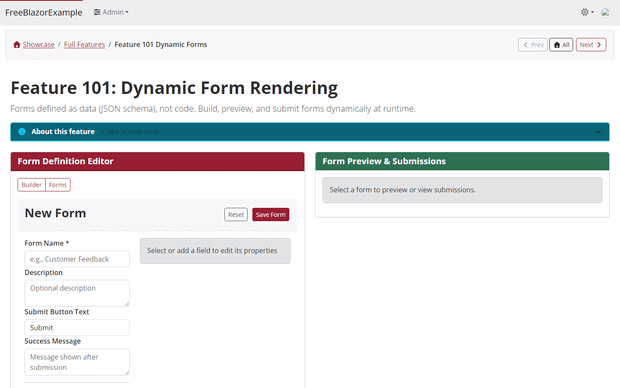
</a>
<br/>
<a href="screenshots/showcase-feature101-dynamic-forms/full.webp"><strong>Feature 101 — Dynamic Forms</strong></a>
<br/><code>/showcase/feature101-dynamic-forms</code><br/>
✅ 200 &nbsp;⏱ 18,147ms &nbsp;📦 69.3 MB &nbsp;🖥 ✅ 0 err

<details>
<summary>📋 Details</summary>

**ℹ️ About This Component**

**About this feature**
What is it?

A runtime form renderer that reads a JSON schema definition and produces a fully interactive HTML form — fields, validation rules, and submission handling — without any compiled Razor code.

ELI5: You describe what a form should look like in JSON (a text file), and the app draws the actual form for you. Change the JSON, the form changes — no deploy needed.

 Who uses it?
Product owners who need to iterate on surveys or data-entry screens without a developer
Developers building platforms where customers define their own intake forms
Admins creating configuration wizards that vary by workflow or customer type
 When to use it?

✓ Use when:

Forms that differ per customer, tenant, or workflow
Any scenario where new form fields are added at runtime by non-developers
Multi-step wizards or surveys that need versioning and submission history

✗ Not for:

Simple, static forms that never change — hard-coded Razor is simpler
Forms requiring complex cross-field business logic better expressed in C#
 Why does it exist?

Every time a form changes, a developer writes Razor, tests, and deploys. Schema-driven rendering breaks that cycle — a product owner edits JSON and the change is live immediately.

 Technical notes
FormSchema stored as a JSON column in the FormDefinition table via EF Core
FormService: GetForms, GetForm, SaveForm, DeleteForm, GetSubmissions, SaveSubmission
Renderer traverses schema node tree recursively — supports text, textarea, select, multi-select, radio, checkbox, date, number
Validation rules (required, min/max length, regex) are encoded in the schema and re-evaluated client-side
Submissions stored as JSON blobs keyed by FormDefinitionId + UserId + timestamp
 Quick facts
Layer	Service + UI
Persisted	Yes — schema + submissions in SQL
Real-time	No
Auth required	Yes
Multi-tenant	Yes

**Quick facts**
Layer	Service + UI
Persisted	Yes — schema + submissions in SQL
Real-time	No
Auth required	Yes
Multi-tenant	Yes
**📊 Metrics**

| Metric | Value |
|--------|-------|
| HTTP Status | 200 |
| Navigation | 196 ms |
| Full Load (incl. settle) | 18,147 ms |
| Network Requests | 304 |
| Data Transferred | 69.3 MB |
| JS Errors | 0 |
| JS Warnings | 0 |

<details>
<summary>🌐 Network (304 requests, 69.3 MB)</summary>

| Method | Status | Duration | Bytes | URL |
|--------|:------:|:--------:|------:|-----|
| GET | 200 | 93ms | 9.0 MB | `http://localhost:5201/_framework/MudBlazor.mwezwdoi15.wasm` |
| GET | 200 | 89ms | 6.5 MB | `…:5201/_framework/Microsoft.CodeAnalysis.CSharp.df8hfd5o8z.wasm` |
| GET | 200 | 78ms | 6.0 MB | `…1/_framework/Basic.Reference.Assemblies.Net100.v8tl2dqzst.wasm` |
| GET | 200 | 77ms | 4.6 MB | `…calhost:5201/_framework/System.Private.CoreLib.btnahqa3oa.wasm` |
| GET | 200 | 1ms | 3.5 MB | `…t/BlazorMonaco/lib/monaco-editor/min/vs/editor.api-i0YVFWkl.js` |
| GET | 200 | 100ms | 3.0 MB | `…//localhost:5201/_framework/System.Private.Xml.c86ifkdlwh.wasm` |
| GET | 200 | 79ms | 2.9 MB | `…calhost:5201/_framework/Microsoft.CodeAnalysis.erp1n29u9n.wasm` |
| GET | 200 | 77ms | 2.9 MB | `http://localhost:5201/_framework/dotnet.native.imnhyiqpc9.wasm` |
| GET | 200 | 86ms | 2.4 MB | `http://localhost:5201/_framework/Radzen.Blazor.x7olzc7yc0.wasm` |
| GET | 200 | 117ms | 1.4 MB | `…lhost:5201/_framework/FreeBlazorExample.Client.n18ukcy7q5.wasm` |
| GET | 200 | 37ms | 1.0 MB | `…201/_content/Radzen.Blazor/fonts/MaterialSymbolsOutlined.woff2` |
| GET | 200 | 89ms | 984.3 KB | `…//localhost:5201/_framework/System.Data.Common.cp5bttdxwa.wasm` |
| GET | 200 | 76ms | 914.3 KB | `http://localhost:5201/_framework/BlazorBootstrap.zo6lifkmy7.wasm` |
| GET | 200 | 100ms | 829.3 KB | `…ework/System.Private.DataContractSerialization.yjhmavq6w2.wasm` |
| GET | 200 | 77ms | 788.2 KB | `…alhost:5201/_framework/FreeBlazorExample.Client.3ivhmqjexl.pdb` |
| … | … | … | … | *289 more* |

</details>

<details>
<summary>🖥 Console Info (1 messages)</summary>

```
[info] Debugging hotkey: Shift+Alt+D (when application has focus)
```

</details>

</details>

</td>
<td align="center" valign="top" width="33%">
<a href="screenshots/showcase-feature102-multi-view-sync/full.webp">
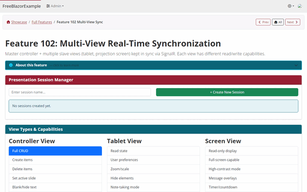
</a>
<br/>
<a href="screenshots/showcase-feature102-multi-view-sync/full.webp"><strong>Feature 102 — Multi-View Sync</strong></a>
<br/><code>/showcase/feature102-multi-view-sync</code><br/>
✅ 200 &nbsp;⏱ 17,624ms &nbsp;📦 69.3 MB &nbsp;🖥 ✅ 0 err

<details>
<summary>📋 Details</summary>

**ℹ️ About This Component**

**About this feature**
What is it?

A SignalR-backed session model where one master client controls shared state and any number of slave clients mirror it in real time, each with its own read/write permission profile.

ELI5: Think of a TV remote and the TV — one device is in control, and whatever it does instantly appears on every screen in the room, all without anyone pressing refresh.

 Who uses it?
Presenters who run guided walkthroughs on a projector while controlling from a tablet
Kiosk operators pushing content to displays
Developers building shared-screen collaboration flows (e.g., co-browsing support tools)
 When to use it?

✓ Use when:

Live presentations where a handheld device drives a wall screen
Multi-screen kiosks where a back-office admin pushes content to public displays
Step-by-step guided workflows where a rep controls what a customer sees

✗ Not for:

Persistent multi-user collaboration that needs conflict resolution — use a proper CRDT or OT approach
Simple data sync that just needs a database poll — SignalR overhead isn't worth it
 Why does it exist?

The gap between 'I control from my phone' and 'it shows on the big screen' used to require native apps or complex WebSocket wiring. This collapses that into a reusable session abstraction.

 Technical notes
RealtimeSyncService manages named sessions; each session has one master connection ID and N slave IDs
SignalR hub group per session — master calls hub method, hub broadcasts to group
Slave views receive a strongly-typed SyncPayload and re-render; they never call hub methods unless granted write permission
Session state is in-memory only — no DB persistence; sessions vanish on server restart
Controller page uses @implements IAsyncDisposable to clean up the hub connection
 Quick facts
Layer	UI + SignalR hub
Persisted	No — in-memory session only
Real-time	SignalR (push)
Auth required	Yes
Multi-tenant	Yes

**Quick facts**
Layer	UI + SignalR hub
Persisted	No — in-memory session only
Real-time	SignalR (push)
Auth required	Yes
Multi-tenant	Yes
**📊 Metrics**

| Metric | Value |
|--------|-------|
| HTTP Status | 200 |
| Navigation | 254 ms |
| Full Load (incl. settle) | 17,624 ms |
| Network Requests | 304 |
| Data Transferred | 69.3 MB |
| JS Errors | 0 |
| JS Warnings | 0 |

<details>
<summary>🌐 Network (304 requests, 69.3 MB)</summary>

| Method | Status | Duration | Bytes | URL |
|--------|:------:|:--------:|------:|-----|
| GET | 200 | 95ms | 9.0 MB | `http://localhost:5201/_framework/MudBlazor.mwezwdoi15.wasm` |
| GET | 200 | 98ms | 6.5 MB | `…:5201/_framework/Microsoft.CodeAnalysis.CSharp.df8hfd5o8z.wasm` |
| GET | 200 | 73ms | 6.0 MB | `…1/_framework/Basic.Reference.Assemblies.Net100.v8tl2dqzst.wasm` |
| GET | 200 | 75ms | 4.6 MB | `…calhost:5201/_framework/System.Private.CoreLib.btnahqa3oa.wasm` |
| GET | 200 | 40ms | 3.5 MB | `…t/BlazorMonaco/lib/monaco-editor/min/vs/editor.api-i0YVFWkl.js` |
| GET | 200 | 106ms | 3.0 MB | `…//localhost:5201/_framework/System.Private.Xml.c86ifkdlwh.wasm` |
| GET | 200 | 75ms | 2.9 MB | `…calhost:5201/_framework/Microsoft.CodeAnalysis.erp1n29u9n.wasm` |
| GET | 200 | 22ms | 2.9 MB | `http://localhost:5201/_framework/dotnet.native.imnhyiqpc9.wasm` |
| GET | 200 | 94ms | 2.4 MB | `http://localhost:5201/_framework/Radzen.Blazor.x7olzc7yc0.wasm` |
| GET | 200 | 284ms | 1.4 MB | `…lhost:5201/_framework/FreeBlazorExample.Client.n18ukcy7q5.wasm` |
| GET | 200 | 45ms | 1.0 MB | `…201/_content/Radzen.Blazor/fonts/MaterialSymbolsOutlined.woff2` |
| GET | 200 | 104ms | 984.3 KB | `…//localhost:5201/_framework/System.Data.Common.cp5bttdxwa.wasm` |
| GET | 200 | 73ms | 914.3 KB | `http://localhost:5201/_framework/BlazorBootstrap.zo6lifkmy7.wasm` |
| GET | 200 | 107ms | 829.3 KB | `…ework/System.Private.DataContractSerialization.yjhmavq6w2.wasm` |
| GET | 200 | 73ms | 788.2 KB | `…alhost:5201/_framework/FreeBlazorExample.Client.3ivhmqjexl.pdb` |
| … | … | … | … | *289 more* |

</details>

<details>
<summary>🖥 Console Info (1 messages)</summary>

```
[info] Debugging hotkey: Shift+Alt+D (when application has focus)
```

</details>

</details>

</td>
<td align="center" valign="top" width="33%">
<a href="screenshots/showcase-feature103-calendar/full.webp">
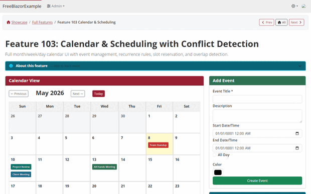
</a>
<br/>
<a href="screenshots/showcase-feature103-calendar/full.webp"><strong>Feature 103 — Calendar &amp; Scheduling</strong></a>
<br/><code>/showcase/feature103-calendar</code><br/>
✅ 200 &nbsp;⏱ 17,656ms &nbsp;📦 69.3 MB &nbsp;🖥 ✅ 0 err

<details>
<summary>📋 Details</summary>

**ℹ️ About This Component**

**About this feature**
What is it?

A full-featured scheduling UI component with month/week/day views, RRULE-based recurrence, exception handling (single-occurrence overrides), slot reservation, and conflict/overlap detection.

ELI5: A complete calendar you can drop into any page — click a day to add an event, set it to repeat every Tuesday, and the system will warn you if two events try to occupy the same slot.

 Who uses it?
Staff booking appointments, rooms, or equipment
Admins managing recurring events (weekly meetings, maintenance windows)
Developers building scheduling into any business workflow without starting from scratch
 When to use it?

✓ Use when:

Appointment scheduling with hard time slots
Recurring event management (daily standups, weekly reports)
Resource reservation where double-booking must be prevented

✗ Not for:

Simple 'pick a date' inputs — use the DateTimePicker component
Read-only calendar displays with no interaction — lighter third-party widgets exist
 Why does it exist?

Calendar UI is deceptively complex — recurrence rules, exception handling, timezone math, and conflict detection each take weeks to get right. This provides a production-tested starting point.

 Technical notes
Recurrence encoded as RRULE strings (RFC 5545); parsed at render time to expand occurrence dates
Exception events: a separate CalendarEventException row overrides a single occurrence of a recurring event
Overlap detection runs a time-range intersection query before committing a save
CalendarEventService: GetEvents, GetEvent, SaveEvent, DeleteEvent, GetOccurrences(dateRange)
Month view uses a 6-row × 7-column grid; day cells clip overflow with '+N more' badges linking to a day detail view
 Quick facts
Layer	Service + UI
Persisted	Yes — SQL via EF Core
Real-time	No
Auth required	Yes
Multi-tenant	Yes

**Quick facts**
Layer	Service + UI
Persisted	Yes — SQL via EF Core
Real-time	No
Auth required	Yes
Multi-tenant	Yes
**📊 Metrics**

| Metric | Value |
|--------|-------|
| HTTP Status | 200 |
| Navigation | 279 ms |
| Full Load (incl. settle) | 17,656 ms |
| Network Requests | 305 |
| Data Transferred | 69.3 MB |
| JS Errors | 0 |
| JS Warnings | 0 |

<details>
<summary>🌐 Network (305 requests, 69.3 MB)</summary>

| Method | Status | Duration | Bytes | URL |
|--------|:------:|:--------:|------:|-----|
| GET | 200 | 285ms | 9.0 MB | `http://localhost:5201/_framework/MudBlazor.mwezwdoi15.wasm` |
| GET | 200 | 90ms | 6.5 MB | `…:5201/_framework/Microsoft.CodeAnalysis.CSharp.df8hfd5o8z.wasm` |
| GET | 200 | 21ms | 6.0 MB | `…1/_framework/Basic.Reference.Assemblies.Net100.v8tl2dqzst.wasm` |
| GET | 200 | 20ms | 4.6 MB | `…calhost:5201/_framework/System.Private.CoreLib.btnahqa3oa.wasm` |
| GET | 200 | 2ms | 3.5 MB | `…t/BlazorMonaco/lib/monaco-editor/min/vs/editor.api-i0YVFWkl.js` |
| GET | 200 | 274ms | 3.0 MB | `…//localhost:5201/_framework/System.Private.Xml.c86ifkdlwh.wasm` |
| GET | 200 | 21ms | 2.9 MB | `…calhost:5201/_framework/Microsoft.CodeAnalysis.erp1n29u9n.wasm` |
| GET | 200 | 19ms | 2.9 MB | `http://localhost:5201/_framework/dotnet.native.imnhyiqpc9.wasm` |
| GET | 200 | 88ms | 2.4 MB | `http://localhost:5201/_framework/Radzen.Blazor.x7olzc7yc0.wasm` |
| GET | 200 | 289ms | 1.4 MB | `…lhost:5201/_framework/FreeBlazorExample.Client.n18ukcy7q5.wasm` |
| GET | 200 | 46ms | 1.0 MB | `…201/_content/Radzen.Blazor/fonts/MaterialSymbolsOutlined.woff2` |
| GET | 200 | 272ms | 984.3 KB | `…//localhost:5201/_framework/System.Data.Common.cp5bttdxwa.wasm` |
| GET | 200 | 21ms | 914.3 KB | `http://localhost:5201/_framework/BlazorBootstrap.zo6lifkmy7.wasm` |
| GET | 200 | 273ms | 829.3 KB | `…ework/System.Private.DataContractSerialization.yjhmavq6w2.wasm` |
| GET | 200 | 20ms | 788.2 KB | `…alhost:5201/_framework/FreeBlazorExample.Client.3ivhmqjexl.pdb` |
| … | … | … | … | *290 more* |

</details>

<details>
<summary>🖥 Console Info (1 messages)</summary>

```
[info] Debugging hotkey: Shift+Alt+D (when application has focus)
```

</details>

</details>

</td>
</tr>
<tr>
<td align="center" valign="top" width="33%">
<a href="screenshots/showcase-feature104-user-preferences/full.webp">
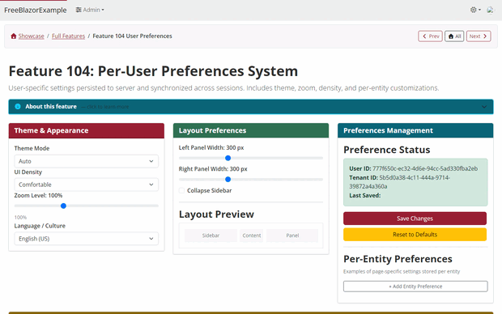
</a>
<br/>
<a href="screenshots/showcase-feature104-user-preferences/full.webp"><strong>Feature 104 — User Preferences</strong></a>
<br/><code>/showcase/feature104-user-preferences</code><br/>
✅ 200 &nbsp;⏱ 17,563ms &nbsp;📦 69.3 MB &nbsp;🖥 ✅ 0 err

<details>
<summary>📋 Details</summary>

**ℹ️ About This Component**

**About this feature**
What is it?

A server-persisted, per-user key-value settings store covering theme, UI density, zoom, language, panel widths, and arbitrary per-entity JSON blobs.

ELI5: Each user gets their own saved settings that follow them to every device and browser session — like a preferences file that lives on the server, not the browser.

 Who uses it?
End users — adjusting their personal theme, zoom, and layout
Developers — storing per-entity expansion state or sort preferences without a database schema change
 When to use it?

✓ Use when:

Any preference that should survive browser-cache clears
Per-entity UI state (expanded/collapsed, sort column, column visibility)
Multi-device users who expect consistent settings everywhere

✗ Not for:

App-wide config that applies to all users (use tenant settings instead)
Temporary UI state that resets on navigation (use component-local state)
 Why does it exist?

Browser localStorage is wiped on cache clears and doesn't roam across devices. Storing prefs server-side means a user's dark-mode setting on their phone matches their laptop automatically.

 Technical notes
UserPreferences table: one row per user, JSON blob column holds the full preferences object
UserPreferencesService (scoped) — Get, Save, Reset, GetForEntity, SaveForEntity
Loaded at login and cached in BlazorDataModel; auto-saved via 500 ms debounce in MainLayout.razor
Entity prefs: dictionary keyed by entity GUID — each entry is an arbitrary JSON string
Cross-tab sync via SignalR: saving in one tab broadcasts to other open tabs for the same user
 Quick facts
Layer	Service + UI
Persisted	Yes — SQL via EF Core
Real-time sync	SignalR (cross-tab)
Auth required	Yes
Multi-tenant	Yes

**Quick facts**
Layer	Service + UI
Persisted	Yes — SQL via EF Core
Real-time sync	SignalR (cross-tab)
Auth required	Yes
Multi-tenant	Yes
**📊 Metrics**

| Metric | Value |
|--------|-------|
| HTTP Status | 200 |
| Navigation | 273 ms |
| Full Load (incl. settle) | 17,563 ms |
| Network Requests | 304 |
| Data Transferred | 69.3 MB |
| JS Errors | 0 |
| JS Warnings | 0 |

<details>
<summary>🌐 Network (304 requests, 69.3 MB)</summary>

| Method | Status | Duration | Bytes | URL |
|--------|:------:|:--------:|------:|-----|
| GET | 200 | 274ms | 9.0 MB | `http://localhost:5201/_framework/MudBlazor.mwezwdoi15.wasm` |
| GET | 200 | 88ms | 6.5 MB | `…:5201/_framework/Microsoft.CodeAnalysis.CSharp.df8hfd5o8z.wasm` |
| GET | 200 | 22ms | 6.0 MB | `…1/_framework/Basic.Reference.Assemblies.Net100.v8tl2dqzst.wasm` |
| GET | 200 | 21ms | 4.6 MB | `…calhost:5201/_framework/System.Private.CoreLib.btnahqa3oa.wasm` |
| GET | 200 | 2ms | 3.5 MB | `…t/BlazorMonaco/lib/monaco-editor/min/vs/editor.api-i0YVFWkl.js` |
| GET | 200 | 275ms | 3.0 MB | `…//localhost:5201/_framework/System.Private.Xml.c86ifkdlwh.wasm` |
| GET | 200 | 78ms | 2.9 MB | `…calhost:5201/_framework/Microsoft.CodeAnalysis.erp1n29u9n.wasm` |
| GET | 200 | 21ms | 2.9 MB | `http://localhost:5201/_framework/dotnet.native.imnhyiqpc9.wasm` |
| GET | 200 | 87ms | 2.4 MB | `http://localhost:5201/_framework/Radzen.Blazor.x7olzc7yc0.wasm` |
| GET | 200 | 284ms | 1.4 MB | `…lhost:5201/_framework/FreeBlazorExample.Client.n18ukcy7q5.wasm` |
| GET | 200 | 45ms | 1.0 MB | `…201/_content/Radzen.Blazor/fonts/MaterialSymbolsOutlined.woff2` |
| GET | 200 | 272ms | 984.3 KB | `…//localhost:5201/_framework/System.Data.Common.cp5bttdxwa.wasm` |
| GET | 200 | 21ms | 914.3 KB | `http://localhost:5201/_framework/BlazorBootstrap.zo6lifkmy7.wasm` |
| GET | 200 | 276ms | 829.3 KB | `…ework/System.Private.DataContractSerialization.yjhmavq6w2.wasm` |
| GET | 200 | 22ms | 788.2 KB | `…alhost:5201/_framework/FreeBlazorExample.Client.3ivhmqjexl.pdb` |
| … | … | … | … | *289 more* |

</details>

<details>
<summary>🖥 Console Info (1 messages)</summary>

```
[info] Debugging hotkey: Shift+Alt+D (when application has focus)
```

</details>

</details>

</td>
<td align="center" valign="top" width="33%">
<a href="screenshots/showcase-feature105-agent-monitoring/full.webp">
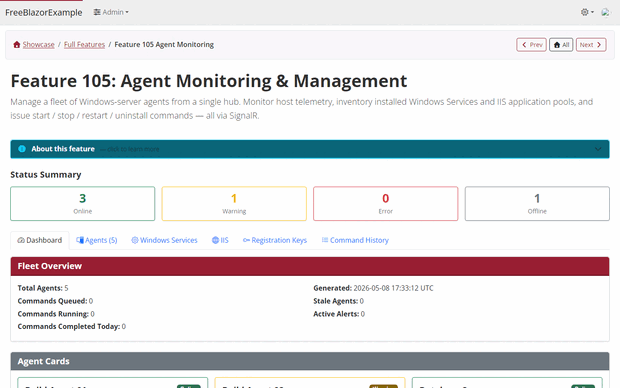
</a>
<br/>
<a href="screenshots/showcase-feature105-agent-monitoring/full.webp"><strong>Feature 105 — Agent Monitoring</strong></a>
<br/><code>/showcase/feature105-agent-monitoring</code><br/>
✅ 200 &nbsp;⏱ 17,417ms &nbsp;📦 69.4 MB &nbsp;🖥 ✅ 0 err

<details>
<summary>📋 Details</summary>

**ℹ️ About This Component**

**About this feature**
What is it?

A distributed monitoring system where a lightweight .NET Worker Service runs on each Windows host, phones home via SignalR with CPU/memory/disk telemetry, and exposes the host's Windows Services and IIS application pools for remote start/stop/restart/uninstall commands.

ELI5: A tiny watchdog program runs quietly on each server and sends its health stats to a central dashboard — and you can click a button in the dashboard to restart a crashed service without touching the server directly.

 Who uses it?
IT operations teams monitoring a fleet of application servers
System administrators who currently RDP into each server individually to check service health
DevOps engineers who want a lightweight self-hosted alternative to full APM suites for Windows service oversight
 When to use it?

✓ Use when:

Monitoring Windows Services and IIS pools across multiple hosts from one screen
Alerting when CPU/disk crosses a threshold
Remotely restarting a crashed service without opening RDP

✗ Not for:

Linux hosts — agent uses Windows-only PerformanceCounter and ServiceController APIs (systemd port is on the roadmap)
Full APM/observability — use OpenTelemetry + Grafana for distributed tracing and log aggregation
 Why does it exist?

Checking each server via RDP is slow, error-prone, and doesn't scale past a handful of machines. This provides a centralised command-and-control surface without deploying a commercial monitoring product.

 Technical notes
Agent = .NET 10 Worker Service; registered as a Windows Service via UseWindowsService()
Telemetry collected via System.Diagnostics.PerformanceCounter (CPU) and DriveInfo/GC (disk/memory)
Agent connects to the hub as a SignalR client on startup; reconnects with exponential back-off on disconnect
Hub routes commands back to the correct agent by ConnectionId; results stream back as SignalR events
Showcase runs an in-memory simulation — no real Windows host required to explore the UI
Linux research targets: systemd (services), nginx (IIS equivalent), Caddy/Traefik (reverse proxy)
 Quick facts
Layer	Agent + Hub + UI
Persisted	Metrics: in-memory ring buffer; registrations: SQL
Real-time	SignalR (bidirectional)
Auth required	Yes
OS support	Windows only (Linux: roadmap)

**Quick facts**
Layer	Agent + Hub + UI
Persisted	Metrics: in-memory ring buffer; registrations: SQL
Real-time	SignalR (bidirectional)
Auth required	Yes
OS support	Windows only (Linux: roadmap)
**📊 Metrics**

| Metric | Value |
|--------|-------|
| HTTP Status | 200 |
| Navigation | 202 ms |
| Full Load (incl. settle) | 17,417 ms |
| Network Requests | 305 |
| Data Transferred | 69.4 MB |
| JS Errors | 0 |
| JS Warnings | 0 |

<details>
<summary>🌐 Network (305 requests, 69.4 MB)</summary>

| Method | Status | Duration | Bytes | URL |
|--------|:------:|:--------:|------:|-----|
| GET | 200 | 322ms | 9.0 MB | `http://localhost:5201/_framework/MudBlazor.mwezwdoi15.wasm` |
| GET | 200 | 319ms | 6.5 MB | `…:5201/_framework/Microsoft.CodeAnalysis.CSharp.df8hfd5o8z.wasm` |
| GET | 200 | 50ms | 6.0 MB | `…1/_framework/Basic.Reference.Assemblies.Net100.v8tl2dqzst.wasm` |
| GET | 200 | 49ms | 4.6 MB | `…calhost:5201/_framework/System.Private.CoreLib.btnahqa3oa.wasm` |
| GET | 200 | 2ms | 3.5 MB | `…t/BlazorMonaco/lib/monaco-editor/min/vs/editor.api-i0YVFWkl.js` |
| GET | 200 | 287ms | 3.0 MB | `…//localhost:5201/_framework/System.Private.Xml.c86ifkdlwh.wasm` |
| GET | 200 | 109ms | 2.9 MB | `…calhost:5201/_framework/Microsoft.CodeAnalysis.erp1n29u9n.wasm` |
| GET | 200 | 76ms | 2.9 MB | `http://localhost:5201/_framework/dotnet.native.imnhyiqpc9.wasm` |
| GET | 200 | 108ms | 2.4 MB | `http://localhost:5201/_framework/Radzen.Blazor.x7olzc7yc0.wasm` |
| GET | 200 | 288ms | 1.4 MB | `…lhost:5201/_framework/FreeBlazorExample.Client.n18ukcy7q5.wasm` |
| GET | 200 | 52ms | 1.0 MB | `…201/_content/Radzen.Blazor/fonts/MaterialSymbolsOutlined.woff2` |
| GET | 200 | 287ms | 984.3 KB | `…//localhost:5201/_framework/System.Data.Common.cp5bttdxwa.wasm` |
| GET | 200 | 50ms | 914.3 KB | `http://localhost:5201/_framework/BlazorBootstrap.zo6lifkmy7.wasm` |
| GET | 200 | 287ms | 829.3 KB | `…ework/System.Private.DataContractSerialization.yjhmavq6w2.wasm` |
| GET | 200 | 50ms | 788.2 KB | `…alhost:5201/_framework/FreeBlazorExample.Client.3ivhmqjexl.pdb` |
| … | … | … | … | *290 more* |

</details>

<details>
<summary>🖥 Console Info (1 messages)</summary>

```
[info] Debugging hotkey: Shift+Alt+D (when application has focus)
```

</details>

</details>

</td>
<td align="center" valign="top" width="33%">
<a href="screenshots/showcase-feature107-hierarchical-tree/full.webp">
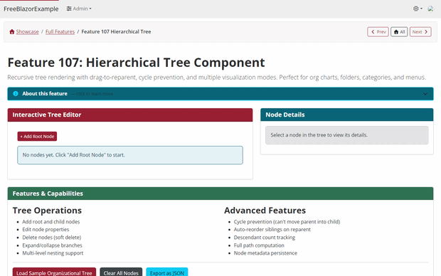
</a>
<br/>
<a href="screenshots/showcase-feature107-hierarchical-tree/full.webp"><strong>Feature 107 — Hierarchical Tree</strong></a>
<br/><code>/showcase/feature107-hierarchical-tree</code><br/>
✅ 200 &nbsp;⏱ 17,537ms &nbsp;📦 69.3 MB &nbsp;🖥 ✅ 0 err

<details>
<summary>📋 Details</summary>

**ℹ️ About This Component**

**About this feature**
What is it?

A recursive Razor component that renders an arbitrarily deep tree of nodes with expand/collapse, multi-select, drag-to-reparent, and a cycle-prevention guard that walks the ancestor chain before accepting any drop.

ELI5: An org chart or folder tree that you can drag around — and it's smart enough to stop you from accidentally making someone their own boss (which would create an infinite loop).

 Who uses it?
Admins building category or menu hierarchies
Developers modelling org charts, folder structures, or multi-level config trees
UX designers prototyping any parent-child relationship that users need to reorganise
 When to use it?

✓ Use when:

Org charts, department hierarchies, folder trees
Navigation menu builders where items can have sub-items
Any data model with a self-referencing ParentId foreign key that users need to edit

✗ Not for:

Flat lists or two-level parent/child where a simple <select> is enough
Very large trees (10 000+ nodes) — virtual rendering would be needed for performance
 Why does it exist?

Recursive rendering and drag-and-drop reparenting are easy to get wrong — especially cycle detection, which most hand-rolled tree UIs skip entirely. This packages the correct algorithm once so it doesn't need reinventing per project.

 Technical notes
Component calls itself recursively via <HierarchicalTree Nodes='node.Children' />
Cycle prevention: on drop, walk from the drag target upward through ParentId; if the dragged node appears, reject
TreeService: GetTree, GetNode, SaveNode, DeleteNode, MoveNode(nodeId, newParentId)
Node payload: arbitrary JSON string stored alongside the typed fields — survives unknown future fields
Visualization modes: indented list, connector lines, compact badges — switched via a Mode parameter
 Quick facts
Layer	UI component (service optional)
Persisted	Via calling service — not self-contained
Real-time	No
Auth required	Optional
Max tested depth	~20 levels

**Quick facts**
Layer	UI component (service optional)
Persisted	Via calling service — not self-contained
Real-time	No
Auth required	Optional
Max tested depth	~20 levels
**📊 Metrics**

| Metric | Value |
|--------|-------|
| HTTP Status | 200 |
| Navigation | 277 ms |
| Full Load (incl. settle) | 17,537 ms |
| Network Requests | 305 |
| Data Transferred | 69.3 MB |
| JS Errors | 0 |
| JS Warnings | 0 |

<details>
<summary>🌐 Network (305 requests, 69.3 MB)</summary>

| Method | Status | Duration | Bytes | URL |
|--------|:------:|:--------:|------:|-----|
| GET | 200 | 281ms | 9.0 MB | `http://localhost:5201/_framework/MudBlazor.mwezwdoi15.wasm` |
| GET | 200 | 285ms | 6.5 MB | `…:5201/_framework/Microsoft.CodeAnalysis.CSharp.df8hfd5o8z.wasm` |
| GET | 200 | 22ms | 6.0 MB | `…1/_framework/Basic.Reference.Assemblies.Net100.v8tl2dqzst.wasm` |
| GET | 200 | 22ms | 4.6 MB | `…calhost:5201/_framework/System.Private.CoreLib.btnahqa3oa.wasm` |
| GET | 200 | 3ms | 3.5 MB | `…t/BlazorMonaco/lib/monaco-editor/min/vs/editor.api-i0YVFWkl.js` |
| GET | 200 | 256ms | 3.0 MB | `…//localhost:5201/_framework/System.Private.Xml.c86ifkdlwh.wasm` |
| GET | 200 | 70ms | 2.9 MB | `…calhost:5201/_framework/Microsoft.CodeAnalysis.erp1n29u9n.wasm` |
| GET | 200 | 23ms | 2.9 MB | `http://localhost:5201/_framework/dotnet.native.imnhyiqpc9.wasm` |
| GET | 200 | 77ms | 2.4 MB | `http://localhost:5201/_framework/Radzen.Blazor.x7olzc7yc0.wasm` |
| GET | 200 | 259ms | 1.4 MB | `…lhost:5201/_framework/FreeBlazorExample.Client.n18ukcy7q5.wasm` |
| GET | 200 | 44ms | 1.0 MB | `…201/_content/Radzen.Blazor/fonts/MaterialSymbolsOutlined.woff2` |
| GET | 200 | 254ms | 984.3 KB | `…//localhost:5201/_framework/System.Data.Common.cp5bttdxwa.wasm` |
| GET | 200 | 23ms | 914.3 KB | `http://localhost:5201/_framework/BlazorBootstrap.zo6lifkmy7.wasm` |
| GET | 200 | 256ms | 829.3 KB | `…ework/System.Private.DataContractSerialization.yjhmavq6w2.wasm` |
| GET | 200 | 23ms | 788.2 KB | `…alhost:5201/_framework/FreeBlazorExample.Client.3ivhmqjexl.pdb` |
| … | … | … | … | *290 more* |

</details>

<details>
<summary>🖥 Console Info (1 messages)</summary>

```
[info] Debugging hotkey: Shift+Alt+D (when application has focus)
```

</details>

</details>

</td>
</tr>
</table>

---

## Core Demos

> 13 pages &nbsp;|&nbsp; ✅ 13 ok &nbsp;|&nbsp; 🔴 0 JS errors &nbsp;|&nbsp; 📦 899.1 MB transferred

<table>
<tr>
<td align="center" valign="top" width="33%">
<a href="screenshots/showcase-autocomplete/full.webp">
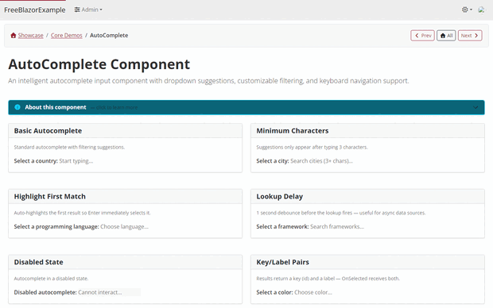
</a>
<br/>
<a href="screenshots/showcase-autocomplete/full.webp"><strong>AutoComplete</strong></a>
<br/><code>/showcase/autocomplete</code><br/>
✅ 200 &nbsp;⏱ 17,573ms &nbsp;📦 69.3 MB &nbsp;🖥 ✅ 0 err

<details>
<summary>📋 Details</summary>

**ℹ️ About This Component**

**About this component**
What is it?

A text input bound to a string list that opens a filtered dropdown of matching suggestions as the user types, supporting minimum-character thresholds, max-results caps, case sensitivity, and a custom-entry allow/deny flag.

ELI5: A text box that suggests matching options as you type — like a search bar that shows guesses before you finish typing.

 Who uses it?
Developers adding search-as-you-type UX to any text field
Form builders where the valid values are too long for a <select> but should still guide the user
Any UI where free text is allowed but known values are preferred
 When to use it?

✓ Use when:

Fields with a large option list where typing to filter is faster than scrolling a dropdown
Search boxes where partial matches are expected
Tags or label entry where both free text and suggestions are valid

✗ Not for:

Small fixed option lists (≤10 items) — a plain <select> is less surprising
Fields that must be restricted to the list — use MultiSelect with AllowCustom=false and a validation rule instead
 Why does it exist?

Standard <datalist> is inconsistent across browsers and can't be styled. This provides a predictable, accessible, styleable alternative with full Blazor data binding.

 Technical notes
Filters the Options list client-side on each keystroke; no server round-trip unless the caller provides a dynamic options source via a callback
MinChars prevents the dropdown opening until the user has typed enough to produce useful results
AllowCustom=false: OnSelected fires only when the user picks a suggestion; the input reverts if they blur without selecting
Keyboard navigation: ArrowDown/Up move through suggestions; Enter selects; Escape closes
 Quick facts
Layer	UI only
Persisted	No
Real-time	No
Auth required	No
Namespace	FreeBlazor

**Quick facts**
Layer	UI only
Persisted	No
Real-time	No
Auth required	No
Namespace	FreeBlazor
**📊 Metrics**

| Metric | Value |
|--------|-------|
| HTTP Status | 200 |
| Navigation | 295 ms |
| Full Load (incl. settle) | 17,573 ms |
| Network Requests | 311 |
| Data Transferred | 69.3 MB |
| JS Errors | 0 |
| JS Warnings | 0 |

<details>
<summary>🌐 Network (311 requests, 69.3 MB)</summary>

| Method | Status | Duration | Bytes | URL |
|--------|:------:|:--------:|------:|-----|
| GET | 200 | 308ms | 9.0 MB | `http://localhost:5201/_framework/MudBlazor.mwezwdoi15.wasm` |
| GET | 200 | 304ms | 6.5 MB | `…:5201/_framework/Microsoft.CodeAnalysis.CSharp.df8hfd5o8z.wasm` |
| GET | 200 | 15ms | 6.0 MB | `…1/_framework/Basic.Reference.Assemblies.Net100.v8tl2dqzst.wasm` |
| GET | 200 | 15ms | 4.6 MB | `…calhost:5201/_framework/System.Private.CoreLib.btnahqa3oa.wasm` |
| GET | 200 | 2ms | 3.5 MB | `…t/BlazorMonaco/lib/monaco-editor/min/vs/editor.api-i0YVFWkl.js` |
| GET | 200 | 270ms | 3.0 MB | `…//localhost:5201/_framework/System.Private.Xml.c86ifkdlwh.wasm` |
| GET | 200 | 86ms | 2.9 MB | `…calhost:5201/_framework/Microsoft.CodeAnalysis.erp1n29u9n.wasm` |
| GET | 200 | 15ms | 2.9 MB | `http://localhost:5201/_framework/dotnet.native.imnhyiqpc9.wasm` |
| GET | 200 | 85ms | 2.4 MB | `http://localhost:5201/_framework/Radzen.Blazor.x7olzc7yc0.wasm` |
| GET | 200 | 273ms | 1.4 MB | `…lhost:5201/_framework/FreeBlazorExample.Client.n18ukcy7q5.wasm` |
| GET | 200 | 70ms | 1.0 MB | `…201/_content/Radzen.Blazor/fonts/MaterialSymbolsOutlined.woff2` |
| GET | 200 | 271ms | 984.3 KB | `…//localhost:5201/_framework/System.Data.Common.cp5bttdxwa.wasm` |
| GET | 200 | 15ms | 914.3 KB | `http://localhost:5201/_framework/BlazorBootstrap.zo6lifkmy7.wasm` |
| GET | 200 | 269ms | 829.3 KB | `…ework/System.Private.DataContractSerialization.yjhmavq6w2.wasm` |
| GET | 200 | 15ms | 788.2 KB | `…alhost:5201/_framework/FreeBlazorExample.Client.3ivhmqjexl.pdb` |
| … | … | … | … | *296 more* |

</details>

<details>
<summary>🖥 Console Info (1 messages)</summary>

```
[info] Debugging hotkey: Shift+Alt+D (when application has focus)
```

</details>

</details>

</td>
<td align="center" valign="top" width="33%">
<a href="screenshots/showcase-autogrowtext/full.webp">
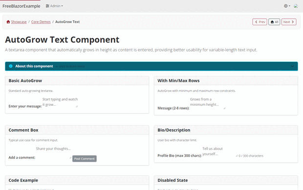
</a>
<br/>
<a href="screenshots/showcase-autogrowtext/full.webp"><strong>Auto Grow Text</strong></a>
<br/><code>/showcase/autogrowtext</code><br/>
✅ 200 &nbsp;⏱ 17,483ms &nbsp;📦 69.3 MB &nbsp;🖥 ✅ 0 err

<details>
<summary>📋 Details</summary>

**ℹ️ About This Component**

**About this component**
What is it?

A textarea that listens to its own input event and adjusts its CSS height to match its scrollHeight, giving it MinRows as a floor and MaxRows as a ceiling. No JavaScript interop required.

ELI5: A text box that grows taller as you type so you never have to scroll inside it — but it also won't take over the whole page if someone pastes a novel.

 Who uses it?
Form builders adding comment, notes, or description fields
Developers who want a textarea that feels as natural as a messaging app input
Any UI where the amount of text the user will enter is unpredictable
 When to use it?

✓ Use when:

Comment boxes, notes fields, bio/description inputs
Any textarea where a fixed height would either waste whitespace or force internal scrolling
Forms where content length varies wildly between users

✗ Not for:

Code editors or very long structured text — use MonacoEditor instead
Inputs where a fixed height is a deliberate design choice (e.g., a constrained log viewer)
 Why does it exist?

A fixed-height textarea that forces scroll feels cramped for short content and confusing for long content. Auto-grow matches the input to its content so it always looks just right.

 Technical notes
Height adjustment triggered by the oninput event via a one-liner JS interop call (element.style.height = element.scrollHeight + 'px')
MinRows sets the initial height via inline style rows attribute; MaxRows caps via max-height with overflow-y:auto
MaxLength enforced via the native maxlength HTML attribute
Fully keyboard accessible; no custom event handlers on the host page needed
 Quick facts
Layer	UI only
Persisted	No
Real-time	No
Auth required	No
Namespace	FreeBlazor

**Quick facts**
Layer	UI only
Persisted	No
Real-time	No
Auth required	No
Namespace	FreeBlazor
**📊 Metrics**

| Metric | Value |
|--------|-------|
| HTTP Status | 200 |
| Navigation | 261 ms |
| Full Load (incl. settle) | 17,483 ms |
| Network Requests | 309 |
| Data Transferred | 69.3 MB |
| JS Errors | 0 |
| JS Warnings | 0 |

<details>
<summary>🌐 Network (309 requests, 69.3 MB)</summary>

| Method | Status | Duration | Bytes | URL |
|--------|:------:|:--------:|------:|-----|
| GET | 200 | 317ms | 9.0 MB | `http://localhost:5201/_framework/MudBlazor.mwezwdoi15.wasm` |
| GET | 200 | 316ms | 6.5 MB | `…:5201/_framework/Microsoft.CodeAnalysis.CSharp.df8hfd5o8z.wasm` |
| GET | 200 | 16ms | 6.0 MB | `…1/_framework/Basic.Reference.Assemblies.Net100.v8tl2dqzst.wasm` |
| GET | 200 | 17ms | 4.6 MB | `…calhost:5201/_framework/System.Private.CoreLib.btnahqa3oa.wasm` |
| GET | 200 | 2ms | 3.5 MB | `…t/BlazorMonaco/lib/monaco-editor/min/vs/editor.api-i0YVFWkl.js` |
| GET | 200 | 288ms | 3.0 MB | `…//localhost:5201/_framework/System.Private.Xml.c86ifkdlwh.wasm` |
| GET | 200 | 72ms | 2.9 MB | `…calhost:5201/_framework/Microsoft.CodeAnalysis.erp1n29u9n.wasm` |
| GET | 200 | 16ms | 2.9 MB | `http://localhost:5201/_framework/dotnet.native.imnhyiqpc9.wasm` |
| GET | 200 | 285ms | 2.4 MB | `http://localhost:5201/_framework/Radzen.Blazor.x7olzc7yc0.wasm` |
| GET | 200 | 289ms | 1.4 MB | `…lhost:5201/_framework/FreeBlazorExample.Client.n18ukcy7q5.wasm` |
| GET | 200 | 58ms | 1.0 MB | `…201/_content/Radzen.Blazor/fonts/MaterialSymbolsOutlined.woff2` |
| GET | 200 | 286ms | 984.3 KB | `…//localhost:5201/_framework/System.Data.Common.cp5bttdxwa.wasm` |
| GET | 200 | 17ms | 914.3 KB | `http://localhost:5201/_framework/BlazorBootstrap.zo6lifkmy7.wasm` |
| GET | 200 | 288ms | 829.3 KB | `…ework/System.Private.DataContractSerialization.yjhmavq6w2.wasm` |
| GET | 200 | 16ms | 788.2 KB | `…alhost:5201/_framework/FreeBlazorExample.Client.3ivhmqjexl.pdb` |
| … | … | … | … | *294 more* |

</details>

<details>
<summary>🖥 Console Info (1 messages)</summary>

```
[info] Debugging hotkey: Shift+Alt+D (when application has focus)
```

</details>

</details>

</td>
<td align="center" valign="top" width="33%">
<a href="screenshots/showcase-confirmationcode/full.webp">
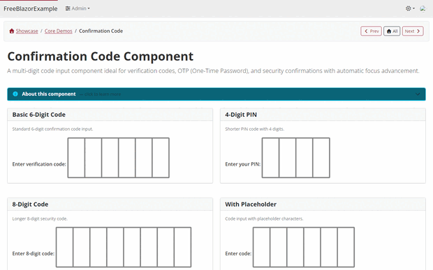
</a>
<br/>
<a href="screenshots/showcase-confirmationcode/full.webp"><strong>Confirmation Code</strong></a>
<br/><code>/showcase/confirmationcode</code><br/>
✅ 200 &nbsp;⏱ 17,462ms &nbsp;📦 69.3 MB &nbsp;🖥 ✅ 0 err

<details>
<summary>📋 Details</summary>

**ℹ️ About This Component**

**About this component**
What is it?

A row of N single-character inputs that auto-advance focus on each keystroke, auto-retreat focus on backspace, and fire OnComplete when all digits are filled — modelled on standard OTP entry UX.

ELI5: Those six little boxes you see when a website texts you a code — each box accepts one digit and jumps to the next one automatically so you don't have to click between them.

 Who uses it?
Developers building two-factor authentication flows
Auth screens requiring PIN entry (ATM-style short numeric codes)
Any verification step where the user must type a code received out-of-band
 When to use it?

✓ Use when:

Email or SMS verification codes
Two-factor authentication OTP entry
Short PIN entry (4–8 digits or alphanumeric)

✗ Not for:

Long arbitrary strings — a plain text input with paste support is faster for codes longer than ~10 characters
Cases where the code length is unknown at render time
 Why does it exist?

A standard text input for a 6-digit SMS code forces the user to click, type, and worry about formatting. Individual advancing boxes exactly match the mental model users already have from banking apps.

 Technical notes
NumberOfInputs parameter controls how many boxes render; each is a maxlength=1 <input>
Focus advancement: input event handler calls the next sibling's .focus() via ElementReference
Backspace handler: if current input is empty, move focus to previous input
AllowAlpha=false restricts input pattern to [0-9] only; AllowAlpha=true accepts [A-Za-z0-9]
OnComplete fires when the last box receives a character; passes the full concatenated string
 Quick facts
Layer	UI only
Persisted	No
Real-time	No
Auth required	No
Namespace	FreeBlazor

**Quick facts**
Layer	UI only
Persisted	No
Real-time	No
Auth required	No
Namespace	FreeBlazor
**📊 Metrics**

| Metric | Value |
|--------|-------|
| HTTP Status | 200 |
| Navigation | 272 ms |
| Full Load (incl. settle) | 17,462 ms |
| Network Requests | 304 |
| Data Transferred | 69.3 MB |
| JS Errors | 0 |
| JS Warnings | 0 |

<details>
<summary>🌐 Network (304 requests, 69.3 MB)</summary>

| Method | Status | Duration | Bytes | URL |
|--------|:------:|:--------:|------:|-----|
| GET | 200 | 300ms | 9.0 MB | `http://localhost:5201/_framework/MudBlazor.mwezwdoi15.wasm` |
| GET | 200 | 288ms | 6.5 MB | `…:5201/_framework/Microsoft.CodeAnalysis.CSharp.df8hfd5o8z.wasm` |
| GET | 200 | 15ms | 6.0 MB | `…1/_framework/Basic.Reference.Assemblies.Net100.v8tl2dqzst.wasm` |
| GET | 200 | 16ms | 4.6 MB | `…calhost:5201/_framework/System.Private.CoreLib.btnahqa3oa.wasm` |
| GET | 200 | 3ms | 3.5 MB | `…t/BlazorMonaco/lib/monaco-editor/min/vs/editor.api-i0YVFWkl.js` |
| GET | 200 | 258ms | 3.0 MB | `…//localhost:5201/_framework/System.Private.Xml.c86ifkdlwh.wasm` |
| GET | 200 | 83ms | 2.9 MB | `…calhost:5201/_framework/Microsoft.CodeAnalysis.erp1n29u9n.wasm` |
| GET | 200 | 15ms | 2.9 MB | `http://localhost:5201/_framework/dotnet.native.imnhyiqpc9.wasm` |
| GET | 200 | 258ms | 2.4 MB | `http://localhost:5201/_framework/Radzen.Blazor.x7olzc7yc0.wasm` |
| GET | 200 | 274ms | 1.4 MB | `…lhost:5201/_framework/FreeBlazorExample.Client.n18ukcy7q5.wasm` |
| GET | 200 | 67ms | 1.0 MB | `…201/_content/Radzen.Blazor/fonts/MaterialSymbolsOutlined.woff2` |
| GET | 200 | 258ms | 984.3 KB | `…//localhost:5201/_framework/System.Data.Common.cp5bttdxwa.wasm` |
| GET | 200 | 16ms | 914.3 KB | `http://localhost:5201/_framework/BlazorBootstrap.zo6lifkmy7.wasm` |
| GET | 200 | 258ms | 829.3 KB | `…ework/System.Private.DataContractSerialization.yjhmavq6w2.wasm` |
| GET | 200 | 15ms | 788.2 KB | `…alhost:5201/_framework/FreeBlazorExample.Client.3ivhmqjexl.pdb` |
| … | … | … | … | *289 more* |

</details>

<details>
<summary>🖥 Console Info (1 messages)</summary>

```
[info] Debugging hotkey: Shift+Alt+D (when application has focus)
```

</details>

</details>

</td>
</tr>
<tr>
<td align="center" valign="top" width="33%">
<a href="screenshots/showcase-datetimepicker/full.webp">
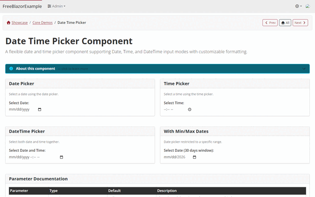
</a>
<br/>
<a href="screenshots/showcase-datetimepicker/full.webp"><strong>Date Time Picker</strong></a>
<br/><code>/showcase/datetimepicker</code><br/>
✅ 200 &nbsp;⏱ 17,622ms &nbsp;📦 69.3 MB &nbsp;🖥 ✅ 0 err

<details>
<summary>📋 Details</summary>

**ℹ️ About This Component**

**About this component**
What is it?

A type-aware date/time input that infers whether to render a date, time, or combined datetime picker from the TValue generic type parameter — supporting DateTime?, DateOnly?, and TimeOnly? — and handles UTC↔local conversion automatically.

ELI5: A date or time box that figures out what kind of value you need (just a date? just a time? both?) and shows the right calendar or clock without you having to configure it.

 Who uses it?
Developers binding form fields to DateTime, DateOnly, or TimeOnly model properties
Form builders that need consistent date entry across the app without copy-pasting format strings
Any page collecting appointment times, birth dates, or event timestamps
 When to use it?

✓ Use when:

Any form field bound to a date or time C# type
Scheduling inputs where MinDate/MaxDate constraints need to be enforced
Forms where the server stores UTC but the UI should show local time

✗ Not for:

Inline calendar month views (use the Calendar feature for that)
Date range pickers — this is a single-value input
 Why does it exist?

Native browser date inputs use different formats on different browsers and OSes, and don't understand C# nullable types. This wraps them into a consistent, strongly-typed Blazor component.

 Technical notes
Generic TValue parameter; the component determines input type = 'date', 'time', or 'datetime-local' at render time
UTC conversion: if ConvertToLocal=true, incoming UTC values are shifted to local before display and shifted back on change
Format parameter overrides the default display format string
Min/MaxDate enforced via the native min/max HTML attributes on the underlying input
 Quick facts
Layer	UI only
Persisted	No
Real-time	No
Auth required	No
Namespace	FreeBlazor

**Quick facts**
Layer	UI only
Persisted	No
Real-time	No
Auth required	No
Namespace	FreeBlazor
**📊 Metrics**

| Metric | Value |
|--------|-------|
| HTTP Status | 200 |
| Navigation | 290 ms |
| Full Load (incl. settle) | 17,622 ms |
| Network Requests | 305 |
| Data Transferred | 69.3 MB |
| JS Errors | 0 |
| JS Warnings | 0 |

<details>
<summary>🌐 Network (305 requests, 69.3 MB)</summary>

| Method | Status | Duration | Bytes | URL |
|--------|:------:|:--------:|------:|-----|
| GET | 200 | 246ms | 9.0 MB | `http://localhost:5201/_framework/MudBlazor.mwezwdoi15.wasm` |
| GET | 200 | 76ms | 6.5 MB | `…:5201/_framework/Microsoft.CodeAnalysis.CSharp.df8hfd5o8z.wasm` |
| GET | 200 | 16ms | 6.0 MB | `…1/_framework/Basic.Reference.Assemblies.Net100.v8tl2dqzst.wasm` |
| GET | 200 | 17ms | 4.6 MB | `…calhost:5201/_framework/System.Private.CoreLib.btnahqa3oa.wasm` |
| GET | 200 | 2ms | 3.5 MB | `…t/BlazorMonaco/lib/monaco-editor/min/vs/editor.api-i0YVFWkl.js` |
| GET | 200 | 255ms | 3.0 MB | `…//localhost:5201/_framework/System.Private.Xml.c86ifkdlwh.wasm` |
| GET | 200 | 18ms | 2.9 MB | `…calhost:5201/_framework/Microsoft.CodeAnalysis.erp1n29u9n.wasm` |
| GET | 200 | 16ms | 2.9 MB | `http://localhost:5201/_framework/dotnet.native.imnhyiqpc9.wasm` |
| GET | 200 | 75ms | 2.4 MB | `http://localhost:5201/_framework/Radzen.Blazor.x7olzc7yc0.wasm` |
| GET | 200 | 274ms | 1.4 MB | `…lhost:5201/_framework/FreeBlazorExample.Client.n18ukcy7q5.wasm` |
| GET | 200 | 71ms | 1.0 MB | `…201/_content/Radzen.Blazor/fonts/MaterialSymbolsOutlined.woff2` |
| GET | 200 | 244ms | 984.3 KB | `…//localhost:5201/_framework/System.Data.Common.cp5bttdxwa.wasm` |
| GET | 200 | 17ms | 914.3 KB | `http://localhost:5201/_framework/BlazorBootstrap.zo6lifkmy7.wasm` |
| GET | 200 | 254ms | 829.3 KB | `…ework/System.Private.DataContractSerialization.yjhmavq6w2.wasm` |
| GET | 200 | 17ms | 788.2 KB | `…alhost:5201/_framework/FreeBlazorExample.Client.3ivhmqjexl.pdb` |
| … | … | … | … | *290 more* |

</details>

<details>
<summary>🖥 Console Info (1 messages)</summary>

```
[info] Debugging hotkey: Shift+Alt+D (when application has focus)
```

</details>

</details>

</td>
<td align="center" valign="top" width="33%">
<a href="screenshots/showcase-deleteconfirmation/full.webp">
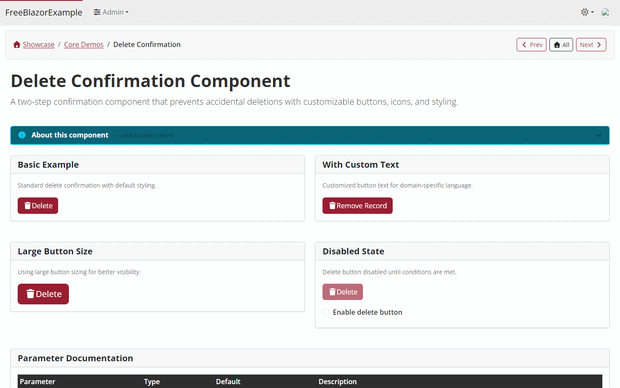
</a>
<br/>
<a href="screenshots/showcase-deleteconfirmation/full.webp"><strong>Delete Confirmation</strong></a>
<br/><code>/showcase/deleteconfirmation</code><br/>
✅ 200 &nbsp;⏱ 17,543ms &nbsp;📦 69.3 MB &nbsp;🖥 ✅ 0 err

<details>
<summary>📋 Details</summary>

**ℹ️ About This Component**

**About this component**
What is it?

A two-stage UI control: an initial Delete button that transitions to a Confirm/Cancel pair on first click, preventing accidental data deletion with zero boilerplate inline logic on the calling page.

ELI5: A delete button that asks 'are you sure?' before actually deleting — so a misclick never wipes out real data.

 Who uses it?
Any CRUD list or detail page that has a delete action
Form builders who want safe delete without writing the two-step state logic themselves every time
UX designers standardising destructive-action patterns across the app
 When to use it?

✓ Use when:

List rows with a delete button next to each record
Detail pages with a 'Delete this record' action
Any destructive action where an accidental click would have lasting consequences

✗ Not for:

Bulk-delete scenarios — a confirmation modal dialog is better for 'delete 47 records'
Non-destructive actions where undo is trivially available
 Why does it exist?

Single-click deletes cause support tickets and user frustration. Re-implementing the two-step state pattern on every page is repetitive and inconsistent. One component handles it everywhere.

 Technical notes
Internal _confirming bool toggles between the initial button and the confirm/cancel pair
OnConfirmed: EventCallback fired only after the second click — no value passed, just a signal
All three button texts (DeleteText, CancelText, ConfirmDeleteText), icon classes, and CSS button classes are Parameters
ButtonSize parameter maps to Bootstrap btn-sm/btn-lg; defaults to standard size
Disabled parameter blocks the initial click entirely (useful during async operations)
 Quick facts
Layer	UI only
Persisted	No
Real-time	No
Auth required	No
Namespace	FreeBlazor

**Quick facts**
Layer	UI only
Persisted	No
Real-time	No
Auth required	No
Namespace	FreeBlazor
**📊 Metrics**

| Metric | Value |
|--------|-------|
| HTTP Status | 200 |
| Navigation | 278 ms |
| Full Load (incl. settle) | 17,543 ms |
| Network Requests | 304 |
| Data Transferred | 69.3 MB |
| JS Errors | 0 |
| JS Warnings | 0 |

<details>
<summary>🌐 Network (304 requests, 69.3 MB)</summary>

| Method | Status | Duration | Bytes | URL |
|--------|:------:|:--------:|------:|-----|
| GET | 200 | 284ms | 9.0 MB | `http://localhost:5201/_framework/MudBlazor.mwezwdoi15.wasm` |
| GET | 200 | 282ms | 6.5 MB | `…:5201/_framework/Microsoft.CodeAnalysis.CSharp.df8hfd5o8z.wasm` |
| GET | 200 | 16ms | 6.0 MB | `…1/_framework/Basic.Reference.Assemblies.Net100.v8tl2dqzst.wasm` |
| GET | 200 | 15ms | 4.6 MB | `…calhost:5201/_framework/System.Private.CoreLib.btnahqa3oa.wasm` |
| GET | 200 | 2ms | 3.5 MB | `…t/BlazorMonaco/lib/monaco-editor/min/vs/editor.api-i0YVFWkl.js` |
| GET | 200 | 238ms | 3.0 MB | `…//localhost:5201/_framework/System.Private.Xml.c86ifkdlwh.wasm` |
| GET | 200 | 58ms | 2.9 MB | `…calhost:5201/_framework/Microsoft.CodeAnalysis.erp1n29u9n.wasm` |
| GET | 200 | 17ms | 2.9 MB | `http://localhost:5201/_framework/dotnet.native.imnhyiqpc9.wasm` |
| GET | 200 | 56ms | 2.4 MB | `http://localhost:5201/_framework/Radzen.Blazor.x7olzc7yc0.wasm` |
| GET | 200 | 243ms | 1.4 MB | `…lhost:5201/_framework/FreeBlazorExample.Client.n18ukcy7q5.wasm` |
| GET | 200 | 61ms | 1.0 MB | `…201/_content/Radzen.Blazor/fonts/MaterialSymbolsOutlined.woff2` |
| GET | 200 | 67ms | 984.3 KB | `…//localhost:5201/_framework/System.Data.Common.cp5bttdxwa.wasm` |
| GET | 200 | 16ms | 914.3 KB | `http://localhost:5201/_framework/BlazorBootstrap.zo6lifkmy7.wasm` |
| GET | 200 | 239ms | 829.3 KB | `…ework/System.Private.DataContractSerialization.yjhmavq6w2.wasm` |
| GET | 200 | 16ms | 788.2 KB | `…alhost:5201/_framework/FreeBlazorExample.Client.3ivhmqjexl.pdb` |
| … | … | … | … | *289 more* |

</details>

<details>
<summary>🖥 Console Info (1 messages)</summary>

```
[info] Debugging hotkey: Shift+Alt+D (when application has focus)
```

</details>

</details>

</td>
<td align="center" valign="top" width="33%">
<a href="screenshots/showcase-getinput/full.webp">
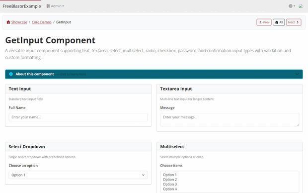
</a>
<br/>
<a href="screenshots/showcase-getinput/full.webp"><strong>Get Input</strong></a>
<br/><code>/showcase/getinput</code><br/>
✅ 200 &nbsp;⏱ 17,490ms &nbsp;📦 69.3 MB &nbsp;🖥 ✅ 0 err

<details>
<summary>📋 Details</summary>

**ℹ️ About This Component**

**About this component**
What is it?

A single Blazor component that renders any of 9 input types — text, textarea, select, multi-select, radio, checkbox, password, email, number — based on the InputType parameter, with a uniform Value/OnChange binding contract.

ELI5: One component that can be any kind of input box — text field, dropdown, checkboxes, password, number — just by changing one parameter. No need to remember different markup for each type.

 Who uses it?
Developers building inline edit UX or quick-input dialogs where the field type varies
Form generators that need to map a field type enum to a rendered input without a giant switch statement
Any page that needs a consistent label + input + validation layout regardless of input type
 When to use it?

✓ Use when:

Inline edit controls where the type is determined at runtime
Modal dialogs asking for a single value (GetInput in a dialog pattern)
Dynamic form sections where field types come from configuration

✗ Not for:

Full structured forms with many fields — use individual form controls for readability
The FeatureDynamicForms builder, which already uses this internally
 Why does it exist?

Switching input types across a form requires memorising different HTML elements and Blazor binding patterns. This unifies them under one component so adding a new field type is a one-parameter change.

 Technical notes
InputType enum: Text, Textarea, Select, MultiSelect, Radio, Checkbox, Password, Email, Number
Options parameter (List<string>) used by Select, MultiSelect, Radio, Checkbox — ignored by scalar types
Value is always string; multi-value types serialize to comma-separated strings
Rows parameter only applied when InputType=Textarea
Required parameter adds the native HTML required attribute and a visual RequiredIndicator marker
 Quick facts
Layer	UI only
Persisted	No
Real-time	No
Auth required	No
Namespace	FreeBlazor

**Quick facts**
Layer	UI only
Persisted	No
Real-time	No
Auth required	No
Namespace	FreeBlazor
**📊 Metrics**

| Metric | Value |
|--------|-------|
| HTTP Status | 200 |
| Navigation | 257 ms |
| Full Load (incl. settle) | 17,490 ms |
| Network Requests | 312 |
| Data Transferred | 69.3 MB |
| JS Errors | 0 |
| JS Warnings | 0 |

<details>
<summary>🌐 Network (312 requests, 69.3 MB)</summary>

| Method | Status | Duration | Bytes | URL |
|--------|:------:|:--------:|------:|-----|
| GET | 200 | 314ms | 9.0 MB | `http://localhost:5201/_framework/MudBlazor.mwezwdoi15.wasm` |
| GET | 200 | 314ms | 6.5 MB | `…:5201/_framework/Microsoft.CodeAnalysis.CSharp.df8hfd5o8z.wasm` |
| GET | 200 | 17ms | 6.0 MB | `…1/_framework/Basic.Reference.Assemblies.Net100.v8tl2dqzst.wasm` |
| GET | 200 | 16ms | 4.6 MB | `…calhost:5201/_framework/System.Private.CoreLib.btnahqa3oa.wasm` |
| GET | 200 | 2ms | 3.5 MB | `…t/BlazorMonaco/lib/monaco-editor/min/vs/editor.api-i0YVFWkl.js` |
| GET | 200 | 290ms | 3.0 MB | `…//localhost:5201/_framework/System.Private.Xml.c86ifkdlwh.wasm` |
| GET | 200 | 75ms | 2.9 MB | `…calhost:5201/_framework/Microsoft.CodeAnalysis.erp1n29u9n.wasm` |
| GET | 200 | 16ms | 2.9 MB | `http://localhost:5201/_framework/dotnet.native.imnhyiqpc9.wasm` |
| GET | 200 | 286ms | 2.4 MB | `http://localhost:5201/_framework/Radzen.Blazor.x7olzc7yc0.wasm` |
| GET | 200 | 290ms | 1.4 MB | `…lhost:5201/_framework/FreeBlazorExample.Client.n18ukcy7q5.wasm` |
| GET | 200 | 45ms | 1.0 MB | `…201/_content/Radzen.Blazor/fonts/MaterialSymbolsOutlined.woff2` |
| GET | 200 | 287ms | 984.3 KB | `…//localhost:5201/_framework/System.Data.Common.cp5bttdxwa.wasm` |
| GET | 200 | 17ms | 914.3 KB | `http://localhost:5201/_framework/BlazorBootstrap.zo6lifkmy7.wasm` |
| GET | 200 | 291ms | 829.3 KB | `…ework/System.Private.DataContractSerialization.yjhmavq6w2.wasm` |
| GET | 200 | 16ms | 788.2 KB | `…alhost:5201/_framework/FreeBlazorExample.Client.3ivhmqjexl.pdb` |
| … | … | … | … | *297 more* |

</details>

<details>
<summary>🖥 Console Info (1 messages)</summary>

```
[info] Debugging hotkey: Shift+Alt+D (when application has focus)
```

</details>

</details>

</td>
</tr>
<tr>
<td align="center" valign="top" width="33%">
<a href="screenshots/showcase-multiselect/full.webp">
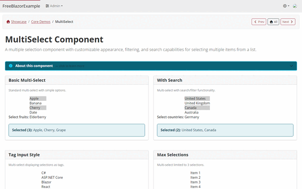
</a>
<br/>
<a href="screenshots/showcase-multiselect/full.webp"><strong>Multi Select</strong></a>
<br/><code>/showcase/multiselect</code><br/>
✅ 200 &nbsp;⏱ 17,364ms &nbsp;📦 69.3 MB &nbsp;🖥 ✅ 0 err

<details>
<summary>📋 Details</summary>

**ℹ️ About This Component**

**About this component**
What is it?

A multi-value selection control that binds to a List&lt;string&gt; and renders either as a tag-chip display, a searchable dropdown list, or an inline checkbox group — controlled by the DisplayMode parameter.

ELI5: A smarter version of the standard 'hold Ctrl to pick multiple' list box — shows your selections as colourful tags, has a search bar, and doesn't require any special keyboard tricks from the user.

 Who uses it?
Developers building filter UIs where multiple values can be selected simultaneously
Form builders adding tag, permission, or category selection to a record
Any page where the user needs to pick N items from a known list
 When to use it?

✓ Use when:

Filter bars (select multiple campuses, categories, statuses)
Permission or role assignment
Tagging and label selection on records

✗ Not for:

Single-value selection — use a plain <select> or GetInput with InputType=Select
Very large option lists (1000+ items) where server-side filtering is needed — use AutoComplete instead
 Why does it exist?

The native HTML multi-select requires Ctrl+click which almost no user knows about. This gives a self-explanatory UI with visible tag chips for selected values and an optional search filter.

 Technical notes
Binds to List<string> via Value / ValueChanged (two-way)
DisplayMode: Tags (chip badges), Dropdown (searchable list panel), Checkboxes (inline)
MaxSelections: if set, disables further selection once the limit is reached
Searchable=true adds a filter text input above the option list
DropdownDirection: Down/Up — useful when the control is near the bottom of the viewport
 Quick facts
Layer	UI only
Persisted	No
Real-time	No
Auth required	No
Namespace	FreeBlazor

**Quick facts**
Layer	UI only
Persisted	No
Real-time	No
Auth required	No
Namespace	FreeBlazor
**📊 Metrics**

| Metric | Value |
|--------|-------|
| HTTP Status | 200 |
| Navigation | 256 ms |
| Full Load (incl. settle) | 17,364 ms |
| Network Requests | 304 |
| Data Transferred | 69.3 MB |
| JS Errors | 0 |
| JS Warnings | 0 |

<details>
<summary>🌐 Network (304 requests, 69.3 MB)</summary>

| Method | Status | Duration | Bytes | URL |
|--------|:------:|:--------:|------:|-----|
| GET | 200 | 316ms | 9.0 MB | `http://localhost:5201/_framework/MudBlazor.mwezwdoi15.wasm` |
| GET | 200 | 304ms | 6.5 MB | `…:5201/_framework/Microsoft.CodeAnalysis.CSharp.df8hfd5o8z.wasm` |
| GET | 200 | 16ms | 6.0 MB | `…1/_framework/Basic.Reference.Assemblies.Net100.v8tl2dqzst.wasm` |
| GET | 200 | 16ms | 4.6 MB | `…calhost:5201/_framework/System.Private.CoreLib.btnahqa3oa.wasm` |
| GET | 200 | 2ms | 3.5 MB | `…t/BlazorMonaco/lib/monaco-editor/min/vs/editor.api-i0YVFWkl.js` |
| GET | 200 | 275ms | 3.0 MB | `…//localhost:5201/_framework/System.Private.Xml.c86ifkdlwh.wasm` |
| GET | 200 | 80ms | 2.9 MB | `…calhost:5201/_framework/Microsoft.CodeAnalysis.erp1n29u9n.wasm` |
| GET | 200 | 16ms | 2.9 MB | `http://localhost:5201/_framework/dotnet.native.imnhyiqpc9.wasm` |
| GET | 200 | 78ms | 2.4 MB | `http://localhost:5201/_framework/Radzen.Blazor.x7olzc7yc0.wasm` |
| GET | 200 | 277ms | 1.4 MB | `…lhost:5201/_framework/FreeBlazorExample.Client.n18ukcy7q5.wasm` |
| GET | 200 | 43ms | 1.0 MB | `…201/_content/Radzen.Blazor/fonts/MaterialSymbolsOutlined.woff2` |
| GET | 200 | 276ms | 984.3 KB | `…//localhost:5201/_framework/System.Data.Common.cp5bttdxwa.wasm` |
| GET | 200 | 17ms | 914.3 KB | `http://localhost:5201/_framework/BlazorBootstrap.zo6lifkmy7.wasm` |
| GET | 200 | 275ms | 829.3 KB | `…ework/System.Private.DataContractSerialization.yjhmavq6w2.wasm` |
| GET | 200 | 16ms | 788.2 KB | `…alhost:5201/_framework/FreeBlazorExample.Client.3ivhmqjexl.pdb` |
| … | … | … | … | *289 more* |

</details>

<details>
<summary>🖥 Console Info (1 messages)</summary>

```
[info] Debugging hotkey: Shift+Alt+D (when application has focus)
```

</details>

</details>

</td>
<td align="center" valign="top" width="33%">
<a href="screenshots/showcase-pagedrecordset/full.webp">
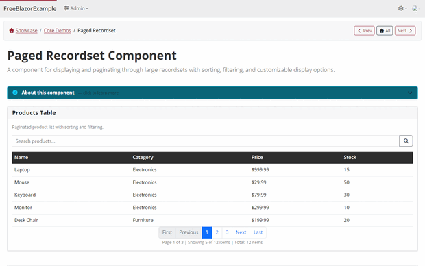
</a>
<br/>
<a href="screenshots/showcase-pagedrecordset/full.webp"><strong>Paged Recordset</strong></a>
<br/><code>/showcase/pagedrecordset</code><br/>
✅ 200 &nbsp;⏱ 17,547ms &nbsp;📦 69.3 MB &nbsp;🖥 ✅ 0 err

<details>
<summary>📋 Details</summary>

**ℹ️ About This Component**

**About this component**
What is it?

A generic paginated table component that accepts a List&lt;T&gt; data source plus column definitions and handles client-side sorting, page navigation, and row-level action callbacks — with optional server-side paging via an async fetch delegate.

ELI5: A data table that only shows one page of results at a time and lets you click column headers to sort — so even a list of 50 000 records feels fast and manageable.

 Who uses it?
Developers building any admin list view (users, records, reports)
Anyone replacing a raw HTML table that loads all rows upfront and makes the page slow
Pages that need sortable columns without writing sort logic for each one
 When to use it?

✓ Use when:

Any list of records that could grow beyond ~20 rows
Admin tables where sortable columns and row actions are needed
Reports where the user filters down to a subset and pages through results

✗ Not for:

Small static tables (≤10 rows) — the pagination chrome adds visual noise without benefit
Read-only display tables where interaction is not needed — a plain <table> is lighter
 Why does it exist?

Every list page ends up needing the same pagination logic, sort indicators, and page-size selector. Building it once in a component eliminates that repetition and ensures consistent UX across the app.

 Technical notes
Column definitions passed as ColumnDefinition list — specifies header, field accessor, sort key, and optional cell formatter
Client-side paging: all data loaded once, component slices the page window
Server-side paging: provide an async FetchData(PageNumber, PageSize, SortColumn, SortDir) delegate; component calls it on navigation
CheckboxColumn=true adds a selection column; selected items exposed via SelectedItems parameter
ExtraRowData: optional RenderFragment<T> shown in an expanded row below the main row
 Quick facts
Layer	UI only
Persisted	No
Real-time	No
Auth required	No
Namespace	FreeBlazor

**Quick facts**
Layer	UI only
Persisted	No
Real-time	No
Auth required	No
Namespace	FreeBlazor
**📊 Metrics**

| Metric | Value |
|--------|-------|
| HTTP Status | 200 |
| Navigation | 255 ms |
| Full Load (incl. settle) | 17,547 ms |
| Network Requests | 305 |
| Data Transferred | 69.3 MB |
| JS Errors | 0 |
| JS Warnings | 0 |

<details>
<summary>🌐 Network (305 requests, 69.3 MB)</summary>

| Method | Status | Duration | Bytes | URL |
|--------|:------:|:--------:|------:|-----|
| GET | 200 | 304ms | 9.0 MB | `http://localhost:5201/_framework/MudBlazor.mwezwdoi15.wasm` |
| GET | 200 | 300ms | 6.5 MB | `…:5201/_framework/Microsoft.CodeAnalysis.CSharp.df8hfd5o8z.wasm` |
| GET | 200 | 14ms | 6.0 MB | `…1/_framework/Basic.Reference.Assemblies.Net100.v8tl2dqzst.wasm` |
| GET | 200 | 15ms | 4.6 MB | `…calhost:5201/_framework/System.Private.CoreLib.btnahqa3oa.wasm` |
| GET | 200 | 2ms | 3.5 MB | `…t/BlazorMonaco/lib/monaco-editor/min/vs/editor.api-i0YVFWkl.js` |
| GET | 200 | 277ms | 3.0 MB | `…//localhost:5201/_framework/System.Private.Xml.c86ifkdlwh.wasm` |
| GET | 200 | 73ms | 2.9 MB | `…calhost:5201/_framework/Microsoft.CodeAnalysis.erp1n29u9n.wasm` |
| GET | 200 | 15ms | 2.9 MB | `http://localhost:5201/_framework/dotnet.native.imnhyiqpc9.wasm` |
| GET | 200 | 271ms | 2.4 MB | `http://localhost:5201/_framework/Radzen.Blazor.x7olzc7yc0.wasm` |
| GET | 200 | 287ms | 1.4 MB | `…lhost:5201/_framework/FreeBlazorExample.Client.n18ukcy7q5.wasm` |
| GET | 200 | 45ms | 1.0 MB | `…201/_content/Radzen.Blazor/fonts/MaterialSymbolsOutlined.woff2` |
| GET | 200 | 273ms | 984.3 KB | `…//localhost:5201/_framework/System.Data.Common.cp5bttdxwa.wasm` |
| GET | 200 | 15ms | 914.3 KB | `http://localhost:5201/_framework/BlazorBootstrap.zo6lifkmy7.wasm` |
| GET | 200 | 276ms | 829.3 KB | `…ework/System.Private.DataContractSerialization.yjhmavq6w2.wasm` |
| GET | 200 | 14ms | 788.2 KB | `…alhost:5201/_framework/FreeBlazorExample.Client.3ivhmqjexl.pdb` |
| … | … | … | … | *290 more* |

</details>

<details>
<summary>🖥 Console Info (1 messages)</summary>

```
[info] Debugging hotkey: Shift+Alt+D (when application has focus)
```

</details>

</details>

</td>
<td align="center" valign="top" width="33%">
<a href="screenshots/showcase-stringlist/full.webp">
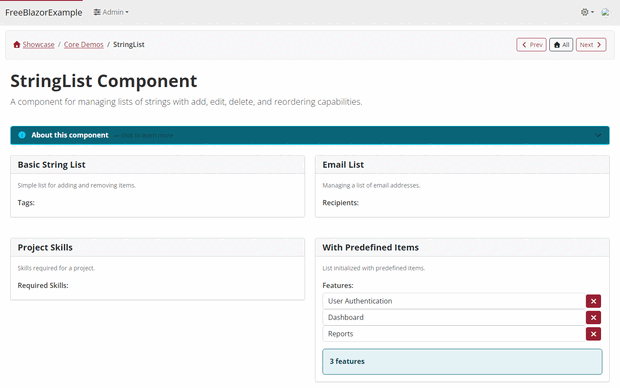
</a>
<br/>
<a href="screenshots/showcase-stringlist/full.webp"><strong>String List</strong></a>
<br/><code>/showcase/stringlist</code><br/>
✅ 200 &nbsp;⏱ 17,588ms &nbsp;📦 69.3 MB &nbsp;🖥 ✅ 0 err

<details>
<summary>📋 Details</summary>

**ℹ️ About This Component**

**About this component**
What is it?

A bound List&lt;string&gt; editor that renders the current items with per-item edit and delete buttons, an add-new text input at the bottom, and optional drag-to-reorder — all backed by a two-way Value/ValueChanged binding.

ELI5: A simple component that lets users manage a list of text entries — add new ones, edit or delete existing ones, and drag to reorder — without writing any list-management code yourself.

 Who uses it?
Form builders adding open-ended list fields (required skills, allowed domains, tags)
Config screens where an admin maintains a list of values (email allowlists, keywords, menu items)
Developers who would otherwise write add/remove/edit list logic inline on every page it's needed
 When to use it?

✓ Use when:

Any form field that holds a variable-length list of strings
Settings screens for maintaining lists of values (IP allowlists, email recipients, categories)
Content editors where items need to be reordered

✗ Not for:

Selecting from a fixed option set — use MultiSelect
Structured list items with multiple fields (not just a string) — build a dedicated list component
 Why does it exist?

Every project eventually needs a 'manage a list of strings' UI. Building add/edit/delete/reorder from scratch each time is boilerplate. This packages the pattern once with consistent keyboard and accessibility behaviour.

 Technical notes
Binds to List<string> via Value / ValueChanged; internal copy is maintained, parent notified on every mutation
AllowEdit=false hides the per-item edit button; AllowDelete=false hides delete; AllowSort=false hides drag handles
MaxItems caps the list length; the add input is disabled once the cap is reached
MinLength/MaxLength enforce per-item string validation before the item is committed to the list
FocusFirst() and FocusLast() public methods allow programmatic focus from the parent page
 Quick facts
Layer	UI only
Persisted	No
Real-time	No
Auth required	No
Namespace	FreeBlazor

**Quick facts**
Layer	UI only
Persisted	No
Real-time	No
Auth required	No
Namespace	FreeBlazor
**📊 Metrics**

| Metric | Value |
|--------|-------|
| HTTP Status | 200 |
| Navigation | 223 ms |
| Full Load (incl. settle) | 17,588 ms |
| Network Requests | 304 |
| Data Transferred | 69.3 MB |
| JS Errors | 0 |
| JS Warnings | 0 |

<details>
<summary>🌐 Network (304 requests, 69.3 MB)</summary>

| Method | Status | Duration | Bytes | URL |
|--------|:------:|:--------:|------:|-----|
| GET | 200 | 299ms | 9.0 MB | `http://localhost:5201/_framework/MudBlazor.mwezwdoi15.wasm` |
| GET | 200 | 286ms | 6.5 MB | `…:5201/_framework/Microsoft.CodeAnalysis.CSharp.df8hfd5o8z.wasm` |
| GET | 200 | 27ms | 6.0 MB | `…1/_framework/Basic.Reference.Assemblies.Net100.v8tl2dqzst.wasm` |
| GET | 200 | 26ms | 4.6 MB | `…calhost:5201/_framework/System.Private.CoreLib.btnahqa3oa.wasm` |
| GET | 200 | 5ms | 3.5 MB | `…t/BlazorMonaco/lib/monaco-editor/min/vs/editor.api-i0YVFWkl.js` |
| GET | 200 | 274ms | 3.0 MB | `…//localhost:5201/_framework/System.Private.Xml.c86ifkdlwh.wasm` |
| GET | 200 | 276ms | 2.9 MB | `…calhost:5201/_framework/Microsoft.CodeAnalysis.erp1n29u9n.wasm` |
| GET | 200 | 43ms | 2.9 MB | `http://localhost:5201/_framework/dotnet.native.imnhyiqpc9.wasm` |
| GET | 200 | 275ms | 2.4 MB | `http://localhost:5201/_framework/Radzen.Blazor.x7olzc7yc0.wasm` |
| GET | 200 | 272ms | 1.4 MB | `…lhost:5201/_framework/FreeBlazorExample.Client.n18ukcy7q5.wasm` |
| GET | 200 | 56ms | 1.0 MB | `…201/_content/Radzen.Blazor/fonts/MaterialSymbolsOutlined.woff2` |
| GET | 200 | 275ms | 984.3 KB | `…//localhost:5201/_framework/System.Data.Common.cp5bttdxwa.wasm` |
| GET | 200 | 27ms | 914.3 KB | `http://localhost:5201/_framework/BlazorBootstrap.zo6lifkmy7.wasm` |
| GET | 200 | 274ms | 829.3 KB | `…ework/System.Private.DataContractSerialization.yjhmavq6w2.wasm` |
| GET | 200 | 27ms | 788.2 KB | `…alhost:5201/_framework/FreeBlazorExample.Client.3ivhmqjexl.pdb` |
| … | … | … | … | *289 more* |

</details>

<details>
<summary>🖥 Console Info (1 messages)</summary>

```
[info] Debugging hotkey: Shift+Alt+D (when application has focus)
```

</details>

</details>

</td>
</tr>
<tr>
<td align="center" valign="top" width="33%">
<a href="screenshots/showcase-togglepassword/full.webp">
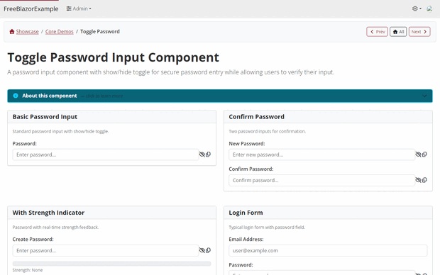
</a>
<br/>
<a href="screenshots/showcase-togglepassword/full.webp"><strong>Toggle Password</strong></a>
<br/><code>/showcase/togglepassword</code><br/>
✅ 200 &nbsp;⏱ 17,585ms &nbsp;📦 69.3 MB &nbsp;🖥 ✅ 0 err

<details>
<summary>📋 Details</summary>

**ℹ️ About This Component**

**About this component**
What is it?

A password input with an eye-icon toggle button that switches the underlying input between type='password' and type='text', plus an optional configurable strength indicator that evaluates entropy rules in real time.

ELI5: A password box with a little eye button — click it to check what you're typing without submitting it, so you catch typos before you lock yourself out.

 Who uses it?
Developers building any login, registration, or password-change form
UX designers standardising password entry across the app
Forms with a confirm-password field where users need to visually verify they typed the same thing twice
 When to use it?

✓ Use when:

Login forms, registration, password reset, and change-password screens
Any input of type password where user error on a mobile keyboard is likely
Forms that need to show password strength feedback during entry

✗ Not for:

Read-only masked display of a stored secret — use a different redaction pattern
API key display with copy-to-clipboard — a different UX is more appropriate there
 Why does it exist?

Users mistype passwords (especially on mobile) and then can't tell why login failed. The eye toggle costs nothing and saves support calls. Strength feedback during entry catches weak passwords before they're saved.

 Technical notes
Toggle implemented by switching the HTML input type attribute; no JS interop needed
ShowIcon and HideIcon parameters accept any icon class string for full design-system flexibility
Strength indicator (optional): evaluates length, uppercase, lowercase, digit, and special-char rules; maps to Weak/Fair/Good/Strong/Very Strong + Bootstrap progress-bar color
MinLength/MaxLength enforce constraints via native HTML attributes and optional Blazor validation
Disabled parameter disables both the input and the toggle button
 Quick facts
Layer	UI only
Persisted	No
Real-time	No
Auth required	No
Namespace	FreeBlazor

**Quick facts**
Layer	UI only
Persisted	No
Real-time	No
Auth required	No
Namespace	FreeBlazor
**📊 Metrics**

| Metric | Value |
|--------|-------|
| HTTP Status | 200 |
| Navigation | 267 ms |
| Full Load (incl. settle) | 17,585 ms |
| Network Requests | 311 |
| Data Transferred | 69.3 MB |
| JS Errors | 0 |
| JS Warnings | 0 |

<details>
<summary>🌐 Network (311 requests, 69.3 MB)</summary>

| Method | Status | Duration | Bytes | URL |
|--------|:------:|:--------:|------:|-----|
| GET | 200 | 262ms | 9.0 MB | `http://localhost:5201/_framework/MudBlazor.mwezwdoi15.wasm` |
| GET | 200 | 85ms | 6.5 MB | `…:5201/_framework/Microsoft.CodeAnalysis.CSharp.df8hfd5o8z.wasm` |
| GET | 200 | 17ms | 6.0 MB | `…1/_framework/Basic.Reference.Assemblies.Net100.v8tl2dqzst.wasm` |
| GET | 200 | 16ms | 4.6 MB | `…calhost:5201/_framework/System.Private.CoreLib.btnahqa3oa.wasm` |
| GET | 200 | 2ms | 3.5 MB | `…t/BlazorMonaco/lib/monaco-editor/min/vs/editor.api-i0YVFWkl.js` |
| GET | 200 | 258ms | 3.0 MB | `…//localhost:5201/_framework/System.Private.Xml.c86ifkdlwh.wasm` |
| GET | 200 | 18ms | 2.9 MB | `…calhost:5201/_framework/Microsoft.CodeAnalysis.erp1n29u9n.wasm` |
| GET | 200 | 15ms | 2.9 MB | `http://localhost:5201/_framework/dotnet.native.imnhyiqpc9.wasm` |
| GET | 200 | 252ms | 2.4 MB | `http://localhost:5201/_framework/Radzen.Blazor.x7olzc7yc0.wasm` |
| GET | 200 | 276ms | 1.4 MB | `…lhost:5201/_framework/FreeBlazorExample.Client.n18ukcy7q5.wasm` |
| GET | 200 | 46ms | 1.0 MB | `…201/_content/Radzen.Blazor/fonts/MaterialSymbolsOutlined.woff2` |
| GET | 200 | 254ms | 984.3 KB | `…//localhost:5201/_framework/System.Data.Common.cp5bttdxwa.wasm` |
| GET | 200 | 17ms | 914.3 KB | `http://localhost:5201/_framework/BlazorBootstrap.zo6lifkmy7.wasm` |
| GET | 200 | 258ms | 829.3 KB | `…ework/System.Private.DataContractSerialization.yjhmavq6w2.wasm` |
| GET | 200 | 16ms | 788.2 KB | `…alhost:5201/_framework/FreeBlazorExample.Client.3ivhmqjexl.pdb` |
| … | … | … | … | *296 more* |

</details>

<details>
<summary>🖥 Console Info (1 messages)</summary>

```
[info] Debugging hotkey: Shift+Alt+D (when application has focus)
```

</details>

</details>

</td>
<td align="center" valign="top" width="33%">
<a href="screenshots/showcase-github-repo/full.webp">
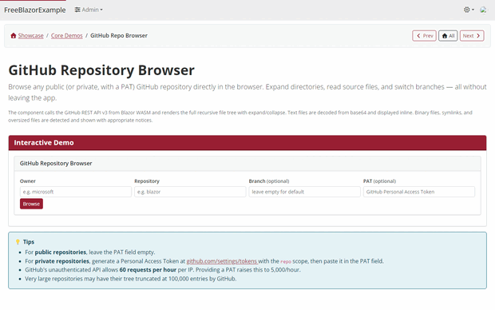
</a>
<br/>
<a href="screenshots/showcase-github-repo/full.webp"><strong>GitHub Repo Browser</strong></a>
<br/><code>/showcase/github-repo</code><br/>
✅ 200 &nbsp;⏱ 17,761ms &nbsp;📦 69.2 MB &nbsp;🖥 ✅ 0 err

<details>
<summary>📋 Details</summary>

**GitHub Repository Browser**

**📊 Metrics**

| Metric | Value |
|--------|-------|
| HTTP Status | 200 |
| Navigation | 264 ms |
| Full Load (incl. settle) | 17,761 ms |
| Network Requests | 303 |
| Data Transferred | 69.2 MB |
| JS Errors | 0 |
| JS Warnings | 0 |

<details>
<summary>🌐 Network (303 requests, 69.2 MB)</summary>

| Method | Status | Duration | Bytes | URL |
|--------|:------:|:--------:|------:|-----|
| GET | 200 | 301ms | 9.0 MB | `http://localhost:5201/_framework/MudBlazor.mwezwdoi15.wasm` |
| GET | 200 | 291ms | 6.5 MB | `…:5201/_framework/Microsoft.CodeAnalysis.CSharp.df8hfd5o8z.wasm` |
| GET | 200 | 16ms | 6.0 MB | `…1/_framework/Basic.Reference.Assemblies.Net100.v8tl2dqzst.wasm` |
| GET | 200 | 15ms | 4.6 MB | `…calhost:5201/_framework/System.Private.CoreLib.btnahqa3oa.wasm` |
| GET | 200 | 2ms | 3.5 MB | `…t/BlazorMonaco/lib/monaco-editor/min/vs/editor.api-i0YVFWkl.js` |
| GET | 200 | 259ms | 3.0 MB | `…//localhost:5201/_framework/System.Private.Xml.c86ifkdlwh.wasm` |
| GET | 200 | 84ms | 2.9 MB | `…calhost:5201/_framework/Microsoft.CodeAnalysis.erp1n29u9n.wasm` |
| GET | 200 | 15ms | 2.9 MB | `http://localhost:5201/_framework/dotnet.native.imnhyiqpc9.wasm` |
| GET | 200 | 83ms | 2.4 MB | `http://localhost:5201/_framework/Radzen.Blazor.x7olzc7yc0.wasm` |
| GET | 200 | 262ms | 1.4 MB | `…lhost:5201/_framework/FreeBlazorExample.Client.n18ukcy7q5.wasm` |
| GET | 200 | 48ms | 1.0 MB | `…201/_content/Radzen.Blazor/fonts/MaterialSymbolsOutlined.woff2` |
| GET | 200 | 260ms | 984.3 KB | `…//localhost:5201/_framework/System.Data.Common.cp5bttdxwa.wasm` |
| GET | 200 | 16ms | 914.3 KB | `http://localhost:5201/_framework/BlazorBootstrap.zo6lifkmy7.wasm` |
| GET | 200 | 259ms | 829.3 KB | `…ework/System.Private.DataContractSerialization.yjhmavq6w2.wasm` |
| GET | 200 | 16ms | 788.2 KB | `…alhost:5201/_framework/FreeBlazorExample.Client.3ivhmqjexl.pdb` |
| … | … | … | … | *288 more* |

</details>

<details>
<summary>🖥 Console Info (1 messages)</summary>

```
[info] Debugging hotkey: Shift+Alt+D (when application has focus)
```

</details>

</details>

</td>
<td align="center" valign="top" width="33%">
<a href="screenshots/showcase-generic-git/full.webp">
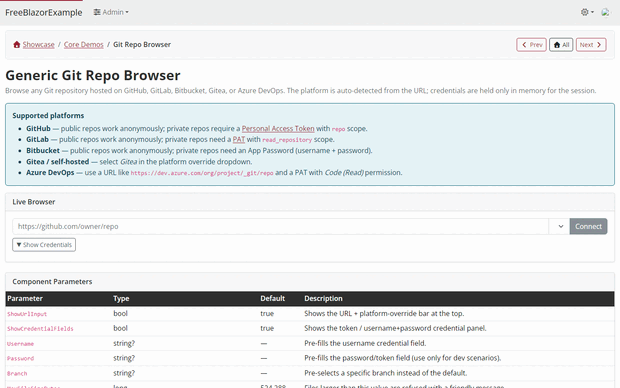
</a>
<br/>
<a href="screenshots/showcase-generic-git/full.webp"><strong>Git Repo Browser</strong></a>
<br/><code>/showcase/generic-git</code><br/>
✅ 200 &nbsp;⏱ 17,606ms &nbsp;📦 68.5 MB &nbsp;🖥 ✅ 0 err

<details>
<summary>📋 Details</summary>

**📊 Metrics**

| Metric | Value |
|--------|-------|
| HTTP Status | 200 |
| Navigation | 240 ms |
| Full Load (incl. settle) | 17,606 ms |
| Network Requests | 303 |
| Data Transferred | 68.5 MB |
| JS Errors | 0 |
| JS Warnings | 0 |

<details>
<summary>🌐 Network (303 requests, 68.5 MB)</summary>

| Method | Status | Duration | Bytes | URL |
|--------|:------:|:--------:|------:|-----|
| GET | 200 | 306ms | 9.0 MB | `http://localhost:5201/_framework/MudBlazor.mwezwdoi15.wasm` |
| GET | 200 | 308ms | 6.5 MB | `…:5201/_framework/Microsoft.CodeAnalysis.CSharp.df8hfd5o8z.wasm` |
| GET | 200 | 18ms | 6.0 MB | `…1/_framework/Basic.Reference.Assemblies.Net100.v8tl2dqzst.wasm` |
| GET | 200 | 19ms | 4.6 MB | `…calhost:5201/_framework/System.Private.CoreLib.btnahqa3oa.wasm` |
| GET | 200 | 1ms | 3.5 MB | `…t/BlazorMonaco/lib/monaco-editor/min/vs/editor.api-i0YVFWkl.js` |
| GET | 200 | 275ms | 3.0 MB | `…//localhost:5201/_framework/System.Private.Xml.c86ifkdlwh.wasm` |
| GET | 200 | 92ms | 2.9 MB | `…calhost:5201/_framework/Microsoft.CodeAnalysis.erp1n29u9n.wasm` |
| GET | 200 | 16ms | 2.9 MB | `http://localhost:5201/_framework/dotnet.native.imnhyiqpc9.wasm` |
| GET | 200 | 269ms | 2.4 MB | `http://localhost:5201/_framework/Radzen.Blazor.x7olzc7yc0.wasm` |
| GET | 200 | 283ms | 1.4 MB | `…lhost:5201/_framework/FreeBlazorExample.Client.n18ukcy7q5.wasm` |
| GET | 200 | 55ms | 1.0 MB | `…201/_content/Radzen.Blazor/fonts/MaterialSymbolsOutlined.woff2` |
| GET | 200 | 271ms | 984.3 KB | `…//localhost:5201/_framework/System.Data.Common.cp5bttdxwa.wasm` |
| GET | 200 | 18ms | 914.3 KB | `http://localhost:5201/_framework/BlazorBootstrap.zo6lifkmy7.wasm` |
| GET | 200 | 275ms | 829.3 KB | `…ework/System.Private.DataContractSerialization.yjhmavq6w2.wasm` |
| GET | 200 | 17ms | 788.2 KB | `…alhost:5201/_framework/FreeBlazorExample.Client.3ivhmqjexl.pdb` |
| … | … | … | … | *288 more* |

</details>

<details>
<summary>🖥 Console Info (1 messages)</summary>

```
[info] Debugging hotkey: Shift+Alt+D (when application has focus)
```

</details>

</details>

</td>
</tr>
<tr>
<td align="center" valign="top" width="33%">
<a href="screenshots/showcase-smartsheet/full.webp">
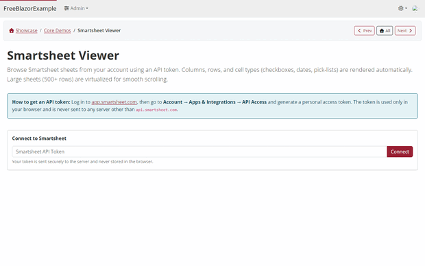
</a>
<br/>
<a href="screenshots/showcase-smartsheet/full.webp"><strong>Smartsheet Viewer</strong></a>
<br/><code>/showcase/smartsheet</code><br/>
✅ 200 &nbsp;⏱ 17,443ms &nbsp;📦 68.6 MB &nbsp;🖥 ✅ 0 err

<details>
<summary>📋 Details</summary>

**Smartsheet Viewer**

**📊 Metrics**

| Metric | Value |
|--------|-------|
| HTTP Status | 200 |
| Navigation | 228 ms |
| Full Load (incl. settle) | 17,443 ms |
| Network Requests | 305 |
| Data Transferred | 68.6 MB |
| JS Errors | 0 |
| JS Warnings | 0 |

<details>
<summary>🌐 Network (305 requests, 68.6 MB)</summary>

| Method | Status | Duration | Bytes | URL |
|--------|:------:|:--------:|------:|-----|
| GET | 200 | 311ms | 9.0 MB | `http://localhost:5201/_framework/MudBlazor.mwezwdoi15.wasm` |
| GET | 200 | 301ms | 6.5 MB | `…:5201/_framework/Microsoft.CodeAnalysis.CSharp.df8hfd5o8z.wasm` |
| GET | 200 | 20ms | 6.0 MB | `…1/_framework/Basic.Reference.Assemblies.Net100.v8tl2dqzst.wasm` |
| GET | 200 | 20ms | 4.6 MB | `…calhost:5201/_framework/System.Private.CoreLib.btnahqa3oa.wasm` |
| GET | 200 | 2ms | 3.5 MB | `…t/BlazorMonaco/lib/monaco-editor/min/vs/editor.api-i0YVFWkl.js` |
| GET | 200 | 270ms | 3.0 MB | `…//localhost:5201/_framework/System.Private.Xml.c86ifkdlwh.wasm` |
| GET | 200 | 273ms | 2.9 MB | `…calhost:5201/_framework/Microsoft.CodeAnalysis.erp1n29u9n.wasm` |
| GET | 200 | 17ms | 2.9 MB | `http://localhost:5201/_framework/dotnet.native.imnhyiqpc9.wasm` |
| GET | 200 | 272ms | 2.4 MB | `http://localhost:5201/_framework/Radzen.Blazor.x7olzc7yc0.wasm` |
| GET | 200 | 274ms | 1.4 MB | `…lhost:5201/_framework/FreeBlazorExample.Client.n18ukcy7q5.wasm` |
| GET | 200 | 54ms | 1.0 MB | `…201/_content/Radzen.Blazor/fonts/MaterialSymbolsOutlined.woff2` |
| GET | 200 | 272ms | 984.3 KB | `…//localhost:5201/_framework/System.Data.Common.cp5bttdxwa.wasm` |
| GET | 200 | 20ms | 914.3 KB | `http://localhost:5201/_framework/BlazorBootstrap.zo6lifkmy7.wasm` |
| GET | 200 | 271ms | 829.3 KB | `…ework/System.Private.DataContractSerialization.yjhmavq6w2.wasm` |
| GET | 200 | 20ms | 788.2 KB | `…alhost:5201/_framework/FreeBlazorExample.Client.3ivhmqjexl.pdb` |
| … | … | … | … | *290 more* |

</details>

<details>
<summary>🖥 Console Info (1 messages)</summary>

```
[info] Debugging hotkey: Shift+Alt+D (when application has focus)
```

</details>

</details>

</td>
<td></td>
<td></td>
</tr>
</table>

---

## Tier 1 Variants

> 15 pages &nbsp;|&nbsp; ✅ 15 ok &nbsp;|&nbsp; 🔴 0 JS errors &nbsp;|&nbsp; 📦 1027.9 MB transferred

<table>
<tr>
<td align="center" valign="top" width="33%">
<a href="screenshots/showcase-signature-v1/full.webp">
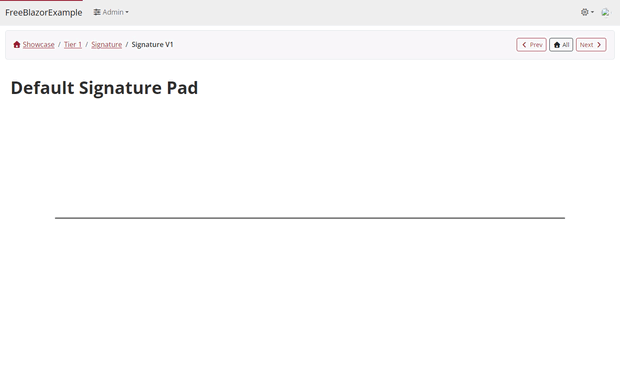
</a>
<br/>
<a href="screenshots/showcase-signature-v1/full.webp"><strong>Signature V1</strong></a>
<br/><code>/showcase/signature/v1</code><br/>
✅ 200 &nbsp;⏱ 17,443ms &nbsp;📦 68.5 MB &nbsp;🖥 ✅ 0 err

<details>
<summary>📋 Details</summary>

**Default Signature Pad**

**📊 Metrics**

| Metric | Value |
|--------|-------|
| HTTP Status | 200 |
| Navigation | 266 ms |
| Full Load (incl. settle) | 17,443 ms |
| Network Requests | 303 |
| Data Transferred | 68.5 MB |
| JS Errors | 0 |
| JS Warnings | 0 |

<details>
<summary>🌐 Network (303 requests, 68.5 MB)</summary>

| Method | Status | Duration | Bytes | URL |
|--------|:------:|:--------:|------:|-----|
| GET | 200 | 280ms | 9.0 MB | `http://localhost:5201/_framework/MudBlazor.mwezwdoi15.wasm` |
| GET | 200 | 280ms | 6.5 MB | `…:5201/_framework/Microsoft.CodeAnalysis.CSharp.df8hfd5o8z.wasm` |
| GET | 200 | 15ms | 6.0 MB | `…1/_framework/Basic.Reference.Assemblies.Net100.v8tl2dqzst.wasm` |
| GET | 200 | 16ms | 4.6 MB | `…calhost:5201/_framework/System.Private.CoreLib.btnahqa3oa.wasm` |
| GET | 200 | 2ms | 3.5 MB | `…t/BlazorMonaco/lib/monaco-editor/min/vs/editor.api-i0YVFWkl.js` |
| GET | 200 | 256ms | 3.0 MB | `…//localhost:5201/_framework/System.Private.Xml.c86ifkdlwh.wasm` |
| GET | 200 | 66ms | 2.9 MB | `…calhost:5201/_framework/Microsoft.CodeAnalysis.erp1n29u9n.wasm` |
| GET | 200 | 16ms | 2.9 MB | `http://localhost:5201/_framework/dotnet.native.imnhyiqpc9.wasm` |
| GET | 200 | 250ms | 2.4 MB | `http://localhost:5201/_framework/Radzen.Blazor.x7olzc7yc0.wasm` |
| GET | 200 | 261ms | 1.4 MB | `…lhost:5201/_framework/FreeBlazorExample.Client.n18ukcy7q5.wasm` |
| GET | 200 | 69ms | 1.0 MB | `…201/_content/Radzen.Blazor/fonts/MaterialSymbolsOutlined.woff2` |
| GET | 200 | 252ms | 984.3 KB | `…//localhost:5201/_framework/System.Data.Common.cp5bttdxwa.wasm` |
| GET | 200 | 15ms | 914.3 KB | `http://localhost:5201/_framework/BlazorBootstrap.zo6lifkmy7.wasm` |
| GET | 200 | 255ms | 829.3 KB | `…ework/System.Private.DataContractSerialization.yjhmavq6w2.wasm` |
| GET | 200 | 16ms | 788.2 KB | `…alhost:5201/_framework/FreeBlazorExample.Client.3ivhmqjexl.pdb` |
| … | … | … | … | *288 more* |

</details>

<details>
<summary>🖥 Console Info (1 messages)</summary>

```
[info] Debugging hotkey: Shift+Alt+D (when application has focus)
```

</details>

</details>

</td>
<td align="center" valign="top" width="33%">
<a href="screenshots/showcase-signature-v2/full.webp">
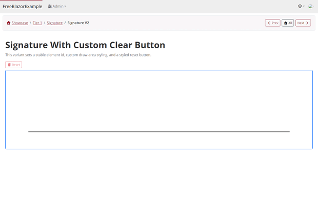
</a>
<br/>
<a href="screenshots/showcase-signature-v2/full.webp"><strong>Signature V2</strong></a>
<br/><code>/showcase/signature/v2</code><br/>
✅ 200 &nbsp;⏱ 17,359ms &nbsp;📦 68.5 MB &nbsp;🖥 ✅ 0 err

<details>
<summary>📋 Details</summary>

**Signature With Custom Clear Button**

**📊 Metrics**

| Metric | Value |
|--------|-------|
| HTTP Status | 200 |
| Navigation | 264 ms |
| Full Load (incl. settle) | 17,359 ms |
| Network Requests | 303 |
| Data Transferred | 68.5 MB |
| JS Errors | 0 |
| JS Warnings | 0 |

<details>
<summary>🌐 Network (303 requests, 68.5 MB)</summary>

| Method | Status | Duration | Bytes | URL |
|--------|:------:|:--------:|------:|-----|
| GET | 200 | 298ms | 9.0 MB | `http://localhost:5201/_framework/MudBlazor.mwezwdoi15.wasm` |
| GET | 200 | 287ms | 6.5 MB | `…:5201/_framework/Microsoft.CodeAnalysis.CSharp.df8hfd5o8z.wasm` |
| GET | 200 | 16ms | 6.0 MB | `…1/_framework/Basic.Reference.Assemblies.Net100.v8tl2dqzst.wasm` |
| GET | 200 | 16ms | 4.6 MB | `…calhost:5201/_framework/System.Private.CoreLib.btnahqa3oa.wasm` |
| GET | 200 | 2ms | 3.5 MB | `…t/BlazorMonaco/lib/monaco-editor/min/vs/editor.api-i0YVFWkl.js` |
| GET | 200 | 266ms | 3.0 MB | `…//localhost:5201/_framework/System.Private.Xml.c86ifkdlwh.wasm` |
| GET | 200 | 89ms | 2.9 MB | `…calhost:5201/_framework/Microsoft.CodeAnalysis.erp1n29u9n.wasm` |
| GET | 200 | 17ms | 2.9 MB | `http://localhost:5201/_framework/dotnet.native.imnhyiqpc9.wasm` |
| GET | 200 | 89ms | 2.4 MB | `http://localhost:5201/_framework/Radzen.Blazor.x7olzc7yc0.wasm` |
| GET | 200 | 267ms | 1.4 MB | `…lhost:5201/_framework/FreeBlazorExample.Client.n18ukcy7q5.wasm` |
| GET | 200 | 61ms | 1.0 MB | `…201/_content/Radzen.Blazor/fonts/MaterialSymbolsOutlined.woff2` |
| GET | 200 | 266ms | 984.3 KB | `…//localhost:5201/_framework/System.Data.Common.cp5bttdxwa.wasm` |
| GET | 200 | 16ms | 914.3 KB | `http://localhost:5201/_framework/BlazorBootstrap.zo6lifkmy7.wasm` |
| GET | 200 | 266ms | 829.3 KB | `…ework/System.Private.DataContractSerialization.yjhmavq6w2.wasm` |
| GET | 200 | 16ms | 788.2 KB | `…alhost:5201/_framework/FreeBlazorExample.Client.3ivhmqjexl.pdb` |
| … | … | … | … | *288 more* |

</details>

<details>
<summary>🖥 Console Info (1 messages)</summary>

```
[info] Debugging hotkey: Shift+Alt+D (when application has focus)
```

</details>

</details>

</td>
<td align="center" valign="top" width="33%">
<a href="screenshots/showcase-signature-v3/full.webp">
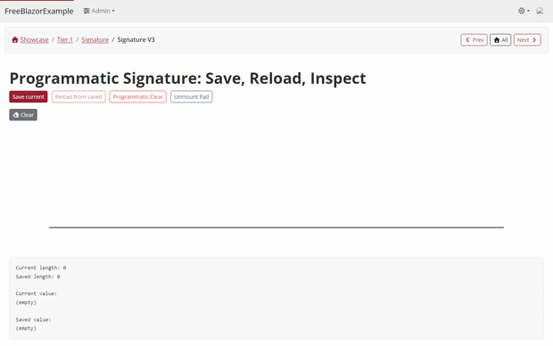
</a>
<br/>
<a href="screenshots/showcase-signature-v3/full.webp"><strong>Signature V3</strong></a>
<br/><code>/showcase/signature/v3</code><br/>
✅ 200 &nbsp;⏱ 17,425ms &nbsp;📦 68.5 MB &nbsp;🖥 ✅ 0 err

<details>
<summary>📋 Details</summary>

**Programmatic Signature: Save, Reload, Inspect**

**📊 Metrics**

| Metric | Value |
|--------|-------|
| HTTP Status | 200 |
| Navigation | 269 ms |
| Full Load (incl. settle) | 17,425 ms |
| Network Requests | 303 |
| Data Transferred | 68.5 MB |
| JS Errors | 0 |
| JS Warnings | 0 |

<details>
<summary>🌐 Network (303 requests, 68.5 MB)</summary>

| Method | Status | Duration | Bytes | URL |
|--------|:------:|:--------:|------:|-----|
| GET | 200 | 304ms | 9.0 MB | `http://localhost:5201/_framework/MudBlazor.mwezwdoi15.wasm` |
| GET | 200 | 301ms | 6.5 MB | `…:5201/_framework/Microsoft.CodeAnalysis.CSharp.df8hfd5o8z.wasm` |
| GET | 200 | 16ms | 6.0 MB | `…1/_framework/Basic.Reference.Assemblies.Net100.v8tl2dqzst.wasm` |
| GET | 200 | 16ms | 4.6 MB | `…calhost:5201/_framework/System.Private.CoreLib.btnahqa3oa.wasm` |
| GET | 200 | 2ms | 3.5 MB | `…t/BlazorMonaco/lib/monaco-editor/min/vs/editor.api-i0YVFWkl.js` |
| GET | 200 | 273ms | 3.0 MB | `…//localhost:5201/_framework/System.Private.Xml.c86ifkdlwh.wasm` |
| GET | 200 | 81ms | 2.9 MB | `…calhost:5201/_framework/Microsoft.CodeAnalysis.erp1n29u9n.wasm` |
| GET | 200 | 17ms | 2.9 MB | `http://localhost:5201/_framework/dotnet.native.imnhyiqpc9.wasm` |
| GET | 200 | 269ms | 2.4 MB | `http://localhost:5201/_framework/Radzen.Blazor.x7olzc7yc0.wasm` |
| GET | 200 | 279ms | 1.4 MB | `…lhost:5201/_framework/FreeBlazorExample.Client.n18ukcy7q5.wasm` |
| GET | 200 | 68ms | 1.0 MB | `…201/_content/Radzen.Blazor/fonts/MaterialSymbolsOutlined.woff2` |
| GET | 200 | 271ms | 984.3 KB | `…//localhost:5201/_framework/System.Data.Common.cp5bttdxwa.wasm` |
| GET | 200 | 16ms | 914.3 KB | `http://localhost:5201/_framework/BlazorBootstrap.zo6lifkmy7.wasm` |
| GET | 200 | 273ms | 829.3 KB | `…ework/System.Private.DataContractSerialization.yjhmavq6w2.wasm` |
| GET | 200 | 16ms | 788.2 KB | `…alhost:5201/_framework/FreeBlazorExample.Client.3ivhmqjexl.pdb` |
| … | … | … | … | *288 more* |

</details>

<details>
<summary>🖥 Console Info (1 messages)</summary>

```
[info] Debugging hotkey: Shift+Alt+D (when application has focus)
```

</details>

</details>

</td>
</tr>
<tr>
<td align="center" valign="top" width="33%">
<a href="screenshots/showcase-infotip-v1/full.webp">
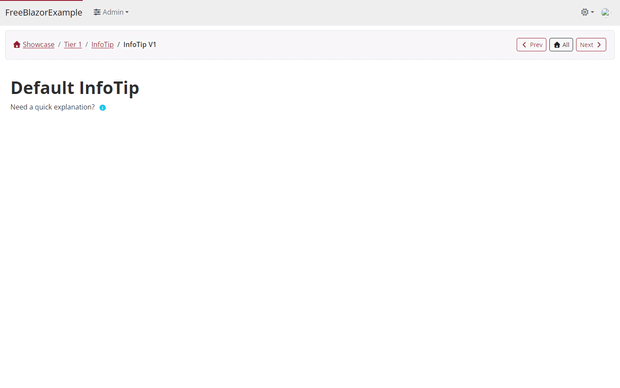
</a>
<br/>
<a href="screenshots/showcase-infotip-v1/full.webp"><strong>InfoTip V1</strong></a>
<br/><code>/showcase/infotip/v1</code><br/>
✅ 200 &nbsp;⏱ 17,614ms &nbsp;📦 68.5 MB &nbsp;🖥 ✅ 0 err

<details>
<summary>📋 Details</summary>

**Default InfoTip**

**📊 Metrics**

| Metric | Value |
|--------|-------|
| HTTP Status | 200 |
| Navigation | 221 ms |
| Full Load (incl. settle) | 17,614 ms |
| Network Requests | 302 |
| Data Transferred | 68.5 MB |
| JS Errors | 0 |
| JS Warnings | 0 |

<details>
<summary>🌐 Network (302 requests, 68.5 MB)</summary>

| Method | Status | Duration | Bytes | URL |
|--------|:------:|:--------:|------:|-----|
| GET | 200 | 315ms | 9.0 MB | `http://localhost:5201/_framework/MudBlazor.mwezwdoi15.wasm` |
| GET | 200 | 278ms | 6.5 MB | `…:5201/_framework/Microsoft.CodeAnalysis.CSharp.df8hfd5o8z.wasm` |
| GET | 200 | 25ms | 6.0 MB | `…1/_framework/Basic.Reference.Assemblies.Net100.v8tl2dqzst.wasm` |
| GET | 200 | 24ms | 4.6 MB | `…calhost:5201/_framework/System.Private.CoreLib.btnahqa3oa.wasm` |
| GET | 200 | 1ms | 3.5 MB | `…t/BlazorMonaco/lib/monaco-editor/min/vs/editor.api-i0YVFWkl.js` |
| GET | 200 | 275ms | 3.0 MB | `…//localhost:5201/_framework/System.Private.Xml.c86ifkdlwh.wasm` |
| GET | 200 | 276ms | 2.9 MB | `…calhost:5201/_framework/Microsoft.CodeAnalysis.erp1n29u9n.wasm` |
| GET | 200 | 19ms | 2.9 MB | `http://localhost:5201/_framework/dotnet.native.imnhyiqpc9.wasm` |
| GET | 200 | 275ms | 2.4 MB | `http://localhost:5201/_framework/Radzen.Blazor.x7olzc7yc0.wasm` |
| GET | 200 | 290ms | 1.4 MB | `…lhost:5201/_framework/FreeBlazorExample.Client.n18ukcy7q5.wasm` |
| GET | 200 | 52ms | 1.0 MB | `…201/_content/Radzen.Blazor/fonts/MaterialSymbolsOutlined.woff2` |
| GET | 200 | 275ms | 984.3 KB | `…//localhost:5201/_framework/System.Data.Common.cp5bttdxwa.wasm` |
| GET | 200 | 25ms | 914.3 KB | `http://localhost:5201/_framework/BlazorBootstrap.zo6lifkmy7.wasm` |
| GET | 200 | 275ms | 829.3 KB | `…ework/System.Private.DataContractSerialization.yjhmavq6w2.wasm` |
| GET | 200 | 25ms | 788.2 KB | `…alhost:5201/_framework/FreeBlazorExample.Client.3ivhmqjexl.pdb` |
| … | … | … | … | *287 more* |

</details>

<details>
<summary>🖥 Console Info (1 messages)</summary>

```
[info] Debugging hotkey: Shift+Alt+D (when application has focus)
```

</details>

</details>

</td>
<td align="center" valign="top" width="33%">
<a href="screenshots/showcase-infotip-v2/full.webp">
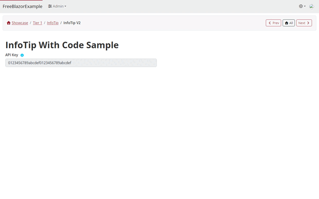
</a>
<br/>
<a href="screenshots/showcase-infotip-v2/full.webp"><strong>InfoTip V2</strong></a>
<br/><code>/showcase/infotip/v2</code><br/>
✅ 200 &nbsp;⏱ 17,498ms &nbsp;📦 68.5 MB &nbsp;🖥 ✅ 0 err

<details>
<summary>📋 Details</summary>

**InfoTip With Code Sample**

**📊 Metrics**

| Metric | Value |
|--------|-------|
| HTTP Status | 200 |
| Navigation | 266 ms |
| Full Load (incl. settle) | 17,498 ms |
| Network Requests | 302 |
| Data Transferred | 68.5 MB |
| JS Errors | 0 |
| JS Warnings | 0 |

<details>
<summary>🌐 Network (302 requests, 68.5 MB)</summary>

| Method | Status | Duration | Bytes | URL |
|--------|:------:|:--------:|------:|-----|
| GET | 200 | 262ms | 9.0 MB | `http://localhost:5201/_framework/MudBlazor.mwezwdoi15.wasm` |
| GET | 200 | 86ms | 6.5 MB | `…:5201/_framework/Microsoft.CodeAnalysis.CSharp.df8hfd5o8z.wasm` |
| GET | 200 | 17ms | 6.0 MB | `…1/_framework/Basic.Reference.Assemblies.Net100.v8tl2dqzst.wasm` |
| GET | 200 | 17ms | 4.6 MB | `…calhost:5201/_framework/System.Private.CoreLib.btnahqa3oa.wasm` |
| GET | 200 | 2ms | 3.5 MB | `…t/BlazorMonaco/lib/monaco-editor/min/vs/editor.api-i0YVFWkl.js` |
| GET | 200 | 268ms | 3.0 MB | `…//localhost:5201/_framework/System.Private.Xml.c86ifkdlwh.wasm` |
| GET | 200 | 72ms | 2.9 MB | `…calhost:5201/_framework/Microsoft.CodeAnalysis.erp1n29u9n.wasm` |
| GET | 200 | 16ms | 2.9 MB | `http://localhost:5201/_framework/dotnet.native.imnhyiqpc9.wasm` |
| GET | 200 | 85ms | 2.4 MB | `http://localhost:5201/_framework/Radzen.Blazor.x7olzc7yc0.wasm` |
| GET | 200 | 284ms | 1.4 MB | `…lhost:5201/_framework/FreeBlazorExample.Client.n18ukcy7q5.wasm` |
| GET | 200 | 44ms | 1.0 MB | `…201/_content/Radzen.Blazor/fonts/MaterialSymbolsOutlined.woff2` |
| GET | 200 | 260ms | 984.3 KB | `…//localhost:5201/_framework/System.Data.Common.cp5bttdxwa.wasm` |
| GET | 200 | 18ms | 914.3 KB | `http://localhost:5201/_framework/BlazorBootstrap.zo6lifkmy7.wasm` |
| GET | 200 | 268ms | 829.3 KB | `…ework/System.Private.DataContractSerialization.yjhmavq6w2.wasm` |
| GET | 200 | 17ms | 788.2 KB | `…alhost:5201/_framework/FreeBlazorExample.Client.3ivhmqjexl.pdb` |
| … | … | … | … | *287 more* |

</details>

<details>
<summary>🖥 Console Info (1 messages)</summary>

```
[info] Debugging hotkey: Shift+Alt+D (when application has focus)
```

</details>

</details>

</td>
<td align="center" valign="top" width="33%">
<a href="screenshots/showcase-infotip-v3/full.webp">
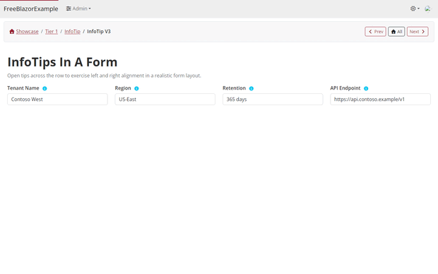
</a>
<br/>
<a href="screenshots/showcase-infotip-v3/full.webp"><strong>InfoTip V3</strong></a>
<br/><code>/showcase/infotip/v3</code><br/>
✅ 200 &nbsp;⏱ 17,455ms &nbsp;📦 68.5 MB &nbsp;🖥 ✅ 0 err

<details>
<summary>📋 Details</summary>

**InfoTips In A Form**

**📊 Metrics**

| Metric | Value |
|--------|-------|
| HTTP Status | 200 |
| Navigation | 277 ms |
| Full Load (incl. settle) | 17,455 ms |
| Network Requests | 302 |
| Data Transferred | 68.5 MB |
| JS Errors | 0 |
| JS Warnings | 0 |

<details>
<summary>🌐 Network (302 requests, 68.5 MB)</summary>

| Method | Status | Duration | Bytes | URL |
|--------|:------:|:--------:|------:|-----|
| GET | 200 | 303ms | 9.0 MB | `http://localhost:5201/_framework/MudBlazor.mwezwdoi15.wasm` |
| GET | 200 | 301ms | 6.5 MB | `…:5201/_framework/Microsoft.CodeAnalysis.CSharp.df8hfd5o8z.wasm` |
| GET | 200 | 15ms | 6.0 MB | `…1/_framework/Basic.Reference.Assemblies.Net100.v8tl2dqzst.wasm` |
| GET | 200 | 15ms | 4.6 MB | `…calhost:5201/_framework/System.Private.CoreLib.btnahqa3oa.wasm` |
| GET | 200 | 4ms | 3.5 MB | `…t/BlazorMonaco/lib/monaco-editor/min/vs/editor.api-i0YVFWkl.js` |
| GET | 200 | 266ms | 3.0 MB | `…//localhost:5201/_framework/System.Private.Xml.c86ifkdlwh.wasm` |
| GET | 200 | 82ms | 2.9 MB | `…calhost:5201/_framework/Microsoft.CodeAnalysis.erp1n29u9n.wasm` |
| GET | 200 | 15ms | 2.9 MB | `http://localhost:5201/_framework/dotnet.native.imnhyiqpc9.wasm` |
| GET | 200 | 263ms | 2.4 MB | `http://localhost:5201/_framework/Radzen.Blazor.x7olzc7yc0.wasm` |
| GET | 200 | 282ms | 1.4 MB | `…lhost:5201/_framework/FreeBlazorExample.Client.n18ukcy7q5.wasm` |
| GET | 200 | 45ms | 1.0 MB | `…201/_content/Radzen.Blazor/fonts/MaterialSymbolsOutlined.woff2` |
| GET | 200 | 264ms | 984.3 KB | `…//localhost:5201/_framework/System.Data.Common.cp5bttdxwa.wasm` |
| GET | 200 | 15ms | 914.3 KB | `http://localhost:5201/_framework/BlazorBootstrap.zo6lifkmy7.wasm` |
| GET | 200 | 266ms | 829.3 KB | `…ework/System.Private.DataContractSerialization.yjhmavq6w2.wasm` |
| GET | 200 | 15ms | 788.2 KB | `…alhost:5201/_framework/FreeBlazorExample.Client.3ivhmqjexl.pdb` |
| … | … | … | … | *287 more* |

</details>

<details>
<summary>🖥 Console Info (1 messages)</summary>

```
[info] Debugging hotkey: Shift+Alt+D (when application has focus)
```

</details>

</details>

</td>
</tr>
<tr>
<td align="center" valign="top" width="33%">
<a href="screenshots/showcase-networkchart-v1/full.webp">
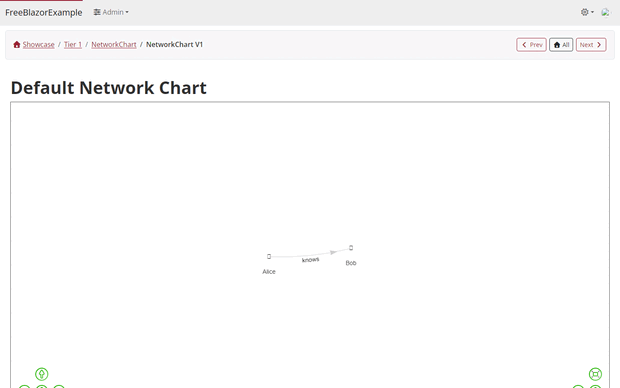
</a>
<br/>
<a href="screenshots/showcase-networkchart-v1/full.webp"><strong>NetworkChart V1</strong></a>
<br/><code>/showcase/networkchart/v1</code><br/>
✅ 200 &nbsp;⏱ 17,140ms &nbsp;📦 68.5 MB &nbsp;🖥 ✅ 0 err

<details>
<summary>📋 Details</summary>

**Default Network Chart**

**📊 Metrics**

| Metric | Value |
|--------|-------|
| HTTP Status | 200 |
| Navigation | 227 ms |
| Full Load (incl. settle) | 17,140 ms |
| Network Requests | 303 |
| Data Transferred | 68.5 MB |
| JS Errors | 0 |
| JS Warnings | 0 |

<details>
<summary>🌐 Network (303 requests, 68.5 MB)</summary>

| Method | Status | Duration | Bytes | URL |
|--------|:------:|:--------:|------:|-----|
| GET | 200 | 269ms | 9.0 MB | `http://localhost:5201/_framework/MudBlazor.mwezwdoi15.wasm` |
| GET | 200 | 270ms | 6.5 MB | `…:5201/_framework/Microsoft.CodeAnalysis.CSharp.df8hfd5o8z.wasm` |
| GET | 200 | 19ms | 6.0 MB | `…1/_framework/Basic.Reference.Assemblies.Net100.v8tl2dqzst.wasm` |
| GET | 200 | 18ms | 4.6 MB | `…calhost:5201/_framework/System.Private.CoreLib.btnahqa3oa.wasm` |
| GET | 200 | 2ms | 3.5 MB | `…t/BlazorMonaco/lib/monaco-editor/min/vs/editor.api-i0YVFWkl.js` |
| GET | 200 | 253ms | 3.0 MB | `…//localhost:5201/_framework/System.Private.Xml.c86ifkdlwh.wasm` |
| GET | 200 | 22ms | 2.9 MB | `…calhost:5201/_framework/Microsoft.CodeAnalysis.erp1n29u9n.wasm` |
| GET | 200 | 16ms | 2.9 MB | `http://localhost:5201/_framework/dotnet.native.imnhyiqpc9.wasm` |
| GET | 200 | 251ms | 2.4 MB | `http://localhost:5201/_framework/Radzen.Blazor.x7olzc7yc0.wasm` |
| GET | 200 | 258ms | 1.4 MB | `…lhost:5201/_framework/FreeBlazorExample.Client.n18ukcy7q5.wasm` |
| GET | 200 | 40ms | 1.0 MB | `…201/_content/Radzen.Blazor/fonts/MaterialSymbolsOutlined.woff2` |
| GET | 200 | 251ms | 984.3 KB | `…//localhost:5201/_framework/System.Data.Common.cp5bttdxwa.wasm` |
| GET | 200 | 19ms | 914.3 KB | `http://localhost:5201/_framework/BlazorBootstrap.zo6lifkmy7.wasm` |
| GET | 200 | 252ms | 829.3 KB | `…ework/System.Private.DataContractSerialization.yjhmavq6w2.wasm` |
| GET | 200 | 19ms | 788.2 KB | `…alhost:5201/_framework/FreeBlazorExample.Client.3ivhmqjexl.pdb` |
| … | … | … | … | *288 more* |

</details>

<details>
<summary>🖥 Console Info (1 messages)</summary>

```
[info] Debugging hotkey: Shift+Alt+D (when application has focus)
```

</details>

</details>

</td>
<td align="center" valign="top" width="33%">
<a href="screenshots/showcase-networkchart-v2/full.webp">
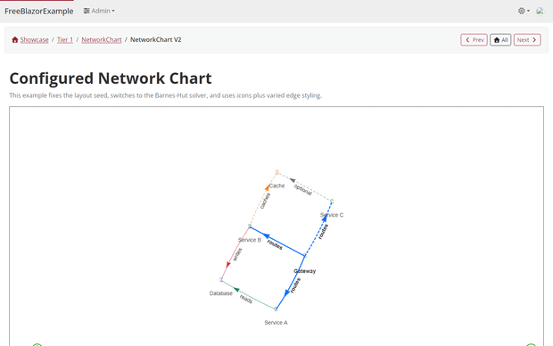
</a>
<br/>
<a href="screenshots/showcase-networkchart-v2/full.webp"><strong>NetworkChart V2</strong></a>
<br/><code>/showcase/networkchart/v2</code><br/>
✅ 200 &nbsp;⏱ 17,130ms &nbsp;📦 68.5 MB &nbsp;🖥 ✅ 0 err

<details>
<summary>📋 Details</summary>

**Configured Network Chart**

**📊 Metrics**

| Metric | Value |
|--------|-------|
| HTTP Status | 200 |
| Navigation | 234 ms |
| Full Load (incl. settle) | 17,130 ms |
| Network Requests | 303 |
| Data Transferred | 68.5 MB |
| JS Errors | 0 |
| JS Warnings | 0 |

<details>
<summary>🌐 Network (303 requests, 68.5 MB)</summary>

| Method | Status | Duration | Bytes | URL |
|--------|:------:|:--------:|------:|-----|
| GET | 200 | 274ms | 9.0 MB | `http://localhost:5201/_framework/MudBlazor.mwezwdoi15.wasm` |
| GET | 200 | 250ms | 6.5 MB | `…:5201/_framework/Microsoft.CodeAnalysis.CSharp.df8hfd5o8z.wasm` |
| GET | 200 | 14ms | 6.0 MB | `…1/_framework/Basic.Reference.Assemblies.Net100.v8tl2dqzst.wasm` |
| GET | 200 | 13ms | 4.6 MB | `…calhost:5201/_framework/System.Private.CoreLib.btnahqa3oa.wasm` |
| GET | 200 | 1ms | 3.5 MB | `…t/BlazorMonaco/lib/monaco-editor/min/vs/editor.api-i0YVFWkl.js` |
| GET | 200 | 261ms | 3.0 MB | `…//localhost:5201/_framework/System.Private.Xml.c86ifkdlwh.wasm` |
| GET | 200 | 20ms | 2.9 MB | `…calhost:5201/_framework/Microsoft.CodeAnalysis.erp1n29u9n.wasm` |
| GET | 200 | 13ms | 2.9 MB | `http://localhost:5201/_framework/dotnet.native.imnhyiqpc9.wasm` |
| GET | 200 | 120ms | 2.4 MB | `http://localhost:5201/_framework/Radzen.Blazor.x7olzc7yc0.wasm` |
| GET | 200 | 265ms | 1.4 MB | `…lhost:5201/_framework/FreeBlazorExample.Client.n18ukcy7q5.wasm` |
| GET | 200 | 37ms | 1.0 MB | `…201/_content/Radzen.Blazor/fonts/MaterialSymbolsOutlined.woff2` |
| GET | 200 | 249ms | 984.3 KB | `…//localhost:5201/_framework/System.Data.Common.cp5bttdxwa.wasm` |
| GET | 200 | 14ms | 914.3 KB | `http://localhost:5201/_framework/BlazorBootstrap.zo6lifkmy7.wasm` |
| GET | 200 | 260ms | 829.3 KB | `…ework/System.Private.DataContractSerialization.yjhmavq6w2.wasm` |
| GET | 200 | 14ms | 788.2 KB | `…alhost:5201/_framework/FreeBlazorExample.Client.3ivhmqjexl.pdb` |
| … | … | … | … | *288 more* |

</details>

<details>
<summary>🖥 Console Info (1 messages)</summary>

```
[info] Debugging hotkey: Shift+Alt+D (when application has focus)
```

</details>

</details>

</td>
<td align="center" valign="top" width="33%">
<a href="screenshots/showcase-networkchart-v3/full.webp">
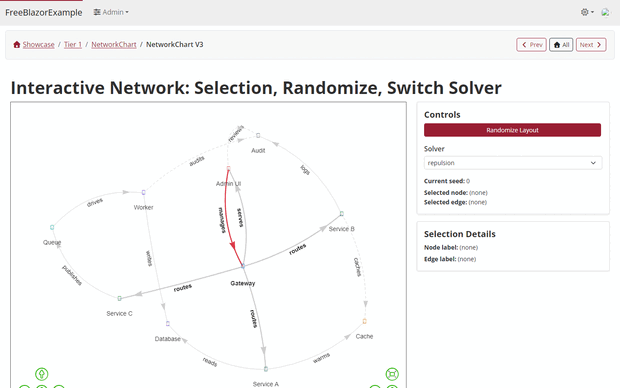
</a>
<br/>
<a href="screenshots/showcase-networkchart-v3/full.webp"><strong>NetworkChart V3</strong></a>
<br/><code>/showcase/networkchart/v3</code><br/>
✅ 200 &nbsp;⏱ 17,284ms &nbsp;📦 68.5 MB &nbsp;🖥 ✅ 0 err

<details>
<summary>📋 Details</summary>

**Interactive Network: Selection, Randomize, Switch Solver**

**📊 Metrics**

| Metric | Value |
|--------|-------|
| HTTP Status | 200 |
| Navigation | 227 ms |
| Full Load (incl. settle) | 17,284 ms |
| Network Requests | 303 |
| Data Transferred | 68.5 MB |
| JS Errors | 0 |
| JS Warnings | 0 |

<details>
<summary>🌐 Network (303 requests, 68.5 MB)</summary>

| Method | Status | Duration | Bytes | URL |
|--------|:------:|:--------:|------:|-----|
| GET | 200 | 241ms | 9.0 MB | `http://localhost:5201/_framework/MudBlazor.mwezwdoi15.wasm` |
| GET | 200 | 237ms | 6.5 MB | `…:5201/_framework/Microsoft.CodeAnalysis.CSharp.df8hfd5o8z.wasm` |
| GET | 200 | 12ms | 6.0 MB | `…1/_framework/Basic.Reference.Assemblies.Net100.v8tl2dqzst.wasm` |
| GET | 200 | 12ms | 4.6 MB | `…calhost:5201/_framework/System.Private.CoreLib.btnahqa3oa.wasm` |
| GET | 200 | 1ms | 3.5 MB | `…t/BlazorMonaco/lib/monaco-editor/min/vs/editor.api-i0YVFWkl.js` |
| GET | 200 | 250ms | 3.0 MB | `…//localhost:5201/_framework/System.Private.Xml.c86ifkdlwh.wasm` |
| GET | 200 | 19ms | 2.9 MB | `…calhost:5201/_framework/Microsoft.CodeAnalysis.erp1n29u9n.wasm` |
| GET | 200 | 11ms | 2.9 MB | `http://localhost:5201/_framework/dotnet.native.imnhyiqpc9.wasm` |
| GET | 200 | 236ms | 2.4 MB | `http://localhost:5201/_framework/Radzen.Blazor.x7olzc7yc0.wasm` |
| GET | 200 | 257ms | 1.4 MB | `…lhost:5201/_framework/FreeBlazorExample.Client.n18ukcy7q5.wasm` |
| GET | 200 | 37ms | 1.0 MB | `…201/_content/Radzen.Blazor/fonts/MaterialSymbolsOutlined.woff2` |
| GET | 200 | 238ms | 984.3 KB | `…//localhost:5201/_framework/System.Data.Common.cp5bttdxwa.wasm` |
| GET | 200 | 12ms | 914.3 KB | `http://localhost:5201/_framework/BlazorBootstrap.zo6lifkmy7.wasm` |
| GET | 200 | 250ms | 829.3 KB | `…ework/System.Private.DataContractSerialization.yjhmavq6w2.wasm` |
| GET | 200 | 12ms | 788.2 KB | `…alhost:5201/_framework/FreeBlazorExample.Client.3ivhmqjexl.pdb` |
| … | … | … | … | *288 more* |

</details>

<details>
<summary>🖥 Console Info (1 messages)</summary>

```
[info] Debugging hotkey: Shift+Alt+D (when application has focus)
```

</details>

</details>

</td>
</tr>
<tr>
<td align="center" valign="top" width="33%">
<a href="screenshots/showcase-wizard-v1/full.webp">
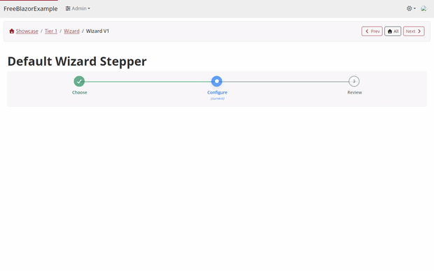
</a>
<br/>
<a href="screenshots/showcase-wizard-v1/full.webp"><strong>Wizard V1</strong></a>
<br/><code>/showcase/wizard/v1</code><br/>
✅ 200 &nbsp;⏱ 17,210ms &nbsp;📦 68.5 MB &nbsp;🖥 ✅ 0 err

<details>
<summary>📋 Details</summary>

**Default Wizard Stepper**

**📊 Metrics**

| Metric | Value |
|--------|-------|
| HTTP Status | 200 |
| Navigation | 253 ms |
| Full Load (incl. settle) | 17,210 ms |
| Network Requests | 302 |
| Data Transferred | 68.5 MB |
| JS Errors | 0 |
| JS Warnings | 0 |

<details>
<summary>🌐 Network (302 requests, 68.5 MB)</summary>

| Method | Status | Duration | Bytes | URL |
|--------|:------:|:--------:|------:|-----|
| GET | 200 | 241ms | 9.0 MB | `http://localhost:5201/_framework/MudBlazor.mwezwdoi15.wasm` |
| GET | 200 | 242ms | 6.5 MB | `…:5201/_framework/Microsoft.CodeAnalysis.CSharp.df8hfd5o8z.wasm` |
| GET | 200 | 16ms | 6.0 MB | `…1/_framework/Basic.Reference.Assemblies.Net100.v8tl2dqzst.wasm` |
| GET | 200 | 15ms | 4.6 MB | `…calhost:5201/_framework/System.Private.CoreLib.btnahqa3oa.wasm` |
| GET | 200 | 1ms | 3.5 MB | `…t/BlazorMonaco/lib/monaco-editor/min/vs/editor.api-i0YVFWkl.js` |
| GET | 200 | 255ms | 3.0 MB | `…//localhost:5201/_framework/System.Private.Xml.c86ifkdlwh.wasm` |
| GET | 200 | 21ms | 2.9 MB | `…calhost:5201/_framework/Microsoft.CodeAnalysis.erp1n29u9n.wasm` |
| GET | 200 | 15ms | 2.9 MB | `http://localhost:5201/_framework/dotnet.native.imnhyiqpc9.wasm` |
| GET | 200 | 241ms | 2.4 MB | `http://localhost:5201/_framework/Radzen.Blazor.x7olzc7yc0.wasm` |
| GET | 200 | 260ms | 1.4 MB | `…lhost:5201/_framework/FreeBlazorExample.Client.n18ukcy7q5.wasm` |
| GET | 200 | 38ms | 1.0 MB | `…201/_content/Radzen.Blazor/fonts/MaterialSymbolsOutlined.woff2` |
| GET | 200 | 243ms | 984.3 KB | `…//localhost:5201/_framework/System.Data.Common.cp5bttdxwa.wasm` |
| GET | 200 | 16ms | 914.3 KB | `http://localhost:5201/_framework/BlazorBootstrap.zo6lifkmy7.wasm` |
| GET | 200 | 255ms | 829.3 KB | `…ework/System.Private.DataContractSerialization.yjhmavq6w2.wasm` |
| GET | 200 | 16ms | 788.2 KB | `…alhost:5201/_framework/FreeBlazorExample.Client.3ivhmqjexl.pdb` |
| … | … | … | … | *287 more* |

</details>

<details>
<summary>🖥 Console Info (1 messages)</summary>

```
[info] Debugging hotkey: Shift+Alt+D (when application has focus)
```

</details>

</details>

</td>
<td align="center" valign="top" width="33%">
<a href="screenshots/showcase-wizard-v2/full.webp">
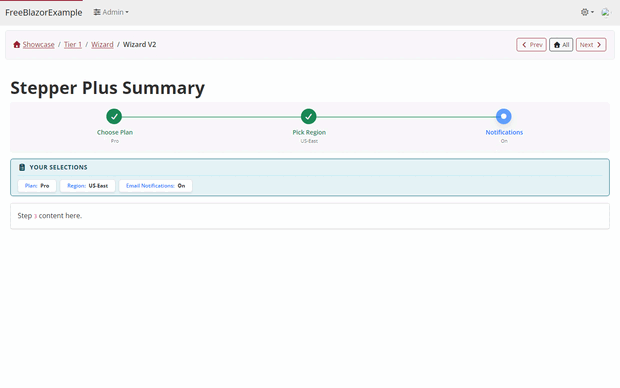
</a>
<br/>
<a href="screenshots/showcase-wizard-v2/full.webp"><strong>Wizard V2</strong></a>
<br/><code>/showcase/wizard/v2</code><br/>
✅ 200 &nbsp;⏱ 17,336ms &nbsp;📦 68.5 MB &nbsp;🖥 ✅ 0 err

<details>
<summary>📋 Details</summary>

**Stepper Plus Summary**

**📊 Metrics**

| Metric | Value |
|--------|-------|
| HTTP Status | 200 |
| Navigation | 230 ms |
| Full Load (incl. settle) | 17,336 ms |
| Network Requests | 302 |
| Data Transferred | 68.5 MB |
| JS Errors | 0 |
| JS Warnings | 0 |

<details>
<summary>🌐 Network (302 requests, 68.5 MB)</summary>

| Method | Status | Duration | Bytes | URL |
|--------|:------:|:--------:|------:|-----|
| GET | 200 | 278ms | 9.0 MB | `http://localhost:5201/_framework/MudBlazor.mwezwdoi15.wasm` |
| GET | 200 | 55ms | 6.5 MB | `…:5201/_framework/Microsoft.CodeAnalysis.CSharp.df8hfd5o8z.wasm` |
| GET | 200 | 18ms | 6.0 MB | `…1/_framework/Basic.Reference.Assemblies.Net100.v8tl2dqzst.wasm` |
| GET | 200 | 18ms | 4.6 MB | `…calhost:5201/_framework/System.Private.CoreLib.btnahqa3oa.wasm` |
| GET | 200 | 1ms | 3.5 MB | `…t/BlazorMonaco/lib/monaco-editor/min/vs/editor.api-i0YVFWkl.js` |
| GET | 200 | 264ms | 3.0 MB | `…//localhost:5201/_framework/System.Private.Xml.c86ifkdlwh.wasm` |
| GET | 200 | 26ms | 2.9 MB | `…calhost:5201/_framework/Microsoft.CodeAnalysis.erp1n29u9n.wasm` |
| GET | 200 | 16ms | 2.9 MB | `http://localhost:5201/_framework/dotnet.native.imnhyiqpc9.wasm` |
| GET | 200 | 54ms | 2.4 MB | `http://localhost:5201/_framework/Radzen.Blazor.x7olzc7yc0.wasm` |
| GET | 200 | 268ms | 1.4 MB | `…lhost:5201/_framework/FreeBlazorExample.Client.n18ukcy7q5.wasm` |
| GET | 200 | 38ms | 1.0 MB | `…201/_content/Radzen.Blazor/fonts/MaterialSymbolsOutlined.woff2` |
| GET | 200 | 249ms | 984.3 KB | `…//localhost:5201/_framework/System.Data.Common.cp5bttdxwa.wasm` |
| GET | 200 | 18ms | 914.3 KB | `http://localhost:5201/_framework/BlazorBootstrap.zo6lifkmy7.wasm` |
| GET | 200 | 264ms | 829.3 KB | `…ework/System.Private.DataContractSerialization.yjhmavq6w2.wasm` |
| GET | 200 | 18ms | 788.2 KB | `…alhost:5201/_framework/FreeBlazorExample.Client.3ivhmqjexl.pdb` |
| … | … | … | … | *287 more* |

</details>

<details>
<summary>🖥 Console Info (1 messages)</summary>

```
[info] Debugging hotkey: Shift+Alt+D (when application has focus)
```

</details>

</details>

</td>
<td align="center" valign="top" width="33%">
<a href="screenshots/showcase-wizard-v3/full.webp">
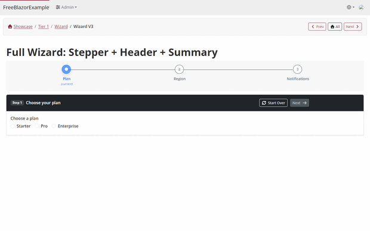
</a>
<br/>
<a href="screenshots/showcase-wizard-v3/full.webp"><strong>Wizard V3</strong></a>
<br/><code>/showcase/wizard/v3</code><br/>
✅ 200 &nbsp;⏱ 17,313ms &nbsp;📦 68.5 MB &nbsp;🖥 ✅ 0 err

<details>
<summary>📋 Details</summary>

**Full Wizard: Stepper + Header + Summary**

**📊 Metrics**

| Metric | Value |
|--------|-------|
| HTTP Status | 200 |
| Navigation | 231 ms |
| Full Load (incl. settle) | 17,313 ms |
| Network Requests | 302 |
| Data Transferred | 68.5 MB |
| JS Errors | 0 |
| JS Warnings | 0 |

<details>
<summary>🌐 Network (302 requests, 68.5 MB)</summary>

| Method | Status | Duration | Bytes | URL |
|--------|:------:|:--------:|------:|-----|
| GET | 200 | 241ms | 9.0 MB | `http://localhost:5201/_framework/MudBlazor.mwezwdoi15.wasm` |
| GET | 200 | 240ms | 6.5 MB | `…:5201/_framework/Microsoft.CodeAnalysis.CSharp.df8hfd5o8z.wasm` |
| GET | 200 | 17ms | 6.0 MB | `…1/_framework/Basic.Reference.Assemblies.Net100.v8tl2dqzst.wasm` |
| GET | 200 | 16ms | 4.6 MB | `…calhost:5201/_framework/System.Private.CoreLib.btnahqa3oa.wasm` |
| GET | 200 | 1ms | 3.5 MB | `…t/BlazorMonaco/lib/monaco-editor/min/vs/editor.api-i0YVFWkl.js` |
| GET | 200 | 248ms | 3.0 MB | `…//localhost:5201/_framework/System.Private.Xml.c86ifkdlwh.wasm` |
| GET | 200 | 19ms | 2.9 MB | `…calhost:5201/_framework/Microsoft.CodeAnalysis.erp1n29u9n.wasm` |
| GET | 200 | 19ms | 2.9 MB | `http://localhost:5201/_framework/dotnet.native.imnhyiqpc9.wasm` |
| GET | 200 | 238ms | 2.4 MB | `http://localhost:5201/_framework/Radzen.Blazor.x7olzc7yc0.wasm` |
| GET | 200 | 253ms | 1.4 MB | `…lhost:5201/_framework/FreeBlazorExample.Client.n18ukcy7q5.wasm` |
| GET | 200 | 38ms | 1.0 MB | `…201/_content/Radzen.Blazor/fonts/MaterialSymbolsOutlined.woff2` |
| GET | 200 | 240ms | 984.3 KB | `…//localhost:5201/_framework/System.Data.Common.cp5bttdxwa.wasm` |
| GET | 200 | 17ms | 914.3 KB | `http://localhost:5201/_framework/BlazorBootstrap.zo6lifkmy7.wasm` |
| GET | 200 | 247ms | 829.3 KB | `…ework/System.Private.DataContractSerialization.yjhmavq6w2.wasm` |
| GET | 200 | 17ms | 788.2 KB | `…alhost:5201/_framework/FreeBlazorExample.Client.3ivhmqjexl.pdb` |
| … | … | … | … | *287 more* |

</details>

<details>
<summary>🖥 Console Info (1 messages)</summary>

```
[info] Debugging hotkey: Shift+Alt+D (when application has focus)
```

</details>

</details>

</td>
</tr>
<tr>
<td align="center" valign="top" width="33%">
<a href="screenshots/showcase-aboutsection-v1/full.webp">
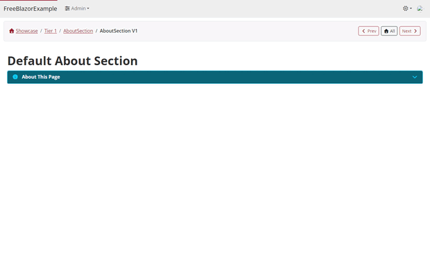
</a>
<br/>
<a href="screenshots/showcase-aboutsection-v1/full.webp"><strong>AboutSection V1</strong></a>
<br/><code>/showcase/aboutsection/v1</code><br/>
✅ 200 &nbsp;⏱ 17,087ms &nbsp;📦 68.5 MB &nbsp;🖥 ✅ 0 err

<details>
<summary>📋 Details</summary>

**ℹ️ About This Component**

**About This Page**
This is the default AboutSection with the built-in title, icon, and collapsed-on-load behavior.
**📊 Metrics**

| Metric | Value |
|--------|-------|
| HTTP Status | 200 |
| Navigation | 223 ms |
| Full Load (incl. settle) | 17,087 ms |
| Network Requests | 302 |
| Data Transferred | 68.5 MB |
| JS Errors | 0 |
| JS Warnings | 0 |

<details>
<summary>🌐 Network (302 requests, 68.5 MB)</summary>

| Method | Status | Duration | Bytes | URL |
|--------|:------:|:--------:|------:|-----|
| GET | 200 | 245ms | 9.0 MB | `http://localhost:5201/_framework/MudBlazor.mwezwdoi15.wasm` |
| GET | 200 | 247ms | 6.5 MB | `…:5201/_framework/Microsoft.CodeAnalysis.CSharp.df8hfd5o8z.wasm` |
| GET | 200 | 17ms | 6.0 MB | `…1/_framework/Basic.Reference.Assemblies.Net100.v8tl2dqzst.wasm` |
| GET | 200 | 16ms | 4.6 MB | `…calhost:5201/_framework/System.Private.CoreLib.btnahqa3oa.wasm` |
| GET | 200 | 1ms | 3.5 MB | `…t/BlazorMonaco/lib/monaco-editor/min/vs/editor.api-i0YVFWkl.js` |
| GET | 200 | 255ms | 3.0 MB | `…//localhost:5201/_framework/System.Private.Xml.c86ifkdlwh.wasm` |
| GET | 200 | 22ms | 2.9 MB | `…calhost:5201/_framework/Microsoft.CodeAnalysis.erp1n29u9n.wasm` |
| GET | 200 | 17ms | 2.9 MB | `http://localhost:5201/_framework/dotnet.native.imnhyiqpc9.wasm` |
| GET | 200 | 245ms | 2.4 MB | `http://localhost:5201/_framework/Radzen.Blazor.x7olzc7yc0.wasm` |
| GET | 200 | 259ms | 1.4 MB | `…lhost:5201/_framework/FreeBlazorExample.Client.n18ukcy7q5.wasm` |
| GET | 200 | 38ms | 1.0 MB | `…201/_content/Radzen.Blazor/fonts/MaterialSymbolsOutlined.woff2` |
| GET | 200 | 246ms | 984.3 KB | `…//localhost:5201/_framework/System.Data.Common.cp5bttdxwa.wasm` |
| GET | 200 | 17ms | 914.3 KB | `http://localhost:5201/_framework/BlazorBootstrap.zo6lifkmy7.wasm` |
| GET | 200 | 254ms | 829.3 KB | `…ework/System.Private.DataContractSerialization.yjhmavq6w2.wasm` |
| GET | 200 | 17ms | 788.2 KB | `…alhost:5201/_framework/FreeBlazorExample.Client.3ivhmqjexl.pdb` |
| … | … | … | … | *287 more* |

</details>

<details>
<summary>🖥 Console Info (1 messages)</summary>

```
[info] Debugging hotkey: Shift+Alt+D (when application has focus)
```

</details>

</details>

</td>
<td align="center" valign="top" width="33%">
<a href="screenshots/showcase-aboutsection-v2/full.webp">
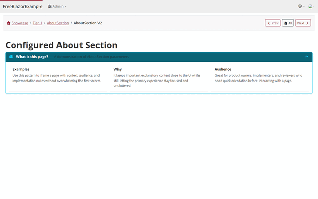
</a>
<br/>
<a href="screenshots/showcase-aboutsection-v2/full.webp"><strong>AboutSection V2</strong></a>
<br/><code>/showcase/aboutsection/v2</code><br/>
✅ 200 &nbsp;⏱ 17,228ms &nbsp;📦 68.5 MB &nbsp;🖥 ✅ 0 err

<details>
<summary>📋 Details</summary>

**ℹ️ About This Component**

**What is this page?**
**📊 Metrics**

| Metric | Value |
|--------|-------|
| HTTP Status | 200 |
| Navigation | 222 ms |
| Full Load (incl. settle) | 17,228 ms |
| Network Requests | 302 |
| Data Transferred | 68.5 MB |
| JS Errors | 0 |
| JS Warnings | 0 |

<details>
<summary>🌐 Network (302 requests, 68.5 MB)</summary>

| Method | Status | Duration | Bytes | URL |
|--------|:------:|:--------:|------:|-----|
| GET | 200 | 272ms | 9.0 MB | `http://localhost:5201/_framework/MudBlazor.mwezwdoi15.wasm` |
| GET | 200 | 245ms | 6.5 MB | `…:5201/_framework/Microsoft.CodeAnalysis.CSharp.df8hfd5o8z.wasm` |
| GET | 200 | 16ms | 6.0 MB | `…1/_framework/Basic.Reference.Assemblies.Net100.v8tl2dqzst.wasm` |
| GET | 200 | 16ms | 4.6 MB | `…calhost:5201/_framework/System.Private.CoreLib.btnahqa3oa.wasm` |
| GET | 200 | 2ms | 3.5 MB | `…t/BlazorMonaco/lib/monaco-editor/min/vs/editor.api-i0YVFWkl.js` |
| GET | 200 | 260ms | 3.0 MB | `…//localhost:5201/_framework/System.Private.Xml.c86ifkdlwh.wasm` |
| GET | 200 | 22ms | 2.9 MB | `…calhost:5201/_framework/Microsoft.CodeAnalysis.erp1n29u9n.wasm` |
| GET | 200 | 20ms | 2.9 MB | `http://localhost:5201/_framework/dotnet.native.imnhyiqpc9.wasm` |
| GET | 200 | 242ms | 2.4 MB | `http://localhost:5201/_framework/Radzen.Blazor.x7olzc7yc0.wasm` |
| GET | 200 | 265ms | 1.4 MB | `…lhost:5201/_framework/FreeBlazorExample.Client.n18ukcy7q5.wasm` |
| GET | 200 | 37ms | 1.0 MB | `…201/_content/Radzen.Blazor/fonts/MaterialSymbolsOutlined.woff2` |
| GET | 200 | 244ms | 984.3 KB | `…//localhost:5201/_framework/System.Data.Common.cp5bttdxwa.wasm` |
| GET | 200 | 16ms | 914.3 KB | `http://localhost:5201/_framework/BlazorBootstrap.zo6lifkmy7.wasm` |
| GET | 200 | 259ms | 829.3 KB | `…ework/System.Private.DataContractSerialization.yjhmavq6w2.wasm` |
| GET | 200 | 16ms | 788.2 KB | `…alhost:5201/_framework/FreeBlazorExample.Client.3ivhmqjexl.pdb` |
| … | … | … | … | *287 more* |

</details>

<details>
<summary>🖥 Console Info (1 messages)</summary>

```
[info] Debugging hotkey: Shift+Alt+D (when application has focus)
```

</details>

</details>

</td>
<td align="center" valign="top" width="33%">
<a href="screenshots/showcase-aboutsection-v3/full.webp">
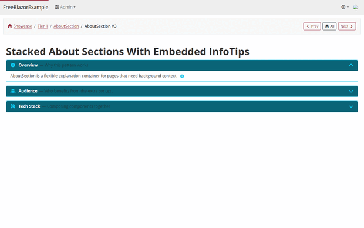
</a>
<br/>
<a href="screenshots/showcase-aboutsection-v3/full.webp"><strong>AboutSection V3</strong></a>
<br/><code>/showcase/aboutsection/v3</code><br/>
✅ 200 &nbsp;⏱ 17,437ms &nbsp;📦 68.5 MB &nbsp;🖥 ✅ 0 err

<details>
<summary>📋 Details</summary>

**ℹ️ About This Component**

**Overview**
**Audience**
It helps implementers, reviewers, and business users align on the intent of a page before they start clicking.

**Tech Stack**
This slot can host plain markup or other reusable components like InfoTip.
**📊 Metrics**

| Metric | Value |
|--------|-------|
| HTTP Status | 200 |
| Navigation | 210 ms |
| Full Load (incl. settle) | 17,437 ms |
| Network Requests | 302 |
| Data Transferred | 68.5 MB |
| JS Errors | 0 |
| JS Warnings | 0 |

<details>
<summary>🌐 Network (302 requests, 68.5 MB)</summary>

| Method | Status | Duration | Bytes | URL |
|--------|:------:|:--------:|------:|-----|
| GET | 200 | 113ms | 9.0 MB | `http://localhost:5201/_framework/MudBlazor.mwezwdoi15.wasm` |
| GET | 200 | 114ms | 6.5 MB | `…:5201/_framework/Microsoft.CodeAnalysis.CSharp.df8hfd5o8z.wasm` |
| GET | 200 | 54ms | 6.0 MB | `…1/_framework/Basic.Reference.Assemblies.Net100.v8tl2dqzst.wasm` |
| GET | 200 | 53ms | 4.6 MB | `…calhost:5201/_framework/System.Private.CoreLib.btnahqa3oa.wasm` |
| GET | 200 | 2ms | 3.5 MB | `…t/BlazorMonaco/lib/monaco-editor/min/vs/editor.api-i0YVFWkl.js` |
| GET | 200 | 301ms | 3.0 MB | `…//localhost:5201/_framework/System.Private.Xml.c86ifkdlwh.wasm` |
| GET | 200 | 56ms | 2.9 MB | `…calhost:5201/_framework/Microsoft.CodeAnalysis.erp1n29u9n.wasm` |
| GET | 200 | 66ms | 2.9 MB | `http://localhost:5201/_framework/dotnet.native.imnhyiqpc9.wasm` |
| GET | 200 | 112ms | 2.4 MB | `http://localhost:5201/_framework/Radzen.Blazor.x7olzc7yc0.wasm` |
| GET | 200 | 315ms | 1.4 MB | `…lhost:5201/_framework/FreeBlazorExample.Client.n18ukcy7q5.wasm` |
| GET | 200 | 55ms | 1.0 MB | `…201/_content/Radzen.Blazor/fonts/MaterialSymbolsOutlined.woff2` |
| GET | 200 | 290ms | 984.3 KB | `…//localhost:5201/_framework/System.Data.Common.cp5bttdxwa.wasm` |
| GET | 200 | 54ms | 914.3 KB | `http://localhost:5201/_framework/BlazorBootstrap.zo6lifkmy7.wasm` |
| GET | 200 | 300ms | 829.3 KB | `…ework/System.Private.DataContractSerialization.yjhmavq6w2.wasm` |
| GET | 200 | 54ms | 788.2 KB | `…alhost:5201/_framework/FreeBlazorExample.Client.3ivhmqjexl.pdb` |
| … | … | … | … | *287 more* |

</details>

<details>
<summary>🖥 Console Info (1 messages)</summary>

```
[info] Debugging hotkey: Shift+Alt+D (when application has focus)
```

</details>

</details>

</td>
</tr>
</table>

---

## Tier 2A Variants

> 18 pages &nbsp;|&nbsp; ✅ 18 ok &nbsp;|&nbsp; 🔴 0 JS errors &nbsp;|&nbsp; 📦 1234.9 MB transferred

<table>
<tr>
<td align="center" valign="top" width="33%">
<a href="screenshots/showcase-toastcontainer-v1/full.webp">
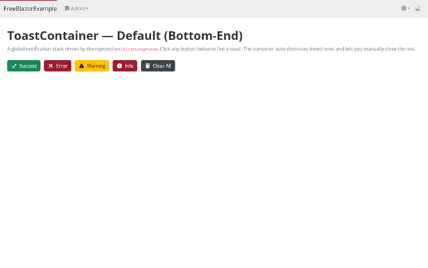
</a>
<br/>
<a href="screenshots/showcase-toastcontainer-v1/full.webp"><strong>ToastContainer V1</strong></a>
<br/><code>/showcase/toastcontainer/v1</code><br/>
✅ 200 &nbsp;⏱ 17,368ms &nbsp;📦 68.5 MB &nbsp;🖥 ✅ 0 err

<details>
<summary>📋 Details</summary>

**ToastContainer — Default (Bottom-End)**

**📊 Metrics**

| Metric | Value |
|--------|-------|
| HTTP Status | 200 |
| Navigation | 210 ms |
| Full Load (incl. settle) | 17,368 ms |
| Network Requests | 302 |
| Data Transferred | 68.5 MB |
| JS Errors | 0 |
| JS Warnings | 0 |

<details>
<summary>🌐 Network (302 requests, 68.5 MB)</summary>

| Method | Status | Duration | Bytes | URL |
|--------|:------:|:--------:|------:|-----|
| GET | 200 | 325ms | 9.0 MB | `http://localhost:5201/_framework/MudBlazor.mwezwdoi15.wasm` |
| GET | 200 | 321ms | 6.5 MB | `…:5201/_framework/Microsoft.CodeAnalysis.CSharp.df8hfd5o8z.wasm` |
| GET | 200 | 48ms | 6.0 MB | `…1/_framework/Basic.Reference.Assemblies.Net100.v8tl2dqzst.wasm` |
| GET | 200 | 47ms | 4.6 MB | `…calhost:5201/_framework/System.Private.CoreLib.btnahqa3oa.wasm` |
| GET | 200 | 1ms | 3.5 MB | `…t/BlazorMonaco/lib/monaco-editor/min/vs/editor.api-i0YVFWkl.js` |
| GET | 200 | 291ms | 3.0 MB | `…//localhost:5201/_framework/System.Private.Xml.c86ifkdlwh.wasm` |
| GET | 200 | 111ms | 2.9 MB | `…calhost:5201/_framework/Microsoft.CodeAnalysis.erp1n29u9n.wasm` |
| GET | 200 | 31ms | 2.9 MB | `http://localhost:5201/_framework/dotnet.native.imnhyiqpc9.wasm` |
| GET | 200 | 111ms | 2.4 MB | `http://localhost:5201/_framework/Radzen.Blazor.x7olzc7yc0.wasm` |
| GET | 200 | 297ms | 1.4 MB | `…lhost:5201/_framework/FreeBlazorExample.Client.n18ukcy7q5.wasm` |
| GET | 200 | 55ms | 1.0 MB | `…201/_content/Radzen.Blazor/fonts/MaterialSymbolsOutlined.woff2` |
| GET | 200 | 289ms | 984.3 KB | `…//localhost:5201/_framework/System.Data.Common.cp5bttdxwa.wasm` |
| GET | 200 | 48ms | 914.3 KB | `http://localhost:5201/_framework/BlazorBootstrap.zo6lifkmy7.wasm` |
| GET | 200 | 291ms | 829.3 KB | `…ework/System.Private.DataContractSerialization.yjhmavq6w2.wasm` |
| GET | 200 | 48ms | 788.2 KB | `…alhost:5201/_framework/FreeBlazorExample.Client.3ivhmqjexl.pdb` |
| … | … | … | … | *287 more* |

</details>

<details>
<summary>🖥 Console Info (1 messages)</summary>

```
[info] Debugging hotkey: Shift+Alt+D (when application has focus)
```

</details>

</details>

</td>
<td align="center" valign="top" width="33%">
<a href="screenshots/showcase-toastcontainer-v2/full.webp">
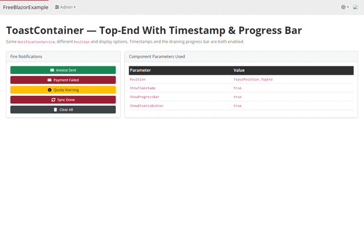
</a>
<br/>
<a href="screenshots/showcase-toastcontainer-v2/full.webp"><strong>ToastContainer V2</strong></a>
<br/><code>/showcase/toastcontainer/v2</code><br/>
✅ 200 &nbsp;⏱ 17,352ms &nbsp;📦 68.5 MB &nbsp;🖥 ✅ 0 err

<details>
<summary>📋 Details</summary>

**ToastContainer — Top-End With Timestamp &amp; Progress Bar**

**📊 Metrics**

| Metric | Value |
|--------|-------|
| HTTP Status | 200 |
| Navigation | 206 ms |
| Full Load (incl. settle) | 17,352 ms |
| Network Requests | 302 |
| Data Transferred | 68.5 MB |
| JS Errors | 0 |
| JS Warnings | 0 |

<details>
<summary>🌐 Network (302 requests, 68.5 MB)</summary>

| Method | Status | Duration | Bytes | URL |
|--------|:------:|:--------:|------:|-----|
| GET | 200 | 335ms | 9.0 MB | `http://localhost:5201/_framework/MudBlazor.mwezwdoi15.wasm` |
| GET | 200 | 334ms | 6.5 MB | `…:5201/_framework/Microsoft.CodeAnalysis.CSharp.df8hfd5o8z.wasm` |
| GET | 200 | 53ms | 6.0 MB | `…1/_framework/Basic.Reference.Assemblies.Net100.v8tl2dqzst.wasm` |
| GET | 200 | 52ms | 4.6 MB | `…calhost:5201/_framework/System.Private.CoreLib.btnahqa3oa.wasm` |
| GET | 200 | 1ms | 3.5 MB | `…t/BlazorMonaco/lib/monaco-editor/min/vs/editor.api-i0YVFWkl.js` |
| GET | 200 | 304ms | 3.0 MB | `…//localhost:5201/_framework/System.Private.Xml.c86ifkdlwh.wasm` |
| GET | 200 | 116ms | 2.9 MB | `…calhost:5201/_framework/Microsoft.CodeAnalysis.erp1n29u9n.wasm` |
| GET | 200 | 43ms | 2.9 MB | `http://localhost:5201/_framework/dotnet.native.imnhyiqpc9.wasm` |
| GET | 200 | 133ms | 2.4 MB | `http://localhost:5201/_framework/Radzen.Blazor.x7olzc7yc0.wasm` |
| GET | 200 | 299ms | 1.4 MB | `…lhost:5201/_framework/FreeBlazorExample.Client.n18ukcy7q5.wasm` |
| GET | 200 | 56ms | 1.0 MB | `…201/_content/Radzen.Blazor/fonts/MaterialSymbolsOutlined.woff2` |
| GET | 200 | 303ms | 984.3 KB | `…//localhost:5201/_framework/System.Data.Common.cp5bttdxwa.wasm` |
| GET | 200 | 53ms | 914.3 KB | `http://localhost:5201/_framework/BlazorBootstrap.zo6lifkmy7.wasm` |
| GET | 200 | 303ms | 829.3 KB | `…ework/System.Private.DataContractSerialization.yjhmavq6w2.wasm` |
| GET | 200 | 53ms | 788.2 KB | `…alhost:5201/_framework/FreeBlazorExample.Client.3ivhmqjexl.pdb` |
| … | … | … | … | *287 more* |

</details>

<details>
<summary>🖥 Console Info (1 messages)</summary>

```
[info] Debugging hotkey: Shift+Alt+D (when application has focus)
```

</details>

</details>

</td>
<td align="center" valign="top" width="33%">
<a href="screenshots/showcase-toastcontainer-v3/full.webp">
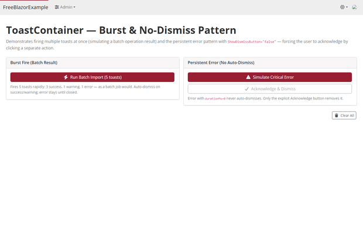
</a>
<br/>
<a href="screenshots/showcase-toastcontainer-v3/full.webp"><strong>ToastContainer V3</strong></a>
<br/><code>/showcase/toastcontainer/v3</code><br/>
✅ 200 &nbsp;⏱ 17,315ms &nbsp;📦 68.5 MB &nbsp;🖥 ✅ 0 err

<details>
<summary>📋 Details</summary>

**ToastContainer — Burst &amp; No-Dismiss Pattern**

**📊 Metrics**

| Metric | Value |
|--------|-------|
| HTTP Status | 200 |
| Navigation | 269 ms |
| Full Load (incl. settle) | 17,315 ms |
| Network Requests | 302 |
| Data Transferred | 68.5 MB |
| JS Errors | 0 |
| JS Warnings | 0 |

<details>
<summary>🌐 Network (302 requests, 68.5 MB)</summary>

| Method | Status | Duration | Bytes | URL |
|--------|:------:|:--------:|------:|-----|
| GET | 200 | 290ms | 9.0 MB | `http://localhost:5201/_framework/MudBlazor.mwezwdoi15.wasm` |
| GET | 200 | 92ms | 6.5 MB | `…:5201/_framework/Microsoft.CodeAnalysis.CSharp.df8hfd5o8z.wasm` |
| GET | 200 | 24ms | 6.0 MB | `…1/_framework/Basic.Reference.Assemblies.Net100.v8tl2dqzst.wasm` |
| GET | 200 | 24ms | 4.6 MB | `…calhost:5201/_framework/System.Private.CoreLib.btnahqa3oa.wasm` |
| GET | 200 | 2ms | 3.5 MB | `…t/BlazorMonaco/lib/monaco-editor/min/vs/editor.api-i0YVFWkl.js` |
| GET | 200 | 273ms | 3.0 MB | `…//localhost:5201/_framework/System.Private.Xml.c86ifkdlwh.wasm` |
| GET | 200 | 24ms | 2.9 MB | `…calhost:5201/_framework/Microsoft.CodeAnalysis.erp1n29u9n.wasm` |
| GET | 200 | 23ms | 2.9 MB | `http://localhost:5201/_framework/dotnet.native.imnhyiqpc9.wasm` |
| GET | 200 | 92ms | 2.4 MB | `http://localhost:5201/_framework/Radzen.Blazor.x7olzc7yc0.wasm` |
| GET | 200 | 277ms | 1.4 MB | `…lhost:5201/_framework/FreeBlazorExample.Client.n18ukcy7q5.wasm` |
| GET | 200 | 74ms | 1.0 MB | `…201/_content/Radzen.Blazor/fonts/MaterialSymbolsOutlined.woff2` |
| GET | 200 | 273ms | 984.3 KB | `…//localhost:5201/_framework/System.Data.Common.cp5bttdxwa.wasm` |
| GET | 200 | 24ms | 914.3 KB | `http://localhost:5201/_framework/BlazorBootstrap.zo6lifkmy7.wasm` |
| GET | 200 | 273ms | 829.3 KB | `…ework/System.Private.DataContractSerialization.yjhmavq6w2.wasm` |
| GET | 200 | 24ms | 788.2 KB | `…alhost:5201/_framework/FreeBlazorExample.Client.3ivhmqjexl.pdb` |
| … | … | … | … | *287 more* |

</details>

<details>
<summary>🖥 Console Info (1 messages)</summary>

```
[info] Debugging hotkey: Shift+Alt+D (when application has focus)
```

</details>

</details>

</td>
</tr>
<tr>
<td align="center" valign="top" width="33%">
<a href="screenshots/showcase-commandpalette-v1/full.webp">
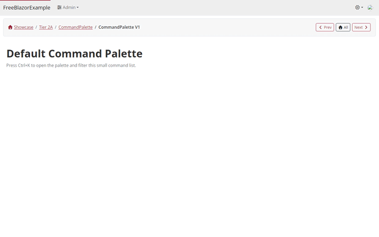
</a>
<br/>
<a href="screenshots/showcase-commandpalette-v1/full.webp"><strong>CommandPalette V1</strong></a>
<br/><code>/showcase/commandpalette/v1</code><br/>
✅ 200 &nbsp;⏱ 17,413ms &nbsp;📦 68.5 MB &nbsp;🖥 ✅ 0 err

<details>
<summary>📋 Details</summary>

**Default Command Palette**

**📊 Metrics**

| Metric | Value |
|--------|-------|
| HTTP Status | 200 |
| Navigation | 262 ms |
| Full Load (incl. settle) | 17,413 ms |
| Network Requests | 303 |
| Data Transferred | 68.5 MB |
| JS Errors | 0 |
| JS Warnings | 0 |

<details>
<summary>🌐 Network (303 requests, 68.5 MB)</summary>

| Method | Status | Duration | Bytes | URL |
|--------|:------:|:--------:|------:|-----|
| GET | 200 | 307ms | 9.0 MB | `http://localhost:5201/_framework/MudBlazor.mwezwdoi15.wasm` |
| GET | 200 | 303ms | 6.5 MB | `…:5201/_framework/Microsoft.CodeAnalysis.CSharp.df8hfd5o8z.wasm` |
| GET | 200 | 19ms | 6.0 MB | `…1/_framework/Basic.Reference.Assemblies.Net100.v8tl2dqzst.wasm` |
| GET | 200 | 19ms | 4.6 MB | `…calhost:5201/_framework/System.Private.CoreLib.btnahqa3oa.wasm` |
| GET | 200 | 2ms | 3.5 MB | `…t/BlazorMonaco/lib/monaco-editor/min/vs/editor.api-i0YVFWkl.js` |
| GET | 200 | 271ms | 3.0 MB | `…//localhost:5201/_framework/System.Private.Xml.c86ifkdlwh.wasm` |
| GET | 200 | 81ms | 2.9 MB | `…calhost:5201/_framework/Microsoft.CodeAnalysis.erp1n29u9n.wasm` |
| GET | 200 | 19ms | 2.9 MB | `http://localhost:5201/_framework/dotnet.native.imnhyiqpc9.wasm` |
| GET | 200 | 79ms | 2.4 MB | `http://localhost:5201/_framework/Radzen.Blazor.x7olzc7yc0.wasm` |
| GET | 200 | 281ms | 1.4 MB | `…lhost:5201/_framework/FreeBlazorExample.Client.n18ukcy7q5.wasm` |
| GET | 200 | 70ms | 1.0 MB | `…201/_content/Radzen.Blazor/fonts/MaterialSymbolsOutlined.woff2` |
| GET | 200 | 272ms | 984.3 KB | `…//localhost:5201/_framework/System.Data.Common.cp5bttdxwa.wasm` |
| GET | 200 | 19ms | 914.3 KB | `http://localhost:5201/_framework/BlazorBootstrap.zo6lifkmy7.wasm` |
| GET | 200 | 271ms | 829.3 KB | `…ework/System.Private.DataContractSerialization.yjhmavq6w2.wasm` |
| GET | 200 | 19ms | 788.2 KB | `…alhost:5201/_framework/FreeBlazorExample.Client.3ivhmqjexl.pdb` |
| … | … | … | … | *288 more* |

</details>

<details>
<summary>🖥 Console Info (1 messages)</summary>

```
[info] Debugging hotkey: Shift+Alt+D (when application has focus)
```

</details>

</details>

</td>
<td align="center" valign="top" width="33%">
<a href="screenshots/showcase-commandpalette-v2/full.webp">
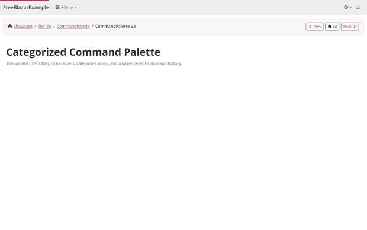
</a>
<br/>
<a href="screenshots/showcase-commandpalette-v2/full.webp"><strong>CommandPalette V2</strong></a>
<br/><code>/showcase/commandpalette/v2</code><br/>
✅ 200 &nbsp;⏱ 17,338ms &nbsp;📦 68.5 MB &nbsp;🖥 ✅ 0 err

<details>
<summary>📋 Details</summary>

**Categorized Command Palette**

**📊 Metrics**

| Metric | Value |
|--------|-------|
| HTTP Status | 200 |
| Navigation | 263 ms |
| Full Load (incl. settle) | 17,338 ms |
| Network Requests | 303 |
| Data Transferred | 68.5 MB |
| JS Errors | 0 |
| JS Warnings | 0 |

<details>
<summary>🌐 Network (303 requests, 68.5 MB)</summary>

| Method | Status | Duration | Bytes | URL |
|--------|:------:|:--------:|------:|-----|
| GET | 200 | 290ms | 9.0 MB | `http://localhost:5201/_framework/MudBlazor.mwezwdoi15.wasm` |
| GET | 200 | 291ms | 6.5 MB | `…:5201/_framework/Microsoft.CodeAnalysis.CSharp.df8hfd5o8z.wasm` |
| GET | 200 | 17ms | 6.0 MB | `…1/_framework/Basic.Reference.Assemblies.Net100.v8tl2dqzst.wasm` |
| GET | 200 | 17ms | 4.6 MB | `…calhost:5201/_framework/System.Private.CoreLib.btnahqa3oa.wasm` |
| GET | 200 | 2ms | 3.5 MB | `…t/BlazorMonaco/lib/monaco-editor/min/vs/editor.api-i0YVFWkl.js` |
| GET | 200 | 260ms | 3.0 MB | `…//localhost:5201/_framework/System.Private.Xml.c86ifkdlwh.wasm` |
| GET | 200 | 71ms | 2.9 MB | `…calhost:5201/_framework/Microsoft.CodeAnalysis.erp1n29u9n.wasm` |
| GET | 200 | 18ms | 2.9 MB | `http://localhost:5201/_framework/dotnet.native.imnhyiqpc9.wasm` |
| GET | 200 | 261ms | 2.4 MB | `http://localhost:5201/_framework/Radzen.Blazor.x7olzc7yc0.wasm` |
| GET | 200 | 267ms | 1.4 MB | `…lhost:5201/_framework/FreeBlazorExample.Client.n18ukcy7q5.wasm` |
| GET | 200 | 65ms | 1.0 MB | `…201/_content/Radzen.Blazor/fonts/MaterialSymbolsOutlined.woff2` |
| GET | 200 | 263ms | 984.3 KB | `…//localhost:5201/_framework/System.Data.Common.cp5bttdxwa.wasm` |
| GET | 200 | 17ms | 914.3 KB | `http://localhost:5201/_framework/BlazorBootstrap.zo6lifkmy7.wasm` |
| GET | 200 | 261ms | 829.3 KB | `…ework/System.Private.DataContractSerialization.yjhmavq6w2.wasm` |
| GET | 200 | 18ms | 788.2 KB | `…alhost:5201/_framework/FreeBlazorExample.Client.3ivhmqjexl.pdb` |
| … | … | … | … | *288 more* |

</details>

<details>
<summary>🖥 Console Info (1 messages)</summary>

```
[info] Debugging hotkey: Shift+Alt+D (when application has focus)
```

</details>

</details>

</td>
<td align="center" valign="top" width="33%">
<a href="screenshots/showcase-commandpalette-v3/full.webp">
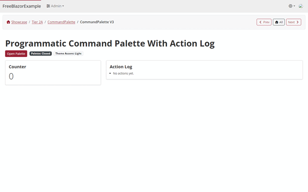
</a>
<br/>
<a href="screenshots/showcase-commandpalette-v3/full.webp"><strong>CommandPalette V3</strong></a>
<br/><code>/showcase/commandpalette/v3</code><br/>
✅ 200 &nbsp;⏱ 17,420ms &nbsp;📦 68.5 MB &nbsp;🖥 ✅ 0 err

<details>
<summary>📋 Details</summary>

**Programmatic Command Palette With Action Log**

**📊 Metrics**

| Metric | Value |
|--------|-------|
| HTTP Status | 200 |
| Navigation | 313 ms |
| Full Load (incl. settle) | 17,420 ms |
| Network Requests | 303 |
| Data Transferred | 68.5 MB |
| JS Errors | 0 |
| JS Warnings | 0 |

<details>
<summary>🌐 Network (303 requests, 68.5 MB)</summary>

| Method | Status | Duration | Bytes | URL |
|--------|:------:|:--------:|------:|-----|
| GET | 200 | 319ms | 9.0 MB | `http://localhost:5201/_framework/MudBlazor.mwezwdoi15.wasm` |
| GET | 200 | 304ms | 6.5 MB | `…:5201/_framework/Microsoft.CodeAnalysis.CSharp.df8hfd5o8z.wasm` |
| GET | 200 | 14ms | 6.0 MB | `…1/_framework/Basic.Reference.Assemblies.Net100.v8tl2dqzst.wasm` |
| GET | 200 | 14ms | 4.6 MB | `…calhost:5201/_framework/System.Private.CoreLib.btnahqa3oa.wasm` |
| GET | 200 | 3ms | 3.5 MB | `…t/BlazorMonaco/lib/monaco-editor/min/vs/editor.api-i0YVFWkl.js` |
| GET | 200 | 288ms | 3.0 MB | `…//localhost:5201/_framework/System.Private.Xml.c86ifkdlwh.wasm` |
| GET | 200 | 102ms | 2.9 MB | `…calhost:5201/_framework/Microsoft.CodeAnalysis.erp1n29u9n.wasm` |
| GET | 200 | 14ms | 2.9 MB | `http://localhost:5201/_framework/dotnet.native.imnhyiqpc9.wasm` |
| GET | 200 | 287ms | 2.4 MB | `http://localhost:5201/_framework/Radzen.Blazor.x7olzc7yc0.wasm` |
| GET | 200 | 291ms | 1.4 MB | `…lhost:5201/_framework/FreeBlazorExample.Client.n18ukcy7q5.wasm` |
| GET | 200 | 71ms | 1.0 MB | `…201/_content/Radzen.Blazor/fonts/MaterialSymbolsOutlined.woff2` |
| GET | 200 | 288ms | 984.3 KB | `…//localhost:5201/_framework/System.Data.Common.cp5bttdxwa.wasm` |
| GET | 200 | 14ms | 914.3 KB | `http://localhost:5201/_framework/BlazorBootstrap.zo6lifkmy7.wasm` |
| GET | 200 | 287ms | 829.3 KB | `…ework/System.Private.DataContractSerialization.yjhmavq6w2.wasm` |
| GET | 200 | 14ms | 788.2 KB | `…alhost:5201/_framework/FreeBlazorExample.Client.3ivhmqjexl.pdb` |
| … | … | … | … | *288 more* |

</details>

<details>
<summary>🖥 Console Info (1 messages)</summary>

```
[info] Debugging hotkey: Shift+Alt+D (when application has focus)
```

</details>

</details>

</td>
</tr>
<tr>
<td align="center" valign="top" width="33%">
<a href="screenshots/showcase-timer-v1/full.webp">
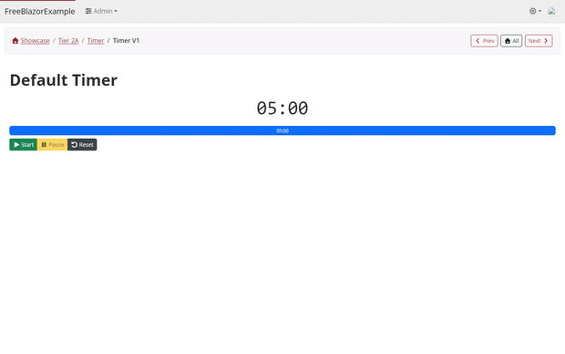
</a>
<br/>
<a href="screenshots/showcase-timer-v1/full.webp"><strong>Timer V1</strong></a>
<br/><code>/showcase/timer/v1</code><br/>
✅ 200 &nbsp;⏱ 17,634ms &nbsp;📦 68.5 MB &nbsp;🖥 ✅ 0 err

<details>
<summary>📋 Details</summary>

**Default Timer**

**📊 Metrics**

| Metric | Value |
|--------|-------|
| HTTP Status | 200 |
| Navigation | 261 ms |
| Full Load (incl. settle) | 17,634 ms |
| Network Requests | 302 |
| Data Transferred | 68.5 MB |
| JS Errors | 0 |
| JS Warnings | 0 |

<details>
<summary>🌐 Network (302 requests, 68.5 MB)</summary>

| Method | Status | Duration | Bytes | URL |
|--------|:------:|:--------:|------:|-----|
| GET | 200 | 313ms | 9.0 MB | `http://localhost:5201/_framework/MudBlazor.mwezwdoi15.wasm` |
| GET | 200 | 314ms | 6.5 MB | `…:5201/_framework/Microsoft.CodeAnalysis.CSharp.df8hfd5o8z.wasm` |
| GET | 200 | 20ms | 6.0 MB | `…1/_framework/Basic.Reference.Assemblies.Net100.v8tl2dqzst.wasm` |
| GET | 200 | 21ms | 4.6 MB | `…calhost:5201/_framework/System.Private.CoreLib.btnahqa3oa.wasm` |
| GET | 200 | 2ms | 3.5 MB | `…t/BlazorMonaco/lib/monaco-editor/min/vs/editor.api-i0YVFWkl.js` |
| GET | 200 | 278ms | 3.0 MB | `…//localhost:5201/_framework/System.Private.Xml.c86ifkdlwh.wasm` |
| GET | 200 | 80ms | 2.9 MB | `…calhost:5201/_framework/Microsoft.CodeAnalysis.erp1n29u9n.wasm` |
| GET | 200 | 20ms | 2.9 MB | `http://localhost:5201/_framework/dotnet.native.imnhyiqpc9.wasm` |
| GET | 200 | 99ms | 2.4 MB | `http://localhost:5201/_framework/Radzen.Blazor.x7olzc7yc0.wasm` |
| GET | 200 | 280ms | 1.4 MB | `…lhost:5201/_framework/FreeBlazorExample.Client.n18ukcy7q5.wasm` |
| GET | 200 | 44ms | 1.0 MB | `…201/_content/Radzen.Blazor/fonts/MaterialSymbolsOutlined.woff2` |
| GET | 200 | 283ms | 984.3 KB | `…//localhost:5201/_framework/System.Data.Common.cp5bttdxwa.wasm` |
| GET | 200 | 20ms | 914.3 KB | `http://localhost:5201/_framework/BlazorBootstrap.zo6lifkmy7.wasm` |
| GET | 200 | 278ms | 829.3 KB | `…ework/System.Private.DataContractSerialization.yjhmavq6w2.wasm` |
| GET | 200 | 20ms | 788.2 KB | `…alhost:5201/_framework/FreeBlazorExample.Client.3ivhmqjexl.pdb` |
| … | … | … | … | *287 more* |

</details>

<details>
<summary>🖥 Console Info (1 messages)</summary>

```
[info] Debugging hotkey: Shift+Alt+D (when application has focus)
```

</details>

</details>

</td>
<td align="center" valign="top" width="33%">
<a href="screenshots/showcase-timer-v2/full.webp">
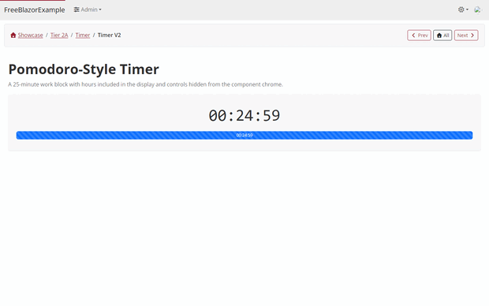
</a>
<br/>
<a href="screenshots/showcase-timer-v2/full.webp"><strong>Timer V2</strong></a>
<br/><code>/showcase/timer/v2</code><br/>
✅ 200 &nbsp;⏱ 17,749ms &nbsp;📦 68.5 MB &nbsp;🖥 ✅ 0 err

<details>
<summary>📋 Details</summary>

**Pomodoro-Style Timer**

**📊 Metrics**

| Metric | Value |
|--------|-------|
| HTTP Status | 200 |
| Navigation | 259 ms |
| Full Load (incl. settle) | 17,749 ms |
| Network Requests | 302 |
| Data Transferred | 68.5 MB |
| JS Errors | 0 |
| JS Warnings | 0 |

<details>
<summary>🌐 Network (302 requests, 68.5 MB)</summary>

| Method | Status | Duration | Bytes | URL |
|--------|:------:|:--------:|------:|-----|
| GET | 200 | 287ms | 9.0 MB | `http://localhost:5201/_framework/MudBlazor.mwezwdoi15.wasm` |
| GET | 200 | 283ms | 6.5 MB | `…:5201/_framework/Microsoft.CodeAnalysis.CSharp.df8hfd5o8z.wasm` |
| GET | 200 | 19ms | 6.0 MB | `…1/_framework/Basic.Reference.Assemblies.Net100.v8tl2dqzst.wasm` |
| GET | 200 | 19ms | 4.6 MB | `…calhost:5201/_framework/System.Private.CoreLib.btnahqa3oa.wasm` |
| GET | 200 | 2ms | 3.5 MB | `…t/BlazorMonaco/lib/monaco-editor/min/vs/editor.api-i0YVFWkl.js` |
| GET | 200 | 259ms | 3.0 MB | `…//localhost:5201/_framework/System.Private.Xml.c86ifkdlwh.wasm` |
| GET | 200 | 85ms | 2.9 MB | `…calhost:5201/_framework/Microsoft.CodeAnalysis.erp1n29u9n.wasm` |
| GET | 200 | 19ms | 2.9 MB | `http://localhost:5201/_framework/dotnet.native.imnhyiqpc9.wasm` |
| GET | 200 | 259ms | 2.4 MB | `http://localhost:5201/_framework/Radzen.Blazor.x7olzc7yc0.wasm` |
| GET | 200 | 260ms | 1.4 MB | `…lhost:5201/_framework/FreeBlazorExample.Client.n18ukcy7q5.wasm` |
| GET | 200 | 70ms | 1.0 MB | `…201/_content/Radzen.Blazor/fonts/MaterialSymbolsOutlined.woff2` |
| GET | 200 | 259ms | 984.3 KB | `…//localhost:5201/_framework/System.Data.Common.cp5bttdxwa.wasm` |
| GET | 200 | 19ms | 914.3 KB | `http://localhost:5201/_framework/BlazorBootstrap.zo6lifkmy7.wasm` |
| GET | 200 | 259ms | 829.3 KB | `…ework/System.Private.DataContractSerialization.yjhmavq6w2.wasm` |
| GET | 200 | 19ms | 788.2 KB | `…alhost:5201/_framework/FreeBlazorExample.Client.3ivhmqjexl.pdb` |
| … | … | … | … | *287 more* |

</details>

<details>
<summary>🖥 Console Info (1 messages)</summary>

```
[info] Debugging hotkey: Shift+Alt+D (when application has focus)
```

</details>

</details>

</td>
<td align="center" valign="top" width="33%">
<a href="screenshots/showcase-timer-v3/full.webp">
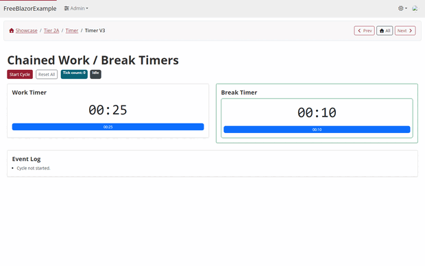
</a>
<br/>
<a href="screenshots/showcase-timer-v3/full.webp"><strong>Timer V3</strong></a>
<br/><code>/showcase/timer/v3</code><br/>
✅ 200 &nbsp;⏱ 17,340ms &nbsp;📦 68.5 MB &nbsp;🖥 ✅ 0 err

<details>
<summary>📋 Details</summary>

**Chained Work / Break Timers**

**📊 Metrics**

| Metric | Value |
|--------|-------|
| HTTP Status | 200 |
| Navigation | 239 ms |
| Full Load (incl. settle) | 17,340 ms |
| Network Requests | 302 |
| Data Transferred | 68.5 MB |
| JS Errors | 0 |
| JS Warnings | 0 |

<details>
<summary>🌐 Network (302 requests, 68.5 MB)</summary>

| Method | Status | Duration | Bytes | URL |
|--------|:------:|:--------:|------:|-----|
| GET | 200 | 299ms | 9.0 MB | `http://localhost:5201/_framework/MudBlazor.mwezwdoi15.wasm` |
| GET | 200 | 299ms | 6.5 MB | `…:5201/_framework/Microsoft.CodeAnalysis.CSharp.df8hfd5o8z.wasm` |
| GET | 200 | 27ms | 6.0 MB | `…1/_framework/Basic.Reference.Assemblies.Net100.v8tl2dqzst.wasm` |
| GET | 200 | 27ms | 4.6 MB | `…calhost:5201/_framework/System.Private.CoreLib.btnahqa3oa.wasm` |
| GET | 200 | 34ms | 3.5 MB | `…t/BlazorMonaco/lib/monaco-editor/min/vs/editor.api-i0YVFWkl.js` |
| GET | 200 | 273ms | 3.0 MB | `…//localhost:5201/_framework/System.Private.Xml.c86ifkdlwh.wasm` |
| GET | 200 | 115ms | 2.9 MB | `…calhost:5201/_framework/Microsoft.CodeAnalysis.erp1n29u9n.wasm` |
| GET | 200 | 50ms | 2.9 MB | `http://localhost:5201/_framework/dotnet.native.imnhyiqpc9.wasm` |
| GET | 200 | 277ms | 2.4 MB | `http://localhost:5201/_framework/Radzen.Blazor.x7olzc7yc0.wasm` |
| GET | 200 | 273ms | 1.4 MB | `…lhost:5201/_framework/FreeBlazorExample.Client.n18ukcy7q5.wasm` |
| GET | 200 | 53ms | 1.0 MB | `…201/_content/Radzen.Blazor/fonts/MaterialSymbolsOutlined.woff2` |
| GET | 200 | 278ms | 984.3 KB | `…//localhost:5201/_framework/System.Data.Common.cp5bttdxwa.wasm` |
| GET | 200 | 27ms | 914.3 KB | `http://localhost:5201/_framework/BlazorBootstrap.zo6lifkmy7.wasm` |
| GET | 200 | 273ms | 829.3 KB | `…ework/System.Private.DataContractSerialization.yjhmavq6w2.wasm` |
| GET | 200 | 27ms | 788.2 KB | `…alhost:5201/_framework/FreeBlazorExample.Client.3ivhmqjexl.pdb` |
| … | … | … | … | *287 more* |

</details>

<details>
<summary>🖥 Console Info (1 messages)</summary>

```
[info] Debugging hotkey: Shift+Alt+D (when application has focus)
```

</details>

</details>

</td>
</tr>
<tr>
<td align="center" valign="top" width="33%">
<a href="screenshots/showcase-pipelinetracker-v1/full.webp">
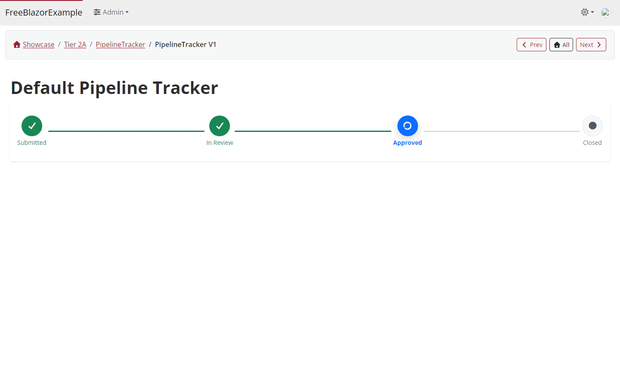
</a>
<br/>
<a href="screenshots/showcase-pipelinetracker-v1/full.webp"><strong>PipelineTracker V1</strong></a>
<br/><code>/showcase/pipelinetracker/v1</code><br/>
✅ 200 &nbsp;⏱ 17,719ms &nbsp;📦 68.5 MB &nbsp;🖥 ✅ 0 err

<details>
<summary>📋 Details</summary>

**Default Pipeline Tracker**

**📊 Metrics**

| Metric | Value |
|--------|-------|
| HTTP Status | 200 |
| Navigation | 254 ms |
| Full Load (incl. settle) | 17,719 ms |
| Network Requests | 302 |
| Data Transferred | 68.5 MB |
| JS Errors | 0 |
| JS Warnings | 0 |

<details>
<summary>🌐 Network (302 requests, 68.5 MB)</summary>

| Method | Status | Duration | Bytes | URL |
|--------|:------:|:--------:|------:|-----|
| GET | 200 | 307ms | 9.0 MB | `http://localhost:5201/_framework/MudBlazor.mwezwdoi15.wasm` |
| GET | 200 | 304ms | 6.5 MB | `…:5201/_framework/Microsoft.CodeAnalysis.CSharp.df8hfd5o8z.wasm` |
| GET | 200 | 19ms | 6.0 MB | `…1/_framework/Basic.Reference.Assemblies.Net100.v8tl2dqzst.wasm` |
| GET | 200 | 20ms | 4.6 MB | `…calhost:5201/_framework/System.Private.CoreLib.btnahqa3oa.wasm` |
| GET | 200 | 2ms | 3.5 MB | `…t/BlazorMonaco/lib/monaco-editor/min/vs/editor.api-i0YVFWkl.js` |
| GET | 200 | 271ms | 3.0 MB | `…//localhost:5201/_framework/System.Private.Xml.c86ifkdlwh.wasm` |
| GET | 200 | 76ms | 2.9 MB | `…calhost:5201/_framework/Microsoft.CodeAnalysis.erp1n29u9n.wasm` |
| GET | 200 | 19ms | 2.9 MB | `http://localhost:5201/_framework/dotnet.native.imnhyiqpc9.wasm` |
| GET | 200 | 91ms | 2.4 MB | `http://localhost:5201/_framework/Radzen.Blazor.x7olzc7yc0.wasm` |
| GET | 200 | 271ms | 1.4 MB | `…lhost:5201/_framework/FreeBlazorExample.Client.n18ukcy7q5.wasm` |
| GET | 200 | 42ms | 1.0 MB | `…201/_content/Radzen.Blazor/fonts/MaterialSymbolsOutlined.woff2` |
| GET | 200 | 273ms | 984.3 KB | `…//localhost:5201/_framework/System.Data.Common.cp5bttdxwa.wasm` |
| GET | 200 | 20ms | 914.3 KB | `http://localhost:5201/_framework/BlazorBootstrap.zo6lifkmy7.wasm` |
| GET | 200 | 272ms | 829.3 KB | `…ework/System.Private.DataContractSerialization.yjhmavq6w2.wasm` |
| GET | 200 | 19ms | 788.2 KB | `…alhost:5201/_framework/FreeBlazorExample.Client.3ivhmqjexl.pdb` |
| … | … | … | … | *287 more* |

</details>

<details>
<summary>🖥 Console Info (1 messages)</summary>

```
[info] Debugging hotkey: Shift+Alt+D (when application has focus)
```

</details>

</details>

</td>
<td align="center" valign="top" width="33%">
<a href="screenshots/showcase-pipelinetracker-v2/full.webp">
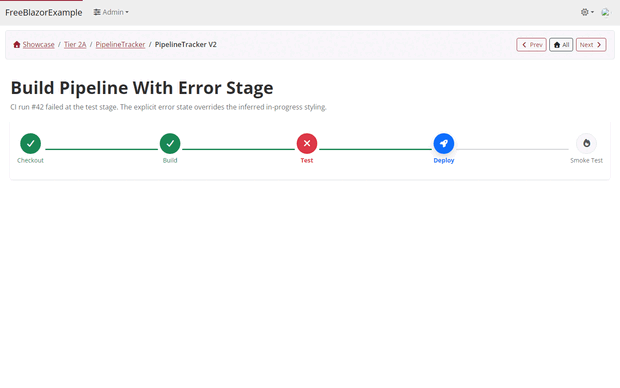
</a>
<br/>
<a href="screenshots/showcase-pipelinetracker-v2/full.webp"><strong>PipelineTracker V2</strong></a>
<br/><code>/showcase/pipelinetracker/v2</code><br/>
✅ 200 &nbsp;⏱ 17,327ms &nbsp;📦 68.5 MB &nbsp;🖥 ✅ 0 err

<details>
<summary>📋 Details</summary>

**Build Pipeline With Error Stage**

**📊 Metrics**

| Metric | Value |
|--------|-------|
| HTTP Status | 200 |
| Navigation | 279 ms |
| Full Load (incl. settle) | 17,327 ms |
| Network Requests | 302 |
| Data Transferred | 68.5 MB |
| JS Errors | 0 |
| JS Warnings | 0 |

<details>
<summary>🌐 Network (302 requests, 68.5 MB)</summary>

| Method | Status | Duration | Bytes | URL |
|--------|:------:|:--------:|------:|-----|
| GET | 200 | 317ms | 9.0 MB | `http://localhost:5201/_framework/MudBlazor.mwezwdoi15.wasm` |
| GET | 200 | 317ms | 6.5 MB | `…:5201/_framework/Microsoft.CodeAnalysis.CSharp.df8hfd5o8z.wasm` |
| GET | 200 | 19ms | 6.0 MB | `…1/_framework/Basic.Reference.Assemblies.Net100.v8tl2dqzst.wasm` |
| GET | 200 | 18ms | 4.6 MB | `…calhost:5201/_framework/System.Private.CoreLib.btnahqa3oa.wasm` |
| GET | 200 | 4ms | 3.5 MB | `…t/BlazorMonaco/lib/monaco-editor/min/vs/editor.api-i0YVFWkl.js` |
| GET | 200 | 284ms | 3.0 MB | `…//localhost:5201/_framework/System.Private.Xml.c86ifkdlwh.wasm` |
| GET | 200 | 83ms | 2.9 MB | `…calhost:5201/_framework/Microsoft.CodeAnalysis.erp1n29u9n.wasm` |
| GET | 200 | 19ms | 2.9 MB | `http://localhost:5201/_framework/dotnet.native.imnhyiqpc9.wasm` |
| GET | 200 | 285ms | 2.4 MB | `http://localhost:5201/_framework/Radzen.Blazor.x7olzc7yc0.wasm` |
| GET | 200 | 285ms | 1.4 MB | `…lhost:5201/_framework/FreeBlazorExample.Client.n18ukcy7q5.wasm` |
| GET | 200 | 46ms | 1.0 MB | `…201/_content/Radzen.Blazor/fonts/MaterialSymbolsOutlined.woff2` |
| GET | 200 | 286ms | 984.3 KB | `…//localhost:5201/_framework/System.Data.Common.cp5bttdxwa.wasm` |
| GET | 200 | 19ms | 914.3 KB | `http://localhost:5201/_framework/BlazorBootstrap.zo6lifkmy7.wasm` |
| GET | 200 | 283ms | 829.3 KB | `…ework/System.Private.DataContractSerialization.yjhmavq6w2.wasm` |
| GET | 200 | 19ms | 788.2 KB | `…alhost:5201/_framework/FreeBlazorExample.Client.3ivhmqjexl.pdb` |
| … | … | … | … | *287 more* |

</details>

<details>
<summary>🖥 Console Info (1 messages)</summary>

```
[info] Debugging hotkey: Shift+Alt+D (when application has focus)
```

</details>

</details>

</td>
<td align="center" valign="top" width="33%">
<a href="screenshots/showcase-pipelinetracker-v3/full.webp">
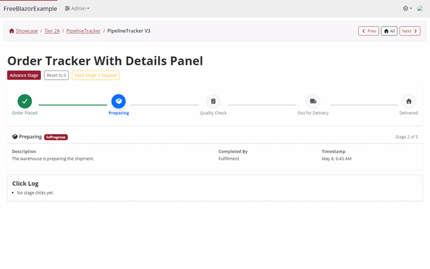
</a>
<br/>
<a href="screenshots/showcase-pipelinetracker-v3/full.webp"><strong>PipelineTracker V3</strong></a>
<br/><code>/showcase/pipelinetracker/v3</code><br/>
✅ 200 &nbsp;⏱ 17,450ms &nbsp;📦 68.5 MB &nbsp;🖥 ✅ 0 err

<details>
<summary>📋 Details</summary>

**Order Tracker With Details Panel**

**📊 Metrics**

| Metric | Value |
|--------|-------|
| HTTP Status | 200 |
| Navigation | 258 ms |
| Full Load (incl. settle) | 17,450 ms |
| Network Requests | 302 |
| Data Transferred | 68.5 MB |
| JS Errors | 0 |
| JS Warnings | 0 |

<details>
<summary>🌐 Network (302 requests, 68.5 MB)</summary>

| Method | Status | Duration | Bytes | URL |
|--------|:------:|:--------:|------:|-----|
| GET | 200 | 267ms | 9.0 MB | `http://localhost:5201/_framework/MudBlazor.mwezwdoi15.wasm` |
| GET | 200 | 264ms | 6.5 MB | `…:5201/_framework/Microsoft.CodeAnalysis.CSharp.df8hfd5o8z.wasm` |
| GET | 200 | 20ms | 6.0 MB | `…1/_framework/Basic.Reference.Assemblies.Net100.v8tl2dqzst.wasm` |
| GET | 200 | 20ms | 4.6 MB | `…calhost:5201/_framework/System.Private.CoreLib.btnahqa3oa.wasm` |
| GET | 200 | 1ms | 3.5 MB | `…t/BlazorMonaco/lib/monaco-editor/min/vs/editor.api-i0YVFWkl.js` |
| GET | 200 | 267ms | 3.0 MB | `…//localhost:5201/_framework/System.Private.Xml.c86ifkdlwh.wasm` |
| GET | 200 | 77ms | 2.9 MB | `…calhost:5201/_framework/Microsoft.CodeAnalysis.erp1n29u9n.wasm` |
| GET | 200 | 19ms | 2.9 MB | `http://localhost:5201/_framework/dotnet.native.imnhyiqpc9.wasm` |
| GET | 200 | 263ms | 2.4 MB | `http://localhost:5201/_framework/Radzen.Blazor.x7olzc7yc0.wasm` |
| GET | 200 | 276ms | 1.4 MB | `…lhost:5201/_framework/FreeBlazorExample.Client.n18ukcy7q5.wasm` |
| GET | 200 | 44ms | 1.0 MB | `…201/_content/Radzen.Blazor/fonts/MaterialSymbolsOutlined.woff2` |
| GET | 200 | 265ms | 984.3 KB | `…//localhost:5201/_framework/System.Data.Common.cp5bttdxwa.wasm` |
| GET | 200 | 21ms | 914.3 KB | `http://localhost:5201/_framework/BlazorBootstrap.zo6lifkmy7.wasm` |
| GET | 200 | 267ms | 829.3 KB | `…ework/System.Private.DataContractSerialization.yjhmavq6w2.wasm` |
| GET | 200 | 20ms | 788.2 KB | `…alhost:5201/_framework/FreeBlazorExample.Client.3ivhmqjexl.pdb` |
| … | … | … | … | *287 more* |

</details>

<details>
<summary>🖥 Console Info (1 messages)</summary>

```
[info] Debugging hotkey: Shift+Alt+D (when application has focus)
```

</details>

</details>

</td>
</tr>
<tr>
<td align="center" valign="top" width="33%">
<a href="screenshots/showcase-timeline-v1/full.webp">
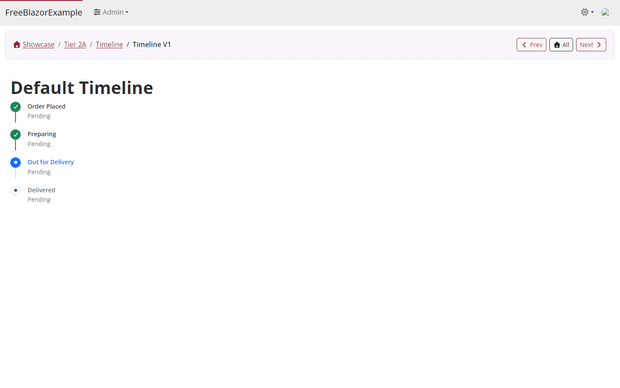
</a>
<br/>
<a href="screenshots/showcase-timeline-v1/full.webp"><strong>Timeline V1</strong></a>
<br/><code>/showcase/timeline/v1</code><br/>
✅ 200 &nbsp;⏱ 17,619ms &nbsp;📦 68.5 MB &nbsp;🖥 ✅ 0 err

<details>
<summary>📋 Details</summary>

**Default Timeline**

**📊 Metrics**

| Metric | Value |
|--------|-------|
| HTTP Status | 200 |
| Navigation | 256 ms |
| Full Load (incl. settle) | 17,619 ms |
| Network Requests | 302 |
| Data Transferred | 68.5 MB |
| JS Errors | 0 |
| JS Warnings | 0 |

<details>
<summary>🌐 Network (302 requests, 68.5 MB)</summary>

| Method | Status | Duration | Bytes | URL |
|--------|:------:|:--------:|------:|-----|
| GET | 200 | 300ms | 9.0 MB | `http://localhost:5201/_framework/MudBlazor.mwezwdoi15.wasm` |
| GET | 200 | 298ms | 6.5 MB | `…:5201/_framework/Microsoft.CodeAnalysis.CSharp.df8hfd5o8z.wasm` |
| GET | 200 | 18ms | 6.0 MB | `…1/_framework/Basic.Reference.Assemblies.Net100.v8tl2dqzst.wasm` |
| GET | 200 | 19ms | 4.6 MB | `…calhost:5201/_framework/System.Private.CoreLib.btnahqa3oa.wasm` |
| GET | 200 | 1ms | 3.5 MB | `…t/BlazorMonaco/lib/monaco-editor/min/vs/editor.api-i0YVFWkl.js` |
| GET | 200 | 268ms | 3.0 MB | `…//localhost:5201/_framework/System.Private.Xml.c86ifkdlwh.wasm` |
| GET | 200 | 84ms | 2.9 MB | `…calhost:5201/_framework/Microsoft.CodeAnalysis.erp1n29u9n.wasm` |
| GET | 200 | 18ms | 2.9 MB | `http://localhost:5201/_framework/dotnet.native.imnhyiqpc9.wasm` |
| GET | 200 | 84ms | 2.4 MB | `http://localhost:5201/_framework/Radzen.Blazor.x7olzc7yc0.wasm` |
| GET | 200 | 268ms | 1.4 MB | `…lhost:5201/_framework/FreeBlazorExample.Client.n18ukcy7q5.wasm` |
| GET | 200 | 68ms | 1.0 MB | `…201/_content/Radzen.Blazor/fonts/MaterialSymbolsOutlined.woff2` |
| GET | 200 | 268ms | 984.3 KB | `…//localhost:5201/_framework/System.Data.Common.cp5bttdxwa.wasm` |
| GET | 200 | 18ms | 914.3 KB | `http://localhost:5201/_framework/BlazorBootstrap.zo6lifkmy7.wasm` |
| GET | 200 | 268ms | 829.3 KB | `…ework/System.Private.DataContractSerialization.yjhmavq6w2.wasm` |
| GET | 200 | 18ms | 788.2 KB | `…alhost:5201/_framework/FreeBlazorExample.Client.3ivhmqjexl.pdb` |
| … | … | … | … | *287 more* |

</details>

<details>
<summary>🖥 Console Info (1 messages)</summary>

```
[info] Debugging hotkey: Shift+Alt+D (when application has focus)
```

</details>

</details>

</td>
<td align="center" valign="top" width="33%">
<a href="screenshots/showcase-timeline-v2/full.webp">
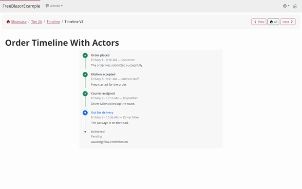
</a>
<br/>
<a href="screenshots/showcase-timeline-v2/full.webp"><strong>Timeline V2</strong></a>
<br/><code>/showcase/timeline/v2</code><br/>
✅ 200 &nbsp;⏱ 17,335ms &nbsp;📦 68.5 MB &nbsp;🖥 ✅ 0 err

<details>
<summary>📋 Details</summary>

**Order Timeline With Actors**

**📊 Metrics**

| Metric | Value |
|--------|-------|
| HTTP Status | 200 |
| Navigation | 270 ms |
| Full Load (incl. settle) | 17,335 ms |
| Network Requests | 302 |
| Data Transferred | 68.5 MB |
| JS Errors | 0 |
| JS Warnings | 0 |

<details>
<summary>🌐 Network (302 requests, 68.5 MB)</summary>

| Method | Status | Duration | Bytes | URL |
|--------|:------:|:--------:|------:|-----|
| GET | 200 | 307ms | 9.0 MB | `http://localhost:5201/_framework/MudBlazor.mwezwdoi15.wasm` |
| GET | 200 | 307ms | 6.5 MB | `…:5201/_framework/Microsoft.CodeAnalysis.CSharp.df8hfd5o8z.wasm` |
| GET | 200 | 19ms | 6.0 MB | `…1/_framework/Basic.Reference.Assemblies.Net100.v8tl2dqzst.wasm` |
| GET | 200 | 18ms | 4.6 MB | `…calhost:5201/_framework/System.Private.CoreLib.btnahqa3oa.wasm` |
| GET | 200 | 2ms | 3.5 MB | `…t/BlazorMonaco/lib/monaco-editor/min/vs/editor.api-i0YVFWkl.js` |
| GET | 200 | 284ms | 3.0 MB | `…//localhost:5201/_framework/System.Private.Xml.c86ifkdlwh.wasm` |
| GET | 200 | 63ms | 2.9 MB | `…calhost:5201/_framework/Microsoft.CodeAnalysis.erp1n29u9n.wasm` |
| GET | 200 | 20ms | 2.9 MB | `http://localhost:5201/_framework/dotnet.native.imnhyiqpc9.wasm` |
| GET | 200 | 95ms | 2.4 MB | `http://localhost:5201/_framework/Radzen.Blazor.x7olzc7yc0.wasm` |
| GET | 200 | 281ms | 1.4 MB | `…lhost:5201/_framework/FreeBlazorExample.Client.n18ukcy7q5.wasm` |
| GET | 200 | 65ms | 1.0 MB | `…201/_content/Radzen.Blazor/fonts/MaterialSymbolsOutlined.woff2` |
| GET | 200 | 281ms | 984.3 KB | `…//localhost:5201/_framework/System.Data.Common.cp5bttdxwa.wasm` |
| GET | 200 | 19ms | 914.3 KB | `http://localhost:5201/_framework/BlazorBootstrap.zo6lifkmy7.wasm` |
| GET | 200 | 283ms | 829.3 KB | `…ework/System.Private.DataContractSerialization.yjhmavq6w2.wasm` |
| GET | 200 | 19ms | 788.2 KB | `…alhost:5201/_framework/FreeBlazorExample.Client.3ivhmqjexl.pdb` |
| … | … | … | … | *287 more* |

</details>

<details>
<summary>🖥 Console Info (1 messages)</summary>

```
[info] Debugging hotkey: Shift+Alt+D (when application has focus)
```

</details>

</details>

</td>
<td align="center" valign="top" width="33%">
<a href="screenshots/showcase-timeline-v3/full.webp">
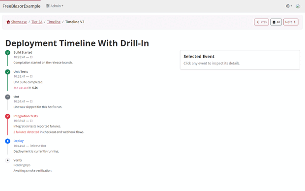
</a>
<br/>
<a href="screenshots/showcase-timeline-v3/full.webp"><strong>Timeline V3</strong></a>
<br/><code>/showcase/timeline/v3</code><br/>
✅ 200 &nbsp;⏱ 17,455ms &nbsp;📦 68.5 MB &nbsp;🖥 ✅ 0 err

<details>
<summary>📋 Details</summary>

**Deployment Timeline With Drill-In**

**📊 Metrics**

| Metric | Value |
|--------|-------|
| HTTP Status | 200 |
| Navigation | 258 ms |
| Full Load (incl. settle) | 17,455 ms |
| Network Requests | 302 |
| Data Transferred | 68.5 MB |
| JS Errors | 0 |
| JS Warnings | 0 |

<details>
<summary>🌐 Network (302 requests, 68.5 MB)</summary>

| Method | Status | Duration | Bytes | URL |
|--------|:------:|:--------:|------:|-----|
| GET | 200 | 311ms | 9.0 MB | `http://localhost:5201/_framework/MudBlazor.mwezwdoi15.wasm` |
| GET | 200 | 302ms | 6.5 MB | `…:5201/_framework/Microsoft.CodeAnalysis.CSharp.df8hfd5o8z.wasm` |
| GET | 200 | 16ms | 6.0 MB | `…1/_framework/Basic.Reference.Assemblies.Net100.v8tl2dqzst.wasm` |
| GET | 200 | 16ms | 4.6 MB | `…calhost:5201/_framework/System.Private.CoreLib.btnahqa3oa.wasm` |
| GET | 200 | 3ms | 3.5 MB | `…t/BlazorMonaco/lib/monaco-editor/min/vs/editor.api-i0YVFWkl.js` |
| GET | 200 | 267ms | 3.0 MB | `…//localhost:5201/_framework/System.Private.Xml.c86ifkdlwh.wasm` |
| GET | 200 | 79ms | 2.9 MB | `…calhost:5201/_framework/Microsoft.CodeAnalysis.erp1n29u9n.wasm` |
| GET | 200 | 16ms | 2.9 MB | `http://localhost:5201/_framework/dotnet.native.imnhyiqpc9.wasm` |
| GET | 200 | 77ms | 2.4 MB | `http://localhost:5201/_framework/Radzen.Blazor.x7olzc7yc0.wasm` |
| GET | 200 | 269ms | 1.4 MB | `…lhost:5201/_framework/FreeBlazorExample.Client.n18ukcy7q5.wasm` |
| GET | 200 | 45ms | 1.0 MB | `…201/_content/Radzen.Blazor/fonts/MaterialSymbolsOutlined.woff2` |
| GET | 200 | 267ms | 984.3 KB | `…//localhost:5201/_framework/System.Data.Common.cp5bttdxwa.wasm` |
| GET | 200 | 16ms | 914.3 KB | `http://localhost:5201/_framework/BlazorBootstrap.zo6lifkmy7.wasm` |
| GET | 200 | 267ms | 829.3 KB | `…ework/System.Private.DataContractSerialization.yjhmavq6w2.wasm` |
| GET | 200 | 16ms | 788.2 KB | `…alhost:5201/_framework/FreeBlazorExample.Client.3ivhmqjexl.pdb` |
| … | … | … | … | *287 more* |

</details>

<details>
<summary>🖥 Console Info (1 messages)</summary>

```
[info] Debugging hotkey: Shift+Alt+D (when application has focus)
```

</details>

</details>

</td>
</tr>
<tr>
<td align="center" valign="top" width="33%">
<a href="screenshots/showcase-imagegallery-v1/full.webp">
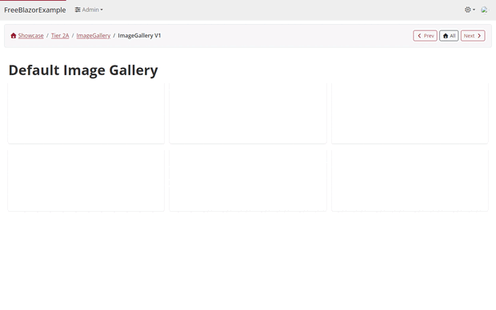
</a>
<br/>
<a href="screenshots/showcase-imagegallery-v1/full.webp"><strong>ImageGallery V1</strong></a>
<br/><code>/showcase/imagegallery/v1</code><br/>
✅ 200 &nbsp;⏱ 18,208ms &nbsp;📦 68.7 MB &nbsp;🖥 ✅ 0 err

<details>
<summary>📋 Details</summary>

**Default Image Gallery**

**📊 Metrics**

| Metric | Value |
|--------|-------|
| HTTP Status | 200 |
| Navigation | 224 ms |
| Full Load (incl. settle) | 18,208 ms |
| Network Requests | 314 |
| Data Transferred | 68.7 MB |
| JS Errors | 0 |
| JS Warnings | 0 |

<details>
<summary>🌐 Network (314 requests, 68.7 MB)</summary>

| Method | Status | Duration | Bytes | URL |
|--------|:------:|:--------:|------:|-----|
| GET | 200 | 305ms | 9.0 MB | `http://localhost:5201/_framework/MudBlazor.mwezwdoi15.wasm` |
| GET | 200 | 306ms | 6.5 MB | `…:5201/_framework/Microsoft.CodeAnalysis.CSharp.df8hfd5o8z.wasm` |
| GET | 200 | 20ms | 6.0 MB | `…1/_framework/Basic.Reference.Assemblies.Net100.v8tl2dqzst.wasm` |
| GET | 200 | 21ms | 4.6 MB | `…calhost:5201/_framework/System.Private.CoreLib.btnahqa3oa.wasm` |
| GET | 200 | 1ms | 3.5 MB | `…t/BlazorMonaco/lib/monaco-editor/min/vs/editor.api-i0YVFWkl.js` |
| GET | 200 | 286ms | 3.0 MB | `…//localhost:5201/_framework/System.Private.Xml.c86ifkdlwh.wasm` |
| GET | 200 | 277ms | 2.9 MB | `…calhost:5201/_framework/Microsoft.CodeAnalysis.erp1n29u9n.wasm` |
| GET | 200 | 33ms | 2.9 MB | `http://localhost:5201/_framework/dotnet.native.imnhyiqpc9.wasm` |
| GET | 200 | 279ms | 2.4 MB | `http://localhost:5201/_framework/Radzen.Blazor.x7olzc7yc0.wasm` |
| GET | 200 | 293ms | 1.4 MB | `…lhost:5201/_framework/FreeBlazorExample.Client.n18ukcy7q5.wasm` |
| GET | 200 | 55ms | 1.0 MB | `…201/_content/Radzen.Blazor/fonts/MaterialSymbolsOutlined.woff2` |
| GET | 200 | 280ms | 984.3 KB | `…//localhost:5201/_framework/System.Data.Common.cp5bttdxwa.wasm` |
| GET | 200 | 20ms | 914.3 KB | `http://localhost:5201/_framework/BlazorBootstrap.zo6lifkmy7.wasm` |
| GET | 200 | 285ms | 829.3 KB | `…ework/System.Private.DataContractSerialization.yjhmavq6w2.wasm` |
| GET | 200 | 20ms | 788.2 KB | `…alhost:5201/_framework/FreeBlazorExample.Client.3ivhmqjexl.pdb` |
| … | … | … | … | *299 more* |

</details>

<details>
<summary>🖥 Console Info (1 messages)</summary>

```
[info] Debugging hotkey: Shift+Alt+D (when application has focus)
```

</details>

</details>

</td>
<td align="center" valign="top" width="33%">
<a href="screenshots/showcase-imagegallery-v2/full.webp">
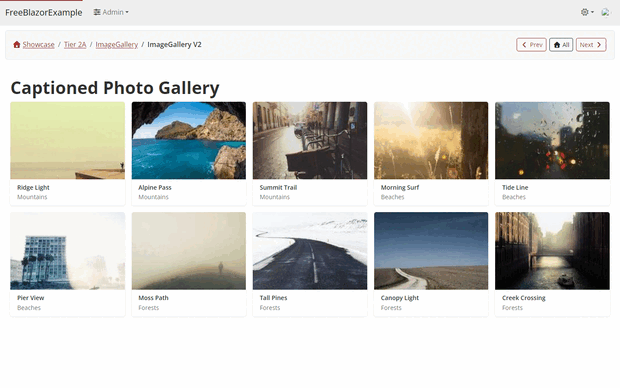
</a>
<br/>
<a href="screenshots/showcase-imagegallery-v2/full.webp"><strong>ImageGallery V2</strong></a>
<br/><code>/showcase/imagegallery/v2</code><br/>
✅ 200 &nbsp;⏱ 18,414ms &nbsp;📦 68.6 MB &nbsp;🖥 ✅ 0 err

<details>
<summary>📋 Details</summary>

**Captioned Photo Gallery**

**📊 Metrics**

| Metric | Value |
|--------|-------|
| HTTP Status | 200 |
| Navigation | 309 ms |
| Full Load (incl. settle) | 18,414 ms |
| Network Requests | 322 |
| Data Transferred | 68.6 MB |
| JS Errors | 0 |
| JS Warnings | 0 |

<details>
<summary>🌐 Network (322 requests, 68.6 MB)</summary>

| Method | Status | Duration | Bytes | URL |
|--------|:------:|:--------:|------:|-----|
| GET | 200 | 287ms | 9.0 MB | `http://localhost:5201/_framework/MudBlazor.mwezwdoi15.wasm` |
| GET | 200 | 284ms | 6.5 MB | `…:5201/_framework/Microsoft.CodeAnalysis.CSharp.df8hfd5o8z.wasm` |
| GET | 200 | 16ms | 6.0 MB | `…1/_framework/Basic.Reference.Assemblies.Net100.v8tl2dqzst.wasm` |
| GET | 200 | 16ms | 4.6 MB | `…calhost:5201/_framework/System.Private.CoreLib.btnahqa3oa.wasm` |
| GET | 200 | 2ms | 3.5 MB | `…t/BlazorMonaco/lib/monaco-editor/min/vs/editor.api-i0YVFWkl.js` |
| GET | 200 | 53ms | 3.0 MB | `…//localhost:5201/_framework/System.Private.Xml.c86ifkdlwh.wasm` |
| GET | 200 | 47ms | 2.9 MB | `…calhost:5201/_framework/Microsoft.CodeAnalysis.erp1n29u9n.wasm` |
| GET | 200 | 16ms | 2.9 MB | `http://localhost:5201/_framework/dotnet.native.imnhyiqpc9.wasm` |
| GET | 200 | 46ms | 2.4 MB | `http://localhost:5201/_framework/Radzen.Blazor.x7olzc7yc0.wasm` |
| GET | 200 | 243ms | 1.4 MB | `…lhost:5201/_framework/FreeBlazorExample.Client.n18ukcy7q5.wasm` |
| GET | 200 | 43ms | 1.0 MB | `…201/_content/Radzen.Blazor/fonts/MaterialSymbolsOutlined.woff2` |
| GET | 200 | 45ms | 984.3 KB | `…//localhost:5201/_framework/System.Data.Common.cp5bttdxwa.wasm` |
| GET | 200 | 16ms | 914.3 KB | `http://localhost:5201/_framework/BlazorBootstrap.zo6lifkmy7.wasm` |
| GET | 200 | 52ms | 829.3 KB | `…ework/System.Private.DataContractSerialization.yjhmavq6w2.wasm` |
| GET | 200 | 16ms | 788.2 KB | `…alhost:5201/_framework/FreeBlazorExample.Client.3ivhmqjexl.pdb` |
| … | … | … | … | *307 more* |

</details>

<details>
<summary>🖥 Console Info (1 messages)</summary>

```
[info] Debugging hotkey: Shift+Alt+D (when application has focus)
```

</details>

</details>

</td>
<td align="center" valign="top" width="33%">
<a href="screenshots/showcase-imagegallery-v3/full.webp">
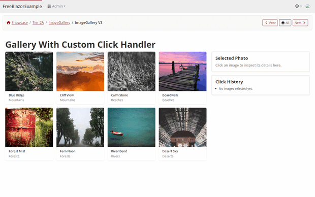
</a>
<br/>
<a href="screenshots/showcase-imagegallery-v3/full.webp"><strong>ImageGallery V3</strong></a>
<br/><code>/showcase/imagegallery/v3</code><br/>
✅ 200 &nbsp;⏱ 17,758ms &nbsp;📦 69.6 MB &nbsp;🖥 ✅ 0 err

<details>
<summary>📋 Details</summary>

**Gallery With Custom Click Handler**

**📊 Metrics**

| Metric | Value |
|--------|-------|
| HTTP Status | 200 |
| Navigation | 268 ms |
| Full Load (incl. settle) | 17,758 ms |
| Network Requests | 318 |
| Data Transferred | 69.6 MB |
| JS Errors | 0 |
| JS Warnings | 0 |

<details>
<summary>🌐 Network (318 requests, 69.6 MB)</summary>

| Method | Status | Duration | Bytes | URL |
|--------|:------:|:--------:|------:|-----|
| GET | 200 | 287ms | 9.0 MB | `http://localhost:5201/_framework/MudBlazor.mwezwdoi15.wasm` |
| GET | 200 | 290ms | 6.5 MB | `…:5201/_framework/Microsoft.CodeAnalysis.CSharp.df8hfd5o8z.wasm` |
| GET | 200 | 18ms | 6.0 MB | `…1/_framework/Basic.Reference.Assemblies.Net100.v8tl2dqzst.wasm` |
| GET | 200 | 18ms | 4.6 MB | `…calhost:5201/_framework/System.Private.CoreLib.btnahqa3oa.wasm` |
| GET | 200 | 1ms | 3.5 MB | `…t/BlazorMonaco/lib/monaco-editor/min/vs/editor.api-i0YVFWkl.js` |
| GET | 200 | 260ms | 3.0 MB | `…//localhost:5201/_framework/System.Private.Xml.c86ifkdlwh.wasm` |
| GET | 200 | 69ms | 2.9 MB | `…calhost:5201/_framework/Microsoft.CodeAnalysis.erp1n29u9n.wasm` |
| GET | 200 | 17ms | 2.9 MB | `http://localhost:5201/_framework/dotnet.native.imnhyiqpc9.wasm` |
| GET | 200 | 76ms | 2.4 MB | `http://localhost:5201/_framework/Radzen.Blazor.x7olzc7yc0.wasm` |
| GET | 200 | 267ms | 1.4 MB | `…lhost:5201/_framework/FreeBlazorExample.Client.n18ukcy7q5.wasm` |
| GET | 200 | 70ms | 1.0 MB | `…201/_content/Radzen.Blazor/fonts/MaterialSymbolsOutlined.woff2` |
| GET | 200 | 257ms | 984.3 KB | `…//localhost:5201/_framework/System.Data.Common.cp5bttdxwa.wasm` |
| GET | 200 | 18ms | 914.3 KB | `http://localhost:5201/_framework/BlazorBootstrap.zo6lifkmy7.wasm` |
| GET | 200 | 260ms | 829.3 KB | `…ework/System.Private.DataContractSerialization.yjhmavq6w2.wasm` |
| GET | 200 | 18ms | 788.2 KB | `…alhost:5201/_framework/FreeBlazorExample.Client.3ivhmqjexl.pdb` |
| … | … | … | … | *303 more* |

</details>

<details>
<summary>🖥 Console Info (1 messages)</summary>

```
[info] Debugging hotkey: Shift+Alt+D (when application has focus)
```

</details>

</details>

</td>
</tr>
</table>

---

## Tier 2B Variants

> 15 pages &nbsp;|&nbsp; ✅ 15 ok &nbsp;|&nbsp; 🔴 0 JS errors &nbsp;|&nbsp; 📦 1029.1 MB transferred

<table>
<tr>
<td align="center" valign="top" width="33%">
<a href="screenshots/showcase-carousel-v1/full.webp">
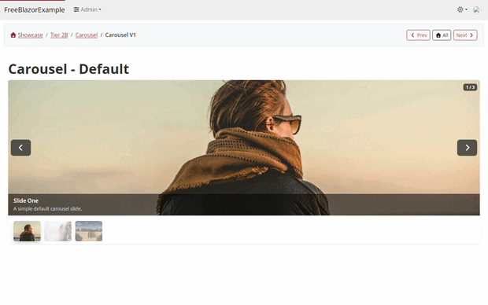
</a>
<br/>
<a href="screenshots/showcase-carousel-v1/full.webp"><strong>Carousel V1</strong></a>
<br/><code>/showcase/carousel/v1</code><br/>
✅ 200 &nbsp;⏱ 17,860ms &nbsp;📦 68.8 MB &nbsp;🖥 ✅ 0 err

<details>
<summary>📋 Details</summary>

**Carousel - Default**

**📊 Metrics**

| Metric | Value |
|--------|-------|
| HTTP Status | 200 |
| Navigation | 259 ms |
| Full Load (incl. settle) | 17,860 ms |
| Network Requests | 308 |
| Data Transferred | 68.8 MB |
| JS Errors | 0 |
| JS Warnings | 0 |

<details>
<summary>🌐 Network (308 requests, 68.8 MB)</summary>

| Method | Status | Duration | Bytes | URL |
|--------|:------:|:--------:|------:|-----|
| GET | 200 | 303ms | 9.0 MB | `http://localhost:5201/_framework/MudBlazor.mwezwdoi15.wasm` |
| GET | 200 | 267ms | 6.5 MB | `…:5201/_framework/Microsoft.CodeAnalysis.CSharp.df8hfd5o8z.wasm` |
| GET | 200 | 18ms | 6.0 MB | `…1/_framework/Basic.Reference.Assemblies.Net100.v8tl2dqzst.wasm` |
| GET | 200 | 17ms | 4.6 MB | `…calhost:5201/_framework/System.Private.CoreLib.btnahqa3oa.wasm` |
| GET | 200 | 3ms | 3.5 MB | `…t/BlazorMonaco/lib/monaco-editor/min/vs/editor.api-i0YVFWkl.js` |
| GET | 200 | 256ms | 3.0 MB | `…//localhost:5201/_framework/System.Private.Xml.c86ifkdlwh.wasm` |
| GET | 200 | 73ms | 2.9 MB | `…calhost:5201/_framework/Microsoft.CodeAnalysis.erp1n29u9n.wasm` |
| GET | 200 | 17ms | 2.9 MB | `http://localhost:5201/_framework/dotnet.native.imnhyiqpc9.wasm` |
| GET | 200 | 75ms | 2.4 MB | `http://localhost:5201/_framework/Radzen.Blazor.x7olzc7yc0.wasm` |
| GET | 200 | 256ms | 1.4 MB | `…lhost:5201/_framework/FreeBlazorExample.Client.n18ukcy7q5.wasm` |
| GET | 200 | 43ms | 1.0 MB | `…201/_content/Radzen.Blazor/fonts/MaterialSymbolsOutlined.woff2` |
| GET | 200 | 75ms | 984.3 KB | `…//localhost:5201/_framework/System.Data.Common.cp5bttdxwa.wasm` |
| GET | 200 | 18ms | 914.3 KB | `http://localhost:5201/_framework/BlazorBootstrap.zo6lifkmy7.wasm` |
| GET | 200 | 257ms | 829.3 KB | `…ework/System.Private.DataContractSerialization.yjhmavq6w2.wasm` |
| GET | 200 | 18ms | 788.2 KB | `…alhost:5201/_framework/FreeBlazorExample.Client.3ivhmqjexl.pdb` |
| … | … | … | … | *293 more* |

</details>

<details>
<summary>🖥 Console Info (1 messages)</summary>

```
[info] Debugging hotkey: Shift+Alt+D (when application has focus)
```

</details>

</details>

</td>
<td align="center" valign="top" width="33%">
<a href="screenshots/showcase-carousel-v2/full.webp">
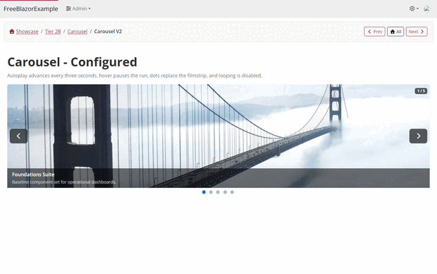
</a>
<br/>
<a href="screenshots/showcase-carousel-v2/full.webp"><strong>Carousel V2</strong></a>
<br/><code>/showcase/carousel/v2</code><br/>
✅ 200 &nbsp;⏱ 17,885ms &nbsp;📦 69.0 MB &nbsp;🖥 ✅ 0 err

<details>
<summary>📋 Details</summary>

**Carousel - Configured**

**📊 Metrics**

| Metric | Value |
|--------|-------|
| HTTP Status | 200 |
| Navigation | 262 ms |
| Full Load (incl. settle) | 17,885 ms |
| Network Requests | 312 |
| Data Transferred | 69.0 MB |
| JS Errors | 0 |
| JS Warnings | 0 |

<details>
<summary>🌐 Network (312 requests, 69.0 MB)</summary>

| Method | Status | Duration | Bytes | URL |
|--------|:------:|:--------:|------:|-----|
| GET | 200 | 307ms | 9.0 MB | `http://localhost:5201/_framework/MudBlazor.mwezwdoi15.wasm` |
| GET | 200 | 308ms | 6.5 MB | `…:5201/_framework/Microsoft.CodeAnalysis.CSharp.df8hfd5o8z.wasm` |
| GET | 200 | 15ms | 6.0 MB | `…1/_framework/Basic.Reference.Assemblies.Net100.v8tl2dqzst.wasm` |
| GET | 200 | 15ms | 4.6 MB | `…calhost:5201/_framework/System.Private.CoreLib.btnahqa3oa.wasm` |
| GET | 200 | 1ms | 3.5 MB | `…t/BlazorMonaco/lib/monaco-editor/min/vs/editor.api-i0YVFWkl.js` |
| GET | 200 | 286ms | 3.0 MB | `…//localhost:5201/_framework/System.Private.Xml.c86ifkdlwh.wasm` |
| GET | 200 | 76ms | 2.9 MB | `…calhost:5201/_framework/Microsoft.CodeAnalysis.erp1n29u9n.wasm` |
| GET | 200 | 15ms | 2.9 MB | `http://localhost:5201/_framework/dotnet.native.imnhyiqpc9.wasm` |
| GET | 200 | 275ms | 2.4 MB | `http://localhost:5201/_framework/Radzen.Blazor.x7olzc7yc0.wasm` |
| GET | 200 | 292ms | 1.4 MB | `…lhost:5201/_framework/FreeBlazorExample.Client.n18ukcy7q5.wasm` |
| GET | 200 | 44ms | 1.0 MB | `…201/_content/Radzen.Blazor/fonts/MaterialSymbolsOutlined.woff2` |
| GET | 200 | 277ms | 984.3 KB | `…//localhost:5201/_framework/System.Data.Common.cp5bttdxwa.wasm` |
| GET | 200 | 15ms | 914.3 KB | `http://localhost:5201/_framework/BlazorBootstrap.zo6lifkmy7.wasm` |
| GET | 200 | 286ms | 829.3 KB | `…ework/System.Private.DataContractSerialization.yjhmavq6w2.wasm` |
| GET | 200 | 16ms | 788.2 KB | `…alhost:5201/_framework/FreeBlazorExample.Client.3ivhmqjexl.pdb` |
| … | … | … | … | *297 more* |

</details>

<details>
<summary>🖥 Console Info (1 messages)</summary>

```
[info] Debugging hotkey: Shift+Alt+D (when application has focus)
```

</details>

</details>

</td>
<td align="center" valign="top" width="33%">
<a href="screenshots/showcase-carousel-v3/full.webp">
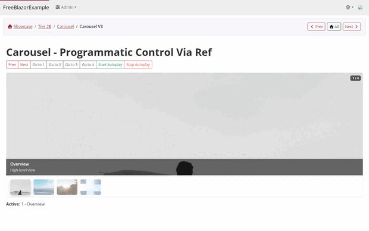
</a>
<br/>
<a href="screenshots/showcase-carousel-v3/full.webp"><strong>Carousel V3</strong></a>
<br/><code>/showcase/carousel/v3</code><br/>
✅ 200 &nbsp;⏱ 17,407ms &nbsp;📦 68.7 MB &nbsp;🖥 ✅ 0 err

<details>
<summary>📋 Details</summary>

**Carousel - Programmatic Control Via Ref**

**📊 Metrics**

| Metric | Value |
|--------|-------|
| HTTP Status | 200 |
| Navigation | 249 ms |
| Full Load (incl. settle) | 17,407 ms |
| Network Requests | 310 |
| Data Transferred | 68.7 MB |
| JS Errors | 0 |
| JS Warnings | 0 |

<details>
<summary>🌐 Network (310 requests, 68.7 MB)</summary>

| Method | Status | Duration | Bytes | URL |
|--------|:------:|:--------:|------:|-----|
| GET | 200 | 328ms | 9.0 MB | `http://localhost:5201/_framework/MudBlazor.mwezwdoi15.wasm` |
| GET | 200 | 300ms | 6.5 MB | `…:5201/_framework/Microsoft.CodeAnalysis.CSharp.df8hfd5o8z.wasm` |
| GET | 200 | 18ms | 6.0 MB | `…1/_framework/Basic.Reference.Assemblies.Net100.v8tl2dqzst.wasm` |
| GET | 200 | 17ms | 4.6 MB | `…calhost:5201/_framework/System.Private.CoreLib.btnahqa3oa.wasm` |
| GET | 200 | 2ms | 3.5 MB | `…t/BlazorMonaco/lib/monaco-editor/min/vs/editor.api-i0YVFWkl.js` |
| GET | 200 | 294ms | 3.0 MB | `…//localhost:5201/_framework/System.Private.Xml.c86ifkdlwh.wasm` |
| GET | 200 | 86ms | 2.9 MB | `…calhost:5201/_framework/Microsoft.CodeAnalysis.erp1n29u9n.wasm` |
| GET | 200 | 17ms | 2.9 MB | `http://localhost:5201/_framework/dotnet.native.imnhyiqpc9.wasm` |
| GET | 200 | 295ms | 2.4 MB | `http://localhost:5201/_framework/Radzen.Blazor.x7olzc7yc0.wasm` |
| GET | 200 | 293ms | 1.4 MB | `…lhost:5201/_framework/FreeBlazorExample.Client.n18ukcy7q5.wasm` |
| GET | 200 | 69ms | 1.0 MB | `…201/_content/Radzen.Blazor/fonts/MaterialSymbolsOutlined.woff2` |
| GET | 200 | 295ms | 984.3 KB | `…//localhost:5201/_framework/System.Data.Common.cp5bttdxwa.wasm` |
| GET | 200 | 18ms | 914.3 KB | `http://localhost:5201/_framework/BlazorBootstrap.zo6lifkmy7.wasm` |
| GET | 200 | 295ms | 829.3 KB | `…ework/System.Private.DataContractSerialization.yjhmavq6w2.wasm` |
| GET | 200 | 18ms | 788.2 KB | `…alhost:5201/_framework/FreeBlazorExample.Client.3ivhmqjexl.pdb` |
| … | … | … | … | *295 more* |

</details>

<details>
<summary>🖥 Console Info (1 messages)</summary>

```
[info] Debugging hotkey: Shift+Alt+D (when application has focus)
```

</details>

</details>

</td>
</tr>
<tr>
<td align="center" valign="top" width="33%">
<a href="screenshots/showcase-kanbanboard-v1/full.webp">
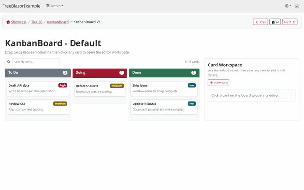
</a>
<br/>
<a href="screenshots/showcase-kanbanboard-v1/full.webp"><strong>KanbanBoard V1</strong></a>
<br/><code>/showcase/kanbanboard/v1</code><br/>
✅ 200 &nbsp;⏱ 17,599ms &nbsp;📦 68.5 MB &nbsp;🖥 ✅ 0 err

<details>
<summary>📋 Details</summary>

**KanbanBoard - Default**

**📊 Metrics**

| Metric | Value |
|--------|-------|
| HTTP Status | 200 |
| Navigation | 253 ms |
| Full Load (incl. settle) | 17,599 ms |
| Network Requests | 302 |
| Data Transferred | 68.5 MB |
| JS Errors | 0 |
| JS Warnings | 0 |

<details>
<summary>🌐 Network (302 requests, 68.5 MB)</summary>

| Method | Status | Duration | Bytes | URL |
|--------|:------:|:--------:|------:|-----|
| GET | 200 | 292ms | 9.0 MB | `http://localhost:5201/_framework/MudBlazor.mwezwdoi15.wasm` |
| GET | 200 | 89ms | 6.5 MB | `…:5201/_framework/Microsoft.CodeAnalysis.CSharp.df8hfd5o8z.wasm` |
| GET | 200 | 18ms | 6.0 MB | `…1/_framework/Basic.Reference.Assemblies.Net100.v8tl2dqzst.wasm` |
| GET | 200 | 17ms | 4.6 MB | `…calhost:5201/_framework/System.Private.CoreLib.btnahqa3oa.wasm` |
| GET | 200 | 2ms | 3.5 MB | `…t/BlazorMonaco/lib/monaco-editor/min/vs/editor.api-i0YVFWkl.js` |
| GET | 200 | 283ms | 3.0 MB | `…//localhost:5201/_framework/System.Private.Xml.c86ifkdlwh.wasm` |
| GET | 200 | 18ms | 2.9 MB | `…calhost:5201/_framework/Microsoft.CodeAnalysis.erp1n29u9n.wasm` |
| GET | 200 | 17ms | 2.9 MB | `http://localhost:5201/_framework/dotnet.native.imnhyiqpc9.wasm` |
| GET | 200 | 279ms | 2.4 MB | `http://localhost:5201/_framework/Radzen.Blazor.x7olzc7yc0.wasm` |
| GET | 200 | 293ms | 1.4 MB | `…lhost:5201/_framework/FreeBlazorExample.Client.n18ukcy7q5.wasm` |
| GET | 200 | 43ms | 1.0 MB | `…201/_content/Radzen.Blazor/fonts/MaterialSymbolsOutlined.woff2` |
| GET | 200 | 281ms | 984.3 KB | `…//localhost:5201/_framework/System.Data.Common.cp5bttdxwa.wasm` |
| GET | 200 | 18ms | 914.3 KB | `http://localhost:5201/_framework/BlazorBootstrap.zo6lifkmy7.wasm` |
| GET | 200 | 283ms | 829.3 KB | `…ework/System.Private.DataContractSerialization.yjhmavq6w2.wasm` |
| GET | 200 | 18ms | 788.2 KB | `…alhost:5201/_framework/FreeBlazorExample.Client.3ivhmqjexl.pdb` |
| … | … | … | … | *287 more* |

</details>

<details>
<summary>🖥 Console Info (1 messages)</summary>

```
[info] Debugging hotkey: Shift+Alt+D (when application has focus)
```

</details>

</details>

</td>
<td align="center" valign="top" width="33%">
<a href="screenshots/showcase-kanbanboard-v2/full.webp">
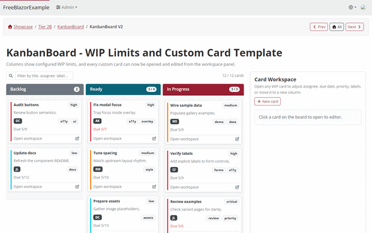
</a>
<br/>
<a href="screenshots/showcase-kanbanboard-v2/full.webp"><strong>KanbanBoard V2</strong></a>
<br/><code>/showcase/kanbanboard/v2</code><br/>
✅ 200 &nbsp;⏱ 17,555ms &nbsp;📦 68.5 MB &nbsp;🖥 ✅ 0 err

<details>
<summary>📋 Details</summary>

**KanbanBoard - WIP Limits and Custom Card Template**

**📊 Metrics**

| Metric | Value |
|--------|-------|
| HTTP Status | 200 |
| Navigation | 268 ms |
| Full Load (incl. settle) | 17,555 ms |
| Network Requests | 302 |
| Data Transferred | 68.5 MB |
| JS Errors | 0 |
| JS Warnings | 0 |

<details>
<summary>🌐 Network (302 requests, 68.5 MB)</summary>

| Method | Status | Duration | Bytes | URL |
|--------|:------:|:--------:|------:|-----|
| GET | 200 | 303ms | 9.0 MB | `http://localhost:5201/_framework/MudBlazor.mwezwdoi15.wasm` |
| GET | 200 | 292ms | 6.5 MB | `…:5201/_framework/Microsoft.CodeAnalysis.CSharp.df8hfd5o8z.wasm` |
| GET | 200 | 15ms | 6.0 MB | `…1/_framework/Basic.Reference.Assemblies.Net100.v8tl2dqzst.wasm` |
| GET | 200 | 15ms | 4.6 MB | `…calhost:5201/_framework/System.Private.CoreLib.btnahqa3oa.wasm` |
| GET | 200 | 2ms | 3.5 MB | `…t/BlazorMonaco/lib/monaco-editor/min/vs/editor.api-i0YVFWkl.js` |
| GET | 200 | 268ms | 3.0 MB | `…//localhost:5201/_framework/System.Private.Xml.c86ifkdlwh.wasm` |
| GET | 200 | 81ms | 2.9 MB | `…calhost:5201/_framework/Microsoft.CodeAnalysis.erp1n29u9n.wasm` |
| GET | 200 | 15ms | 2.9 MB | `http://localhost:5201/_framework/dotnet.native.imnhyiqpc9.wasm` |
| GET | 200 | 81ms | 2.4 MB | `http://localhost:5201/_framework/Radzen.Blazor.x7olzc7yc0.wasm` |
| GET | 200 | 272ms | 1.4 MB | `…lhost:5201/_framework/FreeBlazorExample.Client.n18ukcy7q5.wasm` |
| GET | 200 | 66ms | 1.0 MB | `…201/_content/Radzen.Blazor/fonts/MaterialSymbolsOutlined.woff2` |
| GET | 200 | 269ms | 984.3 KB | `…//localhost:5201/_framework/System.Data.Common.cp5bttdxwa.wasm` |
| GET | 200 | 15ms | 914.3 KB | `http://localhost:5201/_framework/BlazorBootstrap.zo6lifkmy7.wasm` |
| GET | 200 | 268ms | 829.3 KB | `…ework/System.Private.DataContractSerialization.yjhmavq6w2.wasm` |
| GET | 200 | 15ms | 788.2 KB | `…alhost:5201/_framework/FreeBlazorExample.Client.3ivhmqjexl.pdb` |
| … | … | … | … | *287 more* |

</details>

<details>
<summary>🖥 Console Info (1 messages)</summary>

```
[info] Debugging hotkey: Shift+Alt+D (when application has focus)
```

</details>

</details>

</td>
<td align="center" valign="top" width="33%">
<a href="screenshots/showcase-kanbanboard-v3/full.webp">
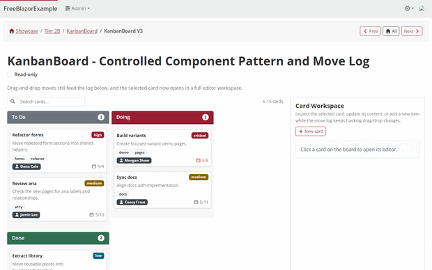
</a>
<br/>
<a href="screenshots/showcase-kanbanboard-v3/full.webp"><strong>KanbanBoard V3</strong></a>
<br/><code>/showcase/kanbanboard/v3</code><br/>
✅ 200 &nbsp;⏱ 17,589ms &nbsp;📦 68.5 MB &nbsp;🖥 ✅ 0 err

<details>
<summary>📋 Details</summary>

**KanbanBoard - Controlled Component Pattern and Move Log**

**📊 Metrics**

| Metric | Value |
|--------|-------|
| HTTP Status | 200 |
| Navigation | 277 ms |
| Full Load (incl. settle) | 17,589 ms |
| Network Requests | 302 |
| Data Transferred | 68.5 MB |
| JS Errors | 0 |
| JS Warnings | 0 |

<details>
<summary>🌐 Network (302 requests, 68.5 MB)</summary>

| Method | Status | Duration | Bytes | URL |
|--------|:------:|:--------:|------:|-----|
| GET | 200 | 266ms | 9.0 MB | `http://localhost:5201/_framework/MudBlazor.mwezwdoi15.wasm` |
| GET | 200 | 266ms | 6.5 MB | `…:5201/_framework/Microsoft.CodeAnalysis.CSharp.df8hfd5o8z.wasm` |
| GET | 200 | 16ms | 6.0 MB | `…1/_framework/Basic.Reference.Assemblies.Net100.v8tl2dqzst.wasm` |
| GET | 200 | 17ms | 4.6 MB | `…calhost:5201/_framework/System.Private.CoreLib.btnahqa3oa.wasm` |
| GET | 200 | 2ms | 3.5 MB | `…t/BlazorMonaco/lib/monaco-editor/min/vs/editor.api-i0YVFWkl.js` |
| GET | 200 | 242ms | 3.0 MB | `…//localhost:5201/_framework/System.Private.Xml.c86ifkdlwh.wasm` |
| GET | 200 | 57ms | 2.9 MB | `…calhost:5201/_framework/Microsoft.CodeAnalysis.erp1n29u9n.wasm` |
| GET | 200 | 16ms | 2.9 MB | `http://localhost:5201/_framework/dotnet.native.imnhyiqpc9.wasm` |
| GET | 200 | 69ms | 2.4 MB | `http://localhost:5201/_framework/Radzen.Blazor.x7olzc7yc0.wasm` |
| GET | 200 | 247ms | 1.4 MB | `…lhost:5201/_framework/FreeBlazorExample.Client.n18ukcy7q5.wasm` |
| GET | 200 | 64ms | 1.0 MB | `…201/_content/Radzen.Blazor/fonts/MaterialSymbolsOutlined.woff2` |
| GET | 200 | 238ms | 984.3 KB | `…//localhost:5201/_framework/System.Data.Common.cp5bttdxwa.wasm` |
| GET | 200 | 17ms | 914.3 KB | `http://localhost:5201/_framework/BlazorBootstrap.zo6lifkmy7.wasm` |
| GET | 200 | 241ms | 829.3 KB | `…ework/System.Private.DataContractSerialization.yjhmavq6w2.wasm` |
| GET | 200 | 16ms | 788.2 KB | `…alhost:5201/_framework/FreeBlazorExample.Client.3ivhmqjexl.pdb` |
| … | … | … | … | *287 more* |

</details>

<details>
<summary>🖥 Console Info (1 messages)</summary>

```
[info] Debugging hotkey: Shift+Alt+D (when application has focus)
```

</details>

</details>

</td>
</tr>
<tr>
<td align="center" valign="top" width="33%">
<a href="screenshots/showcase-examplenav-v1/full.webp">
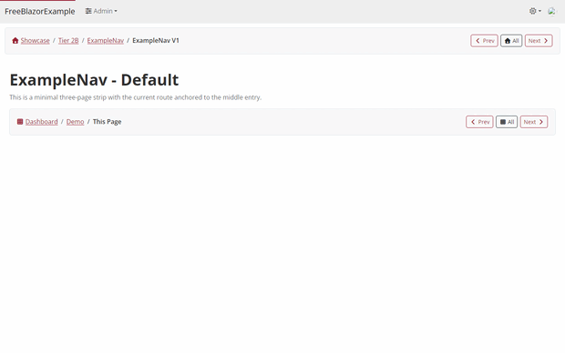
</a>
<br/>
<a href="screenshots/showcase-examplenav-v1/full.webp"><strong>ExampleNav V1</strong></a>
<br/><code>/showcase/examplenav/v1</code><br/>
✅ 200 &nbsp;⏱ 17,366ms &nbsp;📦 68.5 MB &nbsp;🖥 ✅ 0 err

<details>
<summary>📋 Details</summary>

**ExampleNav - Default**

**📊 Metrics**

| Metric | Value |
|--------|-------|
| HTTP Status | 200 |
| Navigation | 284 ms |
| Full Load (incl. settle) | 17,366 ms |
| Network Requests | 302 |
| Data Transferred | 68.5 MB |
| JS Errors | 0 |
| JS Warnings | 0 |

<details>
<summary>🌐 Network (302 requests, 68.5 MB)</summary>

| Method | Status | Duration | Bytes | URL |
|--------|:------:|:--------:|------:|-----|
| GET | 200 | 293ms | 9.0 MB | `http://localhost:5201/_framework/MudBlazor.mwezwdoi15.wasm` |
| GET | 200 | 287ms | 6.5 MB | `…:5201/_framework/Microsoft.CodeAnalysis.CSharp.df8hfd5o8z.wasm` |
| GET | 200 | 15ms | 6.0 MB | `…1/_framework/Basic.Reference.Assemblies.Net100.v8tl2dqzst.wasm` |
| GET | 200 | 14ms | 4.6 MB | `…calhost:5201/_framework/System.Private.CoreLib.btnahqa3oa.wasm` |
| GET | 200 | 2ms | 3.5 MB | `…t/BlazorMonaco/lib/monaco-editor/min/vs/editor.api-i0YVFWkl.js` |
| GET | 200 | 250ms | 3.0 MB | `…//localhost:5201/_framework/System.Private.Xml.c86ifkdlwh.wasm` |
| GET | 200 | 82ms | 2.9 MB | `…calhost:5201/_framework/Microsoft.CodeAnalysis.erp1n29u9n.wasm` |
| GET | 200 | 13ms | 2.9 MB | `http://localhost:5201/_framework/dotnet.native.imnhyiqpc9.wasm` |
| GET | 200 | 81ms | 2.4 MB | `http://localhost:5201/_framework/Radzen.Blazor.x7olzc7yc0.wasm` |
| GET | 200 | 255ms | 1.4 MB | `…lhost:5201/_framework/FreeBlazorExample.Client.n18ukcy7q5.wasm` |
| GET | 200 | 44ms | 1.0 MB | `…201/_content/Radzen.Blazor/fonts/MaterialSymbolsOutlined.woff2` |
| GET | 200 | 249ms | 984.3 KB | `…//localhost:5201/_framework/System.Data.Common.cp5bttdxwa.wasm` |
| GET | 200 | 14ms | 914.3 KB | `http://localhost:5201/_framework/BlazorBootstrap.zo6lifkmy7.wasm` |
| GET | 200 | 250ms | 829.3 KB | `…ework/System.Private.DataContractSerialization.yjhmavq6w2.wasm` |
| GET | 200 | 14ms | 788.2 KB | `…alhost:5201/_framework/FreeBlazorExample.Client.3ivhmqjexl.pdb` |
| … | … | … | … | *287 more* |

</details>

<details>
<summary>🖥 Console Info (1 messages)</summary>

```
[info] Debugging hotkey: Shift+Alt+D (when application has focus)
```

</details>

</details>

</td>
<td align="center" valign="top" width="33%">
<a href="screenshots/showcase-examplenav-v2/full.webp">
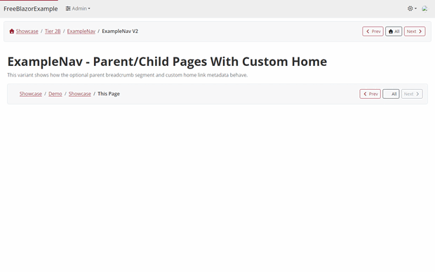
</a>
<br/>
<a href="screenshots/showcase-examplenav-v2/full.webp"><strong>ExampleNav V2</strong></a>
<br/><code>/showcase/examplenav/v2</code><br/>
✅ 200 &nbsp;⏱ 17,364ms &nbsp;📦 68.5 MB &nbsp;🖥 ✅ 0 err

<details>
<summary>📋 Details</summary>

**ExampleNav - Parent/Child Pages With Custom Home**

**📊 Metrics**

| Metric | Value |
|--------|-------|
| HTTP Status | 200 |
| Navigation | 284 ms |
| Full Load (incl. settle) | 17,364 ms |
| Network Requests | 302 |
| Data Transferred | 68.5 MB |
| JS Errors | 0 |
| JS Warnings | 0 |

<details>
<summary>🌐 Network (302 requests, 68.5 MB)</summary>

| Method | Status | Duration | Bytes | URL |
|--------|:------:|:--------:|------:|-----|
| GET | 200 | 306ms | 9.0 MB | `http://localhost:5201/_framework/MudBlazor.mwezwdoi15.wasm` |
| GET | 200 | 307ms | 6.5 MB | `…:5201/_framework/Microsoft.CodeAnalysis.CSharp.df8hfd5o8z.wasm` |
| GET | 200 | 16ms | 6.0 MB | `…1/_framework/Basic.Reference.Assemblies.Net100.v8tl2dqzst.wasm` |
| GET | 200 | 16ms | 4.6 MB | `…calhost:5201/_framework/System.Private.CoreLib.btnahqa3oa.wasm` |
| GET | 200 | 2ms | 3.5 MB | `…t/BlazorMonaco/lib/monaco-editor/min/vs/editor.api-i0YVFWkl.js` |
| GET | 200 | 266ms | 3.0 MB | `…//localhost:5201/_framework/System.Private.Xml.c86ifkdlwh.wasm` |
| GET | 200 | 69ms | 2.9 MB | `…calhost:5201/_framework/Microsoft.CodeAnalysis.erp1n29u9n.wasm` |
| GET | 200 | 16ms | 2.9 MB | `http://localhost:5201/_framework/dotnet.native.imnhyiqpc9.wasm` |
| GET | 200 | 93ms | 2.4 MB | `http://localhost:5201/_framework/Radzen.Blazor.x7olzc7yc0.wasm` |
| GET | 200 | 266ms | 1.4 MB | `…lhost:5201/_framework/FreeBlazorExample.Client.n18ukcy7q5.wasm` |
| GET | 200 | 47ms | 1.0 MB | `…201/_content/Radzen.Blazor/fonts/MaterialSymbolsOutlined.woff2` |
| GET | 200 | 262ms | 984.3 KB | `…//localhost:5201/_framework/System.Data.Common.cp5bttdxwa.wasm` |
| GET | 200 | 16ms | 914.3 KB | `http://localhost:5201/_framework/BlazorBootstrap.zo6lifkmy7.wasm` |
| GET | 200 | 266ms | 829.3 KB | `…ework/System.Private.DataContractSerialization.yjhmavq6w2.wasm` |
| GET | 200 | 16ms | 788.2 KB | `…alhost:5201/_framework/FreeBlazorExample.Client.3ivhmqjexl.pdb` |
| … | … | … | … | *287 more* |

</details>

<details>
<summary>🖥 Console Info (1 messages)</summary>

```
[info] Debugging hotkey: Shift+Alt+D (when application has focus)
```

</details>

</details>

</td>
<td align="center" valign="top" width="33%">
<a href="screenshots/showcase-examplenav-v3/full.webp">
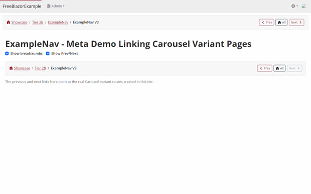
</a>
<br/>
<a href="screenshots/showcase-examplenav-v3/full.webp"><strong>ExampleNav V3</strong></a>
<br/><code>/showcase/examplenav/v3</code><br/>
✅ 200 &nbsp;⏱ 17,470ms &nbsp;📦 68.5 MB &nbsp;🖥 ✅ 0 err

<details>
<summary>📋 Details</summary>

**ExampleNav - Meta Demo Linking Carousel Variant Pages**

**📊 Metrics**

| Metric | Value |
|--------|-------|
| HTTP Status | 200 |
| Navigation | 263 ms |
| Full Load (incl. settle) | 17,470 ms |
| Network Requests | 302 |
| Data Transferred | 68.5 MB |
| JS Errors | 0 |
| JS Warnings | 0 |

<details>
<summary>🌐 Network (302 requests, 68.5 MB)</summary>

| Method | Status | Duration | Bytes | URL |
|--------|:------:|:--------:|------:|-----|
| GET | 200 | 279ms | 9.0 MB | `http://localhost:5201/_framework/MudBlazor.mwezwdoi15.wasm` |
| GET | 200 | 89ms | 6.5 MB | `…:5201/_framework/Microsoft.CodeAnalysis.CSharp.df8hfd5o8z.wasm` |
| GET | 200 | 18ms | 6.0 MB | `…1/_framework/Basic.Reference.Assemblies.Net100.v8tl2dqzst.wasm` |
| GET | 200 | 17ms | 4.6 MB | `…calhost:5201/_framework/System.Private.CoreLib.btnahqa3oa.wasm` |
| GET | 200 | 3ms | 3.5 MB | `…t/BlazorMonaco/lib/monaco-editor/min/vs/editor.api-i0YVFWkl.js` |
| GET | 200 | 272ms | 3.0 MB | `…//localhost:5201/_framework/System.Private.Xml.c86ifkdlwh.wasm` |
| GET | 200 | 19ms | 2.9 MB | `…calhost:5201/_framework/Microsoft.CodeAnalysis.erp1n29u9n.wasm` |
| GET | 200 | 18ms | 2.9 MB | `http://localhost:5201/_framework/dotnet.native.imnhyiqpc9.wasm` |
| GET | 200 | 87ms | 2.4 MB | `http://localhost:5201/_framework/Radzen.Blazor.x7olzc7yc0.wasm` |
| GET | 200 | 292ms | 1.4 MB | `…lhost:5201/_framework/FreeBlazorExample.Client.n18ukcy7q5.wasm` |
| GET | 200 | 63ms | 1.0 MB | `…201/_content/Radzen.Blazor/fonts/MaterialSymbolsOutlined.woff2` |
| GET | 200 | 268ms | 984.3 KB | `…//localhost:5201/_framework/System.Data.Common.cp5bttdxwa.wasm` |
| GET | 200 | 18ms | 914.3 KB | `http://localhost:5201/_framework/BlazorBootstrap.zo6lifkmy7.wasm` |
| GET | 200 | 272ms | 829.3 KB | `…ework/System.Private.DataContractSerialization.yjhmavq6w2.wasm` |
| GET | 200 | 17ms | 788.2 KB | `…alhost:5201/_framework/FreeBlazorExample.Client.3ivhmqjexl.pdb` |
| … | … | … | … | *287 more* |

</details>

<details>
<summary>🖥 Console Info (1 messages)</summary>

```
[info] Debugging hotkey: Shift+Alt+D (when application has focus)
```

</details>

</details>

</td>
</tr>
<tr>
<td align="center" valign="top" width="33%">
<a href="screenshots/showcase-selectfile-v1/full.webp">
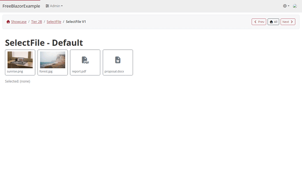
</a>
<br/>
<a href="screenshots/showcase-selectfile-v1/full.webp"><strong>SelectFile V1</strong></a>
<br/><code>/showcase/selectfile/v1</code><br/>
✅ 200 &nbsp;⏱ 17,542ms &nbsp;📦 68.6 MB &nbsp;🖥 ✅ 0 err

<details>
<summary>📋 Details</summary>

**SelectFile - Default**

**📊 Metrics**

| Metric | Value |
|--------|-------|
| HTTP Status | 200 |
| Navigation | 208 ms |
| Full Load (incl. settle) | 17,542 ms |
| Network Requests | 306 |
| Data Transferred | 68.6 MB |
| JS Errors | 0 |
| JS Warnings | 0 |

<details>
<summary>🌐 Network (306 requests, 68.6 MB)</summary>

| Method | Status | Duration | Bytes | URL |
|--------|:------:|:--------:|------:|-----|
| GET | 200 | 338ms | 9.0 MB | `http://localhost:5201/_framework/MudBlazor.mwezwdoi15.wasm` |
| GET | 200 | 332ms | 6.5 MB | `…:5201/_framework/Microsoft.CodeAnalysis.CSharp.df8hfd5o8z.wasm` |
| GET | 200 | 46ms | 6.0 MB | `…1/_framework/Basic.Reference.Assemblies.Net100.v8tl2dqzst.wasm` |
| GET | 200 | 45ms | 4.6 MB | `…calhost:5201/_framework/System.Private.CoreLib.btnahqa3oa.wasm` |
| GET | 200 | 2ms | 3.5 MB | `…t/BlazorMonaco/lib/monaco-editor/min/vs/editor.api-i0YVFWkl.js` |
| GET | 200 | 302ms | 3.0 MB | `…//localhost:5201/_framework/System.Private.Xml.c86ifkdlwh.wasm` |
| GET | 200 | 110ms | 2.9 MB | `…calhost:5201/_framework/Microsoft.CodeAnalysis.erp1n29u9n.wasm` |
| GET | 200 | 56ms | 2.9 MB | `http://localhost:5201/_framework/dotnet.native.imnhyiqpc9.wasm` |
| GET | 200 | 111ms | 2.4 MB | `http://localhost:5201/_framework/Radzen.Blazor.x7olzc7yc0.wasm` |
| GET | 200 | 305ms | 1.4 MB | `…lhost:5201/_framework/FreeBlazorExample.Client.n18ukcy7q5.wasm` |
| GET | 200 | 53ms | 1.0 MB | `…201/_content/Radzen.Blazor/fonts/MaterialSymbolsOutlined.woff2` |
| GET | 200 | 290ms | 984.3 KB | `…//localhost:5201/_framework/System.Data.Common.cp5bttdxwa.wasm` |
| GET | 200 | 47ms | 914.3 KB | `http://localhost:5201/_framework/BlazorBootstrap.zo6lifkmy7.wasm` |
| GET | 200 | 302ms | 829.3 KB | `…ework/System.Private.DataContractSerialization.yjhmavq6w2.wasm` |
| GET | 200 | 46ms | 788.2 KB | `…alhost:5201/_framework/FreeBlazorExample.Client.3ivhmqjexl.pdb` |
| … | … | … | … | *291 more* |

</details>

<details>
<summary>🖥 Console Info (1 messages)</summary>

```
[info] Debugging hotkey: Shift+Alt+D (when application has focus)
```

</details>

</details>

</td>
<td align="center" valign="top" width="33%">
<a href="screenshots/showcase-selectfile-v2/full.webp">
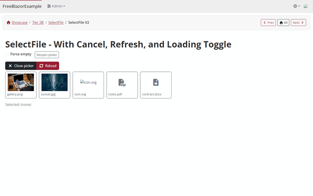
</a>
<br/>
<a href="screenshots/showcase-selectfile-v2/full.webp"><strong>SelectFile V2</strong></a>
<br/><code>/showcase/selectfile/v2</code><br/>
✅ 200 &nbsp;⏱ 17,493ms &nbsp;📦 68.6 MB &nbsp;🖥 ✅ 0 err

<details>
<summary>📋 Details</summary>

**SelectFile - With Cancel, Refresh, and Loading Toggle**

**📊 Metrics**

| Metric | Value |
|--------|-------|
| HTTP Status | 200 |
| Navigation | 279 ms |
| Full Load (incl. settle) | 17,493 ms |
| Network Requests | 306 |
| Data Transferred | 68.6 MB |
| JS Errors | 0 |
| JS Warnings | 0 |

<details>
<summary>🌐 Network (306 requests, 68.6 MB)</summary>

| Method | Status | Duration | Bytes | URL |
|--------|:------:|:--------:|------:|-----|
| GET | 200 | 280ms | 9.0 MB | `http://localhost:5201/_framework/MudBlazor.mwezwdoi15.wasm` |
| GET | 200 | 281ms | 6.5 MB | `…:5201/_framework/Microsoft.CodeAnalysis.CSharp.df8hfd5o8z.wasm` |
| GET | 200 | 17ms | 6.0 MB | `…1/_framework/Basic.Reference.Assemblies.Net100.v8tl2dqzst.wasm` |
| GET | 200 | 17ms | 4.6 MB | `…calhost:5201/_framework/System.Private.CoreLib.btnahqa3oa.wasm` |
| GET | 200 | 2ms | 3.5 MB | `…t/BlazorMonaco/lib/monaco-editor/min/vs/editor.api-i0YVFWkl.js` |
| GET | 200 | 251ms | 3.0 MB | `…//localhost:5201/_framework/System.Private.Xml.c86ifkdlwh.wasm` |
| GET | 200 | 67ms | 2.9 MB | `…calhost:5201/_framework/Microsoft.CodeAnalysis.erp1n29u9n.wasm` |
| GET | 200 | 16ms | 2.9 MB | `http://localhost:5201/_framework/dotnet.native.imnhyiqpc9.wasm` |
| GET | 200 | 231ms | 2.4 MB | `http://localhost:5201/_framework/Radzen.Blazor.x7olzc7yc0.wasm` |
| GET | 200 | 259ms | 1.4 MB | `…lhost:5201/_framework/FreeBlazorExample.Client.n18ukcy7q5.wasm` |
| GET | 200 | 45ms | 1.0 MB | `…201/_content/Radzen.Blazor/fonts/MaterialSymbolsOutlined.woff2` |
| GET | 200 | 248ms | 984.3 KB | `…//localhost:5201/_framework/System.Data.Common.cp5bttdxwa.wasm` |
| GET | 200 | 17ms | 914.3 KB | `http://localhost:5201/_framework/BlazorBootstrap.zo6lifkmy7.wasm` |
| GET | 200 | 251ms | 829.3 KB | `…ework/System.Private.DataContractSerialization.yjhmavq6w2.wasm` |
| GET | 200 | 17ms | 788.2 KB | `…alhost:5201/_framework/FreeBlazorExample.Client.3ivhmqjexl.pdb` |
| … | … | … | … | *291 more* |

</details>

<details>
<summary>🖥 Console Info (1 messages)</summary>

```
[info] Debugging hotkey: Shift+Alt+D (when application has focus)
```

</details>

</details>

</td>
<td align="center" valign="top" width="33%">
<a href="screenshots/showcase-selectfile-v3/full.webp">
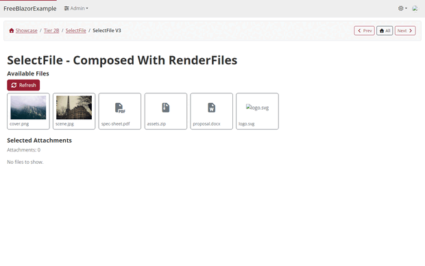
</a>
<br/>
<a href="screenshots/showcase-selectfile-v3/full.webp"><strong>SelectFile V3</strong></a>
<br/><code>/showcase/selectfile/v3</code><br/>
✅ 200 &nbsp;⏱ 17,400ms &nbsp;📦 68.6 MB &nbsp;🖥 ✅ 0 err

<details>
<summary>📋 Details</summary>

**SelectFile - Composed With RenderFiles**

**📊 Metrics**

| Metric | Value |
|--------|-------|
| HTTP Status | 200 |
| Navigation | 260 ms |
| Full Load (incl. settle) | 17,400 ms |
| Network Requests | 306 |
| Data Transferred | 68.6 MB |
| JS Errors | 0 |
| JS Warnings | 0 |

<details>
<summary>🌐 Network (306 requests, 68.6 MB)</summary>

| Method | Status | Duration | Bytes | URL |
|--------|:------:|:--------:|------:|-----|
| GET | 200 | 301ms | 9.0 MB | `http://localhost:5201/_framework/MudBlazor.mwezwdoi15.wasm` |
| GET | 200 | 298ms | 6.5 MB | `…:5201/_framework/Microsoft.CodeAnalysis.CSharp.df8hfd5o8z.wasm` |
| GET | 200 | 16ms | 6.0 MB | `…1/_framework/Basic.Reference.Assemblies.Net100.v8tl2dqzst.wasm` |
| GET | 200 | 16ms | 4.6 MB | `…calhost:5201/_framework/System.Private.CoreLib.btnahqa3oa.wasm` |
| GET | 200 | 2ms | 3.5 MB | `…t/BlazorMonaco/lib/monaco-editor/min/vs/editor.api-i0YVFWkl.js` |
| GET | 200 | 261ms | 3.0 MB | `…//localhost:5201/_framework/System.Private.Xml.c86ifkdlwh.wasm` |
| GET | 200 | 82ms | 2.9 MB | `…calhost:5201/_framework/Microsoft.CodeAnalysis.erp1n29u9n.wasm` |
| GET | 200 | 15ms | 2.9 MB | `http://localhost:5201/_framework/dotnet.native.imnhyiqpc9.wasm` |
| GET | 200 | 81ms | 2.4 MB | `http://localhost:5201/_framework/Radzen.Blazor.x7olzc7yc0.wasm` |
| GET | 200 | 262ms | 1.4 MB | `…lhost:5201/_framework/FreeBlazorExample.Client.n18ukcy7q5.wasm` |
| GET | 200 | 44ms | 1.0 MB | `…201/_content/Radzen.Blazor/fonts/MaterialSymbolsOutlined.woff2` |
| GET | 200 | 261ms | 984.3 KB | `…//localhost:5201/_framework/System.Data.Common.cp5bttdxwa.wasm` |
| GET | 200 | 16ms | 914.3 KB | `http://localhost:5201/_framework/BlazorBootstrap.zo6lifkmy7.wasm` |
| GET | 200 | 261ms | 829.3 KB | `…ework/System.Private.DataContractSerialization.yjhmavq6w2.wasm` |
| GET | 200 | 16ms | 788.2 KB | `…alhost:5201/_framework/FreeBlazorExample.Client.3ivhmqjexl.pdb` |
| … | … | … | … | *291 more* |

</details>

<details>
<summary>🖥 Console Info (1 messages)</summary>

```
[info] Debugging hotkey: Shift+Alt+D (when application has focus)
```

</details>

</details>

</td>
</tr>
<tr>
<td align="center" valign="top" width="33%">
<a href="screenshots/showcase-renderfiles-v1/full.webp">
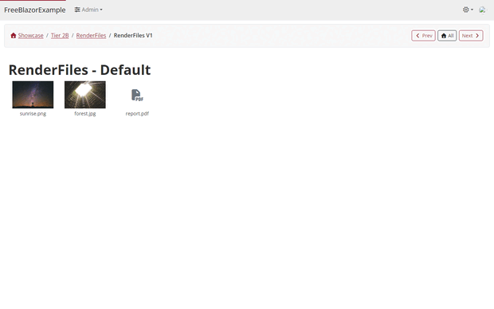
</a>
<br/>
<a href="screenshots/showcase-renderfiles-v1/full.webp"><strong>RenderFiles V1</strong></a>
<br/><code>/showcase/renderfiles/v1</code><br/>
✅ 200 &nbsp;⏱ 17,525ms &nbsp;📦 68.6 MB &nbsp;🖥 ✅ 0 err

<details>
<summary>📋 Details</summary>

**RenderFiles - Default**

**📊 Metrics**

| Metric | Value |
|--------|-------|
| HTTP Status | 200 |
| Navigation | 262 ms |
| Full Load (incl. settle) | 17,525 ms |
| Network Requests | 306 |
| Data Transferred | 68.6 MB |
| JS Errors | 0 |
| JS Warnings | 0 |

<details>
<summary>🌐 Network (306 requests, 68.6 MB)</summary>

| Method | Status | Duration | Bytes | URL |
|--------|:------:|:--------:|------:|-----|
| GET | 200 | 267ms | 9.0 MB | `http://localhost:5201/_framework/MudBlazor.mwezwdoi15.wasm` |
| GET | 200 | 79ms | 6.5 MB | `…:5201/_framework/Microsoft.CodeAnalysis.CSharp.df8hfd5o8z.wasm` |
| GET | 200 | 15ms | 6.0 MB | `…1/_framework/Basic.Reference.Assemblies.Net100.v8tl2dqzst.wasm` |
| GET | 200 | 14ms | 4.6 MB | `…calhost:5201/_framework/System.Private.CoreLib.btnahqa3oa.wasm` |
| GET | 200 | 4ms | 3.5 MB | `…t/BlazorMonaco/lib/monaco-editor/min/vs/editor.api-i0YVFWkl.js` |
| GET | 200 | 269ms | 3.0 MB | `…//localhost:5201/_framework/System.Private.Xml.c86ifkdlwh.wasm` |
| GET | 200 | 16ms | 2.9 MB | `…calhost:5201/_framework/Microsoft.CodeAnalysis.erp1n29u9n.wasm` |
| GET | 200 | 14ms | 2.9 MB | `http://localhost:5201/_framework/dotnet.native.imnhyiqpc9.wasm` |
| GET | 200 | 78ms | 2.4 MB | `http://localhost:5201/_framework/Radzen.Blazor.x7olzc7yc0.wasm` |
| GET | 200 | 276ms | 1.4 MB | `…lhost:5201/_framework/FreeBlazorExample.Client.n18ukcy7q5.wasm` |
| GET | 200 | 46ms | 1.0 MB | `…201/_content/Radzen.Blazor/fonts/MaterialSymbolsOutlined.woff2` |
| GET | 200 | 261ms | 984.3 KB | `…//localhost:5201/_framework/System.Data.Common.cp5bttdxwa.wasm` |
| GET | 200 | 15ms | 914.3 KB | `http://localhost:5201/_framework/BlazorBootstrap.zo6lifkmy7.wasm` |
| GET | 200 | 269ms | 829.3 KB | `…ework/System.Private.DataContractSerialization.yjhmavq6w2.wasm` |
| GET | 200 | 14ms | 788.2 KB | `…alhost:5201/_framework/FreeBlazorExample.Client.3ivhmqjexl.pdb` |
| … | … | … | … | *291 more* |

</details>

<details>
<summary>🖥 Console Info (1 messages)</summary>

```
[info] Debugging hotkey: Shift+Alt+D (when application has focus)
```

</details>

</details>

</td>
<td align="center" valign="top" width="33%">
<a href="screenshots/showcase-renderfiles-v2/full.webp">
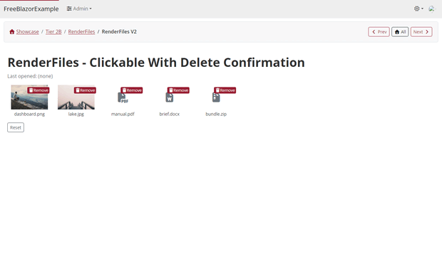
</a>
<br/>
<a href="screenshots/showcase-renderfiles-v2/full.webp"><strong>RenderFiles V2</strong></a>
<br/><code>/showcase/renderfiles/v2</code><br/>
✅ 200 &nbsp;⏱ 17,705ms &nbsp;📦 68.6 MB &nbsp;🖥 ✅ 0 err

<details>
<summary>📋 Details</summary>

**RenderFiles - Clickable With Delete Confirmation**

**📊 Metrics**

| Metric | Value |
|--------|-------|
| HTTP Status | 200 |
| Navigation | 229 ms |
| Full Load (incl. settle) | 17,705 ms |
| Network Requests | 306 |
| Data Transferred | 68.6 MB |
| JS Errors | 0 |
| JS Warnings | 0 |

<details>
<summary>🌐 Network (306 requests, 68.6 MB)</summary>

| Method | Status | Duration | Bytes | URL |
|--------|:------:|:--------:|------:|-----|
| GET | 200 | 311ms | 9.0 MB | `http://localhost:5201/_framework/MudBlazor.mwezwdoi15.wasm` |
| GET | 200 | 309ms | 6.5 MB | `…:5201/_framework/Microsoft.CodeAnalysis.CSharp.df8hfd5o8z.wasm` |
| GET | 200 | 18ms | 6.0 MB | `…1/_framework/Basic.Reference.Assemblies.Net100.v8tl2dqzst.wasm` |
| GET | 200 | 18ms | 4.6 MB | `…calhost:5201/_framework/System.Private.CoreLib.btnahqa3oa.wasm` |
| GET | 200 | 2ms | 3.5 MB | `…t/BlazorMonaco/lib/monaco-editor/min/vs/editor.api-i0YVFWkl.js` |
| GET | 200 | 272ms | 3.0 MB | `…//localhost:5201/_framework/System.Private.Xml.c86ifkdlwh.wasm` |
| GET | 200 | 275ms | 2.9 MB | `…calhost:5201/_framework/Microsoft.CodeAnalysis.erp1n29u9n.wasm` |
| GET | 200 | 19ms | 2.9 MB | `http://localhost:5201/_framework/dotnet.native.imnhyiqpc9.wasm` |
| GET | 200 | 273ms | 2.4 MB | `http://localhost:5201/_framework/Radzen.Blazor.x7olzc7yc0.wasm` |
| GET | 200 | 281ms | 1.4 MB | `…lhost:5201/_framework/FreeBlazorExample.Client.n18ukcy7q5.wasm` |
| GET | 200 | 55ms | 1.0 MB | `…201/_content/Radzen.Blazor/fonts/MaterialSymbolsOutlined.woff2` |
| GET | 200 | 273ms | 984.3 KB | `…//localhost:5201/_framework/System.Data.Common.cp5bttdxwa.wasm` |
| GET | 200 | 18ms | 914.3 KB | `http://localhost:5201/_framework/BlazorBootstrap.zo6lifkmy7.wasm` |
| GET | 200 | 272ms | 829.3 KB | `…ework/System.Private.DataContractSerialization.yjhmavq6w2.wasm` |
| GET | 200 | 19ms | 788.2 KB | `…alhost:5201/_framework/FreeBlazorExample.Client.3ivhmqjexl.pdb` |
| … | … | … | … | *291 more* |

</details>

<details>
<summary>🖥 Console Info (1 messages)</summary>

```
[info] Debugging hotkey: Shift+Alt+D (when application has focus)
```

</details>

</details>

</td>
<td align="center" valign="top" width="33%">
<a href="screenshots/showcase-renderfiles-v3/full.webp">
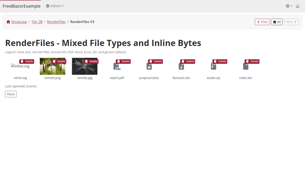
</a>
<br/>
<a href="screenshots/showcase-renderfiles-v3/full.webp"><strong>RenderFiles V3</strong></a>
<br/><code>/showcase/renderfiles/v3</code><br/>
✅ 200 &nbsp;⏱ 17,440ms &nbsp;📦 68.6 MB &nbsp;🖥 ✅ 0 err

<details>
<summary>📋 Details</summary>

**RenderFiles - Mixed File Types and Inline Bytes**

**📊 Metrics**

| Metric | Value |
|--------|-------|
| HTTP Status | 200 |
| Navigation | 271 ms |
| Full Load (incl. settle) | 17,440 ms |
| Network Requests | 306 |
| Data Transferred | 68.6 MB |
| JS Errors | 0 |
| JS Warnings | 0 |

<details>
<summary>🌐 Network (306 requests, 68.6 MB)</summary>

| Method | Status | Duration | Bytes | URL |
|--------|:------:|:--------:|------:|-----|
| GET | 200 | 290ms | 9.0 MB | `http://localhost:5201/_framework/MudBlazor.mwezwdoi15.wasm` |
| GET | 200 | 292ms | 6.5 MB | `…:5201/_framework/Microsoft.CodeAnalysis.CSharp.df8hfd5o8z.wasm` |
| GET | 200 | 17ms | 6.0 MB | `…1/_framework/Basic.Reference.Assemblies.Net100.v8tl2dqzst.wasm` |
| GET | 200 | 17ms | 4.6 MB | `…calhost:5201/_framework/System.Private.CoreLib.btnahqa3oa.wasm` |
| GET | 200 | 2ms | 3.5 MB | `…t/BlazorMonaco/lib/monaco-editor/min/vs/editor.api-i0YVFWkl.js` |
| GET | 200 | 264ms | 3.0 MB | `…//localhost:5201/_framework/System.Private.Xml.c86ifkdlwh.wasm` |
| GET | 200 | 68ms | 2.9 MB | `…calhost:5201/_framework/Microsoft.CodeAnalysis.erp1n29u9n.wasm` |
| GET | 200 | 18ms | 2.9 MB | `http://localhost:5201/_framework/dotnet.native.imnhyiqpc9.wasm` |
| GET | 200 | 259ms | 2.4 MB | `http://localhost:5201/_framework/Radzen.Blazor.x7olzc7yc0.wasm` |
| GET | 200 | 271ms | 1.4 MB | `…lhost:5201/_framework/FreeBlazorExample.Client.n18ukcy7q5.wasm` |
| GET | 200 | 69ms | 1.0 MB | `…201/_content/Radzen.Blazor/fonts/MaterialSymbolsOutlined.woff2` |
| GET | 200 | 261ms | 984.3 KB | `…//localhost:5201/_framework/System.Data.Common.cp5bttdxwa.wasm` |
| GET | 200 | 17ms | 914.3 KB | `http://localhost:5201/_framework/BlazorBootstrap.zo6lifkmy7.wasm` |
| GET | 200 | 264ms | 829.3 KB | `…ework/System.Private.DataContractSerialization.yjhmavq6w2.wasm` |
| GET | 200 | 17ms | 788.2 KB | `…alhost:5201/_framework/FreeBlazorExample.Client.3ivhmqjexl.pdb` |
| … | … | … | … | *291 more* |

</details>

<details>
<summary>🖥 Console Info (1 messages)</summary>

```
[info] Debugging hotkey: Shift+Alt+D (when application has focus)
```

</details>

</details>

</td>
</tr>
</table>

---

## 🔧 Tool Info

Generated by **FreeBlazorExample.ShowcaseTool** — Microsoft.Playwright + Magick.NET

| Setting | Value |
|---------|-------|
| App URL | http://localhost:5201 |
| Browser | Chromium (headless) |
| Viewport | 1440×900 |
| GIF frames | 6 × 2s intervals |
| GIF width | 620px |
| Thumb width | 420px |
| Blazor settle delay | 4000ms after NetworkIdle |
| About sections | Auto-expanded before final screenshot |

