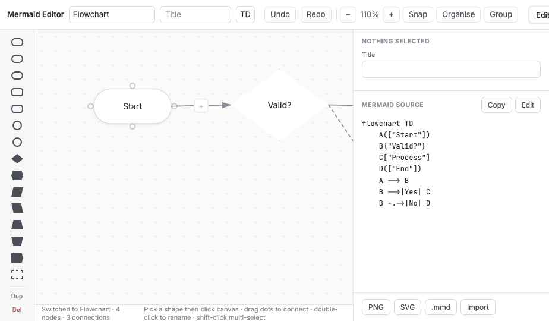
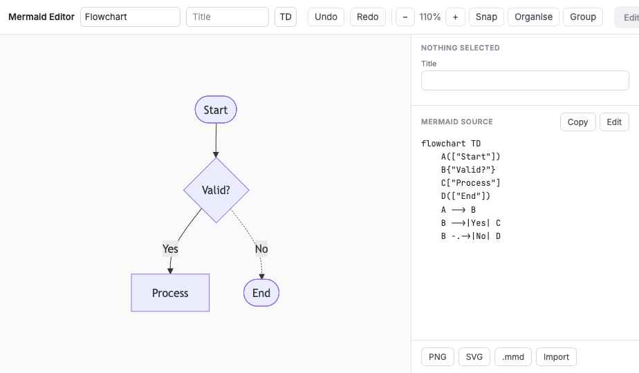
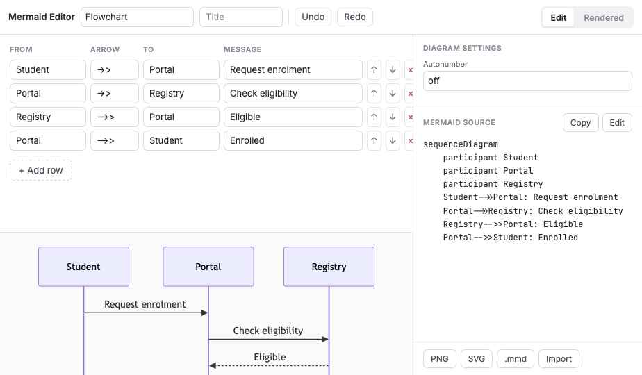
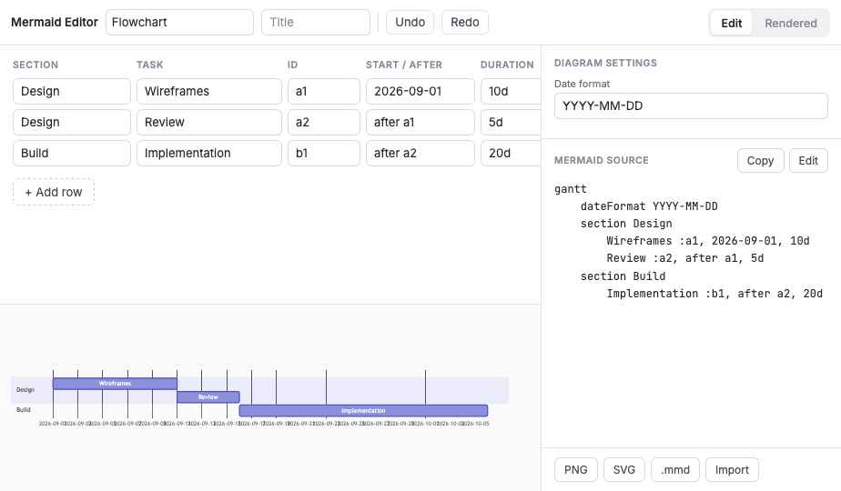
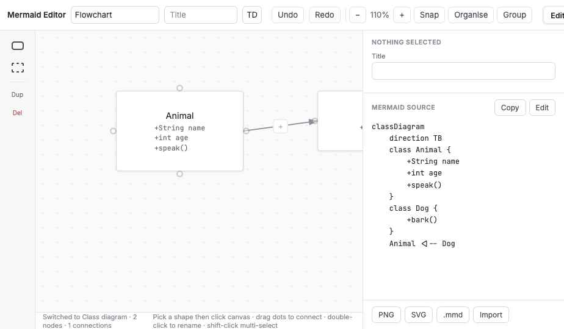
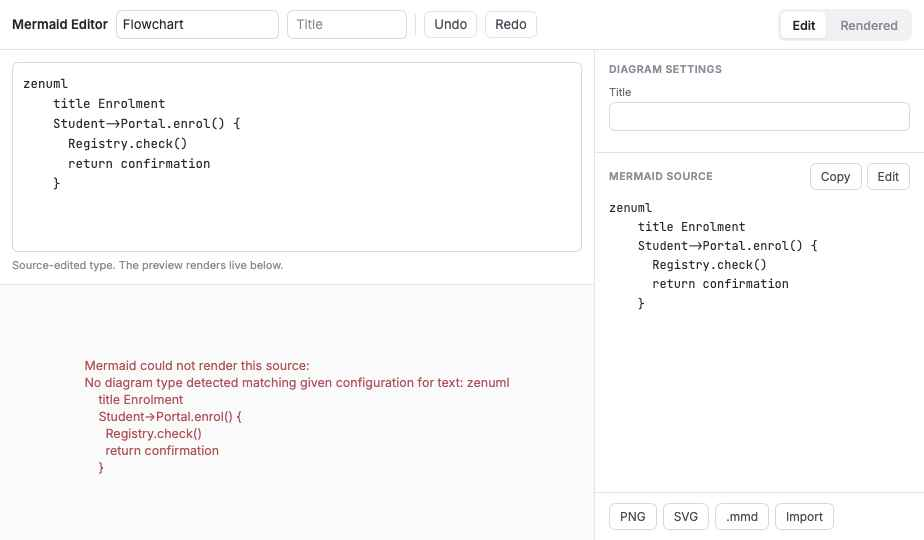

# Mermaid GUI Editor

A browser based visual editor that produces Mermaid diagram source. Draw on a canvas, fill in a table, or write source directly, and get valid Mermaid out the other end.

Built at Washington State University and released under the MIT licence. Everything here is original work. No code from other Mermaid editors was copied.



## What it does

Mermaid covers roughly thirty diagram syntaxes, and they are not all the same kind of thing. A flowchart is a graph you can drag around. A Gantt chart is a table of dates. A railroad diagram is a grammar. One generic node canvas cannot serve all three, so this editor picks an editing mode per diagram type.

**Canvas mode** for node and edge diagrams. Click a shape in the left rail, click the canvas to place it, drag the dots on a node to connect it to another. Double click to rename. Nine types use this mode: flowchart, state, class, ER, mindmap, requirement, C4 context, architecture, block.

**Row mode** for diagrams that are really data. A table with the columns that type needs, and a live render below it. Thirteen types: sequence, Gantt, pie, XY chart, quadrant, Sankey, radar, timeline, user journey, Kanban, git graph, treemap, packet.

**Source mode** for the remaining types, with live rendering and error messages from Mermaid itself: ZenUML, Venn, Ishikawa, railroad, Cynefin, TreeView, plus a catch-all entry for pasting any Mermaid source at all.

Full list with per-type detail: [docs/SUPPORTED_DIAGRAMS.md](docs/SUPPORTED_DIAGRAMS.md).

## Editing features

- 15 flowchart shapes: rectangle, rounded, stadium, subroutine, database, circle, double circle, diamond, hexagon, two parallelograms, two trapezoids, flag, subgraph
- 8 link styles: arrow, open, dotted, thick, bidirectional, invisible, circle end, cross end, each with an optional label
- Nested subgraphs, with an optional direction per subgraph
- Fill, stroke and text colour per node, written out as Mermaid `style` statements
- `classDef` class names and `click` URLs on flowchart nodes
- Undo and redo, multi-select with shift click, group, duplicate, delete, arrow key nudge
- Snap to an 8 pixel grid, zoom from 40 to 200 percent, and an automatic layering pass
- Live render of the current document through Mermaid 11 at any time
- Export to PNG, SVG or `.mmd`, and import a `.mmd` file with diagram type detection
- Flowchart source parses back onto the canvas, so you can hand edit the text and keep working visually

## Screenshots

All captured from the running application. See [docs/screenshots](docs/screenshots/README.md) for the index.

| | |
| --- | --- |
|  |  |
| Rendered tab, same document through Mermaid 11 | Sequence diagram row editor with live preview |
|  |  |
| Gantt row editor with `after` dependencies | Class diagram on the canvas, members in the inspector |
|  | |
| Source mode for a type with no visual editor | |

Animated captures are not included in this release. The screenshots above are still frames taken from the running application rather than mockups. Recording GIFs of the drag and connect interactions is on the list for 1.1.

## Running it

No build step, no package manager, no server side code.

```
git clone https://github.com/WSU-EIT/mermaid-gui-editor.git
cd mermaid-gui-editor
python3 -m http.server 8080
```

Then open `http://localhost:8080/src/mermaid-editor.dc.html`.

Opening the file directly from disk also works in most browsers. Mermaid 11 loads from a CDN at runtime, so the first load needs a network connection. To run fully offline, download `mermaid.esm.min.mjs` and change the import URL at the top of `src/mermaid-editor.dc.html`.

## Repository layout

```
.
├── README.md
├── LICENSE                 MIT, WSU-EIT
├── CHANGELOG.md
├── .gitignore
├── src/
│   ├── mermaid-editor.dc.html    the editor: template, logic, styles in one file
│   └── support.js                runtime the editor loads
└── docs/
    ├── SUPPORTED_DIAGRAMS.md     per-type coverage and known gaps
    └── screenshots/              evidence, indexed in its own README
```

## How it is put together

The editor keeps one document per diagram type in memory. Each document is either a graph (nodes and edges with positions), a set of rows, or a string of source. A serialiser per diagram type turns that document into Mermaid text, which is the thing that gets rendered, copied and exported. Mermaid text is the output of record; the canvas is an editing surface over it.

Round tripping runs the other way for flowcharts. A parser reads flowchart source back into nodes, edges, subgraph nesting, style statements, classes and click links, then lays the nodes out in levels. Other types either detect their keyword on import and open in source mode, or keep their row data.

Canvas positions are the editor's own. Mermaid decides its own layout when it renders, so the rendered diagram will not sit exactly where you placed things. That is a property of Mermaid being declarative, not a bug here.

## Limitations

- Swimlanes have no editor yet
- Sequence fragments such as `alt`, `loop` and `par` need source mode
- Subgraph membership is inferred from position rather than stored explicitly
- Beta syntaxes move between Mermaid versions. The six source mode types marked beta carry a comment saying so, and the render error from Mermaid will tell you if your version disagrees

## Contributing

Issues and pull requests are welcome. Two rules: keep contributions MIT licensable, and do not paste code from projects under other licences. If you add a diagram type, add its serialiser, its editing mode, and a line in `docs/SUPPORTED_DIAGRAMS.md`.

## Licence

MIT. See [LICENSE](LICENSE).

Mermaid itself is a separate MIT licensed project and is not bundled here.
