# Page Scan Report

> **URL:** http://localhost:5105/BackgroundServices  
> **Status:** ✅ 200  

---

## Summary

| Field | Value |
|-------|-------|
| URL | http://localhost:5105/BackgroundServices |
| Title | FreeServicesHub |
| Status | ✅ 200 |
| HTML Size | 85.4 KB |
| Screenshots | 35 (3.0 MB) |
| Images | 1 |
| Images Missing Alt | Warning 1 |
| A11y Violations | Warning 39 |
| Critical | 7 |
| Serious | 21 |
| Moderate | 11 |
| Minor | 0 |
| Tools Run | axe, htmlcheck, htmlcs, ibm |

## Screenshots

<table>
<tr>
<td align="center" width="50%">

 <strong>1. Page Load +0ms</strong>
 72.0 KB
</td>
<td align="center" width="50%">

 <strong>2. Page Load +579ms</strong>
 72.0 KB
</td>
</tr>
<tr>
<td align="center" width="50%">

 <strong>3. Page Load +1143ms</strong>
 72.0 KB
</td>
<td align="center" width="50%">

 <strong>4. Page Load +1709ms</strong>
 72.0 KB
</td>
</tr>
<tr>
<td align="center" width="50%">
<a href="01-page-load-02283ms.png">
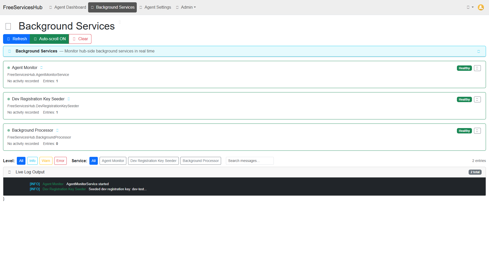
</a>
 <strong>5. Page Load +2283ms</strong>
 72.0 KB
</td>
<td align="center" width="50%">

 <strong>6. Page Load +2868ms</strong>
 72.0 KB
</td>
</tr>
<tr>
<td align="center" width="50%">

 <strong>7. Page Load +3415ms</strong>
 72.0 KB
</td>
<td align="center" width="50%">

 <strong>8. Page Load +3988ms</strong>
 72.0 KB
</td>
</tr>
<tr>
<td align="center" width="50%">

 <strong>9. Page Load +4549ms</strong>
 72.0 KB
</td>
<td align="center" width="50%">

 <strong>10. Page Load +5113ms</strong>
 72.0 KB
</td>
</tr>
<tr>
<td align="center" width="50%">

 <strong>11. Page Load +5674ms</strong>
 72.0 KB
</td>
<td align="center" width="50%">

 <strong>12. Page Load +6236ms</strong>
 72.0 KB
</td>
</tr>
<tr>
<td align="center" width="50%">

 <strong>13. Page Load +6804ms</strong>
 72.0 KB
</td>
<td align="center" width="50%">

 <strong>14. Page Load +7353ms</strong>
 72.0 KB
</td>
</tr>
<tr>
<td align="center" width="50%">

 <strong>15. Page Load +7917ms</strong>
 72.0 KB
</td>
<td align="center" width="50%">

 <strong>16. Page Load +8486ms</strong>
 72.0 KB
</td>
</tr>
<tr>
<td align="center" width="50%">

 <strong>17. Page Load +9060ms</strong>
 72.0 KB
</td>
<td align="center" width="50%">

 <strong>18. Page Load +9645ms</strong>
 72.0 KB
</td>
</tr>
<tr>
<td align="center" width="50%">
<a href="02-page-expanded.jpeg">
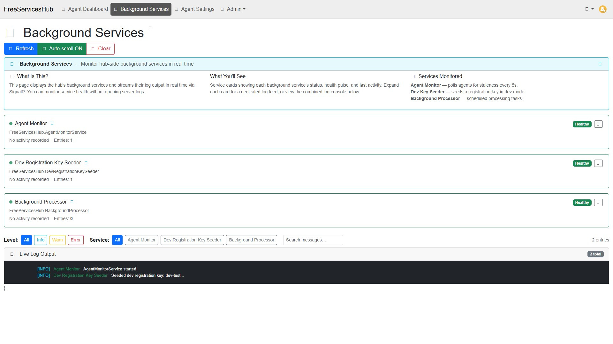
</a>
 <strong>19. page-expanded</strong>
 187.7 KB
</td>
<td align="center" width="50%">
<a href="03-axe-overlay.png">
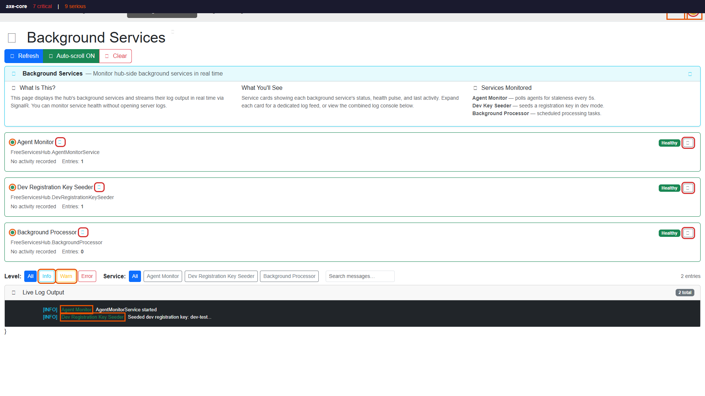
</a>
 <strong>20. axe-overlay</strong>
 90.3 KB
</td>
</tr>
<tr>
<td align="center" width="50%">
<a href="04-quickpeek-overlay.png">
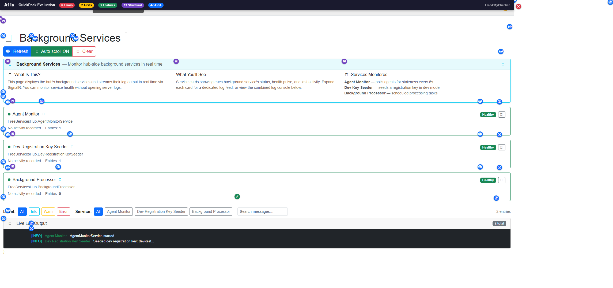
</a>
 <strong>21. quickpeek-overlay</strong>
 119.0 KB
</td>
<td align="center" width="50%">
<a href="05-htmlcs-overlay.png">
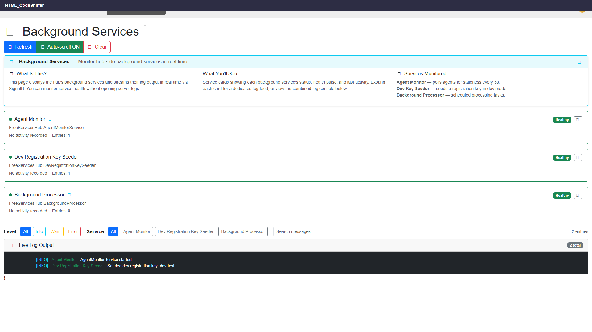
</a>
 <strong>22. htmlcs-overlay</strong>
 84.2 KB
</td>
</tr>
<tr>
<td align="center" width="50%">
<a href="06-ibm-overlay.png">
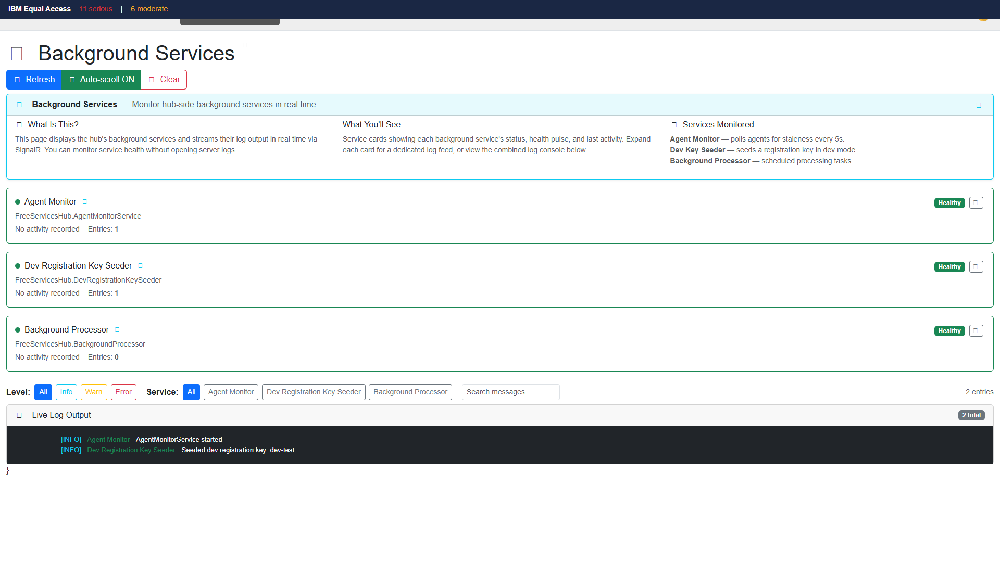
</a>
 <strong>23. ibm-overlay</strong>
 85.7 KB
</td>
<td align="center" width="50%">
<a href="07-structure-overlay.png">
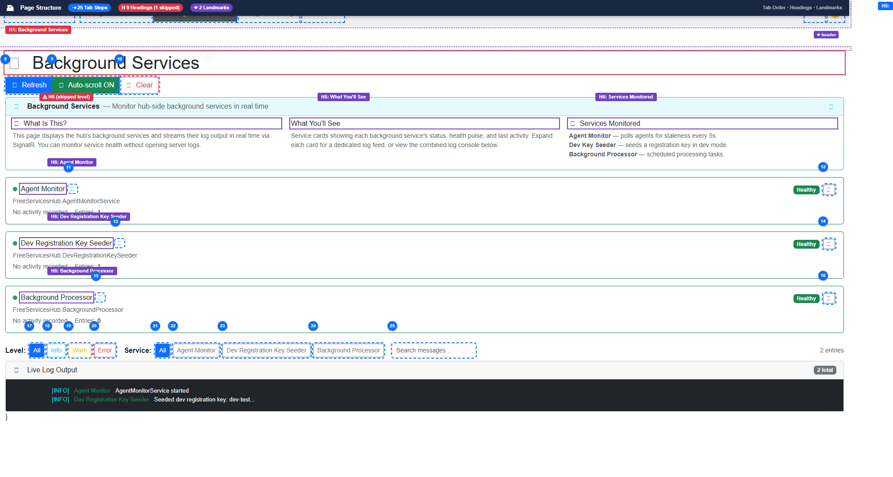
</a>
 <strong>24. structure-overlay</strong>
 117.8 KB
</td>
</tr>
<tr>
<td align="center" width="50%">
<a href="07b-wireframe-blueprint.png">
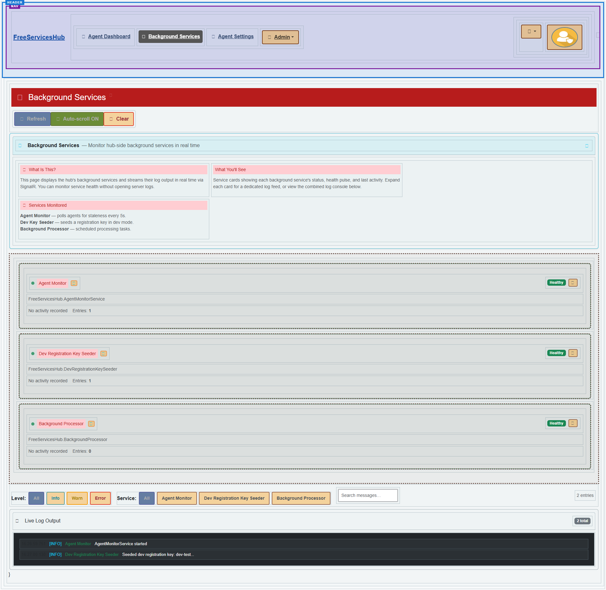
</a>
 <strong>25. wireframe-blueprint</strong>
 124.1 KB
</td>
<td align="center" width="50%">
<a href="08-cvd-protanopia.png">
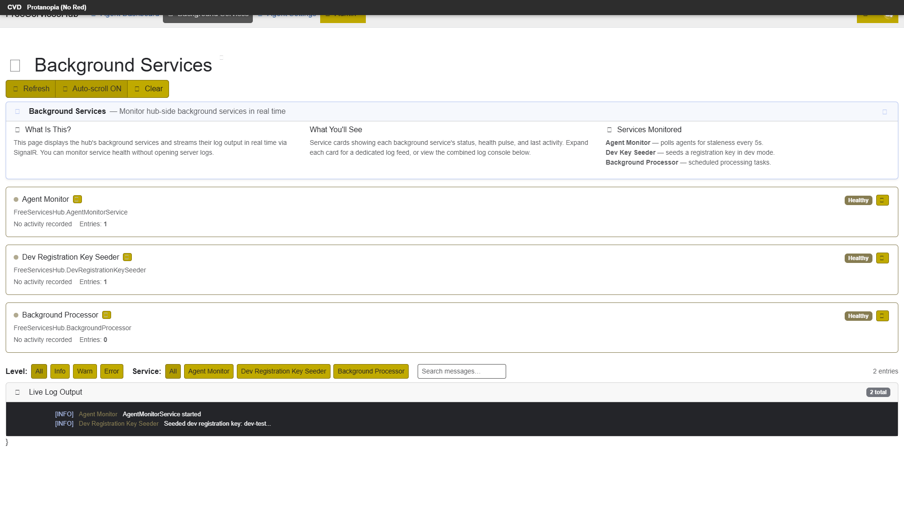
</a>
 <strong>26. cvd-protanopia</strong>
 94.1 KB
</td>
</tr>
<tr>
<td align="center" width="50%">
<a href="09-cvd-deuteranopia.png">
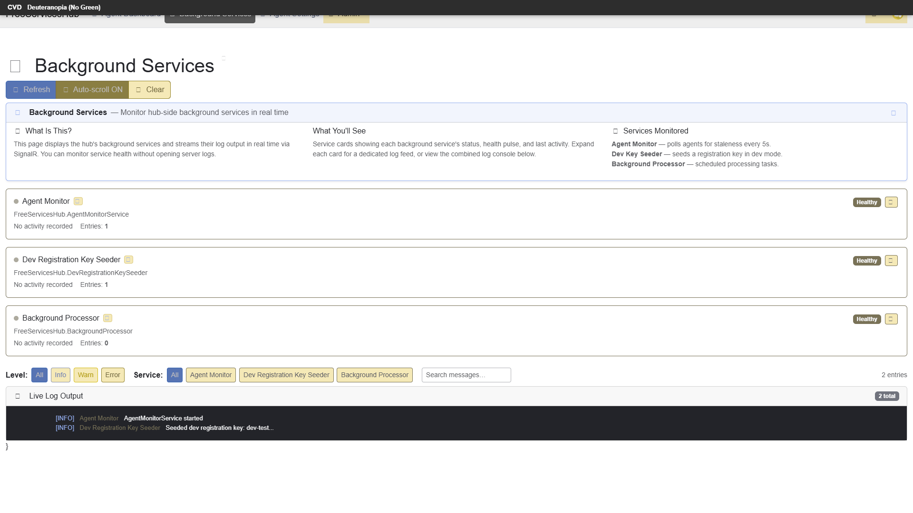
</a>
 <strong>27. cvd-deuteranopia</strong>
 94.9 KB
</td>
<td align="center" width="50%">
<a href="10-cvd-tritanopia.png">
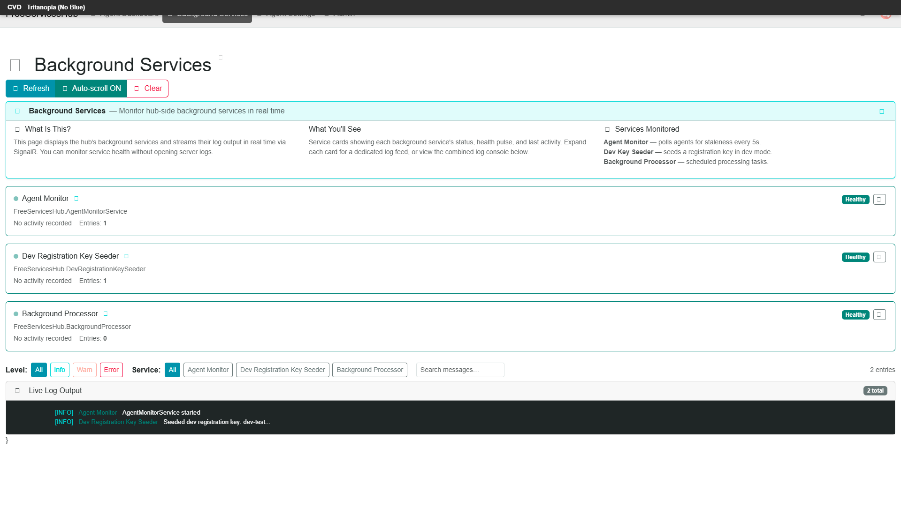
</a>
 <strong>28. cvd-tritanopia</strong>
 92.8 KB
</td>
</tr>
<tr>
<td align="center" width="50%">
<a href="11-cvd-achromatopsia.png">
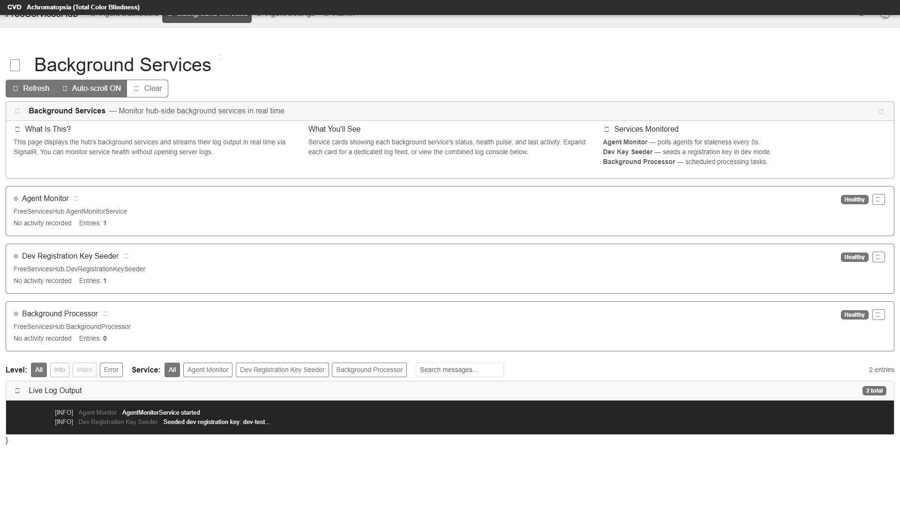
</a>
 <strong>29. cvd-achromatopsia</strong>
 88.9 KB
</td>
<td align="center" width="50%">
<a href="12-cvd-protanomaly.png">
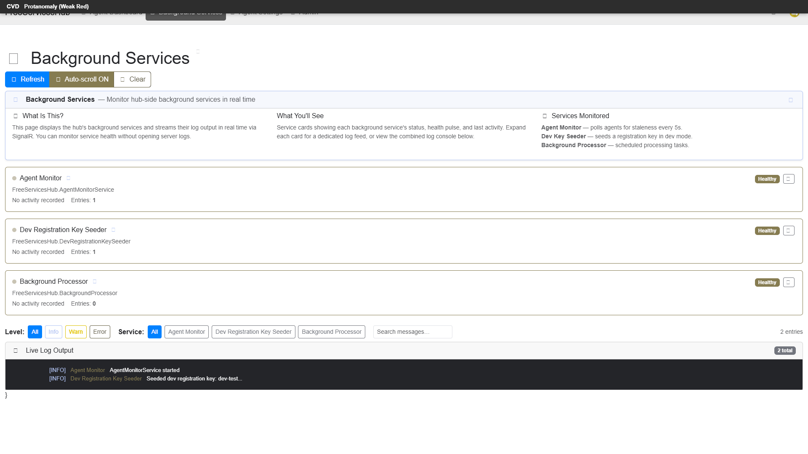
</a>
 <strong>30. cvd-protanomaly</strong>
 93.3 KB
</td>
</tr>
<tr>
<td align="center" width="50%">
<a href="13-cvd-deuteranomaly.png">
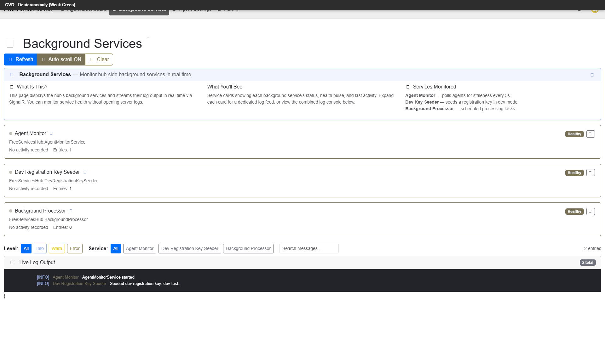
</a>
 <strong>31. cvd-deuteranomaly</strong>
 94.0 KB
</td>
<td align="center" width="50%">

 <strong>32. cvd-tritanomaly</strong>
 93.1 KB
</td>
</tr>
<tr>
<td align="center" width="50%">
<a href="15-screenreader-view.png">
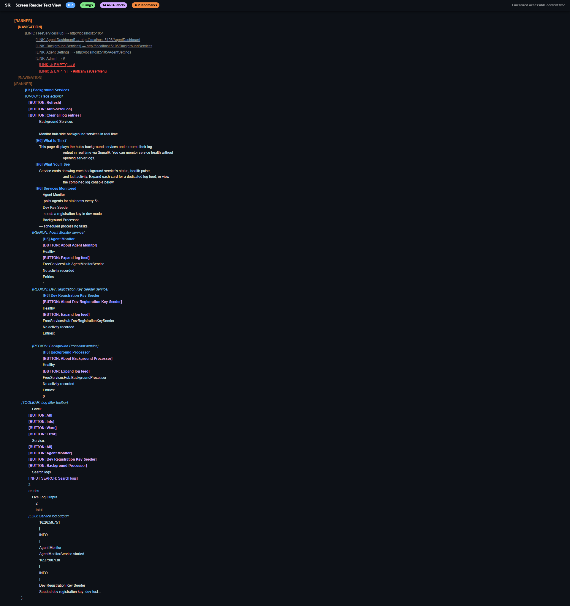
</a>
 <strong>33. screenreader-view</strong>
 131.6 KB
</td>
<td align="center" width="50%">
<a href="16-reduced-motion.png">
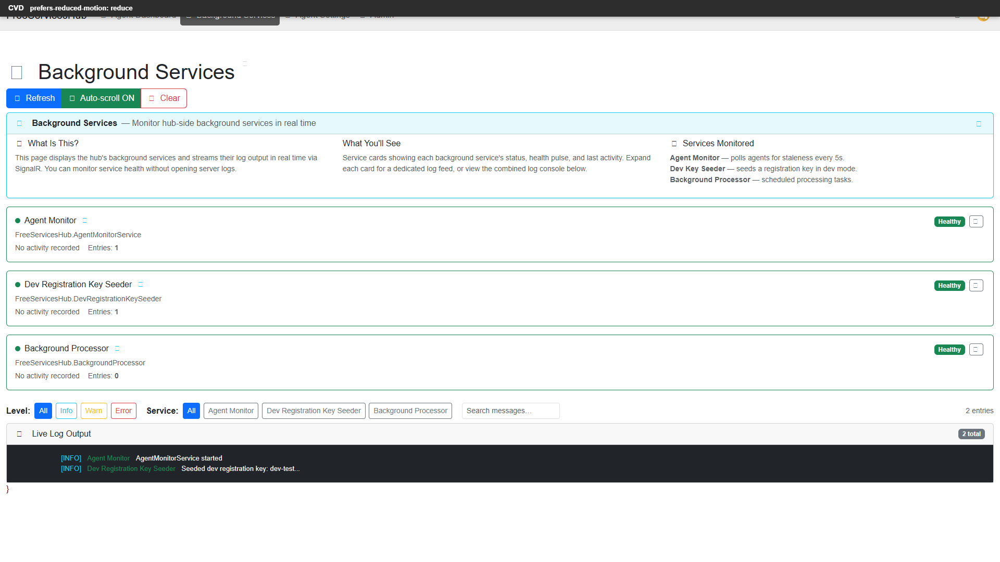
</a>
 <strong>34. reduced-motion</strong>
 87.9 KB
</td>
</tr>
<tr>
<td align="center" width="50%">
<a href="17-forced-colors.png">
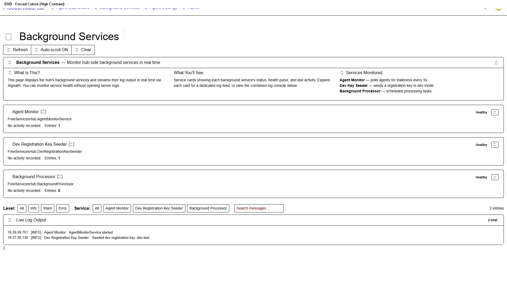
</a>
 <strong>35. forced-colors</strong>
 74.6 KB
</td>
<td></td>
</tr>
</table>

## Page Images (1)

| # | Source URL | Alt Text |
|--:|-----------|----------|
| 1 | http://localhost:5105/File/View/a734ca44-051e-474e-b3be-62ba61105f2c | *(missing)* |

## Accessibility

### Cross-Tool Comparison

| Severity | axe | htmlcheck | htmlcs | ibm |
|----------|:---:|:---:|:---:|:---:|
| critical | 7 | 0 | 0 | 0 |
| serious | 9 | 1 | 0 | 11 |
| moderate | 0 | 5 | 0 | 6 |
| minor | 0 | 0 | 0 | 0 |
| **Total** | **16** | **6** | **0** | **17** |

### Violations by Confidence

<strong>14 rule(s) violated</strong>

| # | Rule | Severity | Consensus | axe | htmlcheck | htmlcs | ibm | Example |
|--:|------|:--------:|:---------:|:---:|:---:|:---:|:---:|---------|
| 1 | image-alt | critical | medium 2/4 | found | found | --- | --- | `` |
| 10 | img_alt_valid | serious | low 1/4 | --- | --- | --- | found | `` |
| 12 | heading-empty | moderate | low 1/4 | --- | found | --- | --- | `<h5 class="offcanvas-title" id="offcanvasQuickActionLabel...` |
| 13 | heading-order | moderate | low 1/4 | --- | found | --- | --- |  |
| 14 | landmark-one-main | moderate | low 1/4 | --- | found | --- | --- |  |

> **Note:** Automated scanning catches ~30-60% of WCAG issues. Manual keyboard and screen reader testing is still required for full compliance.

## Files

| File | Description |
|------|-------------|
| `01-page-load-00000ms.png` | Page Load +0ms (72.0 KB) |
| `01-page-load-00579ms.png` | Page Load +579ms (72.0 KB) |
| `01-page-load-01143ms.png` | Page Load +1143ms (72.0 KB) |
| `01-page-load-01709ms.png` | Page Load +1709ms (72.0 KB) |
| `01-page-load-02283ms.png` | Page Load +2283ms (72.0 KB) |
| `01-page-load-02868ms.png` | Page Load +2868ms (72.0 KB) |
| `01-page-load-03415ms.png` | Page Load +3415ms (72.0 KB) |
| `01-page-load-03988ms.png` | Page Load +3988ms (72.0 KB) |
| `01-page-load-04549ms.png` | Page Load +4549ms (72.0 KB) |
| `01-page-load-05113ms.png` | Page Load +5113ms (72.0 KB) |
| `01-page-load-05674ms.png` | Page Load +5674ms (72.0 KB) |
| `01-page-load-06236ms.png` | Page Load +6236ms (72.0 KB) |
| `01-page-load-06804ms.png` | Page Load +6804ms (72.0 KB) |
| `01-page-load-07353ms.png` | Page Load +7353ms (72.0 KB) |
| `01-page-load-07917ms.png` | Page Load +7917ms (72.0 KB) |
| `01-page-load-08486ms.png` | Page Load +8486ms (72.0 KB) |
| `01-page-load-09060ms.png` | Page Load +9060ms (72.0 KB) |
| `01-page-load-09645ms.png` | Page Load +9645ms (72.0 KB) |
| `02-page-expanded.jpeg` | page-expanded (187.7 KB) |
| `03-axe-overlay.png` | axe-overlay (90.3 KB) |
| `04-quickpeek-overlay.png` | quickpeek-overlay (119.0 KB) |
| `05-htmlcs-overlay.png` | htmlcs-overlay (84.2 KB) |
| `06-ibm-overlay.png` | ibm-overlay (85.7 KB) |
| `07-structure-overlay.png` | structure-overlay (117.8 KB) |
| `07b-wireframe-blueprint.png` | wireframe-blueprint (124.1 KB) |
| `08-cvd-protanopia.png` | cvd-protanopia (94.1 KB) |
| `09-cvd-deuteranopia.png` | cvd-deuteranopia (94.9 KB) |
| `10-cvd-tritanopia.png` | cvd-tritanopia (92.8 KB) |
| `11-cvd-achromatopsia.png` | cvd-achromatopsia (88.9 KB) |
| `12-cvd-protanomaly.png` | cvd-protanomaly (93.3 KB) |
| `13-cvd-deuteranomaly.png` | cvd-deuteranomaly (94.0 KB) |
| `14-cvd-tritanomaly.png` | cvd-tritanomaly (93.1 KB) |
| `15-screenreader-view.png` | screenreader-view (131.6 KB) |
| `16-reduced-motion.png` | reduced-motion (87.9 KB) |
| `17-forced-colors.png` | forced-colors (74.6 KB) |
| `metadata.json` | Machine-readable scan data |
| `a11y-summary.json` | Merged cross-tool accessibility summary |

---

*Generated by FreeA11yChecker Scanner v1.0*
